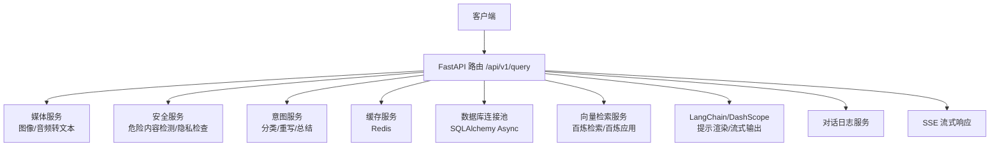
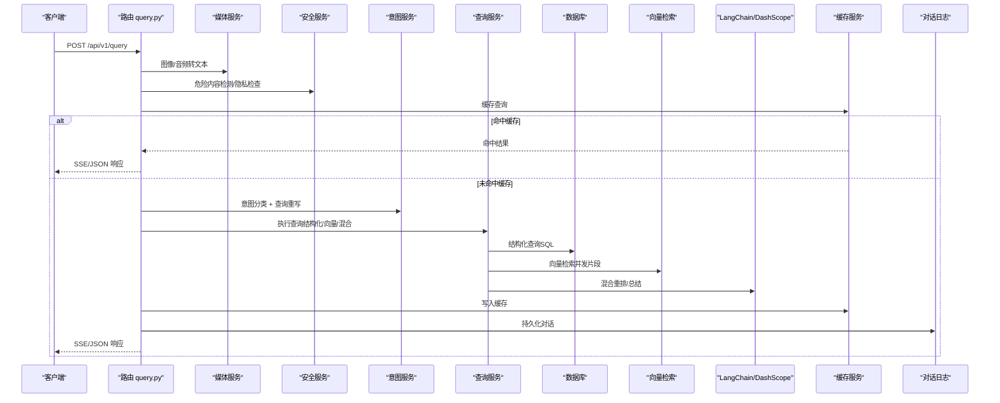
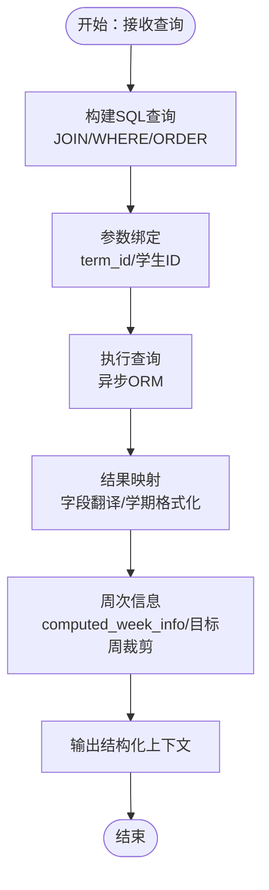
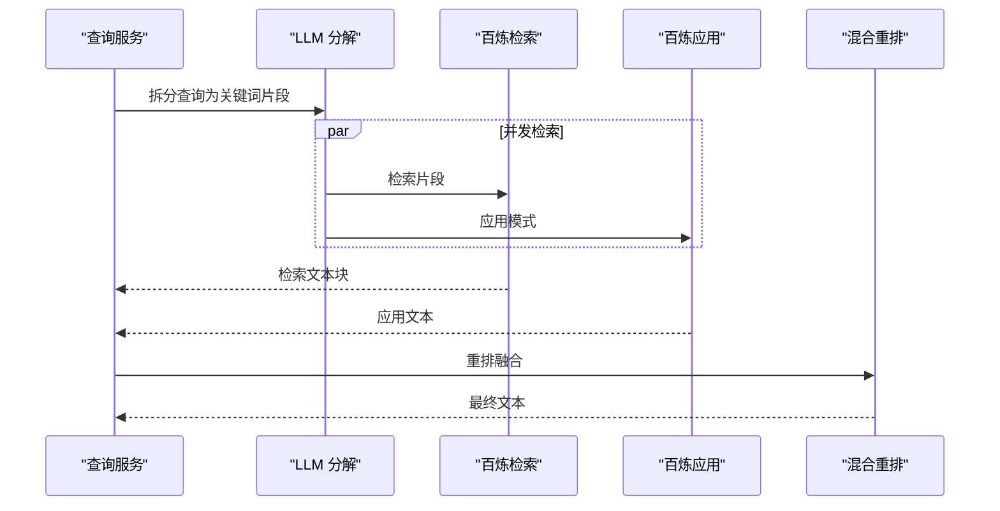
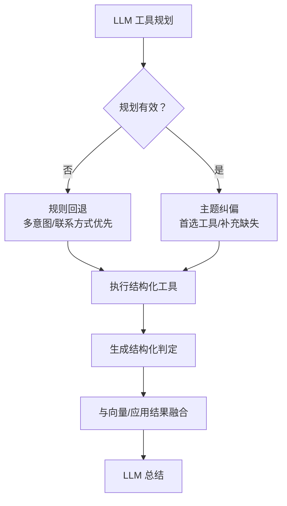
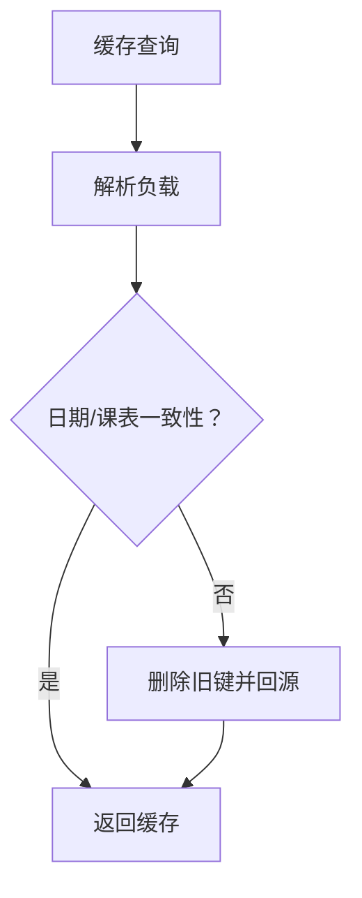
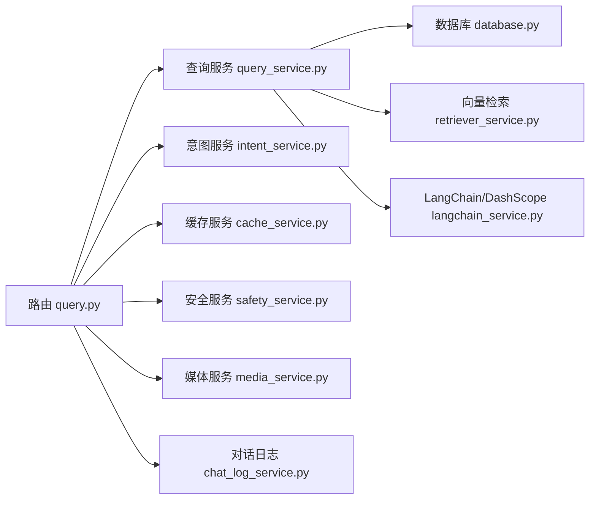

# 查询执行服务

<cite>
**本文档引用的文件**
- [query_service.py](file://service/ai_assistant/app/services/query_service.py)
- [retriever_service.py](file://service/ai_assistant/app/services/retriever_service.py)
- [query.py](file://service/ai_assistant/app/routers/query.py)
- [query.py（schema）](file://service/ai_assistant/app/schemas/query.py)
- [database.py](file://service/ai_assistant/app/database.py)
- [cache_service.py](file://service/ai_assistant/app/services/cache_service.py)
- [langchain_service.py](file://service/ai_assistant/app/services/langchain_service.py)
- [models.py](file://service/ai_assistant/app/models/models.py)
- [config.py](file://service/ai_assistant/app/config.py)
- [logger.py](file://service/ai_assistant/app/utils/logger.py)
- [intent_service.py](file://service/ai_assistant/app/services/intent_service.py)
- [chat_log_service.py](file://service/ai_assistant/app/services/chat_log_service.py)
- [safety_service.py](file://service/ai_assistant/app/services/safety_service.py)
- [media_service.py](file://service/ai_assistant/app/services/media_service.py)
</cite>

## 目录
1. [简介](#简介)
2. [项目结构](#项目结构)
3. [核心组件](#核心组件)
4. [架构总览](#架构总览)
5. [详细组件分析](#详细组件分析)
6. [依赖分析](#依赖分析)
7. [性能考量](#性能考量)
8. [故障排查指南](#故障排查指南)
9. [结论](#结论)
10. [附录](#附录)

## 简介
本文件面向“AI校园助手”的查询执行服务，系统性阐述从请求入口到结果呈现的完整链路，重点覆盖：
- 结构化查询执行：SQL查询构建、参数绑定、结果集处理、数据映射转换
- 向量检索实现：嵌入向量生成、相似度计算、检索结果排序、上下文窗口管理
- 混合查询优化策略：如何平衡结构化查询与向量检索的结果权重
- 查询缓存机制：缓存键生成、过期策略、一致性保证
- 并发查询处理：连接池管理、超时控制、错误恢复
- 查询性能监控：慢查询日志、资源使用统计
- 查询优化技巧与故障排除指南

## 项目结构
查询执行服务位于后端服务目录 service/ai_assistant 下，采用“路由层-服务层-数据层-工具层”的分层组织：
- 路由层：统一入口 /api/v1/query，负责多模态输入解码、并发安全检查与意图分类、缓存命中、流式输出组装
- 服务层：查询服务（结构化/向量/混合）、意图服务（分类/重写/总结）、缓存服务、安全服务、媒体服务
- 数据层：SQLAlchemy 异步 ORM、数据库连接池、模型定义
- 工具层：LangChain/DashScope 适配、日志、隐私 DID 生成

图表来源
- [query.py:198-745](file://service/ai_assistant/app/routers/query.py#L198-L745)
- [media_service.py:115-246](file://service/ai_assistant/app/services/media_service.py#L115-L246)
- [safety_service.py:84-163](file://service/ai_assistant/app/services/safety_service.py#L84-L163)
- [intent_service.py:218-346](file://service/ai_assistant/app/services/intent_service.py#L218-L346)
- [cache_service.py:92-177](file://service/ai_assistant/app/services/cache_service.py#L92-L177)
- [database.py:7-35](file://service/ai_assistant/app/database.py#L7-L35)
- [retriever_service.py:46-135](file://service/ai_assistant/app/services/retriever_service.py#L46-L135)
- [langchain_service.py:139-278](file://service/ai_assistant/app/services/langchain_service.py#L139-L278)
- [chat_log_service.py:14-76](file://service/ai_assistant/app/services/chat_log_service.py#L14-L76)

章节来源
- [query.py:1-788](file://service/ai_assistant/app/routers/query.py#L1-L788)
- [database.py:1-35](file://service/ai_assistant/app/database.py#L1-L35)

## 核心组件
- 路由器 query.py：统一入口，负责多模态输入解码、并发安全检查、意图分类、缓存、结构化/向量/混合查询调度、流式输出与日志持久化
- 查询服务 query_service.py：结构化查询工具集、向量检索实现、混合查询路由、工具规划与纠偏、结果判定与上下文构建
- 向量检索 retriever_service.py：百炼检索 API 客户端封装，支持去重、最小块长度过滤、回退逻辑
- 缓存服务 cache_service.py：缓存键生成、敏感性/日期敏感性/课表版本一致性校验、TTL 策略
- 意图服务 intent_service.py：意图分类、查询重写、回答总结（含历史裁剪与流式输出）
- 数据库 database.py：异步引擎与连接池配置
- LangChain 适配 langchain_service.py：消息裁剪、DashScope 会话、非流式/流式调用
- 日志 logger.py：统一日志配置与落盘
- 安全服务 safety_service.py：危险内容检测、隐私违规检查
- 媒体服务 media_service.py：图像/音频转文本
- 模型定义 models.py：数据库表结构与枚举

章节来源
- [query_service.py:1-1913](file://service/ai_assistant/app/services/query_service.py#L1-L1913)
- [retriever_service.py:1-168](file://service/ai_assistant/app/services/retriever_service.py#L1-L168)
- [query.py（schema）:1-33](file://service/ai_assistant/app/schemas/query.py#L1-L33)
- [database.py:1-35](file://service/ai_assistant/app/database.py#L1-L35)
- [cache_service.py:1-177](file://service/ai_assistant/app/services/cache_service.py#L1-L177)
- [intent_service.py:1-346](file://service/ai_assistant/app/services/intent_service.py#L1-L346)
- [langchain_service.py:1-278](file://service/ai_assistant/app/services/langchain_service.py#L1-L278)
- [logger.py:1-53](file://service/ai_assistant/app/utils/logger.py#L1-L53)
- [safety_service.py:1-163](file://service/ai_assistant/app/services/safety_service.py#L1-L163)
- [media_service.py:1-246](file://service/ai_assistant/app/services/media_service.py#L1-L246)
- [models.py:1-660](file://service/ai_assistant/app/models/models.py#L1-L660)

## 架构总览
查询执行服务采用“路由-并发-缓存-工具-LLM-持久化”的流水线式架构。请求进入后，先进行多模态预处理与安全检查，随后并发执行意图分类与查询重写，再根据意图选择结构化查询、向量检索或混合检索，最后由 LLM 生成自然语言回答并通过 SSE 流式返回。

图表来源
- [query.py:207-745](file://service/ai_assistant/app/routers/query.py#L207-L745)
- [media_service.py:115-246](file://service/ai_assistant/app/services/media_service.py#L115-L246)
- [safety_service.py:84-163](file://service/ai_assistant/app/services/safety_service.py#L84-L163)
- [intent_service.py:218-346](file://service/ai_assistant/app/services/intent_service.py#L218-L346)
- [query_service.py:1034-1067](file://service/ai_assistant/app/services/query_service.py#L1034-L1067)
- [cache_service.py:92-177](file://service/ai_assistant/app/services/cache_service.py#L92-L177)
- [langchain_service.py:139-278](file://service/ai_assistant/app/services/langchain_service.py#L139-L278)
- [chat_log_service.py:14-76](file://service/ai_assistant/app/services/chat_log_service.py#L14-L76)

## 详细组件分析

### 结构化查询执行（SQL）
- 查询构建
  - 使用 SQLAlchemy 异步查询构建器，按工具需求动态拼接 JOIN 与 WHERE 条件
  - 隐私约束：所有查询均以当前学生 ID 作为过滤条件，确保仅访问本人数据
  - 学期解析：支持显式 term_id 与隐式推断（当前/未来/过去/猜测），并生成学期边界与周次信息
- 参数绑定
  - 通过 ORM 查询对象的 where 条件完成参数绑定，避免 SQL 注入
  - 对 term_id 进行合法性校验与存在性检查，防止无效参数
- 结果集处理与映射
  - 将 ORM 查询结果映射为人类可读字段名，包含学期格式化、布尔值转中文、字段名翻译
  - 课表结果支持目标周次裁剪、停课状态标注、目标周无课日统计
- 关键实现位置
  - 结构化工具：[get_my_scores:575-594](file://service/ai_assistant/app/services/query_service.py#L575-L594)、[get_my_schedule:597-706](file://service/ai_assistant/app/services/query_service.py#L597-L706)、[get_my_info:709-726](file://service/ai_assistant/app/services/query_service.py#L709-L726)、[get_my_enrollment:729-749](file://service/ai_assistant/app/services/query_service.py#L729-L749)、[get_my_academic_overview:752-776](file://service/ai_assistant/app/services/query_service.py#L752-L776)、[list_departments_and_majors:779-802](file://service/ai_assistant/app/services/query_service.py#L779-L802)、[list_teacher_directory:805-837](file://service/ai_assistant/app/services/query_service.py#L805-L837)
  - 学期解析与周次信息：[resolve_term_id:387-434](file://service/ai_assistant/app/services/query_service.py#L387-L434)、[get_my_schedule:618-697](file://service/ai_assistant/app/services/query_service.py#L618-L697)、[computed_week_info:449-484](file://service/ai_assistant/app/services/query_service.py#L449-L484)、[目标周次解析:508-532](file://service/ai_assistant/app/services/query_service.py#L508-L532)、[目标周统计:535-543](file://service/ai_assistant/app/services/query_service.py#L535-L543)、[周次裁剪:546-568](file://service/ai_assistant/app/services/query_service.py#L546-L568)
  - 字段翻译与格式化：[字段名映射:77-130](file://service/ai_assistant/app/services/query_service.py#L77-L130)、[翻译函数:133-147](file://service/ai_assistant/app/services/query_service.py#L133-L147)、[学期ID格式化:56-68](file://service/ai_assistant/app/services/query_service.py#L56-L68)

图表来源
- [query_service.py:575-706](file://service/ai_assistant/app/services/query_service.py#L575-L706)
- [query_service.py:449-568](file://service/ai_assistant/app/services/query_service.py#L449-L568)

章节来源
- [query_service.py:575-837](file://service/ai_assistant/app/services/query_service.py#L575-L837)
- [models.py:303-480](file://service/ai_assistant/app/models/models.py#L303-L480)

### 向量检索实现（百炼检索/应用）
- 查询分解
  - 使用 LLM 将用户问题拆分为 1-3 个关键词短语，提高检索召回
- 并发检索
  - 对每个片段并发调用百炼检索 API，合并去重后的文本块
- 重排与融合
  - 当同时具备检索与应用两种来源时，使用 LLM 对两者进行重排融合
- 上下文窗口管理
  - 对检索结果进行最小长度过滤、去重、拼接，避免噪声与冗余
- 关键实现位置
  - 片段分解：[_build_query_fragments:894-917](file://service/ai_assistant/app/services/query_service.py#L894-L917)
  - 路由选择：[_vector_route:919-932](file://service/ai_assistant/app/services/query_service.py#L919-L932)
  - 检索实现：[_search_with_retriever:934-954](file://service/ai_assistant/app/services/query_service.py#L934-L954)、[_search_with_app:957-981](file://service/ai_assistant/app/services/query_service.py#L957-L981)、[_hybrid_rerank:983-1011](file://service/ai_assistant/app/services/query_service.py#L983-L1011)、[_search_with_hybrid_rerank:1014-1031](file://service/ai_assistant/app/services/query_service.py#L1014-L1031)
  - 向量检索器包装：[BailianLangChainRetriever:212-237](file://service/ai_assistant/app/services/query_service.py#L212-L237)
  - 百炼检索客户端：[KnowledgeRetriever:23-135](file://service/ai_assistant/app/services/retriever_service.py#L23-L135)

图表来源
- [query_service.py:894-1031](file://service/ai_assistant/app/services/query_service.py#L894-L1031)
- [retriever_service.py:46-135](file://service/ai_assistant/app/services/retriever_service.py#L46-L135)

章节来源
- [query_service.py:878-1067](file://service/ai_assistant/app/services/query_service.py#L878-L1067)
- [retriever_service.py:1-168](file://service/ai_assistant/app/services/retriever_service.py#L1-L168)

### 混合查询优化策略
- 路由策略
  - 自动选择 retriever/app/hybrid-rerank 三种路径，优先级取决于配置可用性
- 工具规划与纠偏
  - 使用 LLM 规划工具调用，若规划失败则回退到规则检测（多意图、联系方式优先）
  - 强制纠偏：当规划与问题主题不一致时，强制使用首选工具并补充缺失工具
- 结果判定与上下文增强
  - 基于结构化工具结果生成“结构化判定”，约束 LLM 总结阶段不臆断
  - 支持停课、周次、目标周无课日等专项判定
- 关键实现位置
  - 工具规划：[_STRUCTURED_TOOL_PLAN_PROMPT:178-209](file://service/ai_assistant/app/services/query_service.py#L178-L209)
  - 主工具检测：[_detect_primary_structured_tool:1075-1098](file://service/ai_assistant/app/services/query_service.py#L1075-L1098)、[_detect_all_structured_tools:1112-1138](file://service/ai_assistant/app/services/query_service.py#L1112-L1138)
  - 纠偏与补全：[_align_tool_calls_with_query:1186-1250](file://service/ai_assistant/app/services/query_service.py#L1186-L1250)、[_fallback_tool_calls:1171-1183](file://service/ai_assistant/app/services/query_service.py#L1171-L1183)
  - 结果判定：[_build_structured_verdicts:1343-1484](file://service/ai_assistant/app/services/query_service.py#L1343-L1484)

图表来源
- [query_service.py:1075-1250](file://service/ai_assistant/app/services/query_service.py#L1075-L1250)
- [query_service.py:1343-1484](file://service/ai_assistant/app/services/query_service.py#L1343-L1484)

章节来源
- [query_service.py:1075-1484](file://service/ai_assistant/app/services/query_service.py#L1075-L1484)

### 查询缓存机制
- 缓存键生成
  - 格式：chat_cache:{version}:{did}:{query_md5}，版本号用于升级隔离
- 过期策略
  - 敏感查询（涉及成绩/隐私/联系方式等）：30 分钟
  - 普通查询：1 天
- 一致性保证
  - 日期敏感查询：按“当日桶”校验，跨日失效
  - 课表敏感查询：维护课表缓存版本号，管理员改课后递增版本，命中旧版本自动失效
- 关键实现位置
  - 键生成：[_make_cache_key:49-52](file://service/ai_assistant/app/services/cache_service.py#L49-L52)
  - TTL 与敏感性：[get_ttl:85-89](file://service/ai_assistant/app/services/cache_service.py#L85-L89)、[is_sensitive_query:55-57](file://service/ai_assistant/app/services/cache_service.py#L55-L57)
  - 日期/课表一致性：[get_cached_response:92-146](file://service/ai_assistant/app/services/cache_service.py#L92-L146)、[set_cached_response:149-176](file://service/ai_assistant/app/services/cache_service.py#L149-L176)
  - 课表版本：[get_schedule_cache_version:70-75](file://service/ai_assistant/app/services/cache_service.py#L70-L75)、[bump_schedule_cache_version:78-82](file://service/ai_assistant/app/services/cache_service.py#L78-L82)

图表来源
- [cache_service.py:92-146](file://service/ai_assistant/app/services/cache_service.py#L92-L146)

章节来源
- [cache_service.py:1-177](file://service/ai_assistant/app/services/cache_service.py#L1-L177)

### 并发查询处理
- 并发任务
  - 安全检查、查询重写并行执行，缩短端到端延迟
  - 向量检索支持对多个关键词片段并发调用
- 连接池管理
  - SQLAlchemy 异步连接池，pre_ping 与 recycle 保障连接健康
  - 路由层在流式阶段提前回滚数据库会话，避免长时间占用连接
- 超时与错误恢复
  - LLM/DashScope 调用通过线程池异步执行，避免阻塞事件循环
  - 百炼检索/应用降级为“未命中文本”，避免主流程中断
- 关键实现位置
  - 并发安全检查与重写：[并行任务:347-352](file://service/ai_assistant/app/routers/query.py#L347-L352)
  - 向量检索并发：[并发片段检索:942-943](file://service/ai_assistant/app/services/query_service.py#L942-L943)
  - 连接池配置：[数据库引擎:7-20](file://service/ai_assistant/app/database.py#L7-L20)
  - 流式阶段回滚：[流式生成前回滚:654-657](file://service/ai_assistant/app/routers/query.py#L654-L657)

章节来源
- [query.py:347-352](file://service/ai_assistant/app/routers/query.py#L347-L352)
- [query_service.py:934-954](file://service/ai_assistant/app/services/query_service.py#L934-L954)
- [database.py:7-20](file://service/ai_assistant/app/database.py#L7-L20)
- [query.py:654-657](file://service/ai_assistant/app/routers/query.py#L654-L657)

### 查询性能监控与资源统计
- 慢查询日志
  - 向量检索路由指标：记录路由、片段数量、耗时
  - LLM 输入裁剪告警：记录原始/最终字符数、丢弃消息数
- 资源统计
  - 日志统一落盘，便于后续分析
- 关键实现位置
  - 路由指标：[_log_route_metrics:240-248](file://service/ai_assistant/app/services/query_service.py#L240-L248)
  - LLM 输入裁剪统计：[消息裁剪:46-96](file://service/ai_assistant/app/services/langchain_service.py#L46-L96)、[调用统计:149-160](file://service/ai_assistant/app/services/langchain_service.py#L149-L160)
  - 日志配置：[logger:17-52](file://service/ai_assistant/app/utils/logger.py#L17-L52)

章节来源
- [query_service.py:240-248](file://service/ai_assistant/app/services/query_service.py#L240-L248)
- [langchain_service.py:46-96](file://service/ai_assistant/app/services/langchain_service.py#L46-L96)
- [logger.py:17-52](file://service/ai_assistant/app/utils/logger.py#L17-L52)

## 依赖分析
- 组件耦合
  - 路由层依赖服务层（查询/意图/缓存/安全/媒体），服务层依赖数据库与外部 LLM/DashScope
  - 查询服务与向量检索服务通过 LangChain 抽象对接外部模型
- 外部依赖
  - 百炼检索/应用、DashScope、Redis、MySQL
- 潜在循环依赖
  - 未发现循环导入；各模块职责清晰，通过服务接口解耦

图表来源
- [query.py:35-42](file://service/ai_assistant/app/routers/query.py#L35-L42)
- [query_service.py:1-47](file://service/ai_assistant/app/services/query_service.py#L1-L47)
- [retriever_service.py:1-17](file://service/ai_assistant/app/services/retriever_service.py#L1-L17)
- [langchain_service.py:1-17](file://service/ai_assistant/app/services/langchain_service.py#L1-L17)
- [cache_service.py:1-18](file://service/ai_assistant/app/services/cache_service.py#L1-L18)
- [intent_service.py:1-21](file://service/ai_assistant/app/services/intent_service.py#L1-L21)
- [safety_service.py:1-10](file://service/ai_assistant/app/services/safety_service.py#L1-L10)
- [media_service.py:1-17](file://service/ai_assistant/app/services/media_service.py#L1-L17)
- [chat_log_service.py:1-10](file://service/ai_assistant/app/services/chat_log_service.py#L1-L10)
- [database.py:1-6](file://service/ai_assistant/app/database.py#L1-L6)

章节来源
- [query.py:35-42](file://service/ai_assistant/app/routers/query.py#L35-L42)
- [query_service.py:1-47](file://service/ai_assistant/app/services/query_service.py#L1-L47)

## 性能考量
- 查询路径选择
  - 优先使用结构化查询（命中率高、延迟低），向量检索作为补充
  - 混合路径在两者均有有效结果时启用，避免单侧失效
- 并发与批量化
  - 向量检索对关键词片段并发调用，显著降低总延迟
  - LLM 调用通过线程池异步化，避免阻塞
- 缓存策略
  - 敏感/日期/课表类查询采用更短 TTL 或版本校验，保证正确性
- 输入裁剪
  - LLM 历史与上下文按最大字符数裁剪，优先保留最新消息，避免越界
- 连接池与会话
  - 异步连接池与 pre_ping/recycle 保障稳定性；流式阶段及时释放连接

## 故障排查指南
- 常见问题与定位
  - 缓存未命中/异常：检查 Redis 连接与键格式；查看缓存命中日志
  - 结构化查询无结果：确认学生 ID 是否正确、term_id 是否存在；查看学期解析日志
  - 向量检索为空：检查百炼配置、API 返回状态；确认关键词分解是否合理
  - LLM 调用失败：查看 DashScope 状态码与消息；检查输入字符数裁剪日志
  - 危险内容误判/漏判：调整安全服务阈值或提示词；必要时回退正则
- 关键日志位置
  - 缓存：[get_cached_response/set_cached_response:92-176](file://service/ai_assistant/app/services/cache_service.py#L92-L176)
  - 结构化：[学期解析/工具执行:387-706](file://service/ai_assistant/app/services/query_service.py#L387-L706)
  - 向量：[检索/重排:934-1031](file://service/ai_assistant/app/services/query_service.py#L934-L1031)
  - LLM：[输入裁剪/调用:139-278](file://service/ai_assistant/app/services/langchain_service.py#L139-L278)
  - 安全：[危险检测/隐私检查:84-163](file://service/ai_assistant/app/services/safety_service.py#L84-L163)

章节来源
- [cache_service.py:92-176](file://service/ai_assistant/app/services/cache_service.py#L92-L176)
- [query_service.py:387-1031](file://service/ai_assistant/app/services/query_service.py#L387-L1031)
- [langchain_service.py:139-278](file://service/ai_assistant/app/services/langchain_service.py#L139-L278)
- [safety_service.py:84-163](file://service/ai_assistant/app/services/safety_service.py#L84-L163)

## 结论
本查询执行服务通过“结构化查询 + 向量检索 + 混合重排”的组合策略，实现了对校园知识的高效、准确与可解释的检索。配合严格的隐私约束、并发优化、缓存一致性与完善的日志监控，能够在保证安全性与正确性的前提下，提供低延迟、高吞吐的用户体验。建议持续关注缓存版本治理与 LLM 输入裁剪策略，以进一步提升稳定性与性能。

## 附录
- 配置项参考
  - 数据库与 Redis：[config.py:19-101](file://service/ai_assistant/app/config.py#L19-L101)
  - LLM 模型与阈值：[config.py:48-84](file://service/ai_assistant/app/config.py#L48-L84)
- 数据模型参考
  - 学生/成绩/课表/教师/教室/学期等核心模型：[models.py:303-480](file://service/ai_assistant/app/models/models.py#L303-L480)
- 请求/响应模型
  - 查询请求/响应：[query.py（schema）:15-32](file://service/ai_assistant/app/schemas/query.py#L15-L32)