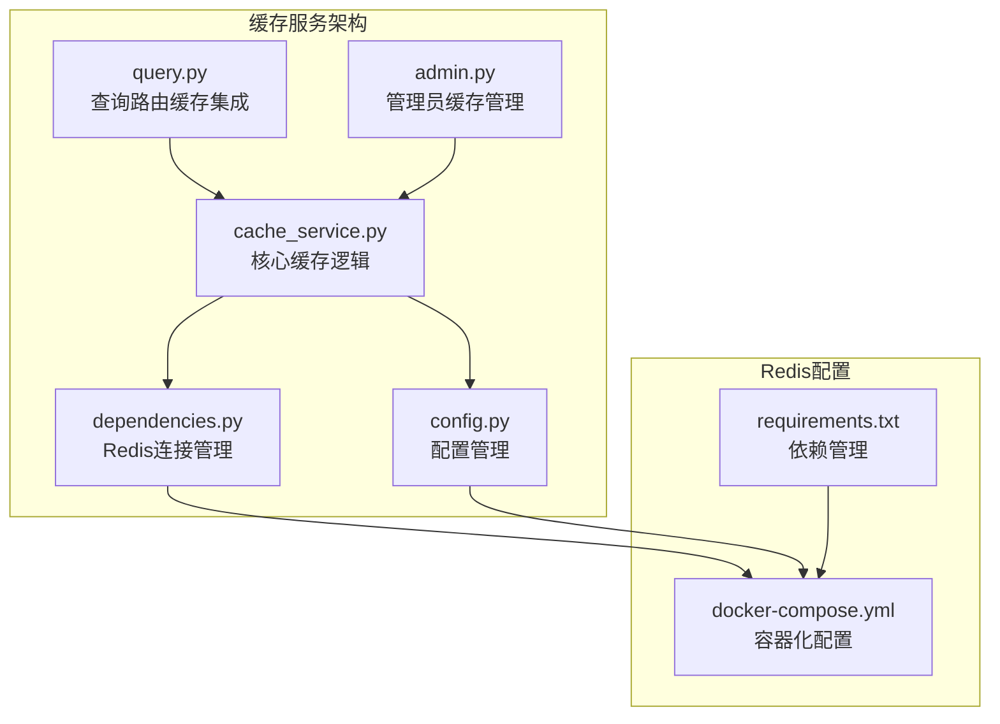
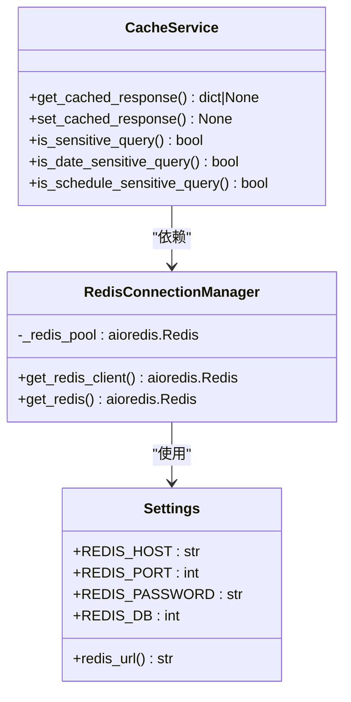
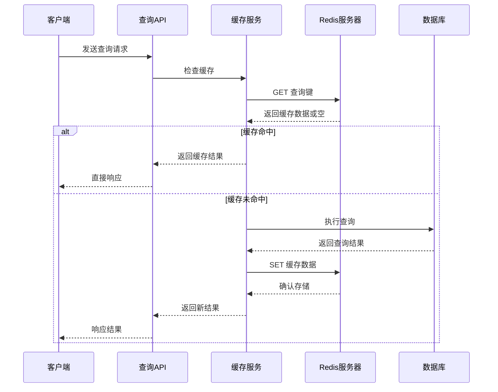
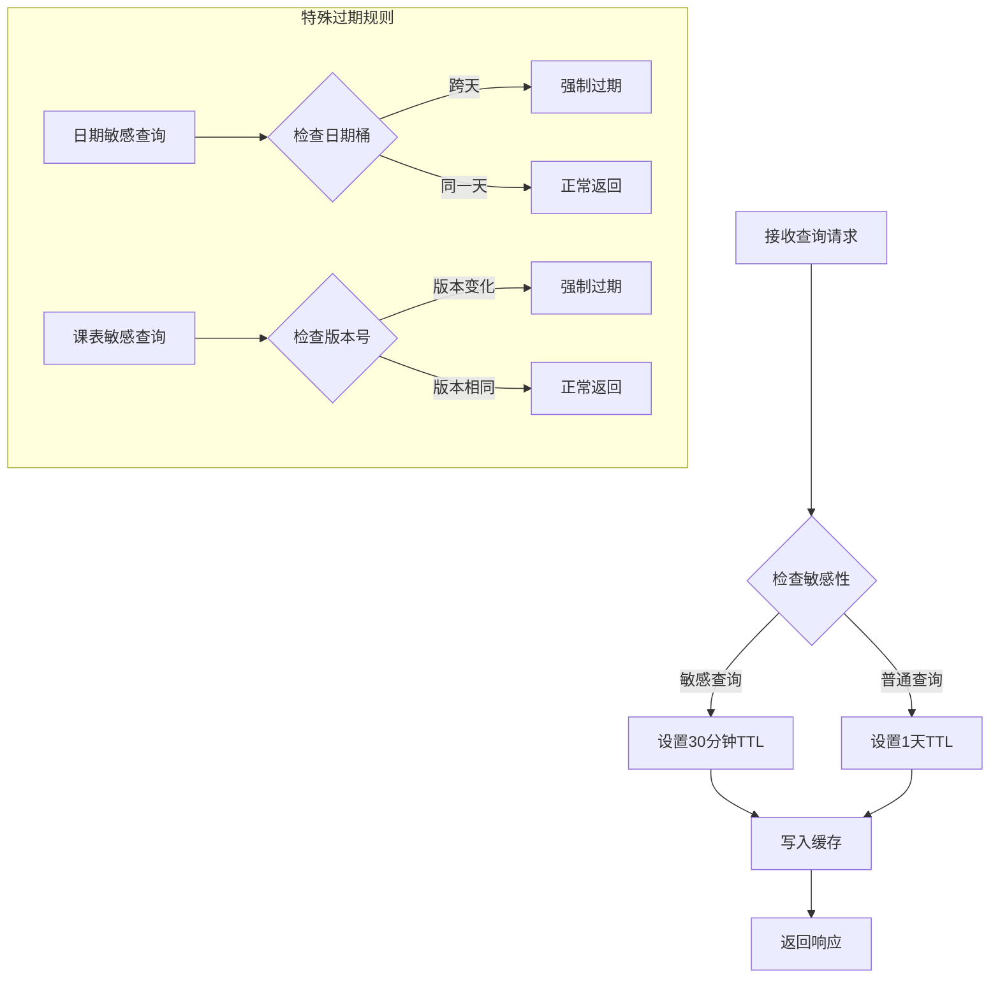
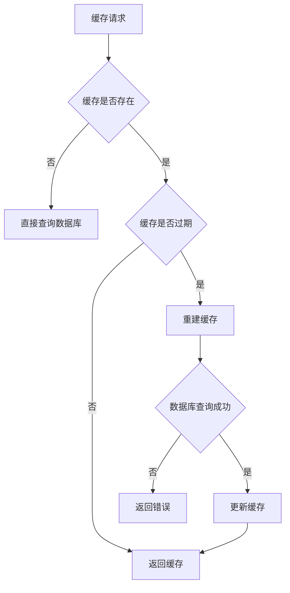
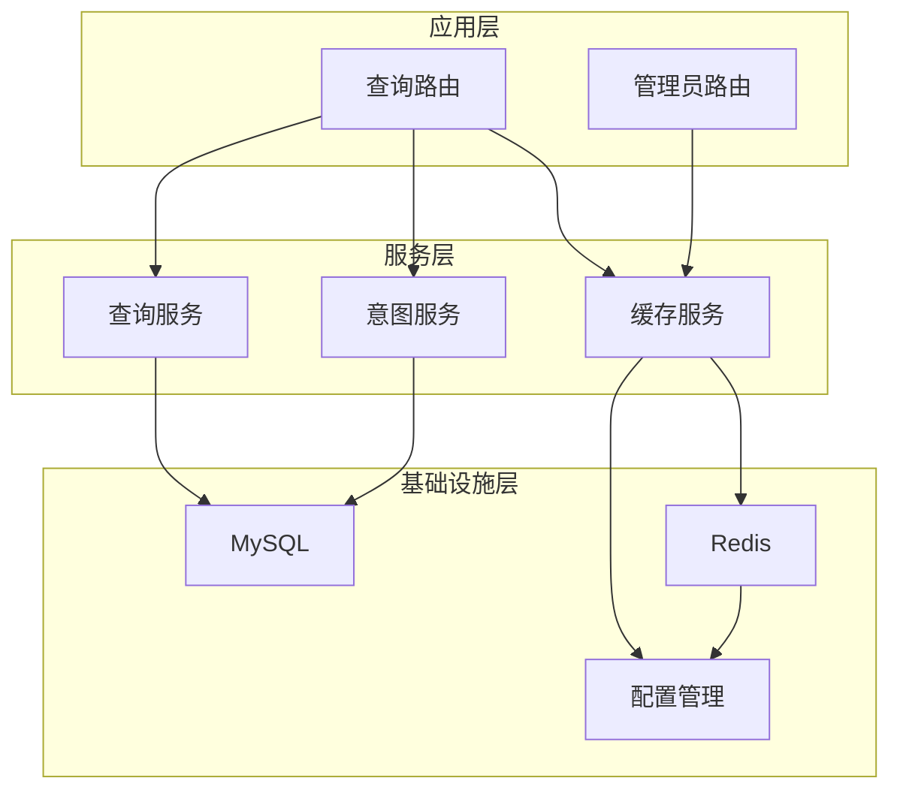
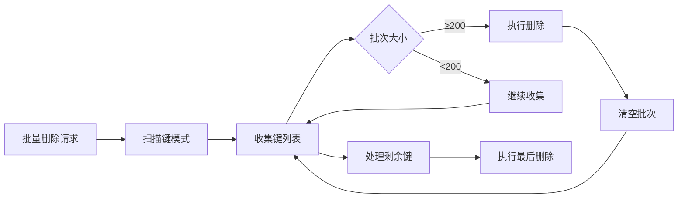

# 缓存服务

<cite>
**本文档引用的文件**
- [cache_service.py](file://service/ai_assistant/app/services/cache_service.py)
- [config.py](file://service/ai_assistant/app/config.py)
- [dependencies.py](file://service/ai_assistant/app/dependencies.py)
- [query.py](file://service/ai_assistant/app/routers/query.py)
- [admin.py](file://service/ai_assistant/app/routers/admin.py)
- [docker-compose.yml](file://service/ai_assistant/docker-compose.yml)
- [main.py](file://service/ai_assistant/app/main.py)
- [requirements.txt](file://service/ai_assistant/requirements.txt)
</cite>

## 目录
1. [简介](#简介)
2. [项目结构](#项目结构)
3. [核心组件](#核心组件)
4. [架构总览](#架构总览)
5. [详细组件分析](#详细组件分析)
6. [依赖关系分析](#依赖关系分析)
7. [性能考虑](#性能考虑)
8. [故障排除指南](#故障排除指南)
9. [结论](#结论)
10. [附录](#附录)

## 简介

AI校园助手项目的缓存服务是一个基于Redis的高性能缓存系统，专为校园智能问答场景设计。该系统实现了多级缓存架构，包括查询结果缓存、意图分类缓存、会话历史缓存，并提供了完善的缓存一致性保证机制。

缓存服务的核心目标是：
- 提升查询响应速度，减少数据库和LLM服务的负载
- 保障数据一致性，防止脏数据缓存
- 支持敏感信息的快速过期机制
- 提供灵活的缓存策略，适应不同类型的查询需求

## 项目结构

缓存服务在项目中的组织结构如下：



**图表来源**
- [cache_service.py:1-177](file://service/ai_assistant/app/services/cache_service.py#L1-L177)
- [dependencies.py:1-109](file://service/ai_assistant/app/dependencies.py#L1-L109)
- [config.py:1-113](file://service/ai_assistant/app/config.py#L1-L113)

**章节来源**
- [cache_service.py:1-177](file://service/ai_assistant/app/services/cache_service.py#L1-L177)
- [dependencies.py:1-109](file://service/ai_assistant/app/dependencies.py#L1-L109)
- [config.py:1-113](file://service/ai_assistant/app/config.py#L1-L113)

## 核心组件

### Redis连接管理

缓存服务通过依赖注入模式管理Redis连接，实现了连接池的单例模式：



**图表来源**
- [dependencies.py:36-50](file://service/ai_assistant/app/dependencies.py#L36-L50)
- [config.py:94-100](file://service/ai_assistant/app/config.py#L94-L100)
- [cache_service.py:92-175](file://service/ai_assistant/app/services/cache_service.py#L92-L175)

### 缓存键空间设计

系统采用层次化的键命名空间设计：

| 键类型 | 命名格式 | 描述 |
|--------|----------|------|
| 查询缓存 | `chat_cache:{version}:{did}:{query_hash}` | 主要的查询结果缓存 |
| 课表版本 | `chat_cache:schedule_version` | 课表变更的版本控制 |
| 会话历史 | `chat:session_history:{did}:{session_id}` | 用户会话历史记录 |

**章节来源**
- [cache_service.py:3-8](file://service/ai_assistant/app/services/cache_service.py#L3-L8)
- [cache_service.py:49-52](file://service/ai_assistant/app/services/cache_service.py#L49-L52)
- [query.py:153-154](file://service/ai_assistant/app/routers/query.py#L153-L154)

## 架构总览

缓存服务的整体架构采用异步非阻塞设计，确保高并发场景下的性能表现：



**图表来源**
- [query.py:280-312](file://service/ai_assistant/app/routers/query.py#L280-L312)
- [cache_service.py:92-175](file://service/ai_assistant/app/services/cache_service.py#L92-L175)

## 详细组件分析

### 缓存策略设计

#### TTL过期管理

系统实现了智能的TTL（生存时间）管理机制：



**图表来源**
- [cache_service.py:85-89](file://service/ai_assistant/app/services/cache_service.py#L85-L89)
- [cache_service.py:114-142](file://service/ai_assistant/app/services/cache_service.py#L114-L142)

#### 缓存键生成策略

缓存键采用MD5哈希算法确保唯一性和安全性：

| 组件 | 作用 | 示例 |
|------|------|------|
| 版本号 | 隔离不同版本的缓存 | `v3` |
| DID标识 | 用户身份隔离 | `did:abc123` |
| 查询哈希 | 查询内容唯一标识 | `md5(query)` |

**章节来源**
- [cache_service.py:49-52](file://service/ai_assistant/app/services/cache_service.py#L49-L52)
- [cache_service.py:85-89](file://service/ai_assistant/app/services/cache_service.py#L85-L89)

### 多级缓存架构

#### 查询结果缓存

查询结果缓存是最主要的缓存层级，支持以下特性：

- **智能过期**：根据查询内容的敏感性自动调整过期时间
- **元数据保护**：缓存中包含版本信息和元数据，确保缓存一致性
- **异常处理**：自动检测和清理损坏的缓存数据

#### 会话历史缓存

会话历史缓存采用Redis列表结构：

```mermaid
graph LR
A[会话开始] --> B[用户提问]
B --> C[存储用户消息]
C --> D[AI回答]
D --> E[存储AI回复]
E --> F[限制历史长度]
F --> G[设置过期时间]
subgraph "Redis列表结构"
H[chat:session_history:{did}:{session_id}]
I[消息1]
J[消息2]
K[消息N]
end
C --> H
E --> H
H --> I
I --> J
J --> K
```

**图表来源**
- [query.py:153-195](file://service/ai_assistant/app/routers/query.py#L153-L195)

**章节来源**
- [query.py:157-195](file://service/ai_assistant/app/routers/query.py#L157-L195)

### 缓存一致性保证机制

#### 写穿透防护

系统通过以下机制防止写穿透：

1. **查询预处理**：对查询文本进行标准化处理
2. **敏感性检查**：自动识别敏感查询并应用特殊策略
3. **缓存验证**：在返回前验证缓存数据的有效性

#### 缓存雪崩预防

通过以下策略预防缓存雪崩：

- **TTL随机化**：在基础TTL基础上添加随机抖动
- **渐进式过期**：关键缓存设置更短的过期时间
- **降级策略**：Redis故障时自动降级到数据库

#### 缓存击穿处理

系统采用双重保护机制：



**图表来源**
- [cache_service.py:92-146](file://service/ai_assistant/app/services/cache_service.py#L92-L146)

**章节来源**
- [cache_service.py:92-175](file://service/ai_assistant/app/services/cache_service.py#L92-L175)

### 缓存监控与健康检查

#### Redis容器配置

Docker Compose文件提供了完整的Redis监控配置：

| 配置项 | 值 | 说明 |
|--------|----|------|
| maxmemory | 256MB | 内存上限 |
| maxmemory-policy | allkeys-lru | 淘汰策略 |
| healthcheck | ping测试 | 健康检查 |
| requirepass | 环境变量 | 密码认证 |

**章节来源**
- [docker-compose.yml:11-22](file://service/ai_assistant/docker-compose.yml#L11-L22)

## 依赖关系分析

缓存服务的依赖关系体现了清晰的分层架构：



**图表来源**
- [query.py:35-42](file://service/ai_assistant/app/routers/query.py#L35-L42)
- [admin.py:45](file://service/ai_assistant/app/routers/admin.py#L45)

**章节来源**
- [query.py:35-42](file://service/ai_assistant/app/routers/query.py#L35-L42)
- [admin.py:45](file://service/ai_assistant/app/routers/admin.py#L45)

## 性能考虑

### 连接复用与优化

系统通过单例模式实现Redis连接的高效复用：

- **连接池管理**：全局唯一的Redis连接实例
- **异步操作**：使用asyncio实现非阻塞I/O
- **批量操作**：支持批量删除和扫描操作

### 缓存性能优化策略

#### 批量操作实现



**图表来源**
- [query.py:763-773](file://service/ai_assistant/app/routers/query.py#L763-L773)

#### 管道命令支持

虽然当前实现使用标准Redis命令，但系统架构支持未来引入管道命令优化：

- **命令组合**：将多个读取操作组合为管道
- **原子性保证**：确保相关操作的原子性
- **网络开销减少**：减少客户端-服务器往返次数

**章节来源**
- [dependencies.py:36-50](file://service/ai_assistant/app/dependencies.py#L36-L50)
- [query.py:763-773](file://service/ai_assistant/app/routers/query.py#L763-L773)

## 故障排除指南

### 常见问题诊断

#### Redis连接问题

**症状**：缓存功能异常，查询超时

**排查步骤**：
1. 检查Redis服务状态
2. 验证连接参数配置
3. 查看连接池状态

#### 缓存一致性问题

**症状**：用户看到过期或错误信息

**解决方案**：
1. 检查TTL配置
2. 验证缓存键生成逻辑
3. 确认版本控制机制

#### 性能问题

**症状**：响应时间过长，Redis负载过高

**优化措施**：
1. 调整maxmemory策略
2. 优化查询模式
3. 实施缓存预热

**章节来源**
- [main.py:43-49](file://service/ai_assistant/app/main.py#L43-L49)
- [docker-compose.yml:13-15](file://service/ai_assistant/docker-compose.yml#L13-L15)

## 结论

AI校园助手项目的缓存服务通过精心设计的架构和策略，为校园智能问答系统提供了可靠的性能保障。系统的主要优势包括：

1. **多层次缓存设计**：查询结果、会话历史、版本控制的完整缓存体系
2. **智能过期机制**：基于查询内容敏感性的动态TTL管理
3. **一致性保证**：通过版本控制和元数据保护确保数据准确性
4. **高可用性**：Redis故障时的优雅降级机制
5. **可观测性**：完善的日志记录和监控支持

该缓存服务为AI校园助手项目提供了坚实的技术基础，能够有效支撑大规模的校园用户访问需求。

## 附录

### 配置最佳实践

#### Redis配置建议

| 参数 | 建议值 | 说明 |
|------|--------|------|
| maxmemory | 256MB-512MB | 根据业务规模调整 |
| maxmemory-policy | allkeys-lru | 推荐的淘汰策略 |
| timeout | 2000ms | 连接超时设置 |
| retry_on_timeout | true | 自动重试机制 |

#### 缓存策略配置

```python
# 缓存TTL配置示例
CACHE_TTL_SENSITIVE = 1800    # 30分钟
CACHE_TTL_NORMAL = 86400      # 24小时
MAX_HISTORY_COUNT = 10        # 会话历史条数
```

#### 运维监控指标

- **缓存命中率**：评估缓存效果的重要指标
- **Redis内存使用率**：监控资源使用情况
- **连接池利用率**：确保连接复用效率
- **查询延迟分布**：分析性能瓶颈