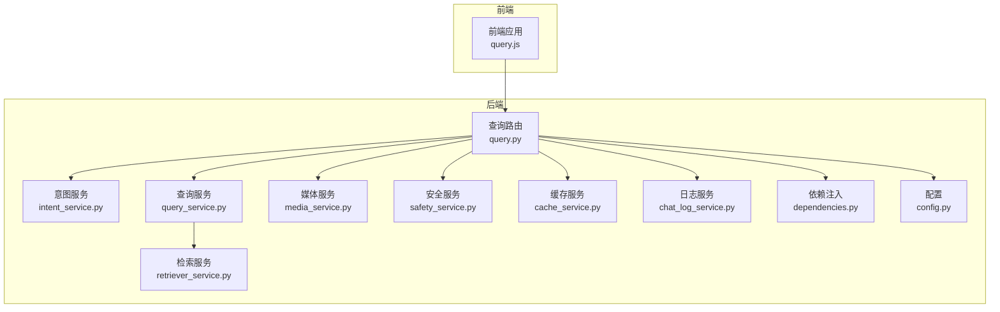
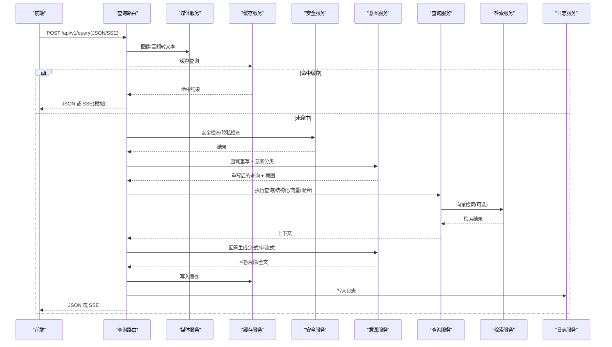
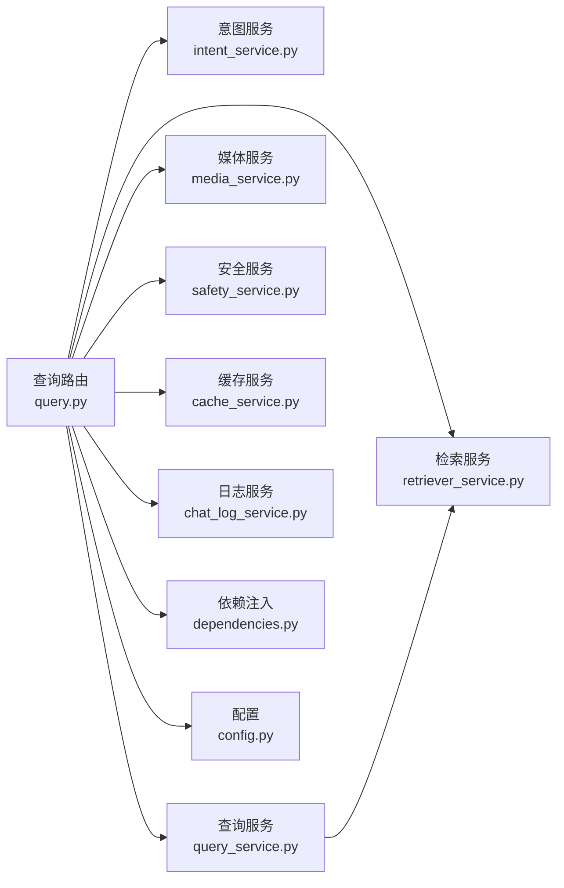

# 查询路由

<cite>
**本文档引用的文件**
- [service/ai_assistant/app/routers/query.py](file://service/ai_assistant/app/routers/query.py)
- [service/ai_assistant/app/schemas/query.py](file://service/ai_assistant/app/schemas/query.py)
- [service/ai_assistant/app/services/query_service.py](file://service/ai_assistant/app/services/query_service.py)
- [service/ai_assistant/app/services/intent_service.py](file://service/ai_assistant/app/services/intent_service.py)
- [service/ai_assistant/app/services/retriever_service.py](file://service/ai_assistant/app/services/retriever_service.py)
- [service/ai_assistant/app/services/cache_service.py](file://service/ai_assistant/app/services/cache_service.py)
- [service/ai_assistant/app/services/chat_log_service.py](file://service/ai_assistant/app/services/chat_log_service.py)
- [service/ai_assistant/app/services/media_service.py](file://service/ai_assistant/app/services/media_service.py)
- [service/ai_assistant/app/services/safety_service.py](file://service/ai_assistant/app/services/safety_service.py)
- [service/ai_assistant/app/dependencies.py](file://service/ai_assistant/app/dependencies.py)
- [service/ai_assistant/app/config.py](file://service/ai_assistant/app/config.py)
- [frontend/ai_assistant/src/api/query.js](file://frontend/ai_assistant/src/api/query.js)
</cite>

## 目录
1. [简介](#简介)
2. [项目结构](#项目结构)
3. [核心组件](#核心组件)
4. [架构总览](#架构总览)
5. [详细组件分析](#详细组件分析)
6. [依赖关系分析](#依赖关系分析)
7. [性能考量](#性能考量)
8. [故障排查指南](#故障排查指南)
9. [结论](#结论)
10. [附录](#附录)

## 简介
本文件聚焦于 AI 校园助手项目的“查询路由”模块，系统性阐述智能问答查询的完整实现链路，包括：
- 多模态输入处理（图像/音频转文本）
- 上下文感知的查询重写
- 意图分类与查询执行（结构化/向量/混合）
- 流式响应（SSE）与实时消息推送
- 并发处理策略与依赖注入
- 请求/响应格式、数据验证与错误处理
- 与服务层的交互模式与性能优化

## 项目结构
查询路由位于后端 FastAPI 应用的路由器层，围绕统一入口 POST /api/v1/query 展开，配合一系列服务层组件完成端到端的问答处理。

图表来源
- [service/ai_assistant/app/routers/query.py:1-788](file://service/ai_assistant/app/routers/query.py#L1-L788)
- [service/ai_assistant/app/services/intent_service.py:1-346](file://service/ai_assistant/app/services/intent_service.py#L1-L346)
- [service/ai_assistant/app/services/query_service.py:1-800](file://service/ai_assistant/app/services/query_service.py#L1-L800)
- [service/ai_assistant/app/services/retriever_service.py:1-168](file://service/ai_assistant/app/services/retriever_service.py#L1-L168)
- [service/ai_assistant/app/services/media_service.py:1-246](file://service/ai_assistant/app/services/media_service.py#L1-L246)
- [service/ai_assistant/app/services/safety_service.py:1-163](file://service/ai_assistant/app/services/safety_service.py#L1-L163)
- [service/ai_assistant/app/services/cache_service.py:1-177](file://service/ai_assistant/app/services/cache_service.py#L1-L177)
- [service/ai_assistant/app/services/chat_log_service.py:1-76](file://service/ai_assistant/app/services/chat_log_service.py#L1-L76)
- [service/ai_assistant/app/dependencies.py:1-109](file://service/ai_assistant/app/dependencies.py#L1-L109)
- [service/ai_assistant/app/config.py:1-113](file://service/ai_assistant/app/config.py#L1-L113)

章节来源
- [service/ai_assistant/app/routers/query.py:1-788](file://service/ai_assistant/app/routers/query.py#L1-L788)

## 核心组件
- 查询路由（query_endpoint）：统一入口，负责多模态输入解码、缓存命中、并发任务、意图分类、查询执行、回答生成与缓存写入、SSE 流式输出。
- 意图服务（intent_service）：意图分类、查询重写、回答生成（含流式）。
- 查询服务（query_service）：结构化查询（SQL）、工具规划、上下文组装与格式化。
- 检索服务（retriever_service）：基于百炼检索 API 的向量检索。
- 媒体服务（media_service）：图像/音频转文本。
- 安全服务（safety_service）：危险内容检测与隐私检查。
- 缓存服务（cache_service）：基于 Redis 的查询缓存与失效策略。
- 日志服务（chat_log_service）：对话日志持久化与历史加载。
- 依赖注入（dependencies）：数据库会话、Redis 客户端、当前用户解析。
- 配置（config）：模型与外部服务配置。

章节来源
- [service/ai_assistant/app/schemas/query.py:1-33](file://service/ai_assistant/app/schemas/query.py#L1-L33)
- [service/ai_assistant/app/services/intent_service.py:1-346](file://service/ai_assistant/app/services/intent_service.py#L1-L346)
- [service/ai_assistant/app/services/query_service.py:1-800](file://service/ai_assistant/app/services/query_service.py#L1-L800)
- [service/ai_assistant/app/services/retriever_service.py:1-168](file://service/ai_assistant/app/services/retriever_service.py#L1-L168)
- [service/ai_assistant/app/services/media_service.py:1-246](file://service/ai_assistant/app/services/media_service.py#L1-L246)
- [service/ai_assistant/app/services/safety_service.py:1-163](file://service/ai_assistant/app/services/safety_service.py#L1-L163)
- [service/ai_assistant/app/services/cache_service.py:1-177](file://service/ai_assistant/app/services/cache_service.py#L1-L177)
- [service/ai_assistant/app/services/chat_log_service.py:1-76](file://service/ai_assistant/app/services/chat_log_service.py#L1-L76)
- [service/ai_assistant/app/dependencies.py:1-109](file://service/ai_assistant/app/dependencies.py#L1-L109)
- [service/ai_assistant/app/config.py:1-113](file://service/ai_assistant/app/config.py#L1-L113)

## 架构总览
查询路由采用“请求预处理 → 缓存 → 并发安全与隐私检查 → 意图重写 → 意图分类 → 查询执行 → 回答生成 → 缓存与日志”的流水线式处理，支持 JSON 与 SSE 两种输出模式。

图表来源
- [service/ai_assistant/app/routers/query.py:198-745](file://service/ai_assistant/app/routers/query.py#L198-L745)
- [service/ai_assistant/app/services/media_service.py:115-246](file://service/ai_assistant/app/services/media_service.py#L115-L246)
- [service/ai_assistant/app/services/cache_service.py:92-177](file://service/ai_assistant/app/services/cache_service.py#L92-L177)
- [service/ai_assistant/app/services/safety_service.py:84-163](file://service/ai_assistant/app/services/safety_service.py#L84-L163)
- [service/ai_assistant/app/services/intent_service.py:218-346](file://service/ai_assistant/app/services/intent_service.py#L218-L346)
- [service/ai_assistant/app/services/query_service.py:1-800](file://service/ai_assistant/app/services/query_service.py#L1-L800)
- [service/ai_assistant/app/services/retriever_service.py:46-168](file://service/ai_assistant/app/services/retriever_service.py#L46-L168)
- [service/ai_assistant/app/services/chat_log_service.py:14-76](file://service/ai_assistant/app/services/chat_log_service.py#L14-L76)

## 详细组件分析

### 查询路由（query_endpoint）
- 多模态输入处理
  - 图像：调用媒体服务将 Base64 图像转文本，附加上下文前缀。
  - 音频：调用媒体服务将 Base64 音频转 WAV 并识别为文本。
  - 文本：直接拼接到统一查询。
  - 输入校验：至少提供一种模态，否则返回 400。
- 缓存策略
  - 以 DID + 查询文本哈希为键，命中则直接返回 JSON 或 SSE（模拟）。
  - Redis 可用性降级：异常时继续走 DB 回退。
- 并发与上下文
  - 并发执行安全检查与查询重写，缩短总延迟。
  - 会话隔离历史：优先从 Redis 加载最近 N 条历史，异常时回退 DB。
- 意图与查询执行
  - 意图分类：基于重写后的查询进行分类（structured/vector/hybrid/smalltalk）。
  - 图片纯问答：若满足条件，直接基于图片描述回答，跳过检索。
  - 查询执行：根据意图调用查询服务，支持结构化 SQL、向量检索与混合。
  - 意图后处理：根据执行上下文修正意图（如从 vector → hybrid/structured）。
- 回答生成与缓存
  - JSON 模式：在独立会话中持久化回答，避免占用请求会话连接。
  - SSE 模式：使用流式生成器，分片输出，最后发送完成包并写入缓存与日志。
- 错误处理
  - 图像/音频处理失败：返回 502。
  - 查询执行失败：返回 502。
  - 流式异常：转换为 SSE 错误包并结束。
- 会话清理
  - 提供删除端点，按 DID 清理缓存与历史键。

章节来源
- [service/ai_assistant/app/routers/query.py:198-788](file://service/ai_assistant/app/routers/query.py#L198-L788)

### 意图服务（intent_service）
- 意图分类：基于模板与 LLM，输出 structured/vector/hybrid/smalltalk。
- 查询重写：结合最近历史，补齐缺失信息，形成完整独立查询。
- 回答生成：构建总结提示词，裁剪历史与上下文，调用 LLM 生成自然语言回答。
- 流式输出：提供流式生成器，逐片产出回答片段。

章节来源
- [service/ai_assistant/app/services/intent_service.py:218-346](file://service/ai_assistant/app/services/intent_service.py#L218-L346)

### 查询服务（query_service）
- 结构化查询：封装 SQL 查询，支持成绩、课表、选课、个人信息、学术概览、教师通讯录等。
- 工具规划：基于意图与用户问题，规划工具调用序列（如 get_my_schedule/get_my_scores）。
- 上下文组装：将结构化结果与向量检索结果合并，必要时进行重排与去重。
- 数据格式化：将英文字段名翻译为中文，学期 ID 格式化，布尔值人性化。

章节来源
- [service/ai_assistant/app/services/query_service.py:1-800](file://service/ai_assistant/app/services/query_service.py#L1-L800)

### 检索服务（retriever_service）
- 百炼检索：调用检索 API，返回拼接的文本块，过滤过短片段。
- 容错与回退：API 结构变化时提供回退逻辑，异常时返回“未找到”。

章节来源
- [service/ai_assistant/app/services/retriever_service.py:46-168](file://service/ai_assistant/app/services/retriever_service.py#L46-L168)

### 媒体服务（media_service）
- 图像理解：优化图像尺寸与体积，调用多模态模型提取描述。
- 语音识别：解码 Base64 音频，转换为 WAV，调用 ASR 识别为文本。
- 错误处理：对转换失败与 API 错误进行捕获与抛出。

章节来源
- [service/ai_assistant/app/services/media_service.py:115-246](file://service/ai_assistant/app/services/media_service.py#L115-L246)

### 安全服务（safety_service）
- 危险内容检测：优先使用 LLM 判断，失败时回退正则。
- 公共服务查询豁免：对“电话/联系方式/热线”等查询放行。
- 隐私检查：检测是否试图查询他人学号，发现即阻断。

章节来源
- [service/ai_assistant/app/services/safety_service.py:84-163](file://service/ai_assistant/app/services/safety_service.py#L84-L163)

### 缓存服务（cache_service）
- 键空间：chat_cache:{version}:{did}:{query_md5}。
- TTL 策略：敏感查询 30 分钟，普通查询 1 天。
- 日期敏感与课表敏感：跨天或管理员改课后失效。
- 版本控制：课表缓存版本号递增，避免脏缓存。

章节来源
- [service/ai_assistant/app/services/cache_service.py:92-177](file://service/ai_assistant/app/services/cache_service.py#L92-L177)

### 日志服务（chat_log_service）
- 持久化：保存学生提问与助手回答，危险消息保留原始学号。
- 历史加载：按 DID 与时间倒序加载最近 N 条，构建上下文。

章节来源
- [service/ai_assistant/app/services/chat_log_service.py:14-76](file://service/ai_assistant/app/services/chat_log_service.py#L14-L76)

### 依赖注入（dependencies）
- 数据库会话：异步会话生成器，按请求作用域管理。
- Redis 客户端：单例客户端，全局复用。
- 当前用户：从 JWT 解析学号，校验失败返回 401。

章节来源
- [service/ai_assistant/app/dependencies.py:27-73](file://service/ai_assistant/app/dependencies.py#L27-L73)

### 配置（config）
- 模型与外部服务：LLM 模型、百炼检索、DashScope API 等。
- 缓存 TTL：敏感与普通查询的过期时间。
- 数据库与 Redis：连接字符串与 CORS 配置。

章节来源
- [service/ai_assistant/app/config.py:54-113](file://service/ai_assistant/app/config.py#L54-L113)

## 依赖关系分析
查询路由模块与各服务之间呈现清晰的职责分离与松耦合：
- 路由层仅负责编排与协调，不直接操作数据库或外部 API。
- 服务层内聚各自领域逻辑，通过依赖注入共享基础设施。
- 通过枚举与 Pydantic 模型统一请求/响应契约，便于前后端协作。

图表来源
- [service/ai_assistant/app/routers/query.py:35-42](file://service/ai_assistant/app/routers/query.py#L35-L42)
- [service/ai_assistant/app/services/query_service.py:1-800](file://service/ai_assistant/app/services/query_service.py#L1-L800)
- [service/ai_assistant/app/services/retriever_service.py:1-168](file://service/ai_assistant/app/services/retriever_service.py#L1-L168)
- [service/ai_assistant/app/services/media_service.py:1-246](file://service/ai_assistant/app/services/media_service.py#L1-L246)
- [service/ai_assistant/app/services/safety_service.py:1-163](file://service/ai_assistant/app/services/safety_service.py#L1-L163)
- [service/ai_assistant/app/services/cache_service.py:1-177](file://service/ai_assistant/app/services/cache_service.py#L1-L177)
- [service/ai_assistant/app/services/chat_log_service.py:1-76](file://service/ai_assistant/app/services/chat_log_service.py#L1-L76)
- [service/ai_assistant/app/dependencies.py:1-109](file://service/ai_assistant/app/dependencies.py#L1-L109)
- [service/ai_assistant/app/config.py:1-113](file://service/ai_assistant/app/config.py#L1-L113)

## 性能考量
- 并发优化
  - 并发执行安全检查与查询重写，减少等待时间。
  - 流式生成在独立线程池中运行，避免阻塞事件循环。
- 连接管理
  - 在 JSON 模式与 SSE 模式中均尽早回滚数据库会话，释放连接。
  - SSE 生成器结束后使用短生命周期会话写入日志，避免长连接占用。
- 缓存策略
  - 针对敏感与日期敏感查询设置合理 TTL，平衡一致性与性能。
  - 课表缓存版本控制，管理员改课后快速失效。
- I/O 优化
  - 媒体服务对图像进行尺寸与体积优化，降低外部 API 负担。
  - 检索服务过滤过短片段，减少无效上下文。
- 前端适配
  - SSE 容错解析，兼容不同网关改写格式。
  - 前端在 JSON 模式下也能接收最终回答，避免长时间“思考”状态。

[本节为通用性能讨论，无需特定文件来源]

## 故障排查指南
- 常见错误与处理
  - 图像/音频处理失败：检查媒体服务日志与外部 API 状态，确认 Base64 有效性与格式。
  - 查询执行失败：查看查询服务日志，确认 SQL 与工具规划是否正确。
  - 流式异常：路由层将异常转换为 SSE 错误包，前端监听 error 字段并提示用户重试。
  - 缓存异常：Redis 可用性降级不影响功能，但会失去缓存加速。
- 关键日志点
  - 路由层：统一查询构建、缓存命中/未命中、并发任务完成、SSE 生成进度。
  - 服务层：意图分类、查询重写、检索结果、回答生成。
- 建议排查步骤
  - 检查 JWT 是否有效，确认 get_current_user 依赖工作正常。
  - 查看 Redis 连接与键空间，确认缓存键命名与版本。
  - 核对模型配置与外部 API 密钥，确保 LLM 与检索服务可用。
  - 前端：确认 SSE 解析逻辑与错误回调，必要时启用 JSON 模式进行对比测试。

章节来源
- [service/ai_assistant/app/routers/query.py:233-260](file://service/ai_assistant/app/routers/query.py#L233-L260)
- [service/ai_assistant/app/routers/query.py:544-549](file://service/ai_assistant/app/routers/query.py#L544-L549)
- [service/ai_assistant/app/routers/query.py:740-744](file://service/ai_assistant/app/routers/query.py#L740-L744)
- [frontend/ai_assistant/src/api/query.js:78-139](file://frontend/ai_assistant/src/api/query.js#L78-L139)

## 结论
查询路由模块通过“多模态输入解码 → 缓存命中 → 并发安全与隐私检查 → 意图重写与分类 → 查询执行 → 回答生成 → 缓存与日志”的完整链路，实现了高性能、可扩展、可维护的智能问答能力。其设计兼顾实时性与稳定性，既支持 JSON 响应也支持 SSE 流式输出，满足不同前端场景需求。

[本节为总结性内容，无需特定文件来源]

## 附录

### 请求/响应格式与验证规则
- 请求体（QueryRequest）
  - 字段：text、image_base64、audio_base64、session_id、output_type。
  - 验证：至少提供一种模态；output_type 为 "json" 时返回结构化 JSON，否则默认 SSE。
- 响应体（QueryResponse）
  - 字段：answer、intent、session_id、response_time_ms、cached。
  - JSON 模式：直接返回结构化对象。
  - SSE 模式：分片输出 chunk，最后发送包含 intent、response_time_ms、cached、done 的完成包。

章节来源
- [service/ai_assistant/app/schemas/query.py:15-32](file://service/ai_assistant/app/schemas/query.py#L15-L32)

### 与前端的交互模式
- 前端通过 /api/v1/query 发送请求，支持两种模式：
  - JSON 模式：后端直接返回 JSON。
  - SSE 模式：后端以 text/event-stream 推送分片，前端解析 data: {...} 行。
- 前端容错：若后端未按标准格式推送，前端仍能解析兜底格式，确保体验稳定。

章节来源
- [frontend/ai_assistant/src/api/query.js:28-141](file://frontend/ai_assistant/src/api/query.js#L28-L141)

### 异步处理与流式输出实现要点
- 异步任务：使用 asyncio.create_task 并发执行安全检查与查询重写。
- 线程池：使用 asyncio.to_thread 将阻塞调用（如 LLM/ASR/检索）放入线程池，避免阻塞事件循环。
- SSE：使用 StreamingResponse 与自定义头部，降低反向代理缓冲/改写概率。

章节来源
- [service/ai_assistant/app/routers/query.py:347-352](file://service/ai_assistant/app/routers/query.py#L347-L352)
- [service/ai_assistant/app/routers/query.py:659-745](file://service/ai_assistant/app/routers/query.py#L659-L745)