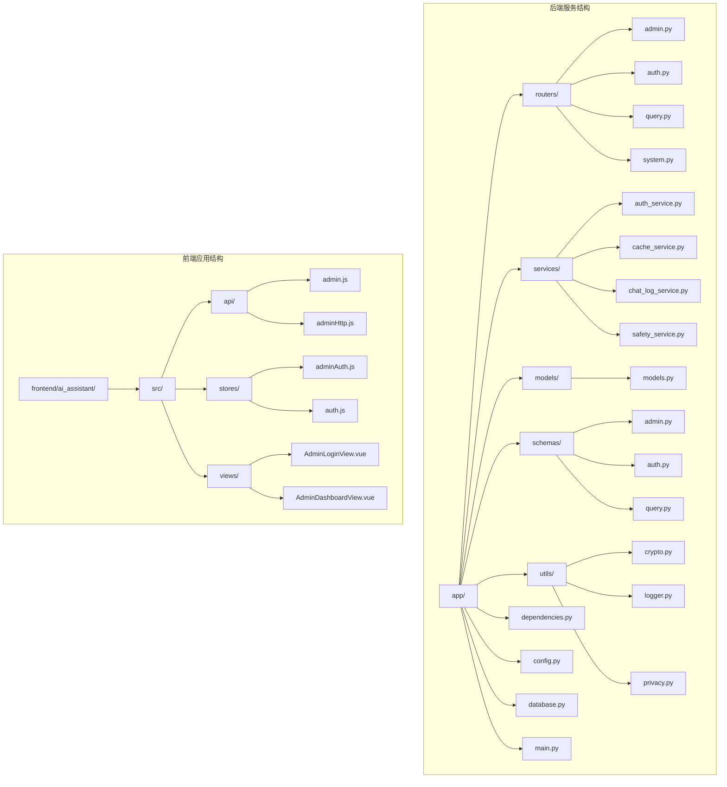
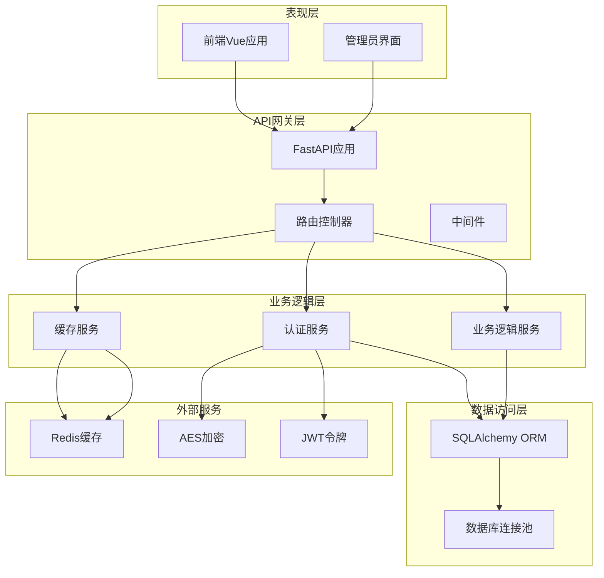
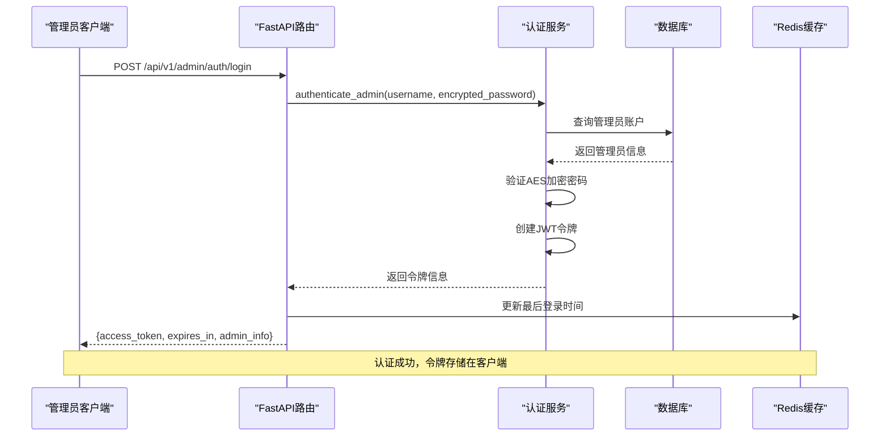
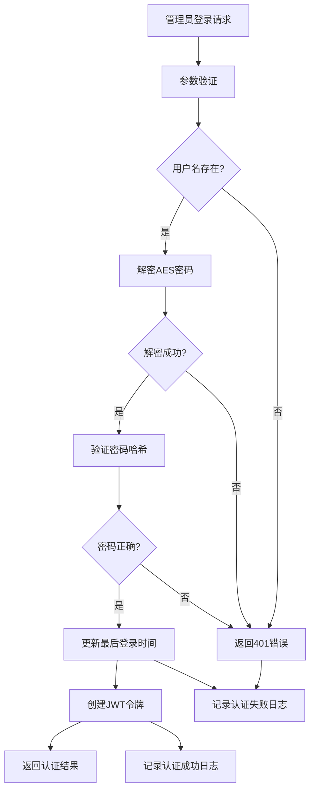
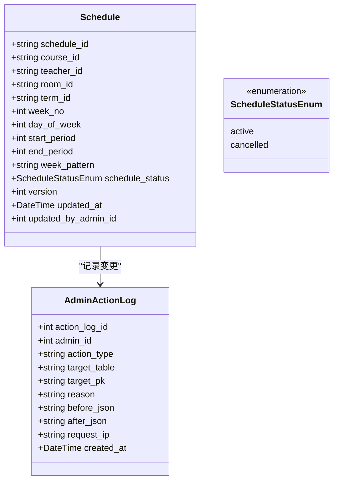
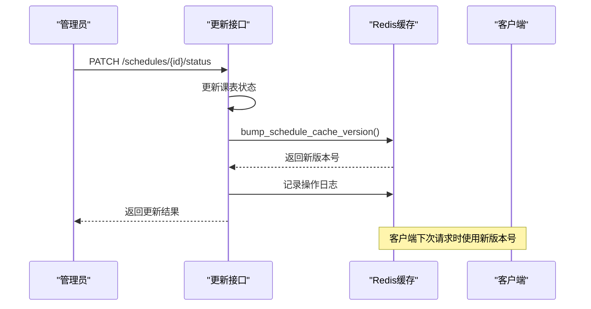
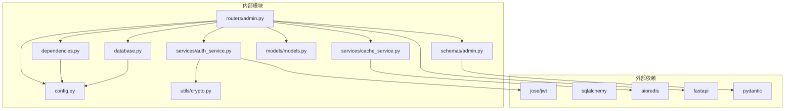
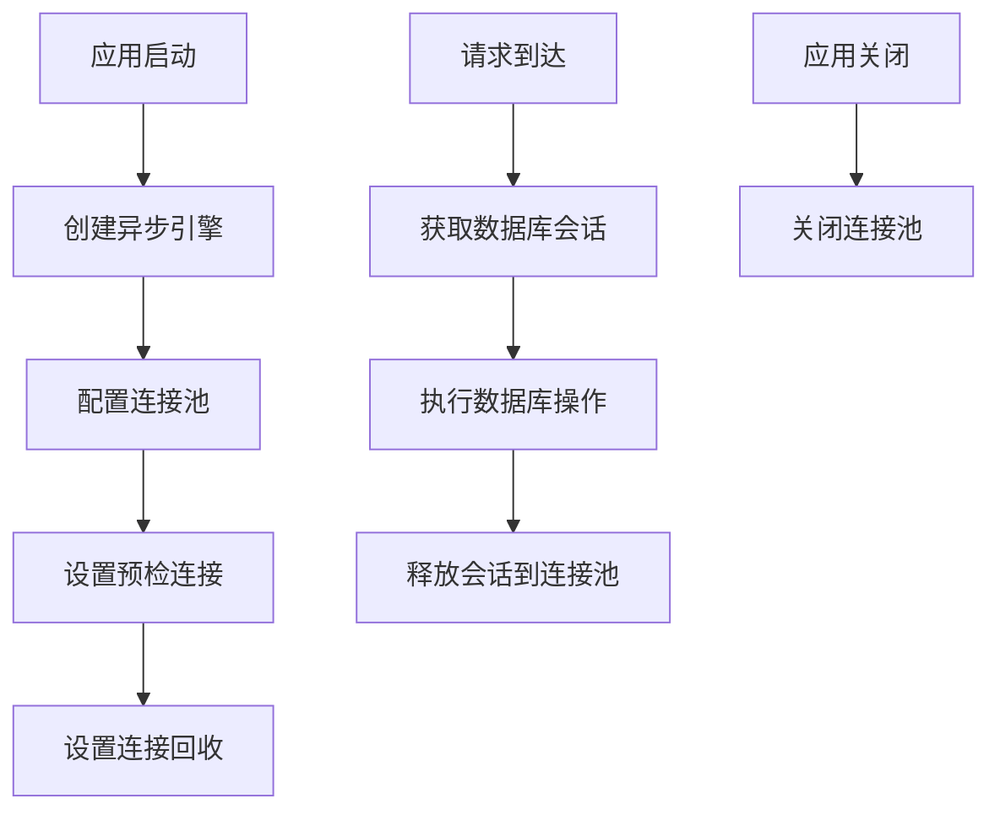

# 管理员路由

<cite>
**本文档引用的文件**
- [admin.py](file://service/ai_assistant/app/routers/admin.py)
- [admin.py](file://service/ai_assistant/app/schemas/admin.py)
- [auth_service.py](file://service/ai_assistant/app/services/auth_service.py)
- [models.py](file://service/ai_assistant/app/models/models.py)
- [dependencies.py](file://service/ai_assistant/app/dependencies.py)
- [config.py](file://service/ai_assistant/app/config.py)
- [crypto.py](file://service/ai_assistant/app/utils/crypto.py)
- [cache_service.py](file://service/ai_assistant/app/services/cache_service.py)
- [database.py](file://service/ai_assistant/app/database.py)
- [main.py](file://service/ai_assistant/app/main.py)
- [admin.js](file://frontend/ai_assistant/src/api/admin.js)
- [adminAuth.js](file://frontend/ai_assistant/src/stores/adminAuth.js)
- [AdminLoginView.vue](file://frontend/ai_assistant/src/views/AdminLoginView.vue)
</cite>

## 目录
1. [简介](#简介)
2. [项目结构](#项目结构)
3. [核心组件](#核心组件)
4. [架构概览](#架构概览)
5. [详细组件分析](#详细组件分析)
6. [依赖关系分析](#依赖关系分析)
7. [性能考虑](#性能考虑)
8. [故障排除指南](#故障排除指南)
9. [结论](#结论)

## 简介

AI校园助手项目的管理员路由模块是整个后台管理系统的核心，负责提供管理员身份认证、课表管理、数据统计和系统监控等关键功能。该模块基于FastAPI构建，采用现代化的异步编程模型，结合JWT令牌认证、Redis缓存和SQLAlchemy ORM，为校园管理系统提供了高效、安全的后台管理能力。

管理员路由模块主要包含以下核心功能：
- 管理员身份认证与授权
- 课表状态管理与批量操作
- 数据统计与概览展示
- 系统元数据管理
- 操作审计与日志记录

## 项目结构

管理员路由模块位于后端服务的`service/ai_assistant/app/routers/`目录下，采用按功能分层的组织方式：

**图表来源**
- [admin.py:1-50](file://service/ai_assistant/app/routers/admin.py#L1-L50)
- [main.py:1-86](file://service/ai_assistant/app/main.py#L1-L86)

**章节来源**
- [admin.py:1-50](file://service/ai_assistant/app/routers/admin.py#L1-L50)
- [main.py:1-86](file://service/ai_assistant/app/main.py#L1-L86)

## 核心组件

管理员路由模块由多个核心组件构成，每个组件都有明确的职责分工：

### 路由控制器
- **admin.py**: 主要的管理员路由控制器，包含所有管理员相关的API端点
- **auth.py**: 用户认证相关路由（学生和管理员）
- **query.py**: 查询相关路由
- **system.py**: 系统管理相关路由

### 数据模型
- **models.py**: 定义了完整的数据库模型，包括管理员、课表、班级、教师等实体
- **schemas/admin.py**: Pydantic模型定义，用于请求验证和响应序列化

### 服务层
- **auth_service.py**: 认证服务，处理JWT令牌创建和验证
- **cache_service.py**: Redis缓存服务，提供智能缓存管理
- **chat_log_service.py**: 对话日志服务
- **safety_service.py**: 安全检测服务

### 工具类
- **crypto.py**: AES加密解密工具
- **logger.py**: 日志记录工具
- **privacy.py**: 隐私保护工具

**章节来源**
- [admin.py:1-50](file://service/ai_assistant/app/routers/admin.py#L1-L50)
- [models.py:1-100](file://service/ai_assistant/app/models/models.py#L1-L100)
- [auth_service.py:1-50](file://service/ai_assistant/app/services/auth_service.py#L1-L50)

## 架构概览

管理员路由模块采用了分层架构设计，确保了良好的关注点分离和可维护性：

**图表来源**
- [main.py:52-86](file://service/ai_assistant/app/main.py#L52-L86)
- [dependencies.py:1-109](file://service/ai_assistant/app/dependencies.py#L1-L109)

### 认证流程

管理员认证采用JWT令牌机制，整个流程如下：

**图表来源**
- [admin.py:51-82](file://service/ai_assistant/app/routers/admin.py#L51-L82)
- [auth_service.py:212-253](file://service/ai_assistant/app/services/auth_service.py#L212-L253)

**章节来源**
- [admin.py:51-82](file://service/ai_assistant/app/routers/admin.py#L51-L82)
- [auth_service.py:212-253](file://service/ai_assistant/app/services/auth_service.py#L212-L253)

## 详细组件分析

### 管理员认证模块

管理员认证模块是整个后台管理系统安全性的核心，采用了多层次的安全防护机制。

#### 认证流程详解

**图表来源**
- [auth_service.py:212-253](file://service/ai_assistant/app/services/auth_service.py#L212-L253)
- [admin.py:57-82](file://service/ai_assistant/app/routers/admin.py#L57-L82)

#### 密码安全机制

管理员密码采用双重安全保护：
1. **传输加密**: 前端使用AES-CBC算法加密密码后传输
2. **存储安全**: 数据库存储SHA-256哈希值，支持多种哈希格式兼容

#### JWT令牌管理

令牌采用标准JWT格式，包含以下关键信息：
- `sub`: 管理员ID
- `role`: 角色标识（固定为"admin"）
- `username`: 管理员用户名
- `exp`: 过期时间戳
- `iat`: 发行时间戳

**章节来源**
- [auth_service.py:63-123](file://service/ai_assistant/app/services/auth_service.py#L63-L123)
- [crypto.py:39-73](file://service/ai_assistant/app/utils/crypto.py#L39-L73)

### 课表管理模块

课表管理模块提供了完整的课表状态管理和批量操作功能。

#### 课表状态管理

**图表来源**
- [models.py:412-480](file://service/ai_assistant/app/models/models.py#L412-L480)
- [models.py:86-112](file://service/ai_assistant/app/models/models.py#L86-L112)

#### 批量操作处理

课表状态更新支持原子性操作，确保数据一致性：

1. **状态检查**: 避免重复更新相同状态
2. **版本控制**: 使用版本号防止并发冲突
3. **审计记录**: 自动记录所有操作变更
4. **缓存同步**: 更新后自动失效相关缓存

**章节来源**
- [admin.py:304-388](file://service/ai_assistant/app/routers/admin.py#L304-L388)
- [models.py:407-410](file://service/ai_assistant/app/models/models.py#L407-L410)

### 数据统计模块

数据统计模块提供了管理员概览页面所需的各种统计数据。

#### 统计指标说明

| 指标名称 | 描述 | SQL查询 |
|---------|------|---------|
| pending_adjustments | 待处理调课申请数量 | `SELECT COUNT(*) FROM schedule_adjustment WHERE status = 'pending'` |
| active_schedules | 活跃课表数量 | `SELECT COUNT(*) FROM schedule WHERE schedule_status = 'active'` |
| cancelled_schedules | 取消课表数量 | `SELECT COUNT(*) FROM schedule WHERE schedule_status = 'cancelled'` |
| total_classes | 班级总数 | `SELECT COUNT(*) FROM class` |
| total_terms | 学期总数 | `SELECT COUNT(*) FROM term` |

#### 统计查询优化

统计查询采用了专门的索引优化：
- `idx_schedule_term_status_time`: 支持活跃/取消课表快速统计
- `idx_action_admin_time`: 支持管理员操作审计统计

**章节来源**
- [admin.py:102-144](file://service/ai_assistant/app/routers/admin.py#L102-L144)
- [models.py:443-465](file://service/ai_assistant/app/models/models.py#L443-L465)

### 系统监控模块

系统监控模块通过Redis实现智能缓存版本控制，确保数据一致性。

#### 缓存版本管理

**图表来源**
- [admin.py:369-381](file://service/ai_assistant/app/routers/admin.py#L369-L381)
- [cache_service.py:78-83](file://service/ai_assistant/app/services/cache_service.py#L78-L83)

#### 缓存策略

系统采用智能缓存策略，根据查询内容自动选择合适的TTL：
- **敏感查询**: 30分钟缓存（如成绩、个人信息）
- **普通查询**: 1天缓存（如一般咨询）
- **课表查询**: 特殊版本控制，管理员更新后立即失效

**章节来源**
- [cache_service.py:85-177](file://service/ai_assistant/app/services/cache_service.py#L85-L177)

## 依赖关系分析

管理员路由模块的依赖关系清晰明确，遵循了依赖倒置原则：

**图表来源**
- [admin.py:1-50](file://service/ai_assistant/app/routers/admin.py#L1-L50)
- [dependencies.py:1-50](file://service/ai_assistant/app/dependencies.py#L1-L50)

### 数据库连接管理

系统采用异步数据库连接池，支持高并发访问：

**图表来源**
- [database.py:7-21](file://service/ai_assistant/app/database.py#L7-L21)
- [dependencies.py:27-31](file://service/ai_assistant/app/dependencies.py#L27-L31)

**章节来源**
- [database.py:1-35](file://service/ai_assistant/app/database.py#L1-L35)
- [dependencies.py:1-109](file://service/ai_assistant/app/dependencies.py#L1-L109)

## 性能考虑

管理员路由模块在设计时充分考虑了性能优化，采用了多种技术手段提升系统性能：

### 缓存优化策略

1. **智能缓存键设计**: 使用MD5哈希作为查询内容的唯一标识
2. **版本控制**: 通过Redis版本号实现缓存失效
3. **敏感性检测**: 自动识别敏感查询并设置合适的TTL

### 数据库查询优化

1. **索引优化**: 为常用查询字段建立复合索引
2. **批量查询**: 使用JOIN查询减少数据库往返次数
3. **分页处理**: 默认每页50条记录，最大200条

### 并发控制

1. **连接池管理**: 使用异步连接池支持高并发
2. **事务管理**: 自动事务提交和回滚
3. **锁机制**: 使用数据库约束防止并发冲突

## 故障排除指南

### 常见问题及解决方案

#### 认证失败问题

**问题症状**:
- 登录时返回401未认证错误
- 返回403禁止访问错误

**可能原因**:
1. 用户名或密码错误
2. 账号被禁用或锁定
3. JWT密钥配置错误
4. AES密钥不匹配

**解决步骤**:
1. 验证用户名和密码是否正确
2. 检查管理员状态是否为active
3. 确认JWT_SECRET_KEY配置正确
4. 验证AES_SECRET_KEY与前端一致

#### 数据库连接问题

**问题症状**:
- 请求超时或连接失败
- 数据库连接池耗尽

**解决步骤**:
1. 检查MySQL服务器状态
2. 验证数据库连接配置
3. 监控连接池使用情况
4. 调整连接池大小参数

#### 缓存失效问题

**问题症状**:
- 更新后数据未及时刷新
- 缓存版本不一致

**解决步骤**:
1. 检查Redis服务器状态
2. 验证缓存键格式
3. 确认版本号递增逻辑
4. 清理异常缓存数据

**章节来源**
- [auth_service.py:212-253](file://service/ai_assistant/app/services/auth_service.py#L212-L253)
- [dependencies.py:75-109](file://service/ai_assistant/app/dependencies.py#L75-L109)

## 结论

管理员路由模块作为AI校园助手项目的核心组件，展现了现代Web应用开发的最佳实践。该模块通过合理的架构设计、完善的安全机制和高效的性能优化，为校园管理系统提供了稳定可靠的后台管理能力。

### 主要优势

1. **安全性**: 采用JWT令牌认证、AES加密传输和多层权限控制
2. **可扩展性**: 模块化设计支持功能扩展和维护
3. **性能**: 异步编程模型、智能缓存和数据库优化
4. **可观测性**: 完善的日志记录和审计功能
5. **用户体验**: 响应式设计和直观的操作界面

### 技术亮点

- **异步架构**: 完全基于async/await的异步编程模型
- **智能缓存**: 基于查询内容的自适应缓存策略
- **操作审计**: 全面的操作日志记录和追踪
- **并发控制**: 有效的数据库并发访问控制
- **前端集成**: 完整的Vue.js前端应用集成

该模块不仅满足了当前的功能需求，还为未来的功能扩展和技术演进奠定了坚实的基础。通过持续的优化和完善，管理员路由模块将继续为AI校园助手项目提供强大的技术支持。