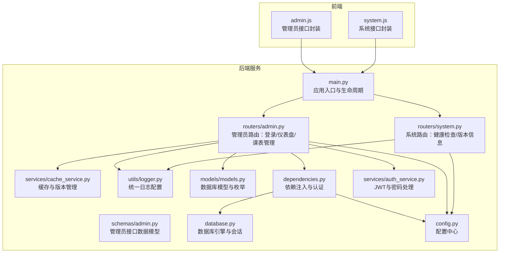
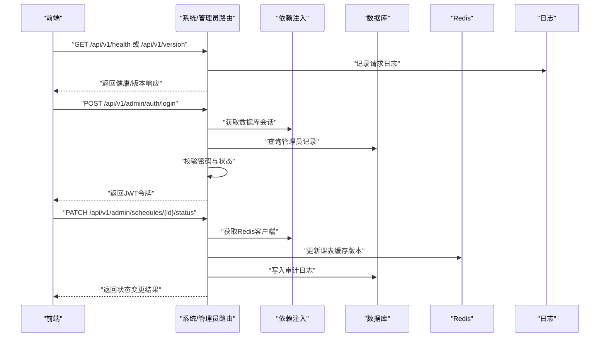
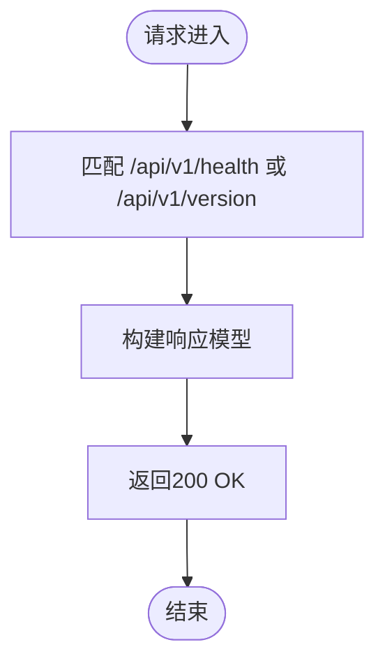
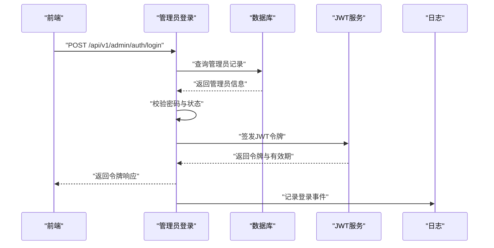
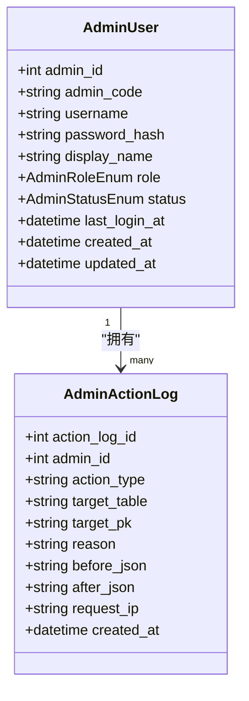
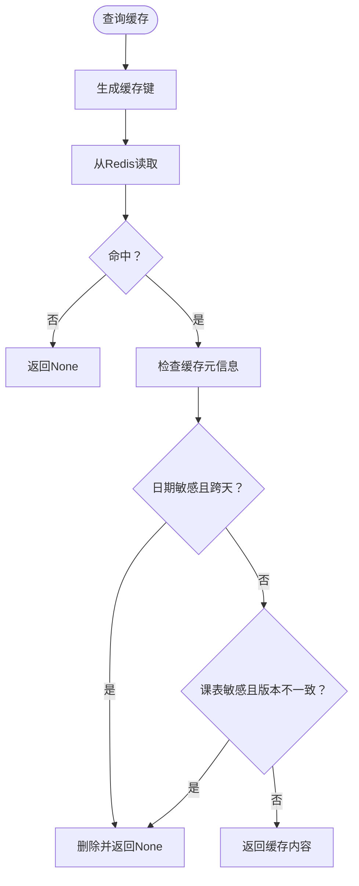
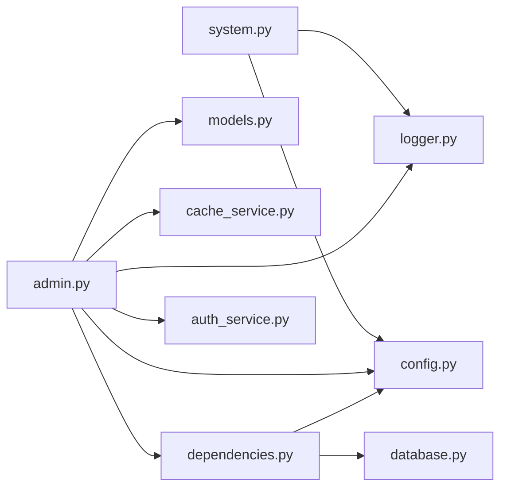

# 系统管理路由

<cite>
**本文引用的文件**
- [system.py](file://service/ai_assistant/app/routers/system.py)
- [admin.py](file://service/ai_assistant/app/routers/admin.py)
- [admin.py](file://service/ai_assistant/app/schemas/admin.py)
- [logger.py](file://service/ai_assistant/app/utils/logger.py)
- [main.py](file://service/ai_assistant/app/main.py)
- [config.py](file://service/ai_assistant/app/config.py)
- [cache_service.py](file://service/ai_assistant/app/services/cache_service.py)
- [models.py](file://service/ai_assistant/app/models/models.py)
- [dependencies.py](file://service/ai_assistant/app/dependencies.py)
- [auth_service.py](file://service/ai_assistant/app/services/auth_service.py)
- [database.py](file://service/ai_assistant/app/database.py)
- [system.js](file://frontend/ai_assistant/src/api/system.js)
- [admin.js](file://frontend/ai_assistant/src/api/admin.js)
</cite>

## 目录
1. [简介](#简介)
2. [项目结构](#项目结构)
3. [核心组件](#核心组件)
4. [架构总览](#架构总览)
5. [详细组件分析](#详细组件分析)
6. [依赖关系分析](#依赖关系分析)
7. [性能考量](#性能考量)
8. [故障排查指南](#故障排查指南)
9. [结论](#结论)
10. [附录](#附录)

## 简介
本文件聚焦于AI校园助手项目的“系统管理路由”模块，系统性梳理并解释系统级管理功能的实现，包括健康检查、版本信息、管理员登录与权限校验、课表状态变更与审计日志、缓存版本管理与失效策略、日志管理与统一输出、以及与外部服务（数据库、Redis、JWT）的集成方式。文档同时阐述系统状态监控机制、性能指标收集思路、异常告警处理策略、接口设计原则、数据格式规范、安全访问控制，以及系统资源管理与运维监控能力，帮助读者快速理解并维护该模块的可维护性与可扩展性。

## 项目结构
系统管理路由模块位于后端Python服务中，采用FastAPI框架组织路由，配合Pydantic模型进行数据校验与序列化，通过依赖注入实现数据库、Redis与认证服务的解耦。前端通过独立API模块对接后端系统管理接口。

图表来源
- [main.py:1-86](file://service/ai_assistant/app/main.py#L1-L86)
- [system.py:1-38](file://service/ai_assistant/app/routers/system.py#L1-L38)
- [admin.py:1-388](file://service/ai_assistant/app/routers/admin.py#L1-L388)
- [admin.py:1-105](file://service/ai_assistant/app/schemas/admin.py#L1-L105)
- [cache_service.py:1-177](file://service/ai_assistant/app/services/cache_service.py#L1-L177)
- [logger.py:1-53](file://service/ai_assistant/app/utils/logger.py#L1-L53)
- [models.py:1-200](file://service/ai_assistant/app/models/models.py#L1-L200)
- [dependencies.py:1-109](file://service/ai_assistant/app/dependencies.py#L1-L109)
- [auth_service.py:1-200](file://service/ai_assistant/app/services/auth_service.py#L1-L200)
- [database.py:1-35](file://service/ai_assistant/app/database.py#L1-L35)
- [config.py:1-113](file://service/ai_assistant/app/config.py#L1-L113)
- [system.js:1-18](file://frontend/ai_assistant/src/api/system.js#L1-L18)
- [admin.js:1-41](file://frontend/ai_assistant/src/api/admin.js#L1-L41)

章节来源
- [main.py:1-86](file://service/ai_assistant/app/main.py#L1-L86)
- [system.py:1-38](file://service/ai_assistant/app/routers/system.py#L1-L38)
- [admin.py:1-388](file://service/ai_assistant/app/routers/admin.py#L1-L388)
- [admin.py:1-105](file://service/ai_assistant/app/schemas/admin.py#L1-L105)
- [cache_service.py:1-177](file://service/ai_assistant/app/services/cache_service.py#L1-L177)
- [logger.py:1-53](file://service/ai_assistant/app/utils/logger.py#L1-L53)
- [models.py:1-200](file://service/ai_assistant/app/models/models.py#L1-L200)
- [dependencies.py:1-109](file://service/ai_assistant/app/dependencies.py#L1-L109)
- [auth_service.py:1-200](file://service/ai_assistant/app/services/auth_service.py#L1-L200)
- [database.py:1-35](file://service/ai_assistant/app/database.py#L1-L35)
- [config.py:1-113](file://service/ai_assistant/app/config.py#L1-L113)
- [system.js:1-18](file://frontend/ai_assistant/src/api/system.js#L1-L18)
- [admin.js:1-41](file://frontend/ai_assistant/src/api/admin.js#L1-L41)

## 核心组件
- 系统路由模块：提供健康检查与版本信息接口，用于系统状态监控与运维发布追踪。
- 管理员路由模块：提供登录、个人信息、仪表盘统计、元数据查询、课表列表与状态变更等管理功能。
- 数据模型与枚举：定义管理员角色、状态、课表状态等枚举类型，支撑权限与业务状态管理。
- 缓存服务：基于Redis的查询缓存与版本管理，支持敏感查询的失效策略与跨天一致性保障。
- 日志服务：统一日志配置，控制台与文件双通道输出，便于问题定位与审计。
- 依赖注入与认证：提供数据库、Redis、JWT解析与管理员鉴权的依赖注入，保证接口安全与资源管理。
- 配置中心：集中管理应用名称、版本、数据库、Redis、JWT、AES、缓存TTL等配置项。

章节来源
- [system.py:12-38](file://service/ai_assistant/app/routers/system.py#L12-L38)
- [admin.py:51-388](file://service/ai_assistant/app/routers/admin.py#L51-L388)
- [models.py:28-112](file://service/ai_assistant/app/models/models.py#L28-L112)
- [cache_service.py:44-177](file://service/ai_assistant/app/services/cache_service.py#L44-L177)
- [logger.py:17-53](file://service/ai_assistant/app/utils/logger.py#L17-L53)
- [dependencies.py:24-109](file://service/ai_assistant/app/dependencies.py#L24-L109)
- [config.py:6-113](file://service/ai_assistant/app/config.py#L6-L113)

## 架构总览
系统管理路由模块遵循分层架构与依赖注入原则，前端通过HTTP客户端调用后端接口，后端通过路由层接收请求，经由依赖注入获取数据库与Redis连接，结合认证服务完成权限校验，最终通过服务层与数据模型完成业务处理与持久化。

图表来源
- [system.py:22-38](file://service/ai_assistant/app/routers/system.py#L22-L38)
- [admin.py:51-82](file://service/ai_assistant/app/routers/admin.py#L51-L82)
- [admin.py:304-388](file://service/ai_assistant/app/routers/admin.py#L304-L388)
- [dependencies.py:27-50](file://service/ai_assistant/app/dependencies.py#L27-L50)
- [cache_service.py:78-82](file://service/ai_assistant/app/services/cache_service.py#L78-L82)
- [logger.py:17-53](file://service/ai_assistant/app/utils/logger.py#L17-L53)

## 详细组件分析

### 系统路由模块（健康检查与版本信息）
- 接口设计
  - 健康检查：返回服务状态与应用名称，便于容器编排与Kubernetes探针使用。
  - 版本信息：返回应用名称与版本号，便于发布追踪与运维监控。
- 数据模型
  - 健康响应模型：包含状态与服务名称字段。
  - 版本响应模型：包含应用名称与版本号字段。
- 实现要点
  - 使用FastAPI的响应模型自动序列化与校验。
  - 读取配置中心的应用名称与版本，确保与实际部署一致。
- 安全与监控
  - 无需认证即可访问，适合外部监控系统拉取。
  - 统一日志输出，便于审计与问题定位。

图表来源
- [system.py:22-38](file://service/ai_assistant/app/routers/system.py#L22-L38)
- [system.py:12-20](file://service/ai_assistant/app/routers/system.py#L12-L20)
- [config.py:14-15](file://service/ai_assistant/app/config.py#L14-L15)

章节来源
- [system.py:12-38](file://service/ai_assistant/app/routers/system.py#L12-L38)
- [config.py:14-15](file://service/ai_assistant/app/config.py#L14-L15)

### 管理员路由模块（登录、仪表盘、课表管理）
- 登录流程
  - 请求体包含用户名与加密密码，兼容历史字段名。
  - 通过认证服务校验密码与管理员状态，签发JWT令牌。
  - 返回令牌、有效期、管理员标识与角色信息。
- 仪表盘统计
  - 统计待处理调整数、活跃课表数、取消课表数、班级总数、学期总数。
- 元数据查询
  - 获取学期列表与班级列表，支持关联专业与院系信息。
- 课表管理
  - 列表查询支持多条件过滤与分页。
  - 更新课表状态时记录审计日志，并递增缓存版本以失效相关缓存。
- 错误处理
  - 用户名或密码错误返回401，账号不可用返回403，资源不存在返回404。

图表来源
- [admin.py:51-82](file://service/ai_assistant/app/routers/admin.py#L51-L82)
- [auth_service.py:125-170](file://service/ai_assistant/app/services/auth_service.py#L125-L170)
- [dependencies.py:75-109](file://service/ai_assistant/app/dependencies.py#L75-L109)

章节来源
- [admin.py:51-144](file://service/ai_assistant/app/routers/admin.py#L51-L144)
- [admin.py:147-302](file://service/ai_assistant/app/routers/admin.py#L147-L302)
- [admin.py:304-388](file://service/ai_assistant/app/routers/admin.py#L304-L388)
- [admin.py:11-105](file://service/ai_assistant/app/schemas/admin.py#L11-L105)
- [auth_service.py:125-170](file://service/ai_assistant/app/services/auth_service.py#L125-L170)
- [dependencies.py:75-109](file://service/ai_assistant/app/dependencies.py#L75-L109)

### 数据模型与枚举
- 管理员角色与状态
  - 角色：超级管理员、课表管理员、安全管理员、只读管理员。
  - 状态：激活、禁用、锁定。
- 课表状态
  - 用于区分课表的启用与取消状态。
- 审计日志
  - 记录管理员操作类型、目标表与主键、前后状态JSON、原因、IP与时间戳。

图表来源
- [models.py:41-84](file://service/ai_assistant/app/models/models.py#L41-L84)
- [models.py:86-112](file://service/ai_assistant/app/models/models.py#L86-L112)

章节来源
- [models.py:28-112](file://service/ai_assistant/app/models/models.py#L28-L112)

### 缓存服务与版本管理
- 缓存键规则
  - 格式：chat_cache:{version}:{did}:{query_hash}，支持按设备ID与查询文本哈希进行缓存隔离。
- 敏感性判定
  - 包含敏感关键词的查询采用短TTL，避免泄露隐私信息。
  - 包含相对时间语义的查询按日期桶失效，避免跨天语义过期导致的脏数据。
  - 与课表相关的查询在管理员改课后递增缓存版本，强制失效旧缓存。
- 版本管理
  - 提供获取与递增课表缓存版本的方法，确保缓存一致性。
- 写入与读取
  - 写入时附加缓存元信息（日期桶、是否课表敏感、当前版本），读取时进行一致性校验与失效处理。

图表来源
- [cache_service.py:49-177](file://service/ai_assistant/app/services/cache_service.py#L49-L177)

章节来源
- [cache_service.py:1-177](file://service/ai_assistant/app/services/cache_service.py#L1-L177)

### 日志管理与统一输出
- 输出策略
  - 控制台输出INFO级别以上，文件落盘DEBUG级别以上，支持滚动与保留策略。
  - 日志格式包含时间、级别、模块名、函数名、行号与消息。
- 初始化
  - 应用启动时初始化日志，确保所有模块日志落盘到统一文件。
- 使用场景
  - 生命周期事件、安全告警、缓存失效、审计日志等均通过统一logger输出。

章节来源
- [logger.py:17-53](file://service/ai_assistant/app/utils/logger.py#L17-L53)
- [main.py:36-50](file://service/ai_assistant/app/main.py#L36-L50)

### 依赖注入与认证
- 数据库会话
  - 提供异步数据库会话生成器，确保事务与连接管理。
- Redis客户端
  - 单例模式提供Redis客户端，支持连接池与URL配置。
- 当前用户与管理员
  - 通过Bearer Token解析JWT，校验管理员状态与有效性。
- 安全建议
  - 生产环境应严格限制CORS来源，使用HTTPS与强密钥。

章节来源
- [dependencies.py:27-50](file://service/ai_assistant/app/dependencies.py#L27-L50)
- [dependencies.py:75-109](file://service/ai_assistant/app/dependencies.py#L75-L109)
- [main.py:70-76](file://service/ai_assistant/app/main.py#L70-L76)

### 配置中心
- 应用配置
  - 应用名称、版本、调试开关、CORS允许来源。
- 数据库与Redis
  - 数据库URL与Redis URL构造，支持密码与DB选择。
- 安全与模型
  - JWT密钥、算法、过期时间；AES密钥；隐私盐；LLM模型配置。
- 缓存TTL
  - 敏感与普通查询的缓存过期时间配置。

章节来源
- [config.py:6-113](file://service/ai_assistant/app/config.py#L6-L113)

### 前端对接
- 系统接口
  - 健康检查与版本信息接口封装，便于前端定时轮询与展示。
- 管理员接口
  - 登录、个人信息、仪表盘、元数据、课表列表与状态变更接口封装。
- 使用建议
  - 前端应在登录成功后保存令牌并在后续请求头中携带Authorization: Bearer。

章节来源
- [system.js:8-18](file://frontend/ai_assistant/src/api/system.js#L8-L18)
- [admin.js:6-40](file://frontend/ai_assistant/src/api/admin.js#L6-L40)

## 依赖关系分析
系统管理路由模块的依赖关系清晰，采用依赖注入降低耦合度，路由层仅负责请求处理与响应模型，业务逻辑通过服务层与数据模型实现。

图表来源
- [system.py:1-38](file://service/ai_assistant/app/routers/system.py#L1-L38)
- [admin.py:1-388](file://service/ai_assistant/app/routers/admin.py#L1-L388)
- [config.py:1-113](file://service/ai_assistant/app/config.py#L1-L113)
- [models.py:1-200](file://service/ai_assistant/app/models/models.py#L1-L200)
- [cache_service.py:1-177](file://service/ai_assistant/app/services/cache_service.py#L1-L177)
- [dependencies.py:1-109](file://service/ai_assistant/app/dependencies.py#L1-L109)
- [auth_service.py:1-200](file://service/ai_assistant/app/services/auth_service.py#L1-L200)
- [database.py:1-35](file://service/ai_assistant/app/database.py#L1-L35)
- [logger.py:1-53](file://service/ai_assistant/app/utils/logger.py#L1-L53)

章节来源
- [system.py:1-38](file://service/ai_assistant/app/routers/system.py#L1-L38)
- [admin.py:1-388](file://service/ai_assistant/app/routers/admin.py#L1-L388)
- [config.py:1-113](file://service/ai_assistant/app/config.py#L1-L113)
- [models.py:1-200](file://service/ai_assistant/app/models/models.py#L1-L200)
- [cache_service.py:1-177](file://service/ai_assistant/app/services/cache_service.py#L1-L177)
- [dependencies.py:1-109](file://service/ai_assistant/app/dependencies.py#L1-L109)
- [auth_service.py:1-200](file://service/ai_assistant/app/services/auth_service.py#L1-L200)
- [database.py:1-35](file://service/ai_assistant/app/database.py#L1-L35)
- [logger.py:1-53](file://service/ai_assistant/app/utils/logger.py#L1-L53)

## 性能考量
- 缓存策略
  - 敏感查询采用短TTL，普通查询采用长TTL，平衡隐私与性能。
  - 日期敏感查询按日期桶失效，避免跨天语义导致的缓存污染。
  - 课表敏感查询通过版本号递增实现主动失效，确保数据一致性。
- 数据库优化
  - 使用异步SQLAlchemy会话，减少阻塞；合理索引与查询条件过滤。
- Redis优化
  - 单例客户端与连接池，避免频繁创建连接；键命名规范与元信息存储。
- 日志性能
  - 控制台与文件双通道，生产环境建议降低文件落盘级别，避免IO瓶颈。

## 故障排查指南
- 健康检查失败
  - 检查应用生命周期钩子与日志初始化是否成功。
  - 确认CORS配置与前端域名是否匹配。
- 登录失败
  - 核对JWT密钥与算法配置，确认管理员状态为激活。
  - 检查AES加密密码格式与后端解密逻辑。
- 课表状态更新异常
  - 确认Redis连接可用，检查缓存版本递增与审计日志写入。
  - 核对课表状态枚举与业务状态转换逻辑。
- 缓存命中异常
  - 检查敏感性判定与日期桶、版本号一致性判断逻辑。
  - 确认缓存键生成与元信息写入是否正确。

章节来源
- [main.py:25-34](file://service/ai_assistant/app/main.py#L25-L34)
- [dependencies.py:75-109](file://service/ai_assistant/app/dependencies.py#L75-L109)
- [admin.py:304-388](file://service/ai_assistant/app/routers/admin.py#L304-L388)
- [cache_service.py:78-177](file://service/ai_assistant/app/services/cache_service.py#L78-L177)

## 结论
系统管理路由模块通过清晰的分层设计与依赖注入，实现了健康检查、版本信息、管理员登录与权限校验、课表管理与审计、缓存版本管理与失效策略、统一日志输出等关键能力。其接口设计遵循REST风格与数据模型约束，具备良好的可维护性与可扩展性。建议在生产环境中强化安全配置（CORS、HTTPS、密钥管理）、完善监控与告警（健康检查、日志聚合、缓存命中率），并持续优化数据库与Redis的性能参数以满足高并发场景需求。

## 附录
- 接口清单
  - GET /api/v1/health：健康检查
  - GET /api/v1/version：版本信息
  - POST /api/v1/admin/auth/login：管理员登录
  - GET /api/v1/admin/auth/me：获取当前管理员信息
  - GET /api/v1/admin/dashboard/summary：管理员概览统计
  - GET /api/v1/admin/meta/terms：获取学期列表
  - GET /api/v1/admin/meta/classes：获取班级列表
  - GET /api/v1/admin/schedules：管理员课表列表
  - PATCH /api/v1/admin/schedules/{id}/status：更新课表状态
- 数据模型
  - 响应模型：健康响应、版本响应、管理员令牌响应、仪表盘响应、课表列表响应、状态更新响应。
  - 请求模型：管理员登录请求（兼容历史字段名）。
- 安全建议
  - 生产环境必须替换默认密钥与密码，启用HTTPS与严格的CORS策略。
  - 审计日志应保留足够时间以便追溯，敏感字段避免明文存储。
- 运维监控
  - 健康检查与版本信息可用于容器探针与发布追踪。
  - 日志应接入集中化平台，建立告警阈值与异常分析。