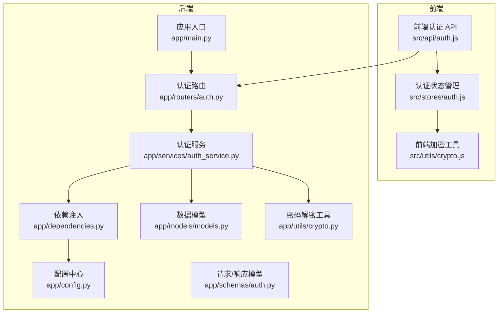
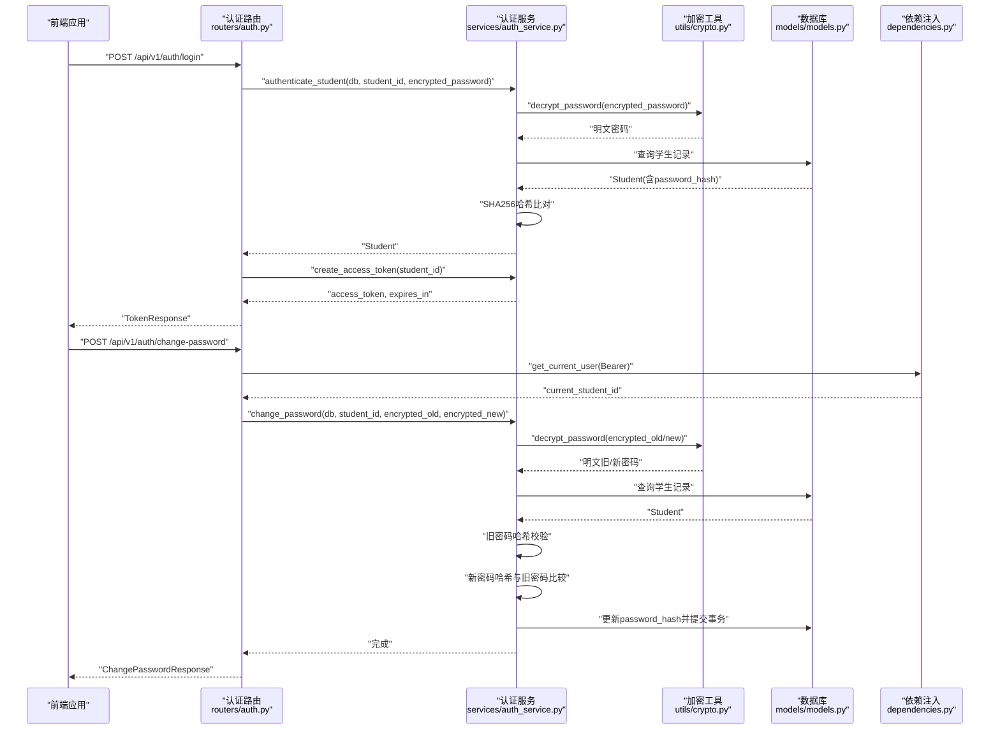
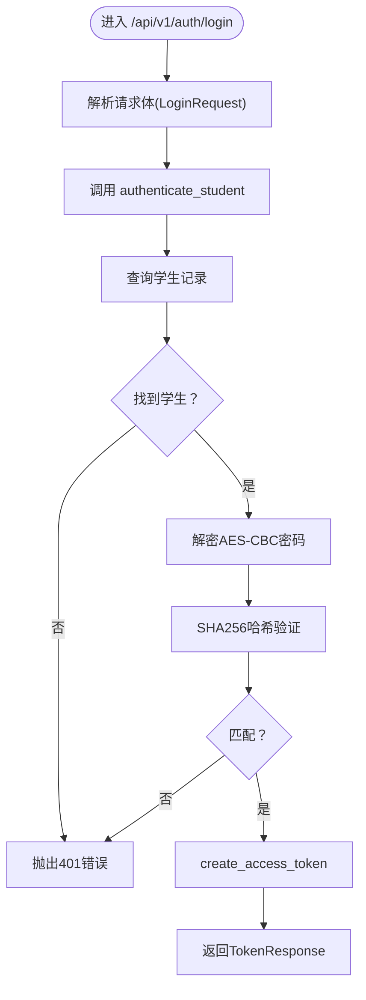
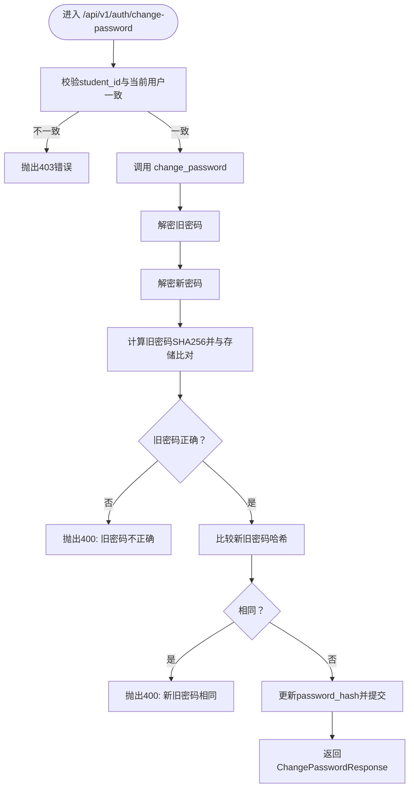
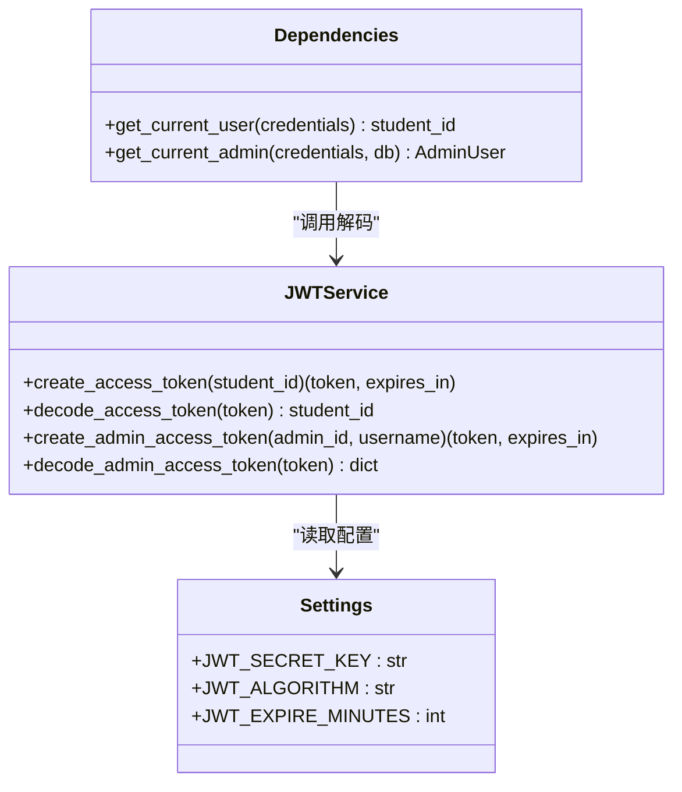
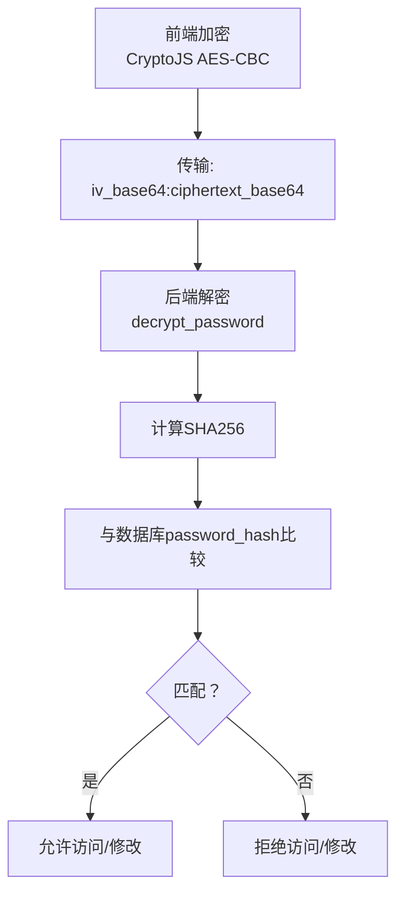
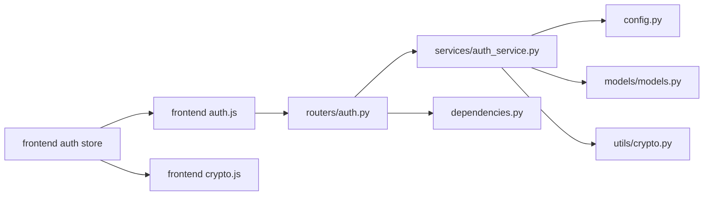

# 认证路由

<cite>
**本文引用的文件**
- [service/ai_assistant/app/routers/auth.py](file://service/ai_assistant/app/routers/auth.py)
- [service/ai_assistant/app/services/auth_service.py](file://service/ai_assistant/app/services/auth_service.py)
- [service/ai_assistant/app/schemas/auth.py](file://service/ai_assistant/app/schemas/auth.py)
- [service/ai_assistant/app/utils/crypto.py](file://service/ai_assistant/app/utils/crypto.py)
- [service/ai_assistant/app/models/models.py](file://service/ai_assistant/app/models/models.py)
- [service/ai_assistant/app/dependencies.py](file://service/ai_assistant/app/dependencies.py)
- [service/ai_assistant/app/config.py](file://service/ai_assistant/app/config.py)
- [service/ai_assistant/app/main.py](file://service/ai_assistant/app/main.py)
- [frontend/ai_assistant/src/api/auth.js](file://frontend/ai_assistant/src/api/auth.js)
- [frontend/ai_assistant/src/stores/auth.js](file://frontend/ai_assistant/src/stores/auth.js)
- [frontend/ai_assistant/src/utils/crypto.js](file://frontend/ai_assistant/src/utils/crypto.js)
</cite>

## 目录
1. [简介](#简介)
2. [项目结构](#项目结构)
3. [核心组件](#核心组件)
4. [架构总览](#架构总览)
5. [详细组件分析](#详细组件分析)
6. [依赖分析](#依赖分析)
7. [性能考量](#性能考量)
8. [故障排查指南](#故障排查指南)
9. [结论](#结论)
10. [附录](#附录)

## 简介
本章节面向开发者，系统性梳理 AI 校园助手项目的认证路由模块，覆盖学生登录认证流程、密码修改功能、JWT 令牌生成机制、AES-CBC 加密密码验证过程、权限控制策略、请求响应格式、错误处理与安全考虑，并给出依赖注入与异常处理的最佳实践指导。文档同时提供可视化图示，帮助快速理解端到端流程与组件关系。

## 项目结构
认证相关代码位于后端 FastAPI 应用的 routers、services、schemas、utils、models、dependencies、config 等模块；前端通过 Pinia 状态管理与 API 层对接后端认证接口，采用 CryptoJS 进行 AES-CBC 密码加密，传输格式为 iv_base64:ciphertext_base64。

图表来源
- [service/ai_assistant/app/main.py:1-86](file://service/ai_assistant/app/main.py#L1-L86)
- [service/ai_assistant/app/routers/auth.py:1-102](file://service/ai_assistant/app/routers/auth.py#L1-L102)
- [service/ai_assistant/app/services/auth_service.py:1-253](file://service/ai_assistant/app/services/auth_service.py#L1-L253)
- [service/ai_assistant/app/schemas/auth.py:1-56](file://service/ai_assistant/app/schemas/auth.py#L1-L56)
- [service/ai_assistant/app/utils/crypto.py:1-73](file://service/ai_assistant/app/utils/crypto.py#L1-L73)
- [service/ai_assistant/app/models/models.py:312-340](file://service/ai_assistant/app/models/models.py#L312-L340)
- [service/ai_assistant/app/dependencies.py:1-109](file://service/ai_assistant/app/dependencies.py#L1-L109)
- [service/ai_assistant/app/config.py:1-113](file://service/ai_assistant/app/config.py#L1-L113)
- [frontend/ai_assistant/src/api/auth.js:1-36](file://frontend/ai_assistant/src/api/auth.js#L1-L36)
- [frontend/ai_assistant/src/stores/auth.js:1-77](file://frontend/ai_assistant/src/stores/auth.js#L1-L77)
- [frontend/ai_assistant/src/utils/crypto.js:1-40](file://frontend/ai_assistant/src/utils/crypto.js#L1-L40)

章节来源
- [service/ai_assistant/app/main.py:1-86](file://service/ai_assistant/app/main.py#L1-L86)
- [service/ai_assistant/app/routers/auth.py:1-102](file://service/ai_assistant/app/routers/auth.py#L1-L102)
- [service/ai_assistant/app/services/auth_service.py:1-253](file://service/ai_assistant/app/services/auth_service.py#L1-L253)
- [service/ai_assistant/app/schemas/auth.py:1-56](file://service/ai_assistant/app/schemas/auth.py#L1-L56)
- [service/ai_assistant/app/utils/crypto.py:1-73](file://service/ai_assistant/app/utils/crypto.py#L1-L73)
- [service/ai_assistant/app/models/models.py:312-340](file://service/ai_assistant/app/models/models.py#L312-L340)
- [service/ai_assistant/app/dependencies.py:1-109](file://service/ai_assistant/app/dependencies.py#L1-L109)
- [service/ai_assistant/app/config.py:1-113](file://service/ai_assistant/app/config.py#L1-L113)
- [frontend/ai_assistant/src/api/auth.js:1-36](file://frontend/ai_assistant/src/api/auth.js#L1-L36)
- [frontend/ai_assistant/src/stores/auth.js:1-77](file://frontend/ai_assistant/src/stores/auth.js#L1-L77)
- [frontend/ai_assistant/src/utils/crypto.js:1-40](file://frontend/ai_assistant/src/utils/crypto.js#L1-L40)

## 核心组件
- 认证路由层：提供登录与修改密码两个端点，负责请求校验、权限拦截与响应封装。
- 认证服务层：实现 JWT 令牌签发/解码、学生认证、密码修改与哈希验证。
- 数据模型层：定义学生实体与字段，承载密码哈希存储。
- 加密工具层：实现前端 AES-CBC 加密与后端 AES-CBC 解密，保证传输安全。
- 依赖注入层：提供数据库会话、Redis 客户端、Bearer Token 解码与当前用户解析。
- 配置中心：集中管理 JWT、AES 密钥与过期时间等安全参数。
- 前端对接：Pinia 管理认证状态，CryptoJS 进行密码加密，API 层调用后端接口。

章节来源
- [service/ai_assistant/app/routers/auth.py:21-102](file://service/ai_assistant/app/routers/auth.py#L21-L102)
- [service/ai_assistant/app/services/auth_service.py:45-253](file://service/ai_assistant/app/services/auth_service.py#L45-L253)
- [service/ai_assistant/app/models/models.py:312-340](file://service/ai_assistant/app/models/models.py#L312-L340)
- [service/ai_assistant/app/utils/crypto.py:39-73](file://service/ai_assistant/app/utils/crypto.py#L39-L73)
- [service/ai_assistant/app/dependencies.py:27-109](file://service/ai_assistant/app/dependencies.py#L27-L109)
- [service/ai_assistant/app/config.py:32-41](file://service/ai_assistant/app/config.py#L32-L41)
- [frontend/ai_assistant/src/stores/auth.js:17-77](file://frontend/ai_assistant/src/stores/auth.js#L17-L77)
- [frontend/ai_assistant/src/utils/crypto.js:26-40](file://frontend/ai_assistant/src/utils/crypto.js#L26-L40)

## 架构总览
下图展示认证端到端流程：前端加密密码后发送登录请求，后端路由层调用认证服务，服务层解密并验证哈希，签发 JWT；修改密码时要求携带有效 Bearer Token 并校验旧密码。

图表来源
- [service/ai_assistant/app/routers/auth.py:24-101](file://service/ai_assistant/app/routers/auth.py#L24-L101)
- [service/ai_assistant/app/services/auth_service.py:125-210](file://service/ai_assistant/app/services/auth_service.py#L125-L210)
- [service/ai_assistant/app/utils/crypto.py:39-73](file://service/ai_assistant/app/utils/crypto.py#L39-L73)
- [service/ai_assistant/app/models/models.py:312-340](file://service/ai_assistant/app/models/models.py#L312-L340)
- [service/ai_assistant/app/dependencies.py:56-72](file://service/ai_assistant/app/dependencies.py#L56-L72)

## 详细组件分析

### 登录认证流程
- 请求端点：POST /api/v1/auth/login
- 输入模型：LoginRequest（支持字段别名兼容旧版）
- 处理流程：
  1) 路由层接收请求体，调用认证服务的 authenticate_student。
  2) 服务层查找学生记录，解密前端传入的 AES-CBC 密码，验证 SHA256 哈希。
  3) 成功后调用 create_access_token 生成 JWT，返回 TokenResponse。
- 错误处理：
  - 凭证无效或解密失败：401 Unauthorized。
  - 日志记录：成功/失败均记录详细信息，便于审计。

图表来源
- [service/ai_assistant/app/routers/auth.py:33-52](file://service/ai_assistant/app/routers/auth.py#L33-L52)
- [service/ai_assistant/app/services/auth_service.py:125-169](file://service/ai_assistant/app/services/auth_service.py#L125-L169)
- [service/ai_assistant/app/utils/crypto.py:39-73](file://service/ai_assistant/app/utils/crypto.py#L39-L73)

章节来源
- [service/ai_assistant/app/routers/auth.py:24-52](file://service/ai_assistant/app/routers/auth.py#L24-L52)
- [service/ai_assistant/app/schemas/auth.py:4-21](file://service/ai_assistant/app/schemas/auth.py#L4-L21)
- [service/ai_assistant/app/services/auth_service.py:125-169](file://service/ai_assistant/app/services/auth_service.py#L125-L169)
- [service/ai_assistant/app/utils/crypto.py:39-73](file://service/ai_assistant/app/utils/crypto.py#L39-L73)

### 密码修改功能
- 请求端点：POST /api/v1/auth/change-password
- 输入模型：ChangePasswordRequest（支持字段别名兼容旧版）
- 权限控制：
  - 依赖 get_current_user 提取 Bearer Token 中的 student_id。
  - 路由层校验请求体中的 student_id 与当前用户一致，防止越权修改。
- 处理流程：
  1) 路由层校验权限后调用 change_password。
  2) 服务层解密旧/新密码，验证旧密码哈希是否匹配。
  3) 比较新旧密码哈希，若相同则拒绝更新。
  4) 更新数据库并提交事务。
- 错误处理：
  - 学生不存在：404 Not Found。
  - 旧密码不正确：400 Bad Request。
  - 新旧密码相同：400 Bad Request。
  - 加密数据无效：400 Bad Request。

图表来源
- [service/ai_assistant/app/routers/auth.py:61-101](file://service/ai_assistant/app/routers/auth.py#L61-L101)
- [service/ai_assistant/app/services/auth_service.py:173-210](file://service/ai_assistant/app/services/auth_service.py#L173-L210)
- [service/ai_assistant/app/utils/crypto.py:39-73](file://service/ai_assistant/app/utils/crypto.py#L39-L73)

章节来源
- [service/ai_assistant/app/routers/auth.py:55-101](file://service/ai_assistant/app/routers/auth.py#L55-L101)
- [service/ai_assistant/app/schemas/auth.py:23-56](file://service/ai_assistant/app/schemas/auth.py#L23-L56)
- [service/ai_assistant/app/services/auth_service.py:173-210](file://service/ai_assistant/app/services/auth_service.py#L173-L210)

### JWT 令牌生成与解码
- 生成：
  - create_access_token：构造 payload（sub、role、iat、exp），使用 HS256 算法签名，返回 token 与过期秒数。
  - 配置来自 settings：JWT_SECRET_KEY、JWT_ALGORITHM、JWT_EXPIRE_MINUTES。
- 解码：
  - decode_access_token：校验签名与角色是否为 student，提取 sub（student_id）。
  - decode_admin_access_token：校验角色为 admin，提取 admin_id 与 username。
- 依赖注入：
  - get_current_user：从 Authorization: Bearer 中提取 token 并解码，未提供或无效时返回 401。

图表来源
- [service/ai_assistant/app/services/auth_service.py:45-123](file://service/ai_assistant/app/services/auth_service.py#L45-L123)
- [service/ai_assistant/app/config.py:32-36](file://service/ai_assistant/app/config.py#L32-L36)
- [service/ai_assistant/app/dependencies.py:56-107](file://service/ai_assistant/app/dependencies.py#L56-L107)

章节来源
- [service/ai_assistant/app/services/auth_service.py:45-123](file://service/ai_assistant/app/services/auth_service.py#L45-L123)
- [service/ai_assistant/app/config.py:32-36](file://service/ai_assistant/app/config.py#L32-L36)
- [service/ai_assistant/app/dependencies.py:56-107](file://service/ai_assistant/app/dependencies.py#L56-L107)

### AES-CBC 密码验证过程
- 前端：
  - 使用 CryptoJS AES-CBC 加密，PKCS7 填充，iv_base64:ciphertext_base64 格式，URL 安全 Base64。
- 后端：
  - decrypt_password：解析 iv 与密文，校验长度，使用 AES.MODE_CBC 解密并去填充，返回明文。
  - authenticate_student/change_password：解密后计算 SHA256 与数据库存储的哈希比对。

图表来源
- [frontend/ai_assistant/src/utils/crypto.js:26-40](file://frontend/ai_assistant/src/utils/crypto.js#L26-L40)
- [service/ai_assistant/app/utils/crypto.py:39-73](file://service/ai_assistant/app/utils/crypto.py#L39-L73)
- [service/ai_assistant/app/services/auth_service.py:125-210](file://service/ai_assistant/app/services/auth_service.py#L125-L210)

章节来源
- [frontend/ai_assistant/src/utils/crypto.js:26-40](file://frontend/ai_assistant/src/utils/crypto.js#L26-L40)
- [service/ai_assistant/app/utils/crypto.py:39-73](file://service/ai_assistant/app/utils/crypto.py#L39-L73)
- [service/ai_assistant/app/services/auth_service.py:125-210](file://service/ai_assistant/app/services/auth_service.py#L125-L210)

### 权限控制策略
- 角色与令牌：
  - 学生端点：JWT 中 role=student，sub=student_id。
  - 管理端点：JWT 中 role=admin，sub=admin_id，携带 username。
- 路由权限：
  - change-password：必须携带有效 Bearer Token，且请求体 student_id 必须与当前用户一致。
- 管理员账户状态：
  - get_current_admin：解码后查询管理员记录，若状态非 active 则拒绝 403。

章节来源
- [service/ai_assistant/app/services/auth_service.py:78-123](file://service/ai_assistant/app/services/auth_service.py#L78-L123)
- [service/ai_assistant/app/routers/auth.py:66-70](file://service/ai_assistant/app/routers/auth.py#L66-L70)
- [service/ai_assistant/app/dependencies.py:75-107](file://service/ai_assistant/app/dependencies.py#L75-L107)

### 请求与响应格式
- 登录请求（LoginRequest）
  - 字段：student_id、encrypted_password（格式：iv_base64:ciphertext_base64）
  - 兼容旧字段名 password（自动映射到 encrypted_password）
- 登录响应（TokenResponse）
  - 字段：access_token、token_type（固定为 bearer）、expires_in（秒）、student_id
- 修改密码请求（ChangePasswordRequest）
  - 字段：student_id、encrypted_old_password、encrypted_new_password
  - 兼容旧字段名 old_password、new_password（自动映射）
- 修改密码响应（ChangePasswordResponse）
  - 字段：success（布尔）、student_id、detail（提示信息）

章节来源
- [service/ai_assistant/app/schemas/auth.py:4-56](file://service/ai_assistant/app/schemas/auth.py#L4-L56)

### 错误处理机制
- 登录：
  - 凭证无效/解密失败：401 Unauthorized
- 修改密码：
  - 学生不存在：404 Not Found
  - 旧密码不正确：400 Bad Request
  - 新旧密码相同：400 Bad Request
  - 加密数据无效：400 Bad Request
- 通用：
  - Bearer 令牌缺失或无效：401 Unauthorized
  - 管理员状态非 active：403 Forbidden

章节来源
- [service/ai_assistant/app/routers/auth.py:41-99](file://service/ai_assistant/app/routers/auth.py#L41-L99)
- [service/ai_assistant/app/dependencies.py:56-107](file://service/ai_assistant/app/dependencies.py#L56-L107)

### 安全考虑
- 传输加密：前端使用 AES-CBC，后端解密后再做哈希验证，避免明文密码在网络传输。
- 令牌安全：JWT 使用 HS256 算法，密钥与过期时间集中配置，避免硬编码。
- 权限最小化：修改密码端点强制校验当前用户身份，防止越权。
- 日志审计：认证与密码修改全流程记录日志，便于追踪与审计。
- 前端状态：Pinia 管理 token、student_id、过期时间，本地持久化存储，注意生产环境的安全存储策略。

章节来源
- [service/ai_assistant/app/utils/crypto.py:39-73](file://service/ai_assistant/app/utils/crypto.py#L39-L73)
- [service/ai_assistant/app/services/auth_service.py:45-123](file://service/ai_assistant/app/services/auth_service.py#L45-L123)
- [service/ai_assistant/app/routers/auth.py:66-70](file://service/ai_assistant/app/routers/auth.py#L66-L70)
- [frontend/ai_assistant/src/stores/auth.js:17-77](file://frontend/ai_assistant/src/stores/auth.js#L17-L77)

### 依赖注入与异常处理最佳实践
- 依赖注入：
  - get_db：提供异步数据库会话，确保事务一致性。
  - get_current_user/get_current_admin：统一 Bearer Token 解码与权限校验。
  - get_redis：提供 Redis 客户端，减少重复初始化。
- 异常处理：
  - 明确区分业务异常（如 PasswordChangeError）与框架异常（HTTPException）。
  - 在路由层捕获并映射为标准 HTTP 状态码，保持对外一致的错误语义。
  - 使用日志记录关键路径，便于问题定位与审计。

章节来源
- [service/ai_assistant/app/dependencies.py:27-109](file://service/ai_assistant/app/dependencies.py#L27-L109)
- [service/ai_assistant/app/services/auth_service.py:21-27](file://service/ai_assistant/app/services/auth_service.py#L21-L27)
- [service/ai_assistant/app/routers/auth.py:41-99](file://service/ai_assistant/app/routers/auth.py#L41-L99)

## 依赖分析
认证模块内部依赖关系如下：路由层依赖服务层与依赖注入；服务层依赖配置、模型与加密工具；前端通过 API 与状态管理对接后端。

图表来源
- [service/ai_assistant/app/routers/auth.py:1-102](file://service/ai_assistant/app/routers/auth.py#L1-L102)
- [service/ai_assistant/app/services/auth_service.py:1-253](file://service/ai_assistant/app/services/auth_service.py#L1-L253)
- [service/ai_assistant/app/dependencies.py:1-109](file://service/ai_assistant/app/dependencies.py#L1-L109)
- [service/ai_assistant/app/config.py:1-113](file://service/ai_assistant/app/config.py#L1-L113)
- [service/ai_assistant/app/models/models.py:312-340](file://service/ai_assistant/app/models/models.py#L312-L340)
- [service/ai_assistant/app/utils/crypto.py:1-73](file://service/ai_assistant/app/utils/crypto.py#L1-L73)
- [frontend/ai_assistant/src/api/auth.js:1-36](file://frontend/ai_assistant/src/api/auth.js#L1-L36)
- [frontend/ai_assistant/src/stores/auth.js:1-77](file://frontend/ai_assistant/src/stores/auth.js#L1-L77)
- [frontend/ai_assistant/src/utils/crypto.js:1-40](file://frontend/ai_assistant/src/utils/crypto.js#L1-L40)

章节来源
- [service/ai_assistant/app/routers/auth.py:1-102](file://service/ai_assistant/app/routers/auth.py#L1-L102)
- [service/ai_assistant/app/services/auth_service.py:1-253](file://service/ai_assistant/app/services/auth_service.py#L1-L253)
- [service/ai_assistant/app/dependencies.py:1-109](file://service/ai_assistant/app/dependencies.py#L1-L109)
- [service/ai_assistant/app/config.py:1-113](file://service/ai_assistant/app/config.py#L1-L113)
- [service/ai_assistant/app/models/models.py:312-340](file://service/ai_assistant/app/models/models.py#L312-L340)
- [service/ai_assistant/app/utils/crypto.py:1-73](file://service/ai_assistant/app/utils/crypto.py#L1-L73)
- [frontend/ai_assistant/src/api/auth.js:1-36](file://frontend/ai_assistant/src/api/auth.js#L1-L36)
- [frontend/ai_assistant/src/stores/auth.js:1-77](file://frontend/ai_assistant/src/stores/auth.js#L1-L77)
- [frontend/ai_assistant/src/utils/crypto.js:1-40](file://frontend/ai_assistant/src/utils/crypto.js#L1-L40)

## 性能考量
- 异步数据库访问：使用 SQLAlchemy AsyncIO，降低 IO 阻塞。
- 令牌过期时间：合理设置 JWT_EXPIRE_MINUTES，平衡安全性与用户体验。
- 前端加密开销：AES-CBC 解密在后端完成，前端仅负责加密与传输，避免重复计算。
- 日志与监控：认证与密码修改路径均记录日志，建议结合外部监控系统进行告警。

## 故障排查指南
- 登录失败（401）：
  - 检查 student_id 是否存在，确认 encrypted_password 格式正确。
  - 核对 AES 密钥与前端一致，确认 iv_base64:ciphertext_base64 格式。
- 修改密码失败（400/404）：
  - 确认旧密码解密正确且与存储哈希匹配。
  - 确认新密码与旧密码不同。
- 权限错误（403）：
  - 确认请求体 student_id 与 Bearer Token 中的 student_id 一致。
- 令牌无效（401）：
  - 检查 Authorization 头格式与 JWT_SECRET_KEY 配置。

章节来源
- [service/ai_assistant/app/routers/auth.py:41-99](file://service/ai_assistant/app/routers/auth.py#L41-L99)
- [service/ai_assistant/app/utils/crypto.py:39-73](file://service/ai_assistant/app/utils/crypto.py#L39-L73)
- [service/ai_assistant/app/dependencies.py:56-107](file://service/ai_assistant/app/dependencies.py#L56-L107)

## 结论
认证路由模块通过“前端 AES-CBC 加密 + 后端解密 + JWT 令牌”的组合，实现了安全、可控的学生认证与密码修改能力。配合严格的权限校验、清晰的错误映射与完善的日志审计，满足教学场景下的安全与可用性需求。建议在生产环境强化密钥管理、启用 HTTPS、限制 CORS 源，并定期轮换密钥与令牌过期策略。

## 附录
- 前端对接要点：
  - 使用 VITE_AES_SECRET_KEY 与后端 AES_SECRET_KEY 保持一致。
  - 登录成功后将 access_token、student_id、expires_in 写入本地存储。
  - 修改密码时确保 student_id 与当前用户一致。
- 配置建议：
  - JWT_SECRET_KEY、AES_SECRET_KEY、DID_SALT 等必须在 .env 中设置强值。
  - JWT_EXPIRE_MINUTES 根据业务需求调整，默认 1 天。

章节来源
- [frontend/ai_assistant/src/utils/crypto.js:9](file://frontend/ai_assistant/src/utils/crypto.js#L9)
- [frontend/ai_assistant/src/stores/auth.js:17-77](file://frontend/ai_assistant/src/stores/auth.js#L17-L77)
- [service/ai_assistant/app/config.py:32-41](file://service/ai_assistant/app/config.py#L32-L41)
- [service/ai_assistant/app/main.py:18-34](file://service/ai_assistant/app/main.py#L18-L34)