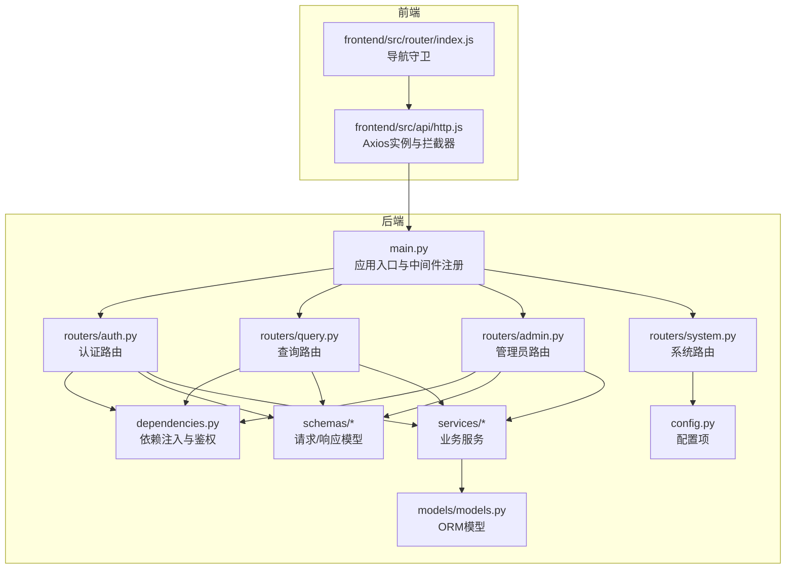
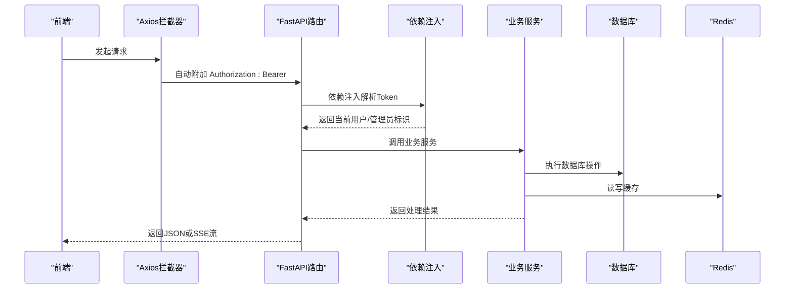
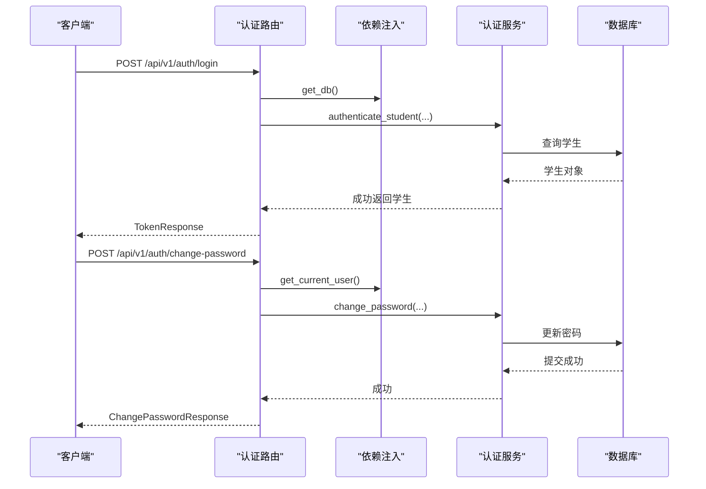
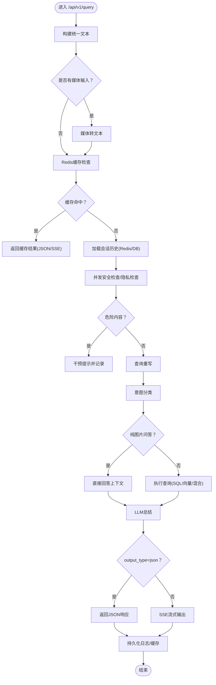
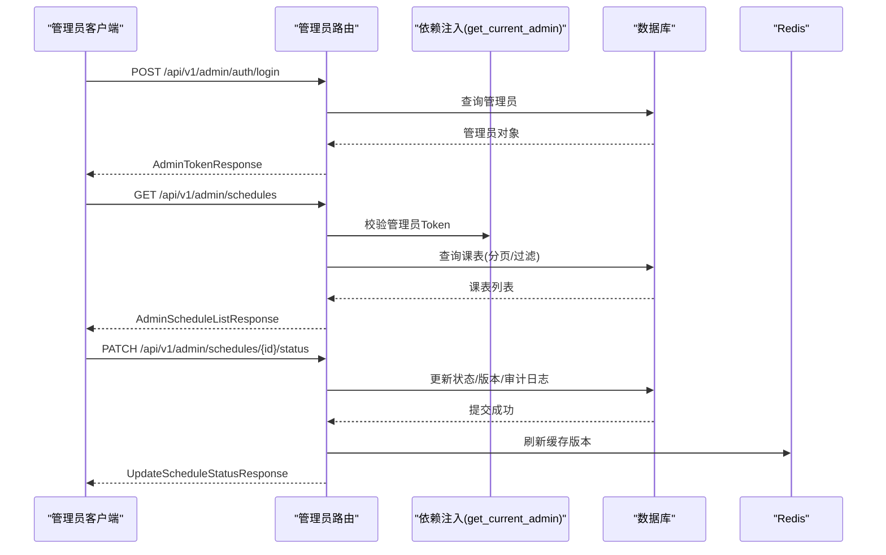
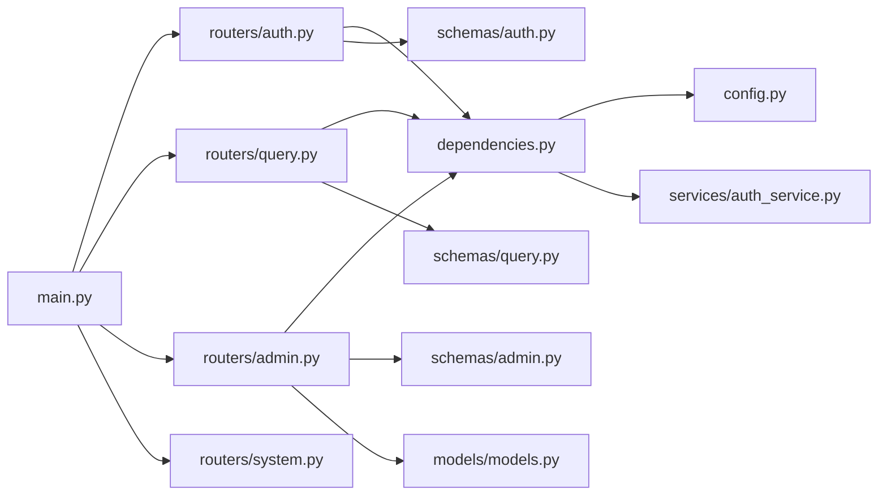

# 路由系统

<cite>
**本文引用的文件**
- [main.py](file://service/ai_assistant/app/main.py)
- [auth.py](file://service/ai_assistant/app/routers/auth.py)
- [query.py](file://service/ai_assistant/app/routers/query.py)
- [admin.py](file://service/ai_assistant/app/routers/admin.py)
- [system.py](file://service/ai_assistant/app/routers/system.py)
- [dependencies.py](file://service/ai_assistant/app/dependencies.py)
- [config.py](file://service/ai_assistant/app/config.py)
- [auth.py](file://service/ai_assistant/app/schemas/auth.py)
- [query.py](file://service/ai_assistant/app/schemas/query.py)
- [admin.py](file://service/ai_assistant/app/schemas/admin.py)
- [auth_service.py](file://service/ai_assistant/app/services/auth_service.py)
- [models.py](file://service/ai_assistant/app/models/models.py)
- [index.js](file://frontend/ai_assistant/src/router/index.js)
- [http.js](file://frontend/ai_assistant/src/api/http.js)
</cite>

## 目录
1. [简介](#简介)
2. [项目结构](#项目结构)
3. [核心组件](#核心组件)
4. [架构总览](#架构总览)
5. [详细组件分析](#详细组件分析)
6. [依赖关系分析](#依赖关系分析)
7. [性能考量](#性能考量)
8. [故障排查指南](#故障排查指南)
9. [结论](#结论)
10. [附录](#附录)

## 简介
本文件系统性梳理AI校园助手项目的路由体系，围绕基于FastAPI的路由架构展开，重点覆盖以下方面：
- 路由功能划分：认证路由、查询路由、管理员路由、系统管理路由
- 路由装饰器与依赖注入机制
- 异常处理策略与HTTP状态码使用
- RESTful API设计原则与请求/响应格式标准化
- 路由中间件、权限控制与API版本管理
- 面向开发者的路由设计模式与最佳实践

## 项目结构
后端采用FastAPI应用入口集中注册各子路由模块，前端通过Axios统一拦截器自动附加认证头，形成前后端协同的路由与鉴权闭环。

图表来源
- [main.py:52-86](file://service/ai_assistant/app/main.py#L52-L86)
- [auth.py:21-52](file://service/ai_assistant/app/routers/auth.py#L21-L52)
- [query.py:46-212](file://service/ai_assistant/app/routers/query.py#L46-L212)
- [admin.py:48-82](file://service/ai_assistant/app/routers/admin.py#L48-L82)
- [system.py:9-38](file://service/ai_assistant/app/routers/system.py#L9-L38)
- [dependencies.py:27-108](file://service/ai_assistant/app/dependencies.py#L27-L108)
- [config.py:6-113](file://service/ai_assistant/app/config.py#L6-L113)
- [http.js:10-49](file://frontend/ai_assistant/src/api/http.js#L10-L49)
- [index.js:52-75](file://frontend/ai_assistant/src/router/index.js#L52-L75)

章节来源
- [main.py:52-86](file://service/ai_assistant/app/main.py#L52-L86)
- [auth.py:21-52](file://service/ai_assistant/app/routers/auth.py#L21-L52)
- [query.py:46-212](file://service/ai_assistant/app/routers/query.py#L46-L212)
- [admin.py:48-82](file://service/ai_assistant/app/routers/admin.py#L48-L82)
- [system.py:9-38](file://service/ai_assistant/app/routers/system.py#L9-L38)
- [dependencies.py:27-108](file://service/ai_assistant/app/dependencies.py#L27-L108)
- [config.py:6-113](file://service/ai_assistant/app/config.py#L6-L113)
- [http.js:10-49](file://frontend/ai_assistant/src/api/http.js#L10-L49)
- [index.js:52-75](file://frontend/ai_assistant/src/router/index.js#L52-L75)

## 核心组件
- 应用入口与中间件
  - 应用标题、版本、文档地址、生命周期钩子
  - CORS中间件配置，允许跨域访问
  - 路由注册：认证、查询、管理员、系统
- 依赖注入与鉴权
  - 数据库会话、Redis客户端、当前用户、当前管理员
  - Bearer Token解析与JWT校验
- 配置中心
  - 数据库、Redis、JWT、AES、LLM模型、缓存TTL等
- 请求/响应模型
  - 登录、修改密码、查询、管理员相关接口的Pydantic模型
- 业务服务
  - JWT签发/解码、学生/管理员认证、密码变更、安全检查、意图分类、查询执行、缓存、日志等

章节来源
- [main.py:52-86](file://service/ai_assistant/app/main.py#L52-L86)
- [dependencies.py:27-108](file://service/ai_assistant/app/dependencies.py#L27-L108)
- [config.py:6-113](file://service/ai_assistant/app/config.py#L6-L113)
- [auth.py:45-56](file://service/ai_assistant/app/schemas/auth.py#L45-L56)
- [query.py:26-33](file://service/ai_assistant/app/schemas/query.py#L26-L33)
- [admin.py:30-46](file://service/ai_assistant/app/schemas/admin.py#L30-L46)

## 架构总览
路由系统遵循“按功能域划分”的模块化组织，每个路由模块负责一组相关接口，并通过依赖注入共享数据库、Redis、JWT等基础设施。前端通过Axios统一拦截器自动附加Bearer Token，后端通过依赖注入解析并校验Token，实现细粒度的权限控制。

图表来源
- [http.js:19-34](file://frontend/ai_assistant/src/api/http.js#L19-L34)
- [dependencies.py:56-108](file://service/ai_assistant/app/dependencies.py#L56-L108)
- [auth.py:33-52](file://service/ai_assistant/app/routers/auth.py#L33-L52)
- [query.py:207-212](file://service/ai_assistant/app/routers/query.py#L207-L212)
- [admin.py:57-82](file://service/ai_assistant/app/routers/admin.py#L57-L82)

## 详细组件分析

### 认证路由（/api/v1/auth）
- 功能职责
  - 学生登录：接收加密密码，签发JWT
  - 修改密码：校验旧密码，更新新密码
- 路由装饰器与依赖
  - 使用APIRouter定义前缀与标签
  - 依赖注入数据库会话与当前用户
  - 登录接口返回TokenResponse；修改密码接口返回ChangePasswordResponse
- 权限控制
  - 修改密码接口通过依赖注入校验Bearer Token与学号一致性
- 异常处理
  - 登录失败返回401；修改密码失败依据不同原因返回404/400/400
- 请求/响应格式
  - 登录：LoginRequest → TokenResponse
  - 修改密码：ChangePasswordRequest → ChangePasswordResponse

图表来源
- [auth.py:24-101](file://service/ai_assistant/app/routers/auth.py#L24-L101)
- [dependencies.py:56-72](file://service/ai_assistant/app/dependencies.py#L56-L72)
- [auth_service.py:125-210](file://service/ai_assistant/app/services/auth_service.py#L125-L210)

章节来源
- [auth.py:21-101](file://service/ai_assistant/app/routers/auth.py#L21-L101)
- [auth.py:4-19](file://service/ai_assistant/app/routers/auth.py#L4-L19)
- [auth.py:45-56](file://service/ai_assistant/app/schemas/auth.py#L45-L56)
- [auth.py:23-43](file://service/ai_assistant/app/schemas/auth.py#L23-L43)
- [auth_service.py:125-210](file://service/ai_assistant/app/services/auth_service.py#L125-L210)
- [dependencies.py:56-72](file://service/ai_assistant/app/dependencies.py#L56-L72)

### 查询路由（/api/v1/query）
- 功能职责
  - 单一统一端点，支持文本/图像/音频多模态输入
  - 安全检查、隐私检查、意图分类、查询执行、LLM总结、缓存、会话历史、SSE流式输出
- 路由装饰器与依赖
  - APIRouter前缀为/api/v1，标签为“查询”
  - 依赖注入当前用户、数据库会话、Redis客户端
- 流程要点
  - 多模态输入解码与统一文本构建
  - Redis缓存命中则直接返回
  - 加载会话历史（Redis优先，失败回退DB）
  - 并发执行安全检查与查询重写
  - 意图分类与查询执行（结构化/向量/混合）
  - JSON输出与SSE流式输出两种模式
  - 缓存与聊天日志持久化
- 异常处理
  - 输入缺失返回400；媒体处理失败返回502；查询执行失败返回502；流式异常转换为可读错误消息
- 请求/响应格式
  - 请求：QueryRequest（text/image_base64/audio_base64/session_id/output_type）
  - 响应：QueryResponse（answer/intent/session_id/response_time_ms/cached）

图表来源
- [query.py:198-745](file://service/ai_assistant/app/routers/query.py#L198-L745)
- [query.py:15-177](file://service/ai_assistant/app/routers/query.py#L15-L177)
- [query.py:26-33](file://service/ai_assistant/app/schemas/query.py#L26-L33)

章节来源
- [query.py:46-745](file://service/ai_assistant/app/routers/query.py#L46-L745)
- [query.py:15-177](file://service/ai_assistant/app/routers/query.py#L15-L177)
- [query.py:26-33](file://service/ai_assistant/app/schemas/query.py#L26-L33)

### 管理员路由（/api/v1/admin）
- 功能职责
  - 管理员登录与个人信息查询
  - 系统概览统计
  - 学期/班级元数据查询
  - 课表列表查询与状态更新
- 路由装饰器与依赖
  - APIRouter前缀为/api/v1/admin，标签为“管理员”
  - 依赖注入当前管理员、数据库会话、Redis客户端
- 权限控制
  - 通过get_current_admin依赖注入校验管理员Token与账户状态
- 异常处理
  - 登录失败返回401/403；课表不存在返回404；状态更新成功后记录审计日志并尝试刷新缓存版本
- 请求/响应格式
  - 登录：AdminLoginRequest → AdminTokenResponse
  - me：AdminMeResponse
  - 概览：AdminDashboardSummaryResponse
  - 元数据：list[AdminTermItem]/list[AdminClassItem]
  - 列表：AdminScheduleListResponse
  - 状态更新：UpdateScheduleStatusRequest → UpdateScheduleStatusResponse

图表来源
- [admin.py:51-387](file://service/ai_assistant/app/routers/admin.py#L51-L387)
- [dependencies.py:75-108](file://service/ai_assistant/app/dependencies.py#L75-L108)
- [admin.py:30-105](file://service/ai_assistant/app/schemas/admin.py#L30-L105)

章节来源
- [admin.py:48-387](file://service/ai_assistant/app/routers/admin.py#L48-L387)
- [admin.py:30-105](file://service/ai_assistant/app/schemas/admin.py#L30-L105)
- [dependencies.py:75-108](file://service/ai_assistant/app/dependencies.py#L75-L108)

### 系统路由（/api/v1/health, /api/v1/version）
- 功能职责
  - 健康检查与版本信息查询
- 路由装饰器与依赖
  - APIRouter无前缀，标签为“系统”
- 请求/响应格式
  - 健康检查：HealthResponse
  - 版本信息：VersionResponse

章节来源
- [system.py:9-38](file://service/ai_assistant/app/routers/system.py#L9-L38)
- [system.py:12-37](file://service/ai_assistant/app/routers/system.py#L12-L37)
- [config.py:14-15](file://service/ai_assistant/app/config.py#L14-L15)

## 依赖关系分析
- 应用入口与中间件
  - main.py集中注册路由与CORS中间件，设置应用元信息与生命周期
- 依赖注入与鉴权
  - dependencies.py提供数据库会话、Redis客户端、当前用户与管理员的依赖解析
  - auth_service.py提供JWT签发/解码与认证逻辑
- 模型与服务
  - models.py定义ORM模型，admin.py中使用枚举与外键关系
  - 各路由通过services层调用业务逻辑
- 前后端协作
  - 前端http.js统一附加Authorization头，index.js进行导航守卫与权限控制

图表来源
- [main.py:81-84](file://service/ai_assistant/app/main.py#L81-L84)
- [dependencies.py:27-108](file://service/ai_assistant/app/dependencies.py#L27-L108)
- [auth_service.py:45-123](file://service/ai_assistant/app/services/auth_service.py#L45-L123)
- [auth.py:45-56](file://service/ai_assistant/app/schemas/auth.py#L45-L56)
- [query.py:26-33](file://service/ai_assistant/app/schemas/query.py#L26-L33)
- [admin.py:30-46](file://service/ai_assistant/app/schemas/admin.py#L30-L46)
- [models.py:28-84](file://service/ai_assistant/app/models/models.py#L28-L84)

章节来源
- [main.py:81-84](file://service/ai_assistant/app/main.py#L81-L84)
- [dependencies.py:27-108](file://service/ai_assistant/app/dependencies.py#L27-L108)
- [auth_service.py:45-123](file://service/ai_assistant/app/services/auth_service.py#L45-L123)
- [auth.py:45-56](file://service/ai_assistant/app/schemas/auth.py#L45-L56)
- [query.py:26-33](file://service/ai_assistant/app/schemas/query.py#L26-L33)
- [admin.py:30-46](file://service/ai_assistant/app/schemas/admin.py#L30-L46)
- [models.py:28-84](file://service/ai_assistant/app/models/models.py#L28-L84)

## 性能考量
- 连接池与资源释放
  - 数据库会话在请求结束后及时释放；流式响应前主动回滚数据库会话，避免长时间占用连接
- 缓存策略
  - Redis缓存命中直接返回，减少数据库与LLM调用开销；敏感与非敏感缓存区分TTL
- 并发优化
  - 安全检查与查询重写并发执行，缩短整体延迟
- I/O分离
  - 流式输出阶段避免持有数据库连接，使用独立短生命周期会话写入日志
- 建议
  - 为关键路径增加超时控制与重试策略
  - 对LLM调用增加熔断与降级预案

章节来源
- [query.py:654-657](file://service/ai_assistant/app/routers/query.py#L654-L657)
- [query.py:717-728](file://service/ai_assistant/app/routers/query.py#L717-L728)
- [config.py:81-84](file://service/ai_assistant/app/config.py#L81-L84)

## 故障排查指南
- 认证失败（401）
  - 检查前端是否正确附加Authorization头
  - 核对JWT签名密钥与算法配置
  - 确认Token未过期且角色匹配
- 修改密码失败（400/404）
  - 校验旧密码是否与存储哈希一致
  - 确认新旧密码不相同
- 查询执行失败（502）
  - 检查媒体转文本服务可用性
  - 核对意图分类与查询执行链路
- 管理员状态异常（403）
  - 确认管理员账户状态为active
- 健康检查与版本
  - 通过/system/health与/system/version确认服务可用性与版本信息

章节来源
- [http.js:37-47](file://frontend/ai_assistant/src/api/http.js#L37-L47)
- [dependencies.py:56-108](file://service/ai_assistant/app/dependencies.py#L56-L108)
- [auth_service.py:78-123](file://service/ai_assistant/app/services/auth_service.py#L78-L123)
- [auth.py:72-99](file://service/ai_assistant/app/routers/auth.py#L72-L99)
- [query.py:238-260](file://service/ai_assistant/app/routers/query.py#L238-L260)
- [admin.py:102-108](file://service/ai_assistant/app/routers/admin.py#L102-L108)
- [system.py:27-37](file://service/ai_assistant/app/routers/system.py#L27-L37)

## 结论
本路由系统以FastAPI为核心，采用模块化路由与依赖注入实现清晰的职责边界与权限控制。通过统一的JWT鉴权、SSE流式输出与Redis缓存，兼顾了用户体验与系统性能。建议在生产环境中完善异常监控、超时与重试策略，并持续优化LLM调用与缓存命中率。

## 附录
- RESTful设计原则
  - 资源命名：使用名词短语，如/admin/schedules
  - 方法语义：GET用于查询，POST用于创建，PATCH用于部分更新
  - 状态码：200/201/400/401/403/404/502/503
- 请求/响应格式标准化
  - 统一使用JSON；错误响应包含明确的错误信息字段
- API版本管理
  - 路由前缀包含版本号（/api/v1），便于后续演进
- 路由设计模式与最佳实践
  - 将鉴权逻辑集中在依赖注入层，路由层保持简洁
  - 对长耗时操作采用流式输出与独立会话写入日志
  - 对关键路径增加缓存与降级策略