# 技术架构概览

<cite>
**本文档引用的文件**
- [README.md](file://README.md)
- [package.json](file://frontend/ai_assistant/package.json)
- [main.js](file://frontend/ai_assistant/src/main.js)
- [router/index.js](file://frontend/ai_assistant/src/router/index.js)
- [vite.config.js](file://frontend/ai_assistant/vite.config.js)
- [Dockerfile](file://service/ai_assistant/Dockerfile)
- [docker-compose.yml](file://service/ai_assistant/docker-compose.yml)
- [requirements.txt](file://service/ai_assistant/requirements.txt)
- [app/main.py](file://service/ai_assistant/app/main.py)
- [app/config.py](file://service/ai_assistant/app/config.py)
- [app/database.py](file://service/ai_assistant/app/database.py)
- [app/routers/auth.py](file://service/ai_assistant/app/routers/auth.py)
- [app/routers/query.py](file://service/ai_assistant/app/routers/query.py)
- [app/schemas/query.py](file://service/ai_assistant/app/schemas/query.py)
- [app/services/langchain_service.py](file://service/ai_assistant/app/services/langchain_service.py)
- [app/services/cache_service.py](file://service/ai_assistant/app/services/cache_service.py)
</cite>

## 目录
1. [引言](#引言)
2. [项目结构](#项目结构)
3. [核心组件](#核心组件)
4. [架构总览](#架构总览)
5. [详细组件分析](#详细组件分析)
6. [依赖关系分析](#依赖关系分析)
7. [性能考虑](#性能考虑)
8. [故障排除指南](#故障排除指南)
9. [结论](#结论)

## 引言
本项目为“AI校园助手”，采用前后端分离架构，后端基于 FastAPI 提供高并发异步接口，前端基于 Vue 3 + Vite 构建现代化交互界面。系统通过 LangChain 框架集成阿里云 DashScope 大模型能力，实现意图分类、多模态输入处理、RAG 检索增强生成与流式输出。数据库采用 MySQL 8.0，缓存采用 Redis 7，整体通过 Docker Compose 实现容器化统一部署，支持生产环境的 HTTPS 与反向代理优化。

## 项目结构
项目采用典型的前后端分离与微服务化目录组织方式：
- 前端：位于 frontend/ai_assistant，使用 Vue 3 + Vite + Pinia + Vue Router 构建，提供登录、聊天、个人资料、管理员后台等功能。
- 后端：位于 service/ai_assistant，采用 FastAPI + SQLAlchemy AsyncIO + Redis + LangChain + Docker Compose 的技术栈，提供认证、查询、缓存、日志等服务。

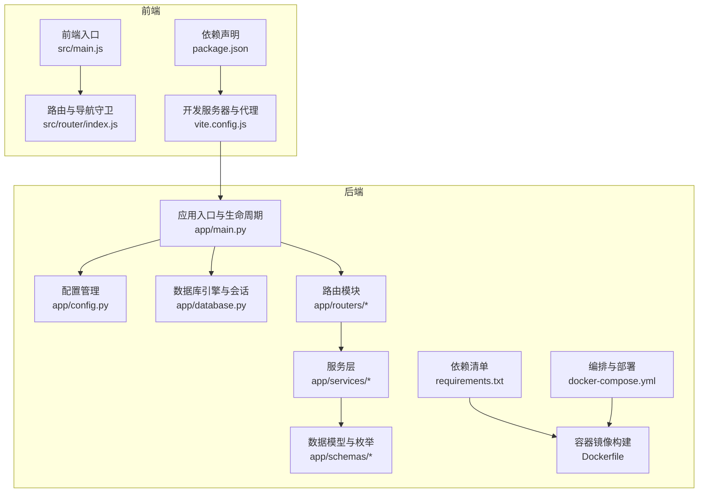

图表来源
- [main.js:1-10](file://frontend/ai_assistant/src/main.js#L1-L10)
- [router/index.js:1-75](file://frontend/ai_assistant/src/router/index.js#L1-L75)
- [vite.config.js:1-23](file://frontend/ai_assistant/vite.config.js#L1-L23)
- [package.json:1-24](file://frontend/ai_assistant/package.json#L1-L24)
- [app/main.py:1-86](file://service/ai_assistant/app/main.py#L1-L86)
- [app/config.py:1-113](file://service/ai_assistant/app/config.py#L1-L113)
- [app/database.py:1-35](file://service/ai_assistant/app/database.py#L1-L35)
- [requirements.txt:1-22](file://service/ai_assistant/requirements.txt#L1-L22)
- [Dockerfile:1-49](file://service/ai_assistant/Dockerfile#L1-L49)
- [docker-compose.yml:1-31](file://service/ai_assistant/docker-compose.yml#L1-L31)

章节来源
- [README.md:1-104](file://README.md#L1-L104)
- [package.json:1-24](file://frontend/ai_assistant/package.json#L1-L24)
- [main.js:1-10](file://frontend/ai_assistant/src/main.js#L1-L10)
- [router/index.js:1-75](file://frontend/ai_assistant/src/router/index.js#L1-L75)
- [vite.config.js:1-23](file://frontend/ai_assistant/vite.config.js#L1-L23)
- [app/main.py:1-86](file://service/ai_assistant/app/main.py#L1-L86)
- [app/config.py:1-113](file://service/ai_assistant/app/config.py#L1-L113)
- [app/database.py:1-35](file://service/ai_assistant/app/database.py#L1-L35)
- [requirements.txt:1-22](file://service/ai_assistant/requirements.txt#L1-L22)
- [Dockerfile:1-49](file://service/ai_assistant/Dockerfile#L1-L49)
- [docker-compose.yml:1-31](file://service/ai_assistant/docker-compose.yml#L1-L31)

## 核心组件
- 前端组件
  - 应用入口与状态管理：Vue 3 + Pinia，负责应用初始化与全局状态。
  - 路由与导航：Vue Router + 导航守卫，实现登录态校验与页面跳转。
  - 开发与代理：Vite 开发服务器，配置 /api 代理到后端 8000 端口。
  - 依赖：Vue、Vue Router、Pinia、Axios、CryptoJS、UUID、Marked 等。
- 后端组件
  - 应用入口：FastAPI 应用，注册中间件、CORS、路由与生命周期钩子。
  - 配置管理：Pydantic Settings，集中管理数据库、Redis、JWT、大模型、缓存等配置。
  - 数据访问：SQLAlchemy AsyncIO 异步引擎与会话工厂，支持 MySQL 8.0。
  - 路由模块：认证、查询、系统、管理等路由，职责清晰。
  - 服务层：缓存、安全、意图、查询、媒体、日志等服务，支撑核心业务。
  - LangChain 集成：DashScope 适配器，支持提示渲染、调用与流式输出。
  - 容器化：Dockerfile 多阶段构建，requirements.txt 管理依赖，docker-compose 统一编排。

章节来源
- [package.json:1-24](file://frontend/ai_assistant/package.json#L1-L24)
- [main.js:1-10](file://frontend/ai_assistant/src/main.js#L1-L10)
- [router/index.js:1-75](file://frontend/ai_assistant/src/router/index.js#L1-L75)
- [vite.config.js:1-23](file://frontend/ai_assistant/vite.config.js#L1-L23)
- [app/main.py:1-86](file://service/ai_assistant/app/main.py#L1-L86)
- [app/config.py:1-113](file://service/ai_assistant/app/config.py#L1-L113)
- [app/database.py:1-35](file://service/ai_assistant/app/database.py#L1-L35)
- [requirements.txt:1-22](file://service/ai_assistant/requirements.txt#L1-L22)
- [app/services/langchain_service.py:1-278](file://service/ai_assistant/app/services/langchain_service.py#L1-L278)
- [app/services/cache_service.py:1-177](file://service/ai_assistant/app/services/cache_service.py#L1-L177)

## 架构总览
系统采用前后端分离与容器化微服务集成模式：
- 表现层：Vue 3 前端，通过 Axios 与后端 API 通信，支持 SSE 流式输出与多模态输入（文本、图像、音频）。
- 业务层：FastAPI 路由与服务层，实现认证、查询、缓存、安全、意图识别、RAG 执行与总结。
- 数据访问层：SQLAlchemy AsyncIO 异步访问 MySQL 8.0，Redis 7 提供缓存与会话上下文存储。
- 大模型集成：LangChain + DashScope，支持多模型调度与流式生成。
- 部署层：Docker 多阶段构建 + docker-compose，统一编排 Redis、MySQL 初始化与应用服务。

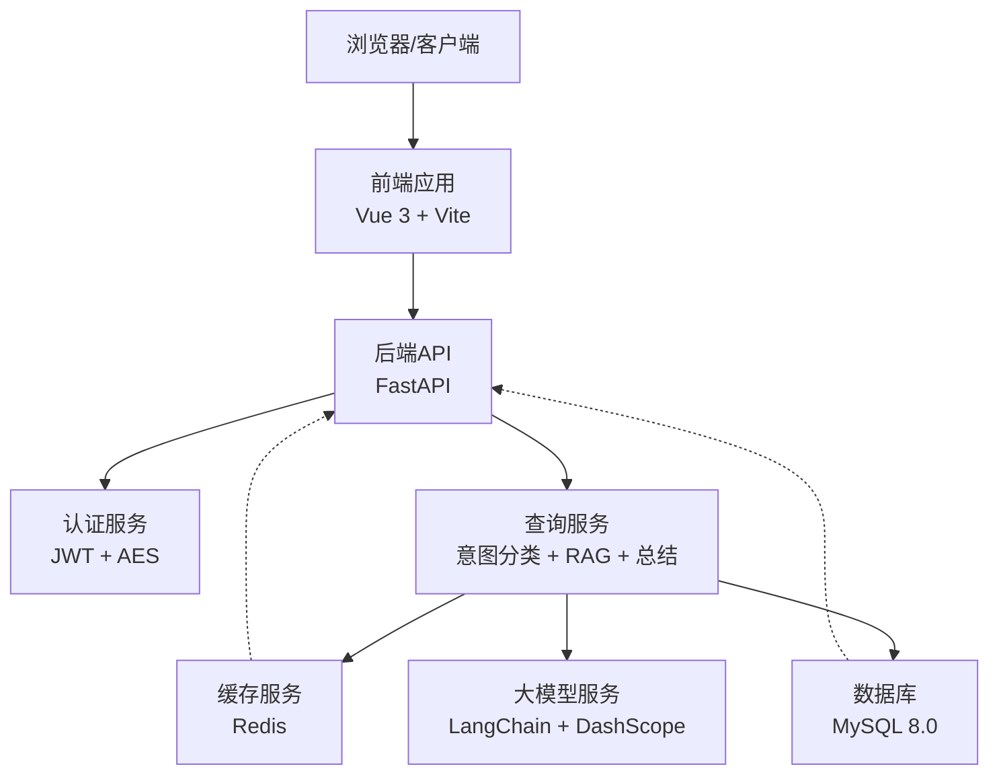

图表来源
- [README.md:9-14](file://README.md#L9-L14)
- [app/main.py:52-86](file://service/ai_assistant/app/main.py#L52-L86)
- [app/routers/auth.py:1-102](file://service/ai_assistant/app/routers/auth.py#L1-L102)
- [app/routers/query.py:1-788](file://service/ai_assistant/app/routers/query.py#L1-L788)
- [app/services/cache_service.py:1-177](file://service/ai_assistant/app/services/cache_service.py#L1-L177)
- [app/database.py:1-35](file://service/ai_assistant/app/database.py#L1-L35)
- [app/services/langchain_service.py:1-278](file://service/ai_assistant/app/services/langchain_service.py#L1-L278)

## 详细组件分析

### 前端架构组件
- 应用入口与状态管理
  - 创建 Vue 应用实例，注册 Pinia 与路由，挂载根组件。
- 路由与导航守卫
  - 定义登录、聊天、个人资料、管理员登录与仪表盘等路由。
  - 通过 meta 字段与导航守卫实现登录态校验与页面重定向。
- 开发与代理
  - Vite 代理将 /api 请求转发至后端 8000 端口，便于开发调试。
- 依赖与构建
  - 使用 Vue 3、Vue Router、Pinia、Axios、CryptoJS、UUID、Marked 等依赖。

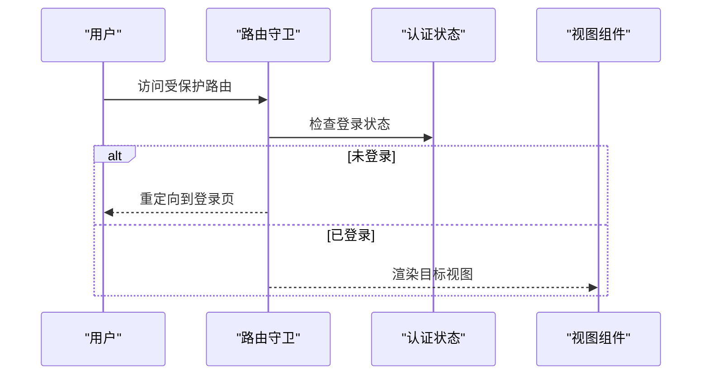

图表来源
- [router/index.js:57-73](file://frontend/ai_assistant/src/router/index.js#L57-L73)

章节来源
- [main.js:1-10](file://frontend/ai_assistant/src/main.js#L1-L10)
- [router/index.js:1-75](file://frontend/ai_assistant/src/router/index.js#L1-L75)
- [vite.config.js:1-23](file://frontend/ai_assistant/vite.config.js#L1-L23)
- [package.json:1-24](file://frontend/ai_assistant/package.json#L1-L24)

### 后端架构组件

#### 应用入口与生命周期
- 注册 CORS 中间件，支持生产环境精确配置允许来源。
- 注册认证、管理、查询、系统路由。
- 生命周期钩子中进行安全默认值检查与 Redis 连接池关闭。

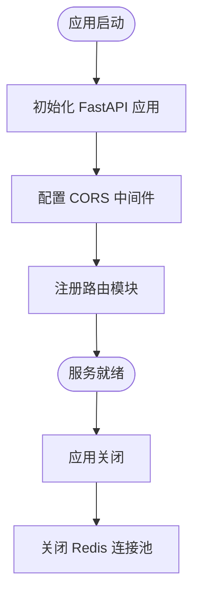

图表来源
- [app/main.py:36-49](file://service/ai_assistant/app/main.py#L36-L49)
- [app/main.py:70-86](file://service/ai_assistant/app/main.py#L70-L86)

章节来源
- [app/main.py:1-86](file://service/ai_assistant/app/main.py#L1-L86)

#### 配置管理
- 使用 Pydantic Settings 从 .env 文件加载配置，支持数据库、Redis、JWT、大模型、缓存 TTL、CORS 等。
- 提供数据库 URL 与 Redis URL 工厂方法，简化连接配置。

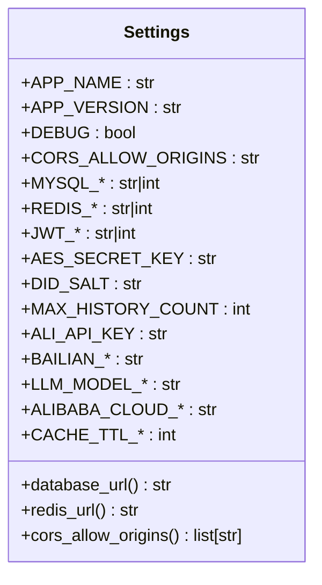

图表来源
- [app/config.py:6-113](file://service/ai_assistant/app/config.py#L6-L113)

章节来源
- [app/config.py:1-113](file://service/ai_assistant/app/config.py#L1-L113)

#### 数据访问层
- 异步 SQLAlchemy 引擎与会话工厂，启用 pre_ping 与 recycle，支持 MySQL 8.0。
- 会话上下文管理器，确保会话正确关闭。

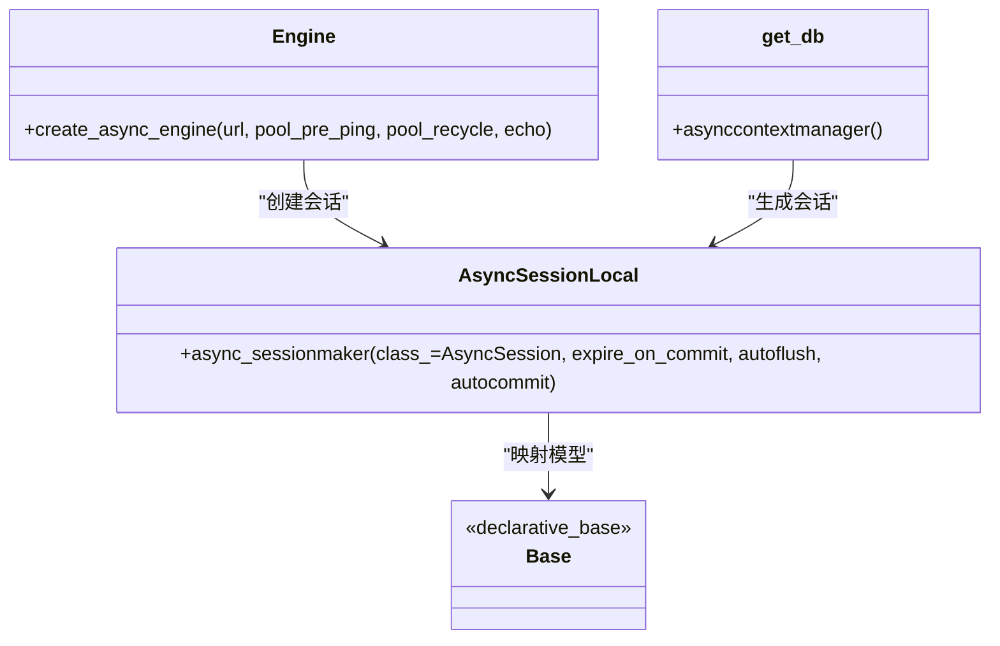

图表来源
- [app/database.py:1-35](file://service/ai_assistant/app/database.py#L1-L35)

章节来源
- [app/database.py:1-35](file://service/ai_assistant/app/database.py#L1-L35)

#### 认证与安全
- 登录接口：接收加密密码，返回 JWT Bearer 令牌。
- 修改密码：校验旧密码与当前登录身份，加密更新新密码。
- 安全检查：危险内容拦截与隐私越权检查，必要时返回干预提示。

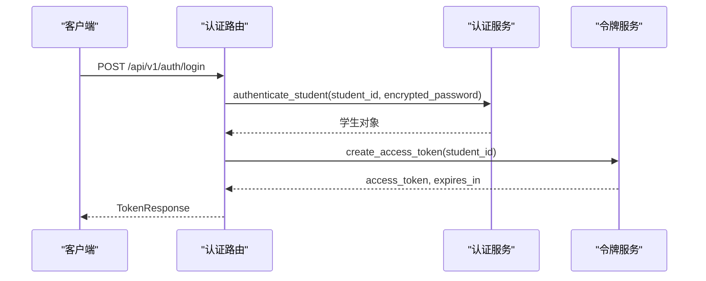

图表来源
- [app/routers/auth.py:24-52](file://service/ai_assistant/app/routers/auth.py#L24-L52)

章节来源
- [app/routers/auth.py:1-102](file://service/ai_assistant/app/routers/auth.py#L1-L102)

#### 查询与意图处理
- 单一查询端点：支持文本、图像、音频输入，统一构建查询文本。
- 缓存优先：基于 DID 与查询哈希的 Redis 缓存命中直接返回。
- 并发执行：安全检查、隐私检查与查询重写并行，缩短响应时间。
- 意图分类：基于 LLM 的结构化/向量/混合/闲聊意图识别。
- RAG 与总结：结合历史上下文与检索片段，LangChain 流式生成最终回答。
- SSE 流式输出：逐块推送回答，包含耗时、缓存状态与意图信息。

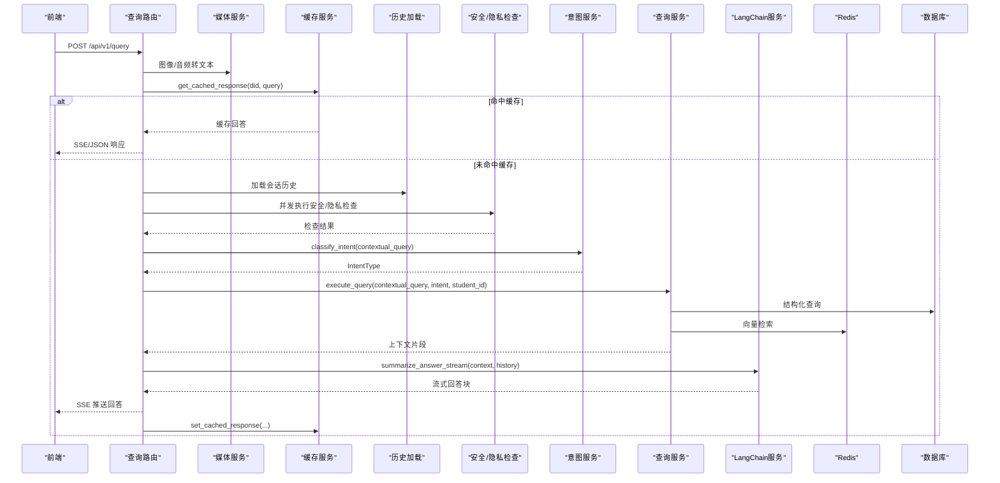

图表来源
- [app/routers/query.py:207-745](file://service/ai_assistant/app/routers/query.py#L207-L745)
- [app/schemas/query.py:8-33](file://service/ai_assistant/app/schemas/query.py#L8-L33)
- [app/services/cache_service.py:92-177](file://service/ai_assistant/app/services/cache_service.py#L92-L177)

章节来源
- [app/routers/query.py:1-788](file://service/ai_assistant/app/routers/query.py#L1-L788)
- [app/schemas/query.py:1-33](file://service/ai_assistant/app/schemas/query.py#L1-L33)
- [app/services/cache_service.py:1-177](file://service/ai_assistant/app/services/cache_service.py#L1-L177)

#### LangChain 与 DashScope 集成
- 提示模板渲染与消息格式转换。
- 输入裁剪与字符数控制，避免超出模型输入上限。
- 非流式与流式调用封装，支持增量输出与错误处理。

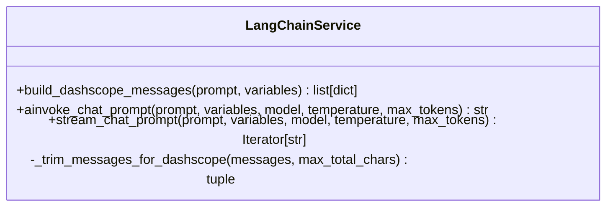

图表来源
- [app/services/langchain_service.py:128-278](file://service/ai_assistant/app/services/langchain_service.py#L128-L278)

章节来源
- [app/services/langchain_service.py:1-278](file://service/ai_assistant/app/services/langchain_service.py#L1-L278)

#### 缓存策略与键设计
- 缓存键格式：chat_cache:{version}:{did}:{query_md5}，支持版本隔离与敏感度区分。
- TTL 策略：敏感查询 30 分钟，普通查询 1 天；时间敏感与课表敏感查询按日期/版本失效。
- 课表版本控制：管理员调整课表后递增版本号，强制失效相关缓存。

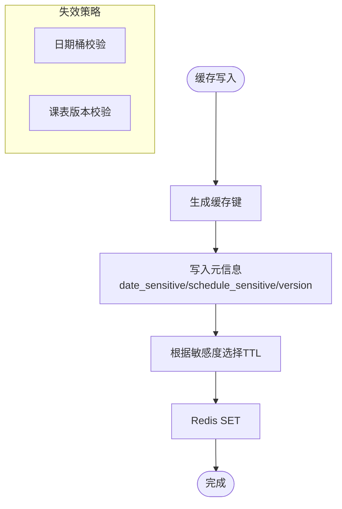

图表来源
- [app/services/cache_service.py:49-177](file://service/ai_assistant/app/services/cache_service.py#L49-L177)

章节来源
- [app/services/cache_service.py:1-177](file://service/ai_assistant/app/services/cache_service.py#L1-L177)

## 依赖关系分析
- 前端依赖
  - Vue 3、Vue Router、Pinia、Axios、CryptoJS、UUID、Marked。
  - Vite 开发工具链，支持热更新与代理。
- 后端依赖
  - FastAPI、Uvicorn、SQLAlchemy AsyncIO、aiomysql、Redis、Pydantic Settings、DashScope、LangChain Core、Loguru 等。
- 容器化
  - Dockerfile 多阶段构建，阿里云镜像加速，非 root 用户运行，暴露 8000 端口。
  - docker-compose 编排 Redis 与健康检查，桥接网络与数据卷。

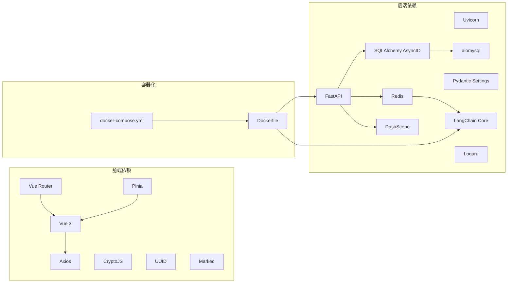

图表来源
- [package.json:11-22](file://frontend/ai_assistant/package.json#L11-L22)
- [requirements.txt:1-22](file://service/ai_assistant/requirements.txt#L1-L22)
- [Dockerfile:1-49](file://service/ai_assistant/Dockerfile#L1-L49)
- [docker-compose.yml:1-31](file://service/ai_assistant/docker-compose.yml#L1-L31)

章节来源
- [package.json:1-24](file://frontend/ai_assistant/package.json#L1-L24)
- [requirements.txt:1-22](file://service/ai_assistant/requirements.txt#L1-L22)
- [Dockerfile:1-49](file://service/ai_assistant/Dockerfile#L1-L49)
- [docker-compose.yml:1-31](file://service/ai_assistant/docker-compose.yml#L1-L31)

## 性能考虑
- 异步与并发
  - 后端使用 SQLAlchemy AsyncIO 与 asyncio 并发执行安全检查与查询重写，减少端到端延迟。
- 缓存优化
  - Redis 缓存命中优先，敏感与普通查询区分 TTL，时间敏感与课表敏感按策略失效，避免陈旧数据。
- 流式输出
  - SSE 流式推送，前端即时渲染，提升用户体验；后端在流式阶段释放数据库连接，避免阻塞。
- 容器与部署
  - 多阶段构建与阿里云镜像加速，非 root 用户运行，降低安全风险；Compose 统一编排，便于横向扩展。

## 故障排除指南
- CORS 与代理
  - 生产环境需在配置中精确设置允许来源；开发环境确认 Vite 代理指向后端 8000 端口。
- 安全默认值
  - 应用启动时检查 JWT、AES、盐值等默认值，生产环境务必替换为强密码。
- Redis 连接
  - docker-compose 提供健康检查，确认密码与内存策略配置；缓存失败时降级到数据库历史。
- 大模型调用
  - 输入字符数超限会触发裁剪与告警；网络代理可能导致调用失败，需检查 DashScope 代理配置。
- HTTPS 与反向代理
  - 生产环境必须配置 HTTPS 与反向代理，确保 SSE 不被缓冲；Nginx 关键参数包括禁用缓冲、关闭缓存、保持连接等。

章节来源
- [app/main.py:25-49](file://service/ai_assistant/app/main.py#L25-L49)
- [vite.config.js:12-22](file://frontend/ai_assistant/vite.config.js#L12-L22)
- [docker-compose.yml:5-24](file://service/ai_assistant/docker-compose.yml#L5-L24)
- [app/services/langchain_service.py:146-203](file://service/ai_assistant/app/services/langchain_service.py#L146-L203)
- [README.md:67-104](file://README.md#L67-L104)

## 结论
本项目通过 Vue 3 + FastAPI 的现代技术栈，结合 LangChain 与 DashScope 的大模型能力，实现了高并发、可扩展、强隐私保障的校园智能问答系统。前后端分离与容器化部署策略确保了开发效率与运维一致性；异步与缓存优化提升了性能与稳定性；完善的错误处理与 HTTPS 部署规范增强了安全性与可靠性。该架构为后续模块深入学习与功能扩展奠定了坚实基础。