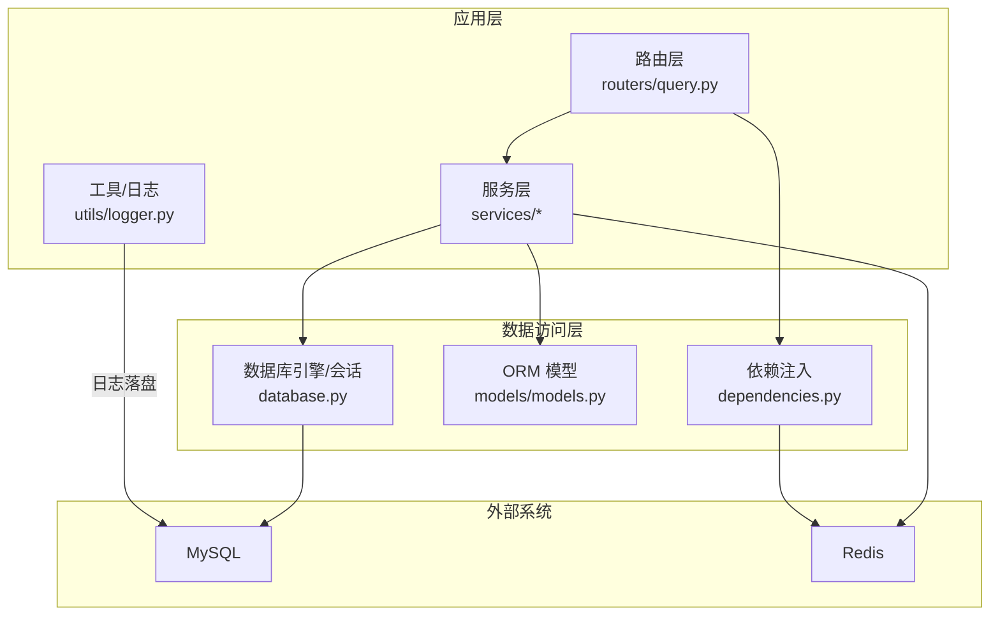
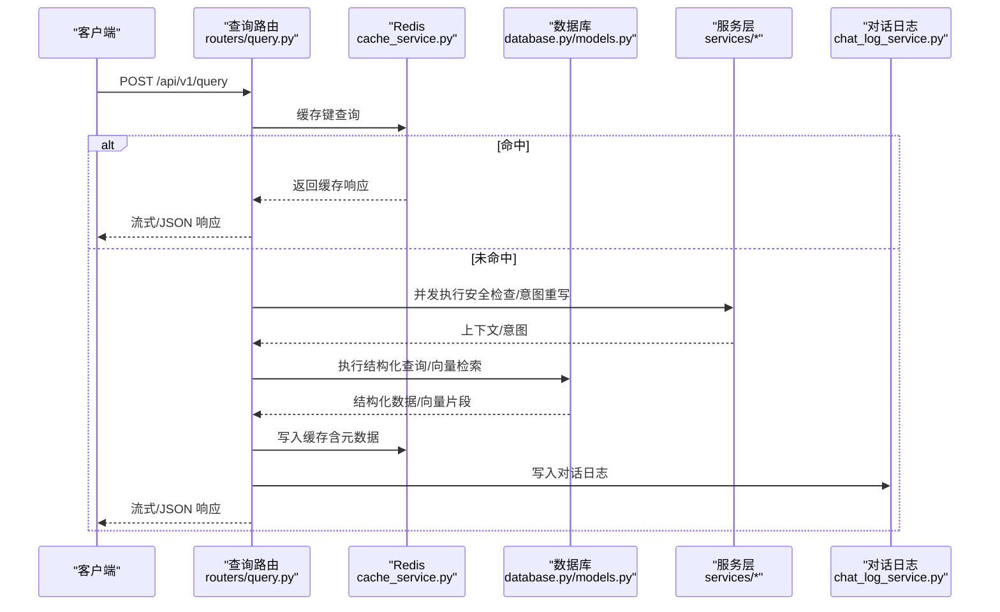
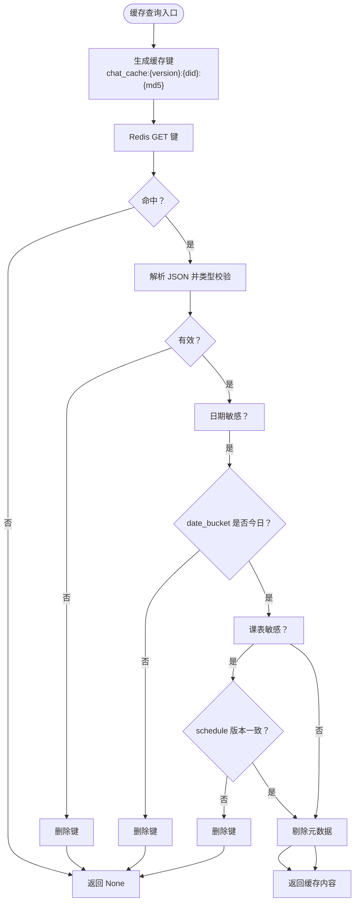
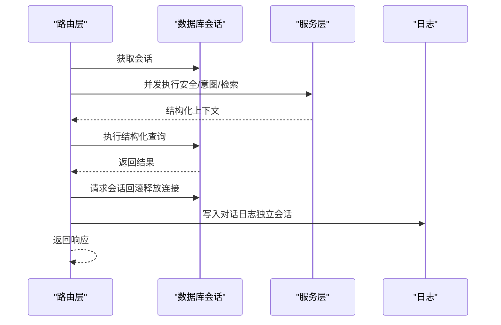
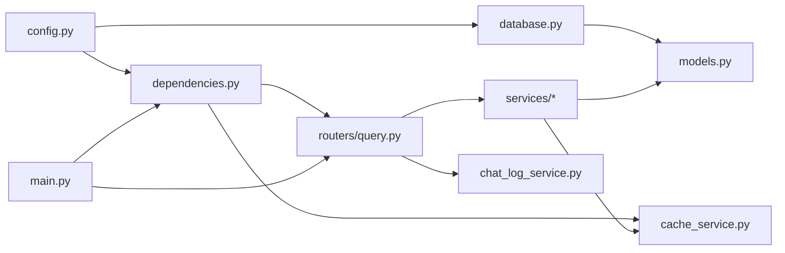

# 数据存储架构

<cite>
**本文档引用的文件**
- [database.py](file://service/ai_assistant/app/database.py)
- [models.py](file://service/ai_assistant/app/models/models.py)
- [cache_service.py](file://service/ai_assistant/app/services/cache_service.py)
- [config.py](file://service/ai_assistant/app/config.py)
- [dependencies.py](file://service/ai_assistant/app/dependencies.py)
- [query.py](file://service/ai_assistant/app/routers/query.py)
- [query_service.py](file://service/ai_assistant/app/services/query_service.py)
- [chat_log_service.py](file://service/ai_assistant/app/services/chat_log_service.py)
- [logger.py](file://service/ai_assistant/app/utils/logger.py)
- [main.py](file://service/ai_assistant/app/main.py)
- [docker-compose.yml](file://service/ai_assistant/docker-compose.yml)
- [Dockerfile](file://service/ai_assistant/Dockerfile)
- [requirements.txt](file://service/ai_assistant/requirements.txt)
</cite>

## 目录
1. [简介](#简介)
2. [项目结构](#项目结构)
3. [核心组件](#核心组件)
4. [架构总览](#架构总览)
5. [详细组件分析](#详细组件分析)
6. [依赖关系分析](#依赖关系分析)
7. [性能考量](#性能考量)
8. [故障排查指南](#故障排查指南)
9. [结论](#结论)
10. [附录](#附录)

## 简介
本文件面向数据工程师，系统梳理 AI 校园助手项目的数据库设计模式、ORM 模型映射、缓存策略与数据访问层设计。重点覆盖：
- MySQL 表结构设计、关系映射与索引优化策略
- Redis 缓存系统集成、缓存键设计、TTL 与一致性保障
- 数据访问层设计理念、连接池管理与事务处理策略
- 面向生产的部署与运维要点

## 项目结构
后端采用 FastAPI + SQLAlchemy Async + Redis 的异步架构，数据层分为 ORM 模型层、服务层与路由层，缓存与会话历史通过 Redis 实现，日志统一落地。



图表来源
- [query.py:1-788](file://service/ai_assistant/app/routers/query.py#L1-L788)
- [dependencies.py:1-109](file://service/ai_assistant/app/dependencies.py#L1-L109)
- [database.py:1-35](file://service/ai_assistant/app/database.py#L1-L35)
- [models.py:1-660](file://service/ai_assistant/app/models/models.py#L1-L660)
- [cache_service.py:1-177](file://service/ai_assistant/app/services/cache_service.py#L1-L177)
- [logger.py:1-53](file://service/ai_assistant/app/utils/logger.py#L1-L53)

章节来源
- [main.py:1-86](file://service/ai_assistant/app/main.py#L1-L86)
- [docker-compose.yml:1-31](file://service/ai_assistant/docker-compose.yml#L1-L31)

## 核心组件
- 数据库引擎与会话管理：基于 SQLAlchemy AsyncEngine 与 async_sessionmaker，启用连接池预检与回收，支持异步上下文管理。
- ORM 模型：采用 DeclarativeBase，定义实体与关系映射，大量使用索引与约束提升查询效率。
- 缓存服务：Redis 异步客户端封装，统一键空间、TTL 策略与一致性校验（日期敏感、课表版本）。
- 依赖注入：统一提供数据库会话与 Redis 客户端，支持路由与服务层按需注入。
- 日志与监控：Loguru 统一日志配置，支持控制台与文件双通道输出。

章节来源
- [database.py:1-35](file://service/ai_assistant/app/database.py#L1-L35)
- [models.py:1-660](file://service/ai_assistant/app/models/models.py#L1-L660)
- [cache_service.py:1-177](file://service/ai_assistant/app/services/cache_service.py#L1-L177)
- [dependencies.py:1-109](file://service/ai_assistant/app/dependencies.py#L1-L109)
- [logger.py:1-53](file://service/ai_assistant/app/utils/logger.py#L1-L53)

## 架构总览
整体数据流：客户端请求经路由层进入，先进行缓存查询与安全检查，随后并发执行意图重写与危险内容检测；根据意图选择结构化 SQL 查询、向量检索或混合路径；最终通过总结服务生成回答并写入缓存与对话日志。



图表来源
- [query.py:198-745](file://service/ai_assistant/app/routers/query.py#L198-L745)
- [cache_service.py:92-177](file://service/ai_assistant/app/services/cache_service.py#L92-L177)
- [query_service.py:1-800](file://service/ai_assistant/app/services/query_service.py#L1-L800)
- [chat_log_service.py:14-76](file://service/ai_assistant/app/services/chat_log_service.py#L14-L76)

## 详细组件分析

### 数据库设计模式与 ORM 映射
- 设计模式
  - 主键策略：多数实体采用字符串主键（如课程、教师、班级、学期等），便于与业务标识对齐；管理员与聊天日志使用整型自增主键。
  - 外键约束：通过 ForeignKey 明确实体间关系，如 Schedule 与 Course/Term/Teacher/Classroom 的多对一关系。
  - 枚举字段：角色、状态、类型等使用 Enum，配合数据库枚举类型，保证取值一致性。
  - 约束与索引：广泛使用 UniqueConstraint、CheckConstraint 与 Index，显著提升查询与写入稳定性。
- 关系映射
  - 一对多/多对一：如 Department-Major、Major-Class、Class-Student、Term-Schedule 等。
  - 多对多：通过中间表 ScheduleClassMap 实现 Schedule 与 Class 的多对多映射。
  - 回表关系：如 AdminUser.action_logs、Schedule.class_mappings、Schedule.adjustments 等，通过 back_populates 建立双向关系。
- 索引优化策略
  - 复合索引：如 Schedule 的 term+course、term+teacher+time、term+room+time、term+status+time 等，覆盖高频查询条件。
  - 单列索引：如 AdminUser 的 role+status、Student 的 class_id、Score 的 course+term 等，支撑快速过滤。
  - 唯一约束：如 AdminUser 的 admin_code/username、Class 的 major+grade+name、Enrollment 的三元唯一等，避免重复与提升写入性能。
- 数据完整性
  - CheckConstraint：如 Schedule 的 day/period/week_no 范围校验，Score 的 0-100 分范围，Term 的 start_date < end_date 等。
  - 级联更新：onupdate=CASCADE，确保主表变更时从表引用保持一致。

```mermaid
erDiagram
ADMIN_USER {
bigint admin_id PK
string admin_code UK
string username UK
string password_hash
string display_name
enum role
enum status
datetime last_login_at
datetime created_at
datetime updated_at
}
ADMIN_ACTION_LOG {
bigint action_log_id PK
bigint admin_id FK
string action_type
string target_table
string target_pk
string reason
text before_json
text after_json
string request_ip
datetime created_at
}
DEPARTMENT {
string dept_id PK
string name UK
}
MAJOR {
string major_id PK
string name
string dept_id FK
}
CLASS {
string class_id PK
string name
string major_id FK
int grade
}
TEACHER {
string teacher_id PK
string name
string title
string dept_id FK
string phone
string email
string office_hours
string office_room
}
TERM {
string term_id PK
date start_date
date end_date
}
COURSE {
string course_id PK
string course_name
int credit
enum course_type
}
CLASSROOM {
string room_id PK
enum room_type
string location
int capacity
}
STUDENT {
string student_id PK
string name
string gender
date date_of_birth
smallint enroll_year
string class_id FK
string phone
string email
enum status
string password_hash
}
ENROLLMENT {
int enrollment_id PK
string student_id FK
string course_id FK
string term_id FK
}
SCORE {
int score_id PK
string student_id FK
string course_id FK
string term_id FK
int score
smallint credit_earned
smallint cheating
}
SCHEDULE {
string schedule_id PK
string course_id FK
string teacher_id FK
string room_id FK
string term_id FK
int week_no
smallint day_of_week
int start_period
int end_period
string week_pattern
enum schedule_status
int version
bigint updated_by_admin_id FK
datetime updated_at
}
SCHEDULE_CLASS_MAP {
string schedule_id FK
string class_id FK
datetime created_at
bigint created_by_admin_id FK
}
SCHEDULE_ADJUSTMENT {
bigint adjustment_id PK
string schedule_id FK
string term_id FK
enum operation_type
string reason
enum status
int expected_schedule_version
int old_week_no
smallint old_day_of_week
int old_start_period
int old_end_period
string old_room_id
string old_teacher_id
int new_week_no
smallint new_day_of_week
int new_start_period
int new_end_period
string new_room_id
string new_teacher_id
bigint requested_by_admin_id FK
bigint approved_by_admin_id FK
datetime requested_at
datetime approved_at
datetime applied_at
bigint rollback_of_adjustment_id FK
text conflict_snapshot
}
CHAT_LOG {
bigint log_id PK
string did
string student_id
datetime timestamp
enum sender
text message_content
enum system_action
bigint response_time_ms
}
ADMIN_USER ||--o{ ADMIN_ACTION_LOG : "action_logs"
DEPARTMENT ||--o{ MAJOR : "majors"
MAJOR ||--o{ CLASS : "classes"
CLASS ||--o{ STUDENT : "students"
DEPARTMENT ||--o{ TEACHER : "teachers"
TERM ||--o{ ENROLLMENT : "enrollments"
TERM ||--o{ SCORE : "scores"
TERM ||--o{ SCHEDULE : "schedules"
TERM ||--o{ SCHEDULE_ADJUSTMENT : "adjustments"
COURSE ||--o{ ENROLLMENT : "enrollments"
COURSE ||--o{ SCORE : "scores"
COURSE ||--o{ SCHEDULE : "schedules"
TEACHER ||--o{ SCHEDULE : "schedules"
CLASSROOM ||--o{ SCHEDULE : "schedules"
STUDENT ||--o{ ENROLLMENT : "enrollments"
STUDENT ||--o{ SCORE : "scores"
STUDENT ||--o{ CHAT_LOG : "chat_logs"
SCHEDULE ||--o{ SCHEDULE_CLASS_MAP : "class_mappings"
SCHEDULE ||--o{ SCHEDULE_ADJUSTMENT : "adjustments"
SCHEDULE_CLASS_MAP }o--|| CLASS : "class_"
SCHEDULE_CLASS_MAP }o--|| SCHEDULE : "schedule"
```

图表来源
- [models.py:41-660](file://service/ai_assistant/app/models/models.py#L41-L660)

章节来源
- [models.py:1-660](file://service/ai_assistant/app/models/models.py#L1-L660)

### 缓存策略设计与一致性保障
- 键空间与版本控制
  - 键格式：chat_cache:{version}:{did}:{query_md5}，版本号用于在查询/总结逻辑升级时隔离旧缓存。
  - 课表版本键：chat_cache:schedule_version，管理员改课后递增版本，使课表相关查询强制失效。
- TTL 策略
  - 敏感/隐私查询：30 分钟（CACHE_TTL_SENSITIVE）
  - 普通查询：1 天（CACHE_TTL_NORMAL）
- 一致性保障
  - 日期敏感查询：缓存元数据包含 date_bucket，跨天自动失效。
  - 课表敏感查询：缓存元数据包含 schedule_cache_version，版本不一致则失效。
  - 命中后剔除元数据再返回，避免泄露内部信息。
- 写入与读取
  - 读取：先解析 JSON，类型校验失败则删除键并返回未命中。
  - 写入：附加元数据（日期桶、课表版本、敏感标记），按策略设置 TTL。



图表来源
- [cache_service.py:92-177](file://service/ai_assistant/app/services/cache_service.py#L92-L177)

章节来源
- [cache_service.py:1-177](file://service/ai_assistant/app/services/cache_service.py#L1-L177)

### 数据访问层设计理念与连接池管理
- 异步引擎与会话
  - 使用 create_async_engine 创建异步 MySQL 引擎，开启 pool_pre_ping 与 pool_recycle，确保连接健康与回收。
  - async_sessionmaker 提供 AsyncSessionLocal，禁用自动 flush/commit，expire_on_commit=False，减少不必要的 ORM 状态刷新。
- 依赖注入
  - get_db 提供异步上下文管理，确保每个请求拥有独立会话并在 finally 中关闭。
  - get_redis 提供 Redis 客户端单例，进程内共享连接池，生命周期与应用绑定。
- 事务处理策略
  - 路由层在 SSE 流式生成前主动回滚请求会话，释放连接，避免长时间占用。
  - JSON 输出路径使用独立短生命周期会话写入最终回答，避免与长连接会话冲突。
- 日志与可观测性
  - 统一日志配置，控制台与文件双通道，支持旋转与保留策略，便于定位问题。



图表来源
- [query.py:654-745](file://service/ai_assistant/app/routers/query.py#L654-L745)
- [dependencies.py:27-50](file://service/ai_assistant/app/dependencies.py#L27-L50)
- [chat_log_service.py:14-76](file://service/ai_assistant/app/services/chat_log_service.py#L14-L76)

章节来源
- [database.py:1-35](file://service/ai_assistant/app/database.py#L1-L35)
- [dependencies.py:1-109](file://service/ai_assistant/app/dependencies.py#L1-L109)
- [query.py:1-788](file://service/ai_assistant/app/routers/query.py#L1-L788)
- [chat_log_service.py:1-76](file://service/ai_assistant/app/services/chat_log_service.py#L1-L76)
- [logger.py:1-53](file://service/ai_assistant/app/utils/logger.py#L1-L53)

### 配置与部署要点
- 配置项
  - MySQL：主机、端口、用户名、密码、数据库名
  - Redis：主机、端口、密码、DB 索引
  - 缓存 TTL：敏感/普通查询的过期时间
  - CORS：允许的前端源
- Docker 部署
  - Redis 7，设置密码、内存上限与淘汰策略（allkeys-lru），健康检查与持久化卷。
  - Python 运行时镜像，换源加速，安装运行时依赖与 MySQL 客户端库。
- 安全与默认值
  - 启动时检查不安全默认值（如 JWT/AES/DID），生产环境务必替换。

章节来源
- [config.py:1-113](file://service/ai_assistant/app/config.py#L1-L113)
- [docker-compose.yml:1-31](file://service/ai_assistant/docker-compose.yml#L1-L31)
- [Dockerfile:1-49](file://service/ai_assistant/Dockerfile#L1-L49)
- [main.py:18-34](file://service/ai_assistant/app/main.py#L18-L34)

## 依赖关系分析
- 组件耦合
  - 路由层依赖依赖注入模块获取数据库与 Redis 客户端，服务层依赖 ORM 模型与配置。
  - 缓存服务与查询服务相互协作，缓存键生成与一致性校验贯穿查询链路。
- 外部依赖
  - SQLAlchemy Async、aiomysql、redis、FastAPI、Loguru 等。
- 循环依赖
  - 通过模块化组织与延迟导入避免循环依赖风险。



图表来源
- [config.py:1-113](file://service/ai_assistant/app/config.py#L1-L113)
- [database.py:1-35](file://service/ai_assistant/app/database.py#L1-L35)
- [dependencies.py:1-109](file://service/ai_assistant/app/dependencies.py#L1-L109)
- [models.py:1-660](file://service/ai_assistant/app/models/models.py#L1-L660)
- [cache_service.py:1-177](file://service/ai_assistant/app/services/cache_service.py#L1-L177)
- [query.py:1-788](file://service/ai_assistant/app/routers/query.py#L1-L788)
- [chat_log_service.py:1-76](file://service/ai_assistant/app/services/chat_log_service.py#L1-L76)
- [main.py:1-86](file://service/ai_assistant/app/main.py#L1-L86)

章节来源
- [requirements.txt:1-22](file://service/ai_assistant/requirements.txt#L1-L22)

## 性能考量
- 数据库层面
  - 合理使用复合索引与单列索引，避免全表扫描；对高频过滤字段建立索引。
  - 利用 CheckConstraint 与 UniqueConstraint 提升写入稳定性与查询效率。
  - 大表分页与排序尽量结合索引，避免 ORDER BY 无索引导致的临时表排序。
- 缓存层面
  - 通过版本号与日期桶实现细粒度失效，避免脏读。
  - 敏感查询短 TTL，普通查询长 TTL，平衡一致性与性能。
- 连接池与事务
  - 异步连接池预检与回收，减少连接抖动。
  - 路由层在 SSE 生成前回滚会话，缩短连接占用时间。
- 日志与监控
  - 统一日志格式与落盘策略，便于性能分析与问题定位。

## 故障排查指南
- 缓存相关
  - 缓存键格式错误或 JSON 解析失败：检查键生成逻辑与元数据写入。
  - 日期敏感查询跨天命中旧结果：确认 date_bucket 与当前日期一致。
  - 课表相关查询命中旧结果：确认 chat_cache:schedule_version 是否递增。
- 数据库相关
  - 连接异常：检查 pool_pre_ping 与 pool_recycle 设置，确认 MySQL 服务可达。
  - 查询慢：核对 WHERE 条件是否命中索引，必要时添加复合索引。
- 路由与服务
  - SSE 流式输出中断：确认请求会话回滚与独立会话写入日志的顺序。
  - 安全检查误判：检查危险内容检测与隐私检查逻辑，必要时放宽阈值。
- 日志与运维
  - 日志未落盘：检查日志配置与权限，确认日志目录存在且可写。
  - Redis 连接失败：检查密码、端口与健康检查配置。

章节来源
- [cache_service.py:92-177](file://service/ai_assistant/app/services/cache_service.py#L92-L177)
- [query.py:654-745](file://service/ai_assistant/app/routers/query.py#L654-L745)
- [chat_log_service.py:14-76](file://service/ai_assistant/app/services/chat_log_service.py#L14-L76)
- [logger.py:1-53](file://service/ai_assistant/app/utils/logger.py#L1-L53)

## 结论
本项目在数据存储方面采用了清晰的分层设计与高效的异步实现：
- ORM 层通过合理的索引与约束保障数据完整性与查询性能；
- 缓存层通过版本化键空间与多维一致性校验，兼顾性能与正确性；
- 数据访问层通过依赖注入与连接池管理，实现了资源的高效利用与生命周期控制；
- 部署层提供了 Redis 与应用的标准化容器化方案，便于生产落地。

建议在生产环境中持续关注：
- 索引维护与查询计划分析
- 缓存命中率与 TTL 调优
- 连接池参数与数据库负载匹配
- 日志与指标监控体系完善

## 附录
- 关键配置项
  - MySQL：MYSQL_HOST/MYSQL_PORT/MYSQL_USER/MYSQL_PASSWORD/MYSQL_DATABASE
  - Redis：REDIS_HOST/REDIS_PORT/REDIS_PASSWORD/REDIS_DB
  - 缓存 TTL：CACHE_TTL_SENSITIVE/CACHE_TTL_NORMAL
  - CORS：CORS_ALLOW_ORIGINS
- 依赖组件
  - FastAPI、SQLAlchemy Async、aiomysql、redis、Loguru、DashScope、LangChain

章节来源
- [config.py:1-113](file://service/ai_assistant/app/config.py#L1-L113)
- [requirements.txt:1-22](file://service/ai_assistant/requirements.txt#L1-L22)