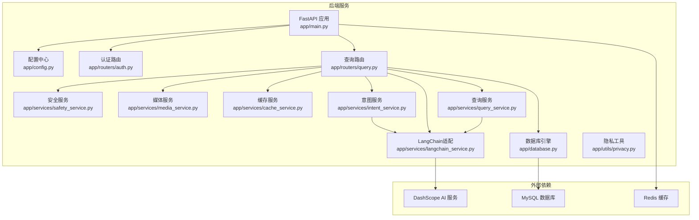
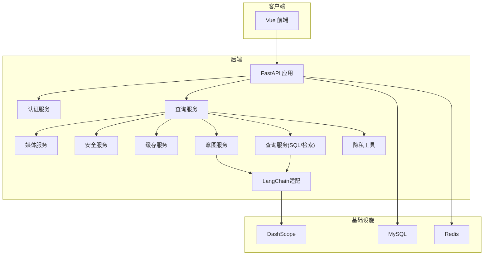
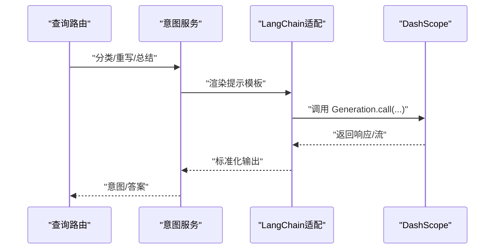
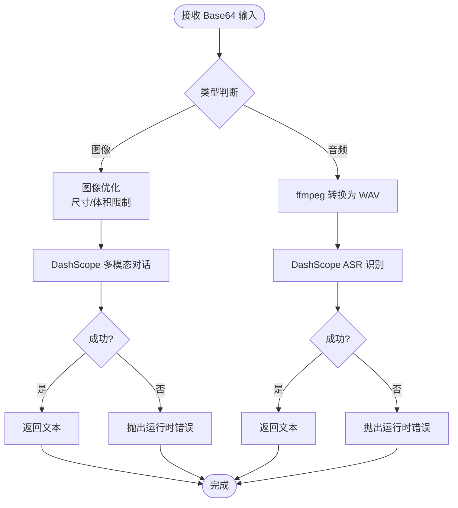
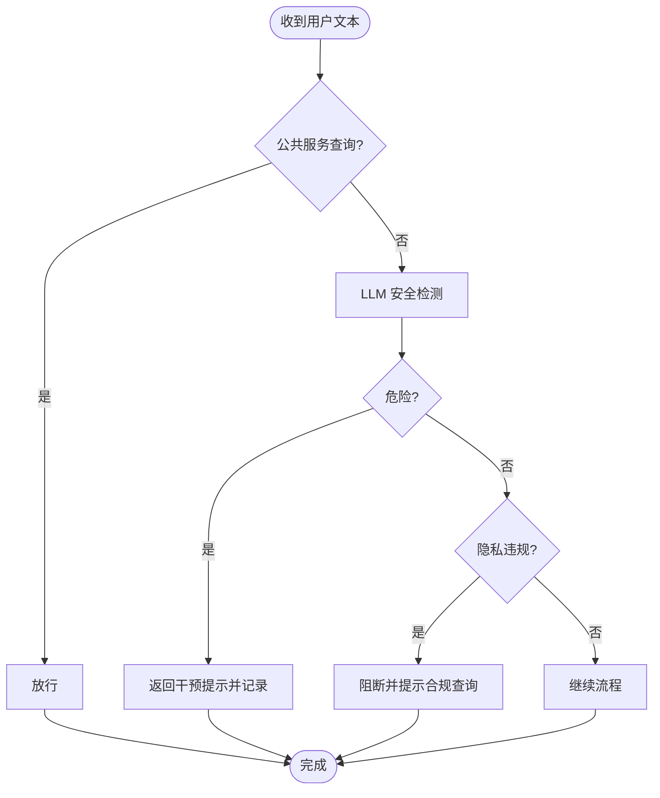
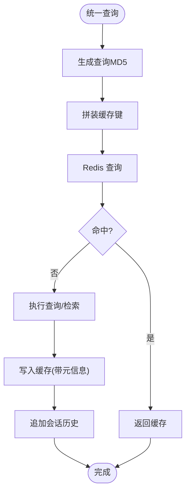
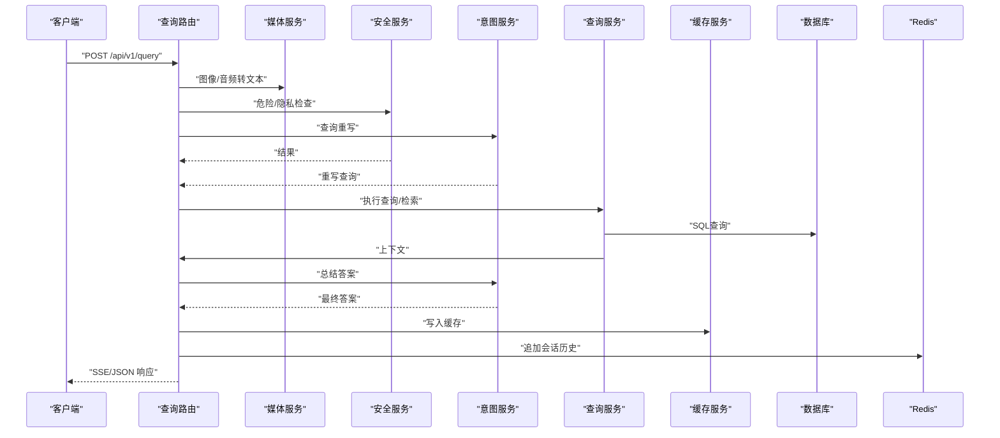
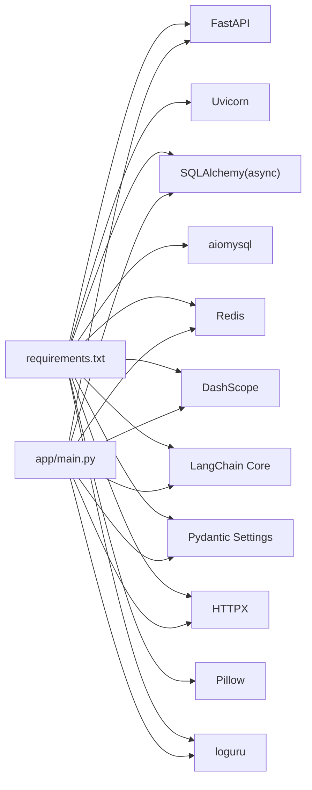

# 系统集成架构

<cite>
**本文档引用的文件**
- [Dockerfile](file://service/ai_assistant/Dockerfile)
- [docker-compose.yml](file://service/ai_assistant/docker-compose.yml)
- [requirements.txt](file://service/ai_assistant/requirements.txt)
- [main.py](file://service/ai_assistant/app/main.py)
- [config.py](file://service/ai_assistant/app/config.py)
- [langchain_service.py](file://service/ai_assistant/app/services/langchain_service.py)
- [media_service.py](file://service/ai_assistant/app/services/media_service.py)
- [safety_service.py](file://service/ai_assistant/app/services/safety_service.py)
- [privacy.py](file://service/ai_assistant/app/utils/privacy.py)
- [query.py](file://service/ai_assistant/app/routers/query.py)
- [cache_service.py](file://service/ai_assistant/app/services/cache_service.py)
- [intent_service.py](file://service/ai_assistant/app/services/intent_service.py)
- [query_service.py](file://service/ai_assistant/app/services/query_service.py)
- [auth.py](file://service/ai_assistant/app/routers/auth.py)
- [database.py](file://service/ai_assistant/app/database.py)
</cite>

## 目录
1. [引言](#引言)
2. [项目结构](#项目结构)
3. [核心组件](#核心组件)
4. [架构总览](#架构总览)
5. [详细组件分析](#详细组件分析)
6. [依赖分析](#依赖分析)
7. [性能考虑](#性能考虑)
8. [故障排查指南](#故障排查指南)
9. [结论](#结论)
10. [附录](#附录)

## 引言
本文件面向系统架构师，系统性阐述“AI校园助手”的系统集成架构，包括第三方服务集成模式（LangChain框架、DashScope AI服务、媒体处理服务）、微服务架构设计、容器化部署策略、安全与隐私保护机制，以及可扩展的基础设施建议。文档以代码为依据，辅以可视化图示，帮助读者快速理解并落地实施。

## 项目结构
后端采用FastAPI应用，按功能域划分服务层与路由层，配合配置中心、数据库与缓存，形成清晰的分层架构。前端为Vue单页应用，通过REST接口与后端交互。

图表来源
- [main.py:1-86](file://service/ai_assistant/app/main.py#L1-L86)
- [config.py:1-113](file://service/ai_assistant/app/config.py#L1-L113)
- [database.py:1-35](file://service/ai_assistant/app/database.py#L1-L35)
- [auth.py:1-102](file://service/ai_assistant/app/routers/auth.py#L1-L102)
- [query.py:1-788](file://service/ai_assistant/app/routers/query.py#L1-L788)
- [safety_service.py:1-163](file://service/ai_assistant/app/services/safety_service.py#L1-L163)
- [media_service.py:1-246](file://service/ai_assistant/app/services/media_service.py#L1-L246)
- [cache_service.py:1-177](file://service/ai_assistant/app/services/cache_service.py#L1-L177)
- [intent_service.py:1-346](file://service/ai_assistant/app/services/intent_service.py#L1-L346)
- [langchain_service.py:1-278](file://service/ai_assistant/app/services/langchain_service.py#L1-L278)
- [query_service.py:1-800](file://service/ai_assistant/app/services/query_service.py#L1-L800)
- [privacy.py:1-23](file://service/ai_assistant/app/utils/privacy.py#L1-L23)

章节来源
- [main.py:1-86](file://service/ai_assistant/app/main.py#L1-L86)
- [config.py:1-113](file://service/ai_assistant/app/config.py#L1-L113)
- [database.py:1-35](file://service/ai_assistant/app/database.py#L1-L35)

## 核心组件
- 应用入口与生命周期：FastAPI应用初始化、CORS中间件、路由注册、启动/关闭钩子。
- 配置中心：集中管理数据库、缓存、AI服务、模型参数、安全密钥等。
- 数据层：异步SQLAlchemy引擎与会话管理，支持连接池与预检。
- 服务层：
  - 安全服务：内容安全与隐私检查，结合规则与LLM双重保障。
  - 媒体服务：图像与音频多模态输入处理，对接DashScope。
  - 缓存服务：基于Redis的查询缓存与版本控制。
  - 意图服务：LangChain链路封装，意图分类、查询重写、答案总结。
  - LangChain适配：DashScope调用桥接，消息格式转换与流式输出。
  - 查询服务：结构化SQL查询、知识库检索、混合检索与重排。
  - 隐私工具：DID生成，保护学生真实ID。
- 路由层：认证路由与统一查询路由，负责鉴权、输入解码、并发处理与流式输出。

章节来源
- [main.py:1-86](file://service/ai_assistant/app/main.py#L1-L86)
- [config.py:1-113](file://service/ai_assistant/app/config.py#L1-L113)
- [auth.py:1-102](file://service/ai_assistant/app/routers/auth.py#L1-L102)
- [query.py:1-788](file://service/ai_assistant/app/routers/query.py#L1-L788)
- [safety_service.py:1-163](file://service/ai_assistant/app/services/safety_service.py#L1-L163)
- [media_service.py:1-246](file://service/ai_assistant/app/services/media_service.py#L1-L246)
- [cache_service.py:1-177](file://service/ai_assistant/app/services/cache_service.py#L1-L177)
- [intent_service.py:1-346](file://service/ai_assistant/app/services/intent_service.py#L1-L346)
- [langchain_service.py:1-278](file://service/ai_assistant/app/services/langchain_service.py#L1-L278)
- [query_service.py:1-800](file://service/ai_assistant/app/services/query_service.py#L1-L800)
- [privacy.py:1-23](file://service/ai_assistant/app/utils/privacy.py#L1-L23)

## 架构总览
系统采用“单体微服务化”思路：后端以FastAPI为核心，服务边界清晰、职责单一，通过依赖注入与异步并发提升吞吐。外部依赖包括DashScope AI服务、MySQL数据库与Redis缓存。容器化部署通过Dockerfile与docker-compose实现，具备基础健康检查与资源限制。

图表来源
- [main.py:1-86](file://service/ai_assistant/app/main.py#L1-L86)
- [query.py:1-788](file://service/ai_assistant/app/routers/query.py#L1-L788)
- [media_service.py:1-246](file://service/ai_assistant/app/services/media_service.py#L1-L246)
- [safety_service.py:1-163](file://service/ai_assistant/app/services/safety_service.py#L1-L163)
- [cache_service.py:1-177](file://service/ai_assistant/app/services/cache_service.py#L1-L177)
- [intent_service.py:1-346](file://service/ai_assistant/app/services/intent_service.py#L1-L346)
- [langchain_service.py:1-278](file://service/ai_assistant/app/services/langchain_service.py#L1-L278)
- [query_service.py:1-800](file://service/ai_assistant/app/services/query_service.py#L1-L800)
- [privacy.py:1-23](file://service/ai_assistant/app/utils/privacy.py#L1-L23)
- [database.py:1-35](file://service/ai_assistant/app/database.py#L1-L35)

## 详细组件分析

### LangChain 与 DashScope 集成
- 适配器职责：将DashScope API调用封装为LangChain兼容的消息格式与流式输出，统一提示模板渲染与调用参数。
- 输入裁剪：按最大字符限制裁剪历史消息，优先丢弃旧历史与最后一条消息，保证模型输入可控。
- 会话隔离：通过请求线程池避免阻塞，确保异步调用与流式输出稳定。
- 代理控制：可选择忽略环境代理变量，避免意外路由。

图表来源
- [intent_service.py:218-346](file://service/ai_assistant/app/services/intent_service.py#L218-L346)
- [langchain_service.py:139-278](file://service/ai_assistant/app/services/langchain_service.py#L139-L278)

章节来源
- [langchain_service.py:1-278](file://service/ai_assistant/app/services/langchain_service.py#L1-L278)
- [intent_service.py:1-346](file://service/ai_assistant/app/services/intent_service.py#L1-L346)

### 媒体处理服务（图像与音频）
- 图像理解：对Base64图像进行尺寸与体积优化，转换为JPEG并限制最长边，随后调用DashScope多模态对话API提取文本。
- 语音识别：使用ffmpeg将音频转换为WAV（单声道、16kHz），调用DashScope ASR识别，兼容多种输入格式。
- 错误处理：对转换失败与API错误进行捕获与降级，避免影响主流程。

图表来源
- [media_service.py:115-246](file://service/ai_assistant/app/services/media_service.py#L115-L246)

章节来源
- [media_service.py:1-246](file://service/ai_assistant/app/services/media_service.py#L1-L246)

### 安全服务与内容审核
- LLM安全检测：基于定制提示模板，判断是否存在自杀/自残或暴力倾向，支持正则回退与异常降级。
- 公共服务查询放行：对“联系方式/热线/地址”等公共服务查询进行识别，避免误判。
- 隐私检查：检测是否尝试查询他人学号，若非本人则阻断并提示合规查询方式。
- 危机干预：当判定危险时，返回标准化干预提示并记录系统动作。

图表来源
- [safety_service.py:84-163](file://service/ai_assistant/app/services/safety_service.py#L84-L163)

章节来源
- [safety_service.py:1-163](file://service/ai_assistant/app/services/safety_service.py#L1-L163)
- [privacy.py:1-23](file://service/ai_assistant/app/utils/privacy.py#L1-L23)

### 缓存与会话历史
- 缓存键：基于版本号、DID与查询MD5，支持敏感/普通两类TTL。
- 版本控制：课表缓存引入版本号，管理员调课后递增版本，避免脏缓存。
- 日期守卫：对包含相对日期的查询，按当日日期桶失效，确保时效性。
- 会话历史：按学生DID与会话ID隔离存储，限制长度并设置过期。

图表来源
- [cache_service.py:49-177](file://service/ai_assistant/app/services/cache_service.py#L49-L177)
- [query.py:153-196](file://service/ai_assistant/app/routers/query.py#L153-L196)

章节来源
- [cache_service.py:1-177](file://service/ai_assistant/app/services/cache_service.py#L1-L177)
- [query.py:1-788](file://service/ai_assistant/app/routers/query.py#L1-L788)

### 查询路由与执行流水线
- 输入解码：多模态输入（文本/图像/音频）统一解码为文本。
- 并发执行：安全检查、隐私检查与查询重写并行，缩短端到端延迟。
- 意图分类：根据重写后的查询选择structured/vector/hybrid。
- 执行与总结：SQL/检索/混合执行，LangChain总结，支持流式与JSON两种输出。
- 缓存与持久化：流式完成后写入缓存与聊天日志。

图表来源
- [query.py:198-745](file://service/ai_assistant/app/routers/query.py#L198-L745)
- [media_service.py:115-246](file://service/ai_assistant/app/services/media_service.py#L115-L246)
- [safety_service.py:84-163](file://service/ai_assistant/app/services/safety_service.py#L84-L163)
- [intent_service.py:218-346](file://service/ai_assistant/app/services/intent_service.py#L218-L346)
- [query_service.py:1-800](file://service/ai_assistant/app/services/query_service.py#L1-L800)
- [cache_service.py:149-177](file://service/ai_assistant/app/services/cache_service.py#L149-L177)

章节来源
- [query.py:1-788](file://service/ai_assistant/app/routers/query.py#L1-L788)

### 认证与权限
- 登录：使用学生ID与AES加密密码进行认证，签发JWT。
- 修改密码：需当前用户令牌与旧密码校验。
- 权限控制：路由依赖当前用户，确保操作主体一致。

章节来源
- [auth.py:1-102](file://service/ai_assistant/app/routers/auth.py#L1-L102)

## 依赖分析
- 外部依赖：FastAPI、Uvicorn、SQLAlchemy(async)、aiomysql、Redis、DashScope、LangChain Core、Pydantic Settings、HTTPX、Pillow、loguru等。
- 内部耦合：路由依赖服务层；服务层依赖配置中心与工具模块；LangChain适配与DashScope紧密耦合；查询服务与数据库模型强耦合。
- 低耦合点：媒体服务与安全服务可独立演进；缓存服务与查询路由通过键约定解耦。

图表来源
- [requirements.txt:1-22](file://service/ai_assistant/requirements.txt#L1-L22)
- [main.py:1-86](file://service/ai_assistant/app/main.py#L1-L86)

章节来源
- [requirements.txt:1-22](file://service/ai_assistant/requirements.txt#L1-L22)

## 性能考虑
- 异步并发：查询路由对安全检查、隐私检查与查询重写并行执行，显著降低端到端延迟。
- 流式输出：SSE流式生成，边生成边返回，改善用户体验。
- 缓存策略：敏感/普通查询不同TTL，课表版本控制与日期守卫，避免无效命中。
- I/O分离：数据库与缓存分别在不同会话中使用，避免长连接占用。
- 代理与超时：LangChain适配器可禁用环境代理，避免不必要的网络开销。

## 故障排查指南
- 安全警告：应用启动时检查配置项是否使用默认值，生产环境务必替换。
- Redis健康：compose中定义了健康检查命令，可通过容器日志定位连接/密码问题。
- DashScope调用：检查API Key与代理配置；注意输入字符数限制与会话关闭。
- 媒体处理：ffmpeg不可用或音频格式不支持时，查看转换日志与错误码。
- 缓存失效：敏感查询按日期桶失效，课表变更后需管理员递增版本。
- 数据库连接：连接池预检与回收参数已在配置中启用，异常时检查URL与凭据。

章节来源
- [main.py:25-49](file://service/ai_assistant/app/main.py#L25-L49)
- [docker-compose.yml:1-31](file://service/ai_assistant/docker-compose.yml#L1-L31)
- [langchain_service.py:99-108](file://service/ai_assistant/app/services/langchain_service.py#L99-L108)
- [media_service.py:75-113](file://service/ai_assistant/app/services/media_service.py#L75-L113)
- [cache_service.py:114-142](file://service/ai_assistant/app/services/cache_service.py#L114-L142)
- [database.py:7-20](file://service/ai_assistant/app/database.py#L7-L20)

## 结论
本系统以FastAPI为核心，围绕LangChain与DashScope构建多模态AI能力，结合MySQL与Redis实现高性能、可扩展的校园智能问答平台。通过严格的隐私保护、安全审核与缓存治理，满足教育场景下的合规与性能双重要求。容器化部署与健康检查为生产环境提供了基础保障。建议后续在网关层增加限流与熔断、引入分布式追踪与指标监控，进一步完善可观测性与弹性。

## 附录

### 容器化部署与基础设施
- Dockerfile：分阶段构建，加速APT与pip源，安装ffmpeg与MySQL客户端，非root运行，暴露8000端口。
- docker-compose：定义Redis服务，设置密码、内存策略与健康检查，挂载数据卷，桥接网络。
- 建议：在生产环境增加Nginx反向代理、负载均衡、服务发现（如Consul/ETCD）与自动扩缩容策略。

章节来源
- [Dockerfile:1-49](file://service/ai_assistant/Dockerfile#L1-L49)
- [docker-compose.yml:1-31](file://service/ai_assistant/docker-compose.yml#L1-L31)