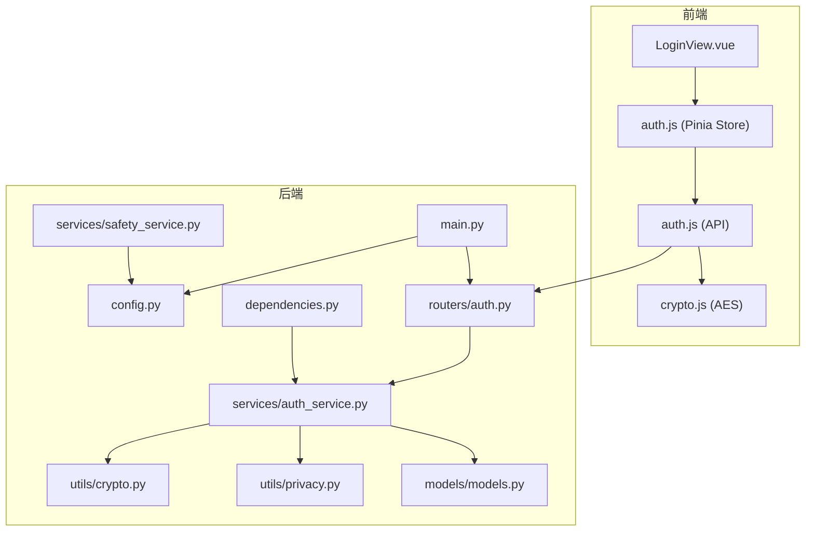
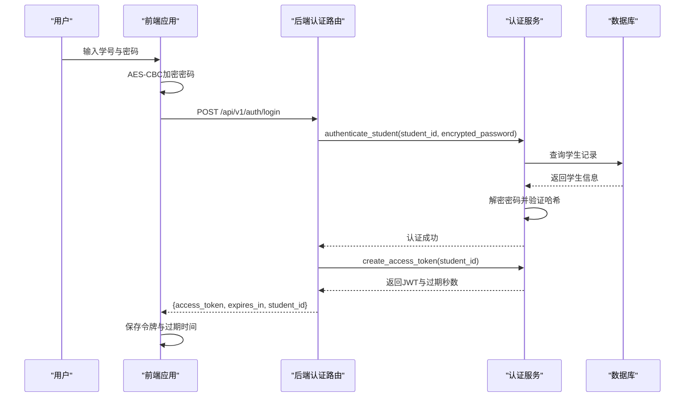
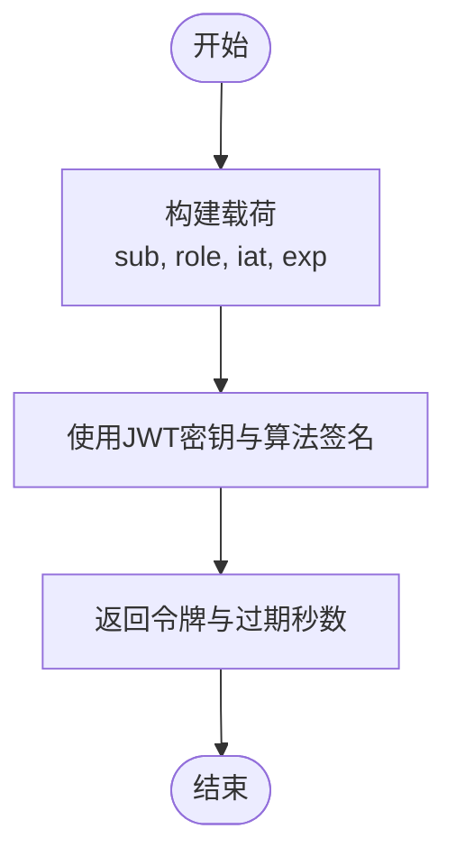
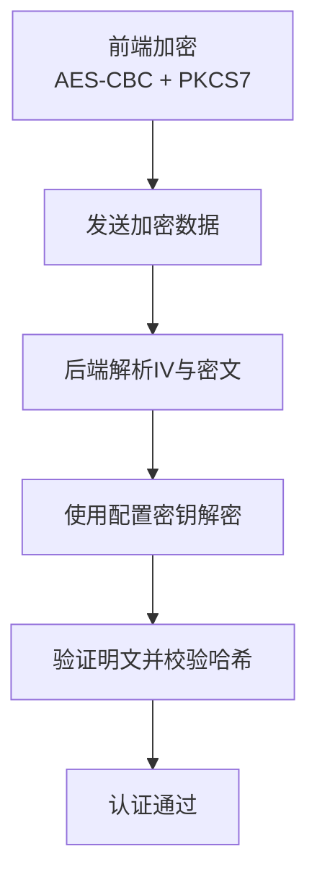
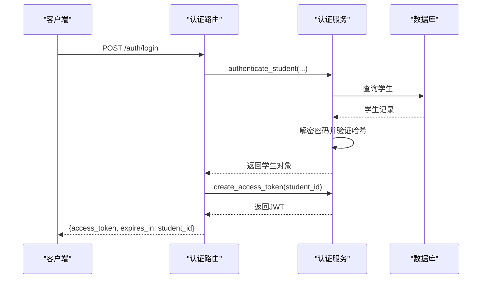
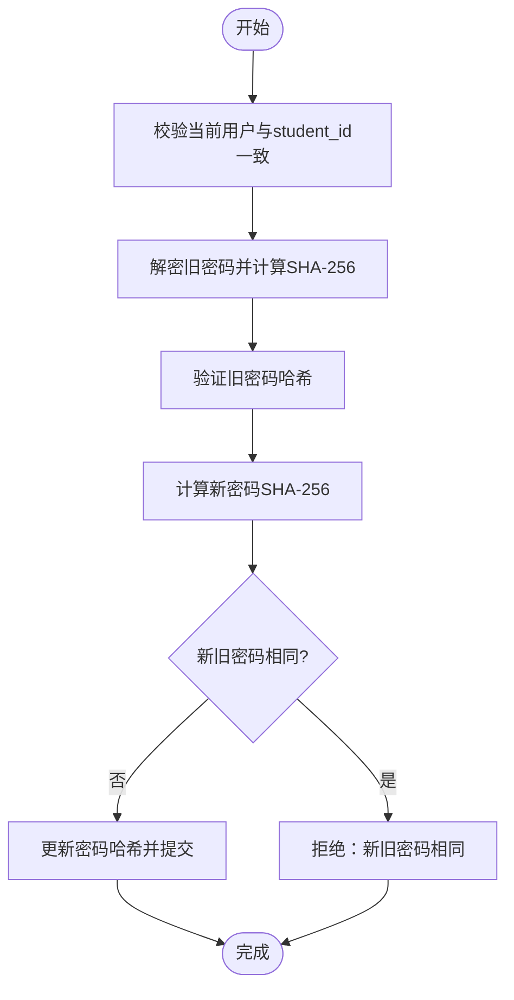
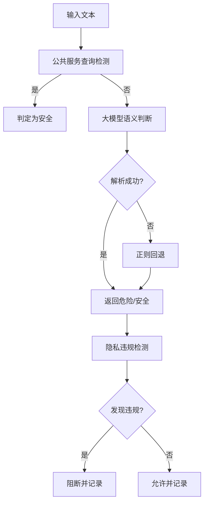
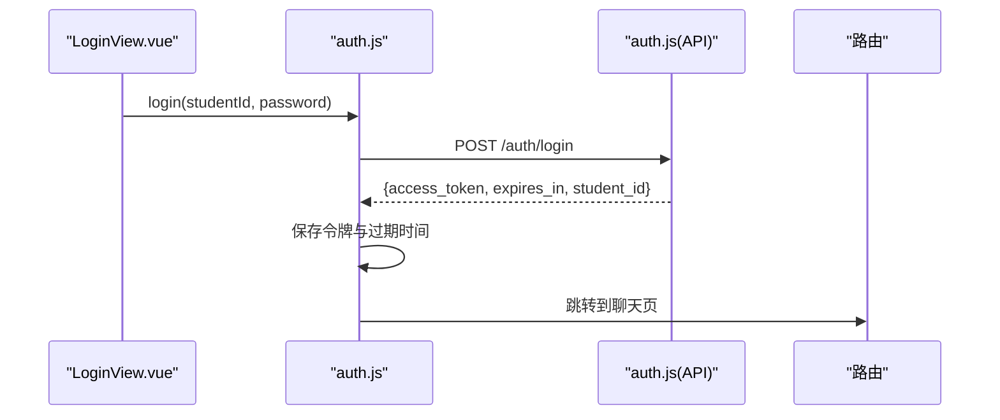
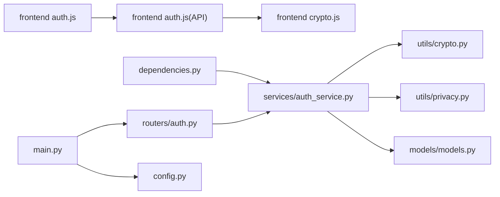

# JWT认证与安全保护

<cite>
**本文引用的文件**
- [service/ai_assistant/app/routers/auth.py](file://service/ai_assistant/app/routers/auth.py)
- [service/ai_assistant/app/services/auth_service.py](file://service/ai_assistant/app/services/auth_service.py)
- [service/ai_assistant/app/utils/crypto.py](file://service/ai_assistant/app/utils/crypto.py)
- [service/ai_assistant/app/schemas/auth.py](file://service/ai_assistant/app/schemas/auth.py)
- [service/ai_assistant/app/config.py](file://service/ai_assistant/app/config.py)
- [service/ai_assistant/app/dependencies.py](file://service/ai_assistant/app/dependencies.py)
- [service/ai_assistant/app/models/models.py](file://service/ai_assistant/app/models/models.py)
- [service/ai_assistant/app/services/safety_service.py](file://service/ai_assistant/app/services/safety_service.py)
- [service/ai_assistant/app/utils/privacy.py](file://service/ai_assistant/app/utils/privacy.py)
- [service/ai_assistant/app/main.py](file://service/ai_assistant/app/main.py)
- [frontend/ai_assistant/src/stores/auth.js](file://frontend/ai_assistant/src/stores/auth.js)
- [frontend/ai_assistant/src/api/auth.js](file://frontend/ai_assistant/src/api/auth.js)
- [frontend/ai_assistant/src/utils/crypto.js](file://frontend/ai_assistant/src/utils/crypto.js)
- [frontend/ai_assistant/src/views/LoginView.vue](file://frontend/ai_assistant/src/views/LoginView.vue)
</cite>

## 目录
1. [简介](#简介)
2. [项目结构](#项目结构)
3. [核心组件](#核心组件)
4. [架构总览](#架构总览)
5. [详细组件分析](#详细组件分析)
6. [依赖关系分析](#依赖关系分析)
7. [性能考虑](#性能考虑)
8. [故障排除指南](#故障排除指南)
9. [结论](#结论)
10. [附录](#附录)

## 简介
本文件面向AI校园助手的JWT认证与安全保护功能，系统性阐述身份认证机制、权限管理、安全防护策略与数据隐私保护。文档覆盖JWT令牌生成、验证、刷新与失效处理流程，解释用户角色管理、访问权限控制与数据安全过滤机制，并提供内容安全检查、隐私数据保护与危险内容检测的实现方法。最后给出认证流程示例、安全配置指南以及开发者最佳实践与漏洞防护策略。

## 项目结构
后端采用FastAPI + SQLAlchemy异步ORM，前端基于Vue 3 + Pinia + Vite。认证与安全相关代码主要分布在后端的路由、服务、工具与配置模块，以及前端的状态管理与API封装。

**图表来源**
- [service/ai_assistant/app/main.py:1-86](file://service/ai_assistant/app/main.py#L1-L86)
- [service/ai_assistant/app/routers/auth.py:1-102](file://service/ai_assistant/app/routers/auth.py#L1-L102)
- [service/ai_assistant/app/services/auth_service.py:1-253](file://service/ai_assistant/app/services/auth_service.py#L1-L253)
- [service/ai_assistant/app/utils/crypto.py:1-73](file://service/ai_assistant/app/utils/crypto.py#L1-L73)
- [service/ai_assistant/app/utils/privacy.py:1-23](file://service/ai_assistant/app/utils/privacy.py#L1-L23)
- [service/ai_assistant/app/models/models.py:1-660](file://service/ai_assistant/app/models/models.py#L1-L660)
- [service/ai_assistant/app/services/safety_service.py:1-163](file://service/ai_assistant/app/services/safety_service.py#L1-L163)
- [frontend/ai_assistant/src/views/LoginView.vue:1-343](file://frontend/ai_assistant/src/views/LoginView.vue#L1-L343)
- [frontend/ai_assistant/src/stores/auth.js:1-77](file://frontend/ai_assistant/src/stores/auth.js#L1-L77)
- [frontend/ai_assistant/src/api/auth.js:1-36](file://frontend/ai_assistant/src/api/auth.js#L1-L36)
- [frontend/ai_assistant/src/utils/crypto.js:1-40](file://frontend/ai_assistant/src/utils/crypto.js#L1-L40)

**章节来源**
- [service/ai_assistant/app/main.py:1-86](file://service/ai_assistant/app/main.py#L1-L86)
- [frontend/ai_assistant/src/views/LoginView.vue:1-343](file://frontend/ai_assistant/src/views/LoginView.vue#L1-L343)

## 核心组件
- JWT与认证服务：负责令牌签发、解码与验证、学生与管理员认证、密码变更等。
- 传输加密工具：负责前后端一致的AES-CBC密码解密与加密。
- 权限与角色模型：定义管理员角色枚举、状态枚举及与权限控制相关的实体。
- 内容安全服务：基于规则与大模型的危险内容检测与隐私违规检查。
- 隐私保护工具：基于学生ID生成稳定脱敏标识，用于日志与数据关联而不暴露真实ID。
- 前端认证状态管理：负责登录、修改密码、登出与本地存储的令牌管理。
- 配置与CORS：集中管理JWT密钥、算法、过期时间、AES密钥、DID盐值、CORS白名单等。

**章节来源**
- [service/ai_assistant/app/services/auth_service.py:1-253](file://service/ai_assistant/app/services/auth_service.py#L1-L253)
- [service/ai_assistant/app/utils/crypto.py:1-73](file://service/ai_assistant/app/utils/crypto.py#L1-L73)
- [service/ai_assistant/app/models/models.py:28-112](file://service/ai_assistant/app/models/models.py#L28-L112)
- [service/ai_assistant/app/services/safety_service.py:1-163](file://service/ai_assistant/app/services/safety_service.py#L1-L163)
- [service/ai_assistant/app/utils/privacy.py:1-23](file://service/ai_assistant/app/utils/privacy.py#L1-L23)
- [frontend/ai_assistant/src/stores/auth.js:1-77](file://frontend/ai_assistant/src/stores/auth.js#L1-L77)
- [service/ai_assistant/app/config.py:32-44](file://service/ai_assistant/app/config.py#L32-L44)

## 架构总览
系统采用前后端分离的认证架构：前端负责收集学号与密码，使用CryptoJS进行AES-CBC加密后提交至后端；后端使用PyCryptodome解密，验证数据库中的密码哈希，签发JWT令牌；前端将令牌持久化并在后续请求中携带；后端通过依赖注入解析并验证JWT，完成权限控制。

**图表来源**
- [service/ai_assistant/app/routers/auth.py:24-52](file://service/ai_assistant/app/routers/auth.py#L24-L52)
- [service/ai_assistant/app/services/auth_service.py:125-169](file://service/ai_assistant/app/services/auth_service.py#L125-L169)
- [service/ai_assistant/app/services/auth_service.py:45-60](file://service/ai_assistant/app/services/auth_service.py#L45-L60)
- [frontend/ai_assistant/src/stores/auth.js:29-43](file://frontend/ai_assistant/src/stores/auth.js#L29-L43)

## 详细组件分析

### JWT令牌生成与验证
- 令牌载荷包含子(subject)、角色(role)、签发时间(iat)与过期时间(exp)，使用对称算法(HS256)与配置中的密钥签发。
- 学生端与管理员端分别有独立的令牌创建与解码函数，确保角色一致性与安全性。
- 解码阶段严格校验角色字段，防止跨端点使用令牌。

**图表来源**
- [service/ai_assistant/app/services/auth_service.py:45-60](file://service/ai_assistant/app/services/auth_service.py#L45-L60)
- [service/ai_assistant/app/services/auth_service.py:63-75](file://service/ai_assistant/app/services/auth_service.py#L63-L75)

**章节来源**
- [service/ai_assistant/app/services/auth_service.py:45-123](file://service/ai_assistant/app/services/auth_service.py#L45-L123)
- [service/ai_assistant/app/config.py:32-35](file://service/ai_assistant/app/config.py#L32-L35)

### 密码传输加密与解密
- 前端使用CryptoJS进行AES-CBC加密，格式为“iv_base64:ciphertext_base64”，并进行URL安全编码。
- 后端使用PyCryptodome解密，校验IV长度与密文有效性，解密失败直接拒绝认证。
- AES密钥长度支持16/24/32字节，需与前端保持一致。

**图表来源**
- [frontend/ai_assistant/src/utils/crypto.js:26-40](file://frontend/ai_assistant/src/utils/crypto.js#L26-L40)
- [service/ai_assistant/app/utils/crypto.py:39-73](file://service/ai_assistant/app/utils/crypto.py#L39-L73)

**章节来源**
- [frontend/ai_assistant/src/utils/crypto.js:1-40](file://frontend/ai_assistant/src/utils/crypto.js#L1-L40)
- [service/ai_assistant/app/utils/crypto.py:17-73](file://service/ai_assistant/app/utils/crypto.py#L17-L73)

### 用户认证与权限控制
- 学生认证：接收加密密码，解密后与数据库中SHA-256哈希对比，成功后签发学生令牌。
- 管理员认证：校验用户名存在性、账户状态与密码哈希，成功后签发管理员令牌。
- 当前用户依赖：通过Bearer方案获取令牌，解码后返回student_id；管理员端解码后查询管理员实体并校验状态。
- 角色与状态：管理员角色枚举与状态枚举用于精细化权限控制。

**图表来源**
- [service/ai_assistant/app/routers/auth.py:24-52](file://service/ai_assistant/app/routers/auth.py#L24-L52)
- [service/ai_assistant/app/services/auth_service.py:125-169](file://service/ai_assistant/app/services/auth_service.py#L125-L169)
- [service/ai_assistant/app/dependencies.py:56-72](file://service/ai_assistant/app/dependencies.py#L56-L72)

**章节来源**
- [service/ai_assistant/app/routers/auth.py:14-101](file://service/ai_assistant/app/routers/auth.py#L14-L101)
- [service/ai_assistant/app/services/auth_service.py:125-253](file://service/ai_assistant/app/services/auth_service.py#L125-L253)
- [service/ai_assistant/app/dependencies.py:56-108](file://service/ai_assistant/app/dependencies.py#L56-L108)
- [service/ai_assistant/app/models/models.py:28-112](file://service/ai_assistant/app/models/models.py#L28-L112)

### 密码修改流程
- 仅允许当前登录用户修改自己的密码，旧密码需通过解密与哈希验证，新密码不得与旧密码相同。
- 成功后更新数据库中的密码哈希并提交事务。

**图表来源**
- [service/ai_assistant/app/routers/auth.py:61-101](file://service/ai_assistant/app/routers/auth.py#L61-L101)
- [service/ai_assistant/app/services/auth_service.py:173-210](file://service/ai_assistant/app/services/auth_service.py#L173-L210)

**章节来源**
- [service/ai_assistant/app/routers/auth.py:55-101](file://service/ai_assistant/app/routers/auth.py#L55-L101)
- [service/ai_assistant/app/services/auth_service.py:173-210](file://service/ai_assistant/app/services/auth_service.py#L173-L210)

### 内容安全检查与隐私保护
- 危险内容检测：优先使用大模型进行语义判断，若输出格式异常则回退到正则匹配；对公共服务联系方式查询进行豁免，避免误判。
- 隐私违规检测：识别试图查询他人学号的行为，若目标学号与当前用户不同则视为违规。
- 隐私脱敏：基于学生ID与盐值生成固定长度的DID，用于对话日志等场景替代真实ID，保证可追溯性的同时保护隐私。

**图表来源**
- [service/ai_assistant/app/services/safety_service.py:84-144](file://service/ai_assistant/app/services/safety_service.py#L84-L144)
- [service/ai_assistant/app/utils/privacy.py:9-22](file://service/ai_assistant/app/utils/privacy.py#L9-L22)

**章节来源**
- [service/ai_assistant/app/services/safety_service.py:14-163](file://service/ai_assistant/app/services/safety_service.py#L14-L163)
- [service/ai_assistant/app/utils/privacy.py:1-23](file://service/ai_assistant/app/utils/privacy.py#L1-L23)

### 前端认证流程与本地存储
- 登录：前端加密密码后调用登录接口，接收令牌与过期时间，写入localStorage。
- 修改密码：加密旧密码与新密码后提交，后端验证通过后返回成功。
- 登出：清除localStorage中的令牌与过期时间。
- 认证状态：根据localStorage中的令牌与过期时间计算是否已登录。

**图表来源**
- [frontend/ai_assistant/src/views/LoginView.vue:94-121](file://frontend/ai_assistant/src/views/LoginView.vue#L94-L121)
- [frontend/ai_assistant/src/stores/auth.js:29-43](file://frontend/ai_assistant/src/stores/auth.js#L29-L43)
- [frontend/ai_assistant/src/api/auth.js:15-20](file://frontend/ai_assistant/src/api/auth.js#L15-L20)

**章节来源**
- [frontend/ai_assistant/src/stores/auth.js:1-77](file://frontend/ai_assistant/src/stores/auth.js#L1-L77)
- [frontend/ai_assistant/src/api/auth.js:1-36](file://frontend/ai_assistant/src/api/auth.js#L1-L36)
- [frontend/ai_assistant/src/views/LoginView.vue:1-343](file://frontend/ai_assistant/src/views/LoginView.vue#L1-L343)

## 依赖关系分析
- 路由依赖服务层进行认证与令牌签发；服务层依赖配置、模型与工具模块。
- 依赖注入提供当前用户与管理员的解析能力，确保中间件式权限控制。
- 前端通过Pinia Store管理认证状态，API层封装认证接口，工具层负责加密。

**图表来源**
- [service/ai_assistant/app/routers/auth.py:14-19](file://service/ai_assistant/app/routers/auth.py#L14-L19)
- [service/ai_assistant/app/services/auth_service.py:11-14](file://service/ai_assistant/app/services/auth_service.py#L11-L14)
- [service/ai_assistant/app/dependencies.py:16-16](file://service/ai_assistant/app/dependencies.py#L16-L16)
- [frontend/ai_assistant/src/stores/auth.js:10-11](file://frontend/ai_assistant/src/stores/auth.js#L10-L11)
- [frontend/ai_assistant/src/api/auth.js:6-6](file://frontend/ai_assistant/src/api/auth.js#L6-L6)
- [frontend/ai_assistant/src/utils/crypto.js:9-9](file://frontend/ai_assistant/src/utils/crypto.js#L9-L9)
- [service/ai_assistant/app/main.py:13-14](file://service/ai_assistant/app/main.py#L13-L14)
- [service/ai_assistant/app/config.py:6-11](file://service/ai_assistant/app/config.py#L6-L11)

**章节来源**
- [service/ai_assistant/app/routers/auth.py:14-19](file://service/ai_assistant/app/routers/auth.py#L14-L19)
- [service/ai_assistant/app/services/auth_service.py:11-14](file://service/ai_assistant/app/services/auth_service.py#L11-L14)
- [service/ai_assistant/app/dependencies.py:16-16](file://service/ai_assistant/app/dependencies.py#L16-L16)
- [frontend/ai_assistant/src/stores/auth.js:10-11](file://frontend/ai_assistant/src/stores/auth.js#L10-L11)
- [frontend/ai_assistant/src/api/auth.js:6-6](file://frontend/ai_assistant/src/api/auth.js#L6-L6)
- [frontend/ai_assistant/src/utils/crypto.js:9-9](file://frontend/ai_assistant/src/utils/crypto.js#L9-L9)
- [service/ai_assistant/app/main.py:13-14](file://service/ai_assistant/app/main.py#L13-L14)
- [service/ai_assistant/app/config.py:6-11](file://service/ai_assistant/app/config.py#L6-L11)

## 性能考虑
- JWT签发与解码为CPU轻量操作，性能瓶颈通常在数据库查询与密码哈希验证。
- 建议在高并发场景下启用连接池与异步数据库驱动，减少I/O等待。
- 前端本地存储令牌避免重复网络往返，但需注意过期时间与自动刷新策略。
- 安全检测建议缓存热点查询结果，降低LLM调用频率。

## 故障排除指南
- 认证失败（401）：检查AES密钥是否与前端一致、令牌是否过期、角色是否匹配。
- 密码错误：确认加密格式正确、IV长度为16字节、数据库中哈希值未被篡改。
- 管理员权限不足：确认管理员状态为激活且具备相应角色。
- CORS问题：核对配置中的CORS允许来源，生产环境应限制为具体域名。
- 不安全默认密钥：启动时会发出警告，务必在.env中替换为强密钥。

**章节来源**
- [service/ai_assistant/app/main.py:25-33](file://service/ai_assistant/app/main.py#L25-L33)
- [service/ai_assistant/app/utils/crypto.py:17-22](file://service/ai_assistant/app/utils/crypto.py#L17-L22)
- [service/ai_assistant/app/dependencies.py:56-108](file://service/ai_assistant/app/dependencies.py#L56-L108)

## 结论
本系统通过“前端AES-CBC加密 + 后端JWT签发”的组合实现了端到端的安全认证，配合管理员角色与状态控制、内容安全检测与隐私脱敏，形成较为完整的安全防护体系。建议在生产环境中严格配置密钥与CORS，持续监控与审计认证与安全事件，确保系统长期稳定运行。

## 附录

### 安全配置清单
- JWT密钥与算法：在配置中设置强密钥与合理过期时间。
- AES密钥：前后端密钥一致，长度符合要求。
- CORS白名单：生产环境限制为可信域名。
- 环境变量：确保敏感配置来自.env而非硬编码。

**章节来源**
- [service/ai_assistant/app/config.py:32-44](file://service/ai_assistant/app/config.py#L32-L44)
- [service/ai_assistant/app/main.py:18-33](file://service/ai_assistant/app/main.py#L18-L33)

### 开发者最佳实践
- 令牌仅通过HTTPS传输，避免明文泄露。
- 定期轮换JWT与AES密钥，建立密钥生命周期管理。
- 对所有外部API调用增加超时与重试策略，避免阻塞。
- 在日志中避免输出完整令牌与敏感信息。
- 对输入参数进行严格校验与最小权限原则。