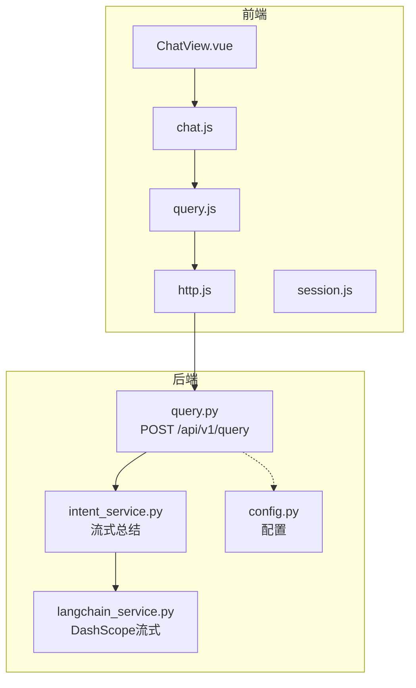
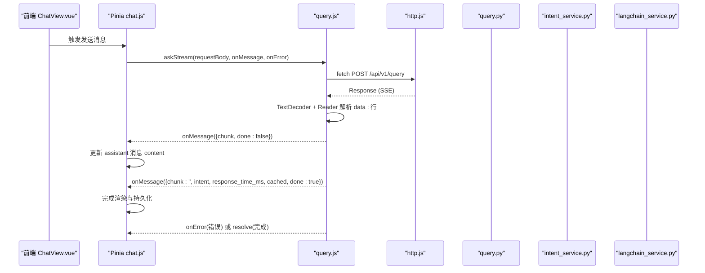
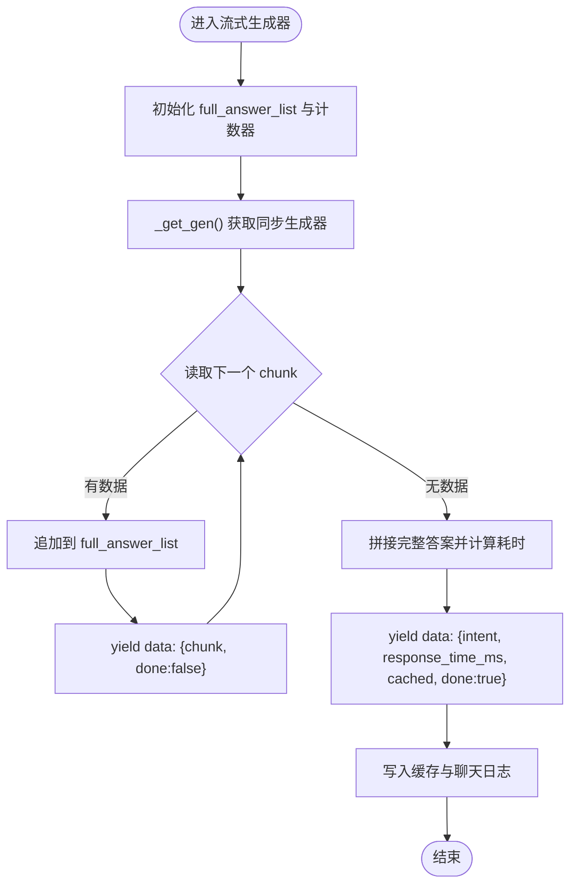
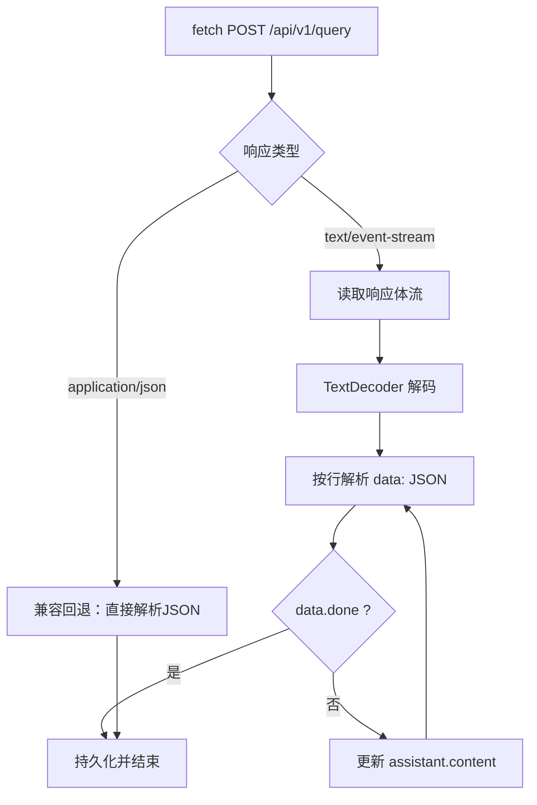
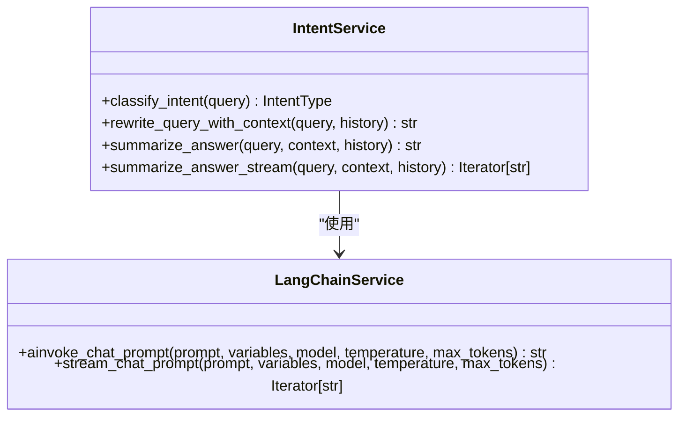
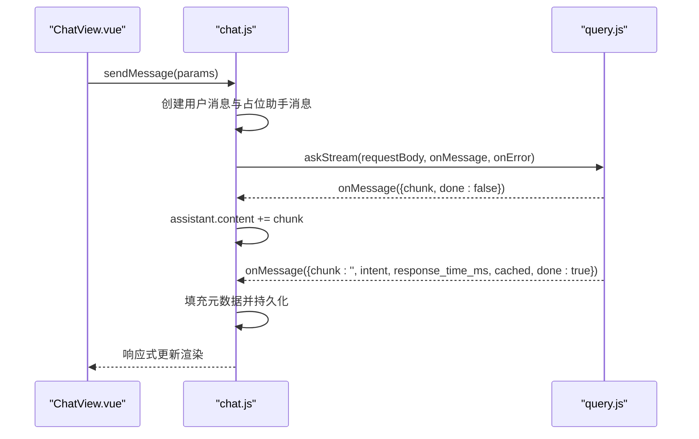
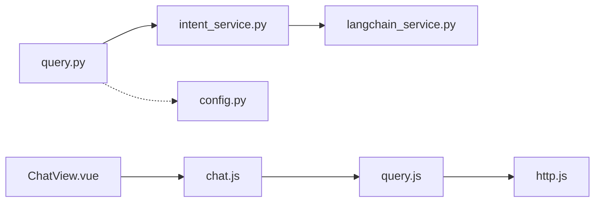

# SSE流式响应

<cite>
**本文档引用的文件**
- [query.py](file://service/ai_assistant/app/routers/query.py)
- [intent_service.py](file://service/ai_assistant/app/services/intent_service.py)
- [langchain_service.py](file://service/ai_assistant/app/services/langchain_service.py)
- [query.js](file://frontend/ai_assistant/src/api/query.js)
- [chat.js](file://frontend/ai_assistant/src/stores/chat.js)
- [ChatView.vue](file://frontend/ai_assistant/src/views/ChatView.vue)
- [http.js](file://frontend/ai_assistant/src/api/http.js)
- [session.js](file://frontend/ai_assistant/src/utils/session.js)
- [config.py](file://service/ai_assistant/app/config.py)
- [README.md](file://README.md)
</cite>

## 目录
1. [简介](#简介)
2. [项目结构](#项目结构)
3. [核心组件](#核心组件)
4. [架构总览](#架构总览)
5. [详细组件分析](#详细组件分析)
6. [依赖关系分析](#依赖关系分析)
7. [性能考虑](#性能考虑)
8. [故障排查指南](#故障排查指南)
9. [结论](#结论)
10. [附录](#附录)

## 简介
本文件聚焦于AI校园助手的SSE（Server-Sent Events）流式响应能力，系统性阐述后端FastAPI的流式生成器、前端fetch流式读取、前后端交互协议、错误处理与重连策略，以及在长文本生成、逐步推理与实时反馈场景下的最佳实践。文档旨在帮助开发者正确集成与优化SSE，提升用户体验与系统稳定性。

## 项目结构
- 后端（FastAPI）：统一查询路由负责多模态输入解码、安全检查、意图分类、查询执行、LLM总结与缓存，并通过StreamingResponse输出SSE事件流。
- 前端（Vue 3 + Vite）：通过自定义askStream方法读取SSE，逐字渲染，支持错误兜底与状态管理。

图表来源
- [query.py:198-745](file://service/ai_assistant/app/routers/query.py#L198-L745)
- [intent_service.py:326-346](file://service/ai_assistant/app/services/intent_service.py#L326-L346)
- [langchain_service.py:206-278](file://service/ai_assistant/app/services/langchain_service.py#L206-L278)
- [query.js:28-141](file://frontend/ai_assistant/src/api/query.js#L28-L141)
- [chat.js:133-230](file://frontend/ai_assistant/src/stores/chat.js#L133-L230)
- [http.js:10-49](file://frontend/ai_assistant/src/api/http.js#L10-L49)
- [session.js:14-31](file://frontend/ai_assistant/src/utils/session.js#L14-L31)
- [config.py:6-113](file://service/ai_assistant/app/config.py#L6-L113)

章节来源
- [README.md:1-104](file://README.md#L1-L104)

## 核心组件
- 后端SSE响应构造：统一SSE响应头与媒体类型，避免反向代理缓冲与改写。
- 流式生成器：在StreamingResponse生命周期内，将LLM增量输出以SSE事件推送，最后发送完成包。
- 前端SSE读取：fetch + TextDecoder + Reader循环解析data:行，容错兼容JSON回退与网关改写。
- 状态管理：Pinia store在消息列表中预置占位消息，流式增量拼接到content，完成时填充intent、耗时、缓存标记等元数据。
- 错误映射：后端将异常映射为用户可见的友好提示，前端统一解析HTTP状态与错误消息。

章节来源
- [query.py:115-125](file://service/ai_assistant/app/routers/query.py#L115-L125)
- [query.py:659-745](file://service/ai_assistant/app/routers/query.py#L659-L745)
- [query.js:28-141](file://frontend/ai_assistant/src/api/query.js#L28-L141)
- [chat.js:133-230](file://frontend/ai_assistant/src/stores/chat.js#L133-L230)

## 架构总览
SSE流式响应的关键路径如下：前端发起POST请求，后端在StreamingResponse中启动流式生成器，逐块产出SSE事件，前端持续解析并渲染，最终完成包携带元数据。

图表来源
- [query.js:28-141](file://frontend/ai_assistant/src/api/query.js#L28-L141)
- [chat.js:133-230](file://frontend/ai_assistant/src/stores/chat.js#L133-L230)
- [http.js:10-49](file://frontend/ai_assistant/src/api/http.js#L10-L49)
- [query.py:198-745](file://service/ai_assistant/app/routers/query.py#L198-L745)
- [intent_service.py:326-346](file://service/ai_assistant/app/services/intent_service.py#L326-L346)
- [langchain_service.py:206-278](file://service/ai_assistant/app/services/langchain_service.py#L206-L278)

## 详细组件分析

### 后端SSE生成器与事件流
- SSE响应头：设置媒体类型为text/event-stream，禁用缓存与变换，保持连接常开。
- 生成器逻辑：在StreamingResponse生命周期内，通过LangChain的流式接口逐块产出LLM增量输出；每块以data: JSON形式发送，最后发送包含intent、耗时、缓存标记与done=true的完成包。
- 完成后处理：在流结束后写入缓存与聊天日志，避免与长连接持有冲突。

图表来源
- [query.py:659-745](file://service/ai_assistant/app/routers/query.py#L659-L745)
- [intent_service.py:326-346](file://service/ai_assistant/app/services/intent_service.py#L326-L346)
- [langchain_service.py:206-278](file://service/ai_assistant/app/services/langchain_service.py#L206-L278)

章节来源
- [query.py:115-125](file://service/ai_assistant/app/routers/query.py#L115-L125)
- [query.py:659-745](file://service/ai_assistant/app/routers/query.py#L659-L745)

### 前端SSE读取与渲染
- fetch请求：携带Authorization头，POST到后端统一查询端点。
- SSE解析：使用TextDecoder与Reader逐块读取，按行解析data: JSON，容错支持网关改写格式与JSON回退。
- 状态更新：onMessage回调中，非完成包增量拼接到assistant消息content，完成包填充intent、耗时、缓存标记等元数据。
- 错误处理：捕获服务端错误与网络异常，统一映射为用户可读提示。

图表来源
- [query.js:28-141](file://frontend/ai_assistant/src/api/query.js#L28-L141)
- [chat.js:133-230](file://frontend/ai_assistant/src/stores/chat.js#L133-L230)

章节来源
- [query.js:28-141](file://frontend/ai_assistant/src/api/query.js#L28-L141)
- [chat.js:133-230](file://frontend/ai_assistant/src/stores/chat.js#L133-L230)

### 意图分类与流式总结
- 意图分类：基于LangChain与DashScope，将查询归类为structured/vector/hybrid/smalltalk。
- 流式总结：将问题、上下文与历史裁剪后传入流式LLM，逐块返回增量内容，最终完成包携带intent与耗时等元数据。

图表来源
- [intent_service.py:218-346](file://service/ai_assistant/app/services/intent_service.py#L218-L346)
- [langchain_service.py:139-278](file://service/ai_assistant/app/services/langchain_service.py#L139-L278)

章节来源
- [intent_service.py:218-346](file://service/ai_assistant/app/services/intent_service.py#L218-L346)
- [langchain_service.py:139-278](file://service/ai_assistant/app/services/langchain_service.py#L139-L278)

### 前端状态管理与UI渲染
- 会话与消息：Pinia store维护sessions、activeSessionId、loadingStates与currentMessages。
- 发送消息：自动创建用户消息与占位助手消息，调用askStream，增量更新content，完成后填充元数据。
- UI渲染：ChatView根据消息content进行Markdown渲染，显示意图标签、缓存标记与响应耗时。

图表来源
- [chat.js:133-230](file://frontend/ai_assistant/src/stores/chat.js#L133-L230)
- [query.js:28-141](file://frontend/ai_assistant/src/api/query.js#L28-L141)
- [ChatView.vue:1-1168](file://frontend/ai_assistant/src/views/ChatView.vue#L1-L1168)

章节来源
- [chat.js:133-230](file://frontend/ai_assistant/src/stores/chat.js#L133-L230)
- [ChatView.vue:1-1168](file://frontend/ai_assistant/src/views/ChatView.vue#L1-L1168)

## 依赖关系分析
- 后端依赖链：query.py路由依赖intent_service.py进行意图与流式总结，intent_service.py依赖langchain_service.py进行DashScope调用与流式输出。
- 前端依赖链：query.js依赖http.js进行统一拦截与鉴权，chat.js依赖query.js进行SSE调用，ChatView.vue依赖chat.js进行状态与渲染。
- 配置依赖：config.py提供LLM模型、DashScope参数与缓存TTL等全局配置。

图表来源
- [query.py:198-745](file://service/ai_assistant/app/routers/query.py#L198-L745)
- [intent_service.py:326-346](file://service/ai_assistant/app/services/intent_service.py#L326-L346)
- [langchain_service.py:206-278](file://service/ai_assistant/app/services/langchain_service.py#L206-L278)
- [query.js:28-141](file://frontend/ai_assistant/src/api/query.js#L28-L141)
- [chat.js:133-230](file://frontend/ai_assistant/src/stores/chat.js#L133-L230)
- [ChatView.vue:1-1168](file://frontend/ai_assistant/src/views/ChatView.vue#L1-L1168)
- [config.py:6-113](file://service/ai_assistant/app/config.py#L6-L113)

章节来源
- [config.py:6-113](file://service/ai_assistant/app/config.py#L6-L113)

## 性能考虑
- 流式生成与连接释放：在StreamingResponse前主动回滚数据库会话，避免长连接占用数据库连接池。
- 线程与异步：使用asyncio.to_thread将阻塞式生成器包装为非阻塞，提升并发能力。
- 上下文裁剪：对历史与上下文进行字符级裁剪，减少LLM输入长度，提高吞吐与稳定性。
- 缓存策略：对非敏感查询进行缓存，命中时直接返回SSE模拟流，缩短响应时间。
- 反向代理：生产环境建议关闭Nginx缓冲，启用chunked_transfer_encoding，确保SSE实时性。

章节来源
- [query.py:654-658](file://service/ai_assistant/app/routers/query.py#L654-L658)
- [query.py:304-308](file://service/ai_assistant/app/routers/query.py#L304-L308)
- [intent_service.py:163-210](file://service/ai_assistant/app/services/intent_service.py#L163-L210)
- [README.md:67-104](file://README.md#L67-L104)

## 故障排查指南
- 前端SSE解析失败
  - 现象：页面一直显示“正在思考”，无增量输出。
  - 排查：确认后端SSE响应头与媒体类型正确；检查反向代理是否开启缓冲；确认fetch读取逻辑是否正确解析data:行。
  - 参考：[query.js:51-141](file://frontend/ai_assistant/src/api/query.js#L51-L141)
- 后端流式生成异常
  - 现象：SSE中途中断或报错。
  - 排查：查看后端日志与异常映射，确认LLM调用状态；检查数据库会话是否提前释放；确认完成包是否发送。
  - 参考：[query.py:740-745](file://service/ai_assistant/app/routers/query.py#L740-L745)
- 错误提示不友好
  - 现象：前端显示技术性错误。
  - 排查：核对后端异常映射与HTTP状态码；前端resolveErrorMessage是否正确处理。
  - 参考：[query.py:142-151](file://service/ai_assistant/app/routers/query.py#L142-L151), [chat.js:235-257](file://frontend/ai_assistant/src/stores/chat.js#L235-L257)
- 缓存命中但无流式
  - 现象：命中缓存后仍无增量输出。
  - 排查：确认后端缓存命中分支是否返回SSE模拟流；检查前端是否正确处理done=true。
  - 参考：[query.py:304-308](file://service/ai_assistant/app/routers/query.py#L304-L308)

章节来源
- [query.js:51-141](file://frontend/ai_assistant/src/api/query.js#L51-L141)
- [query.py:142-151](file://service/ai_assistant/app/routers/query.py#L142-L151)
- [query.py:740-745](file://service/ai_assistant/app/routers/query.py#L740-L745)
- [chat.js:235-257](file://frontend/ai_assistant/src/stores/chat.js#L235-L257)

## 结论
SSE流式响应在AI校园助手中的应用，实现了接近实时的文本生成体验。后端通过StreamingResponse与LangChain流式接口，前端通过fetch与TextDecoder解析，形成稳定的双向实时通道。配合上下文裁剪、缓存与反向代理优化，系统在长文本与复杂推理场景下仍能保持流畅与稳定。建议在生产环境中严格配置反向代理参数，完善错误映射与前端兜底，持续监控SSE连接健康度与响应延迟。

## 附录
- 开发与部署要点
  - 反向代理：关闭缓冲、禁用缓存、设置Connection为空、启用chunked_transfer_encoding。
  - 前端：确保Authorization头正确传递，SSE解析容错处理。
  - 后端：合理设置LLM模型与输入裁剪阈值，避免超长上下文导致性能下降。
- 相关文件路径
  - 后端路由与SSE：[query.py:198-745](file://service/ai_assistant/app/routers/query.py#L198-L745)
  - 流式总结：[intent_service.py:326-346](file://service/ai_assistant/app/services/intent_service.py#L326-L346)
  - LLM流式适配：[langchain_service.py:206-278](file://service/ai_assistant/app/services/langchain_service.py#L206-L278)
  - 前端SSE读取：[query.js:28-141](file://frontend/ai_assistant/src/api/query.js#L28-L141)
  - 前端状态管理：[chat.js:133-230](file://frontend/ai_assistant/src/stores/chat.js#L133-L230)
  - 前端HTTP拦截：[http.js:10-49](file://frontend/ai_assistant/src/api/http.js#L10-L49)
  - 会话与设备ID：[session.js:14-31](file://frontend/ai_assistant/src/utils/session.js#L14-L31)
  - 配置参数：[config.py:6-113](file://service/ai_assistant/app/config.py#L6-L113)
  - 项目说明：[README.md:1-104](file://README.md#L1-L104)