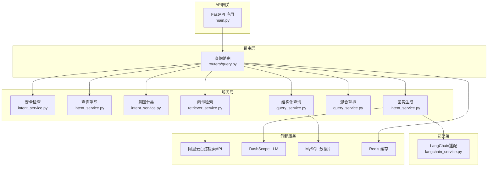
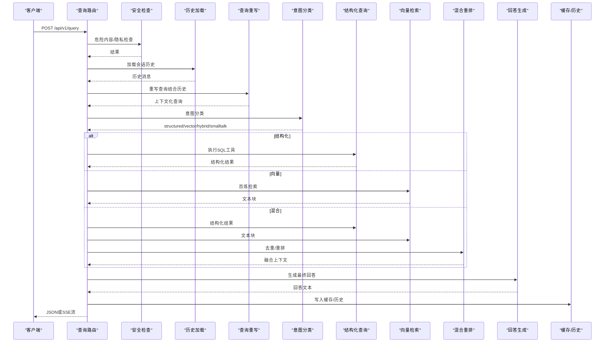
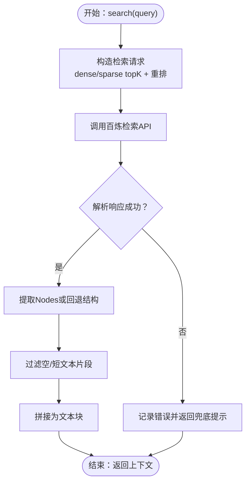
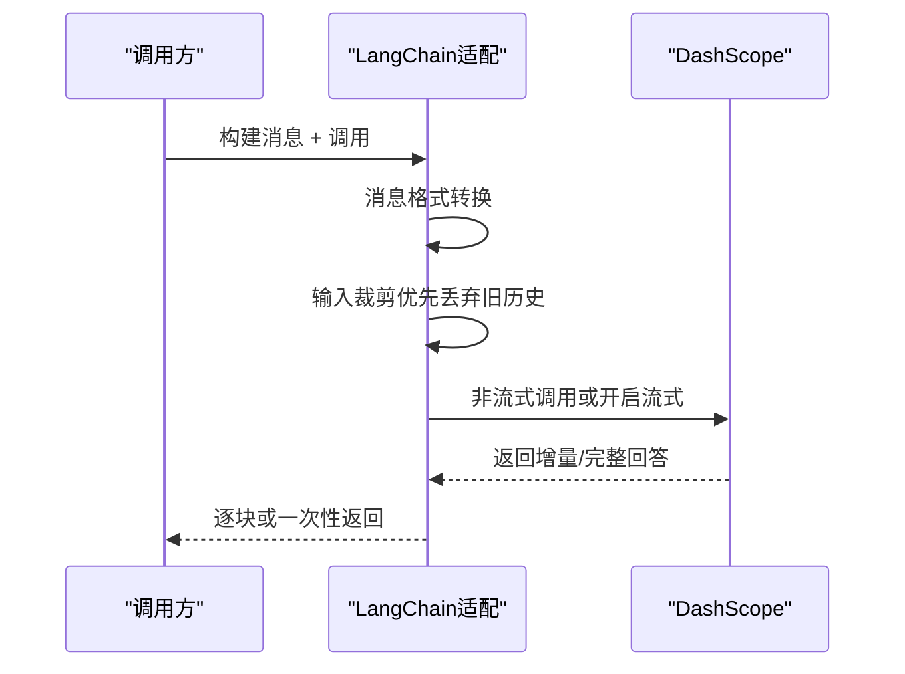
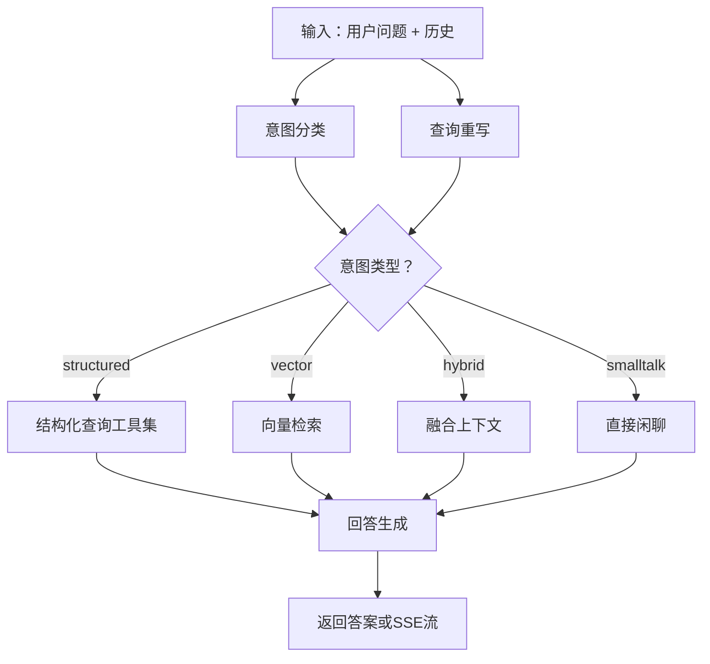
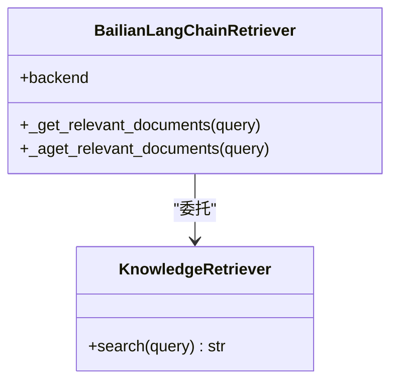
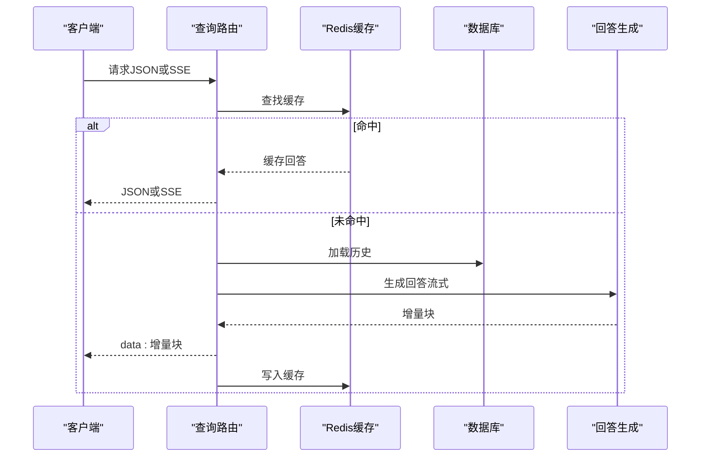
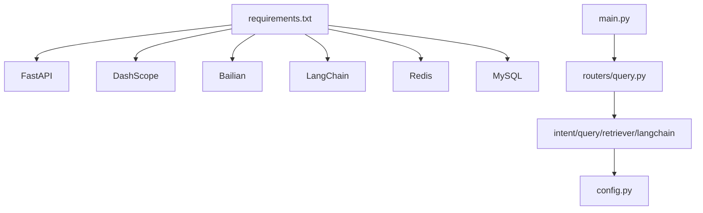

# 向量检索与RAG

<cite>
**本文档引用的文件**
- [retriever_service.py](file://service/ai_assistant/app/services/retriever_service.py)
- [langchain_service.py](file://service/ai_assistant/app/services/langchain_service.py)
- [query.py](file://service/ai_assistant/app/routers/query.py)
- [query_service.py](file://service/ai_assistant/app/services/query_service.py)
- [config.py](file://service/ai_assistant/app/config.py)
- [query.py（schemas）](file://service/ai_assistant/app/schemas/query.py)
- [intent_service.py](file://service/ai_assistant/app/services/intent_service.py)
- [models.py](file://service/ai_assistant/app/models/models.py)
- [main.py](file://service/ai_assistant/app/main.py)
- [requirements.txt](file://service/ai_assistant/requirements.txt)
</cite>

## 目录
1. [简介](#简介)
2. [项目结构](#项目结构)
3. [核心组件](#核心组件)
4. [架构总览](#架构总览)
5. [详细组件分析](#详细组件分析)
6. [依赖分析](#依赖分析)
7. [性能考量](#性能考量)
8. [故障排查指南](#故障排查指南)
9. [结论](#结论)
10. [附录](#附录)

## 简介
本文件面向AI校园助手的向量检索与RAG（检索增强生成）能力，系统性阐述知识库构建、语义搜索、上下文构建与RAG工作流程。文档重点覆盖以下方面：
- 向量检索机制：基于阿里云百炼检索API的dense/sparse双路召回与重排。
- RAG工作流程：检索结果与结构化数据融合、提示词模板设计与生成质量控制。
- LangChain集成与DashScope模型应用：消息格式转换、流式与非流式调用、输入裁剪与代理策略。
- 流式响应实现：SSE事件流与增量输出。
- 开发者优化建议：向量数据库选择、检索算法优化与性能调优。

## 项目结构
后端采用FastAPI + SQLAlchemy + Redis + DashScope + 百炼检索API的组合，核心服务位于service/ai_assistant/app目录，路由集中在routers/query.py，检索与RAG相关的关键模块包括：
- 检索服务：retriever_service.py（百炼检索封装）
- RAG与提示词：intent_service.py、query_service.py（结构化工具规划、提示模板、LangChain链）
- LLM适配层：langchain_service.py（DashScope调用、消息裁剪、流式输出）
- 配置与路由：config.py、query.py（意图枚举、查询端点）
- 数据模型：models.py（MySQL数据库模型）

图表来源
- [main.py:1-86](file://service/ai_assistant/app/main.py#L1-L86)
- [query.py:198-788](file://service/ai_assistant/app/routers/query.py#L198-L788)
- [intent_service.py:1-346](file://service/ai_assistant/app/services/intent_service.py#L1-L346)
- [query_service.py:1-800](file://service/ai_assistant/app/services/query_service.py#L1-L800)
- [retriever_service.py:1-168](file://service/ai_assistant/app/services/retriever_service.py#L1-L168)
- [langchain_service.py:1-278](file://service/ai_assistant/app/services/langchain_service.py#L1-L278)

章节来源
- [main.py:1-86](file://service/ai_assistant/app/main.py#L1-L86)
- [query.py:198-788](file://service/ai_assistant/app/routers/query.py#L198-L788)

## 核心组件
- 百炼知识检索器：封装阿里云百炼检索API，支持dense/sparse召回、重排与最小片段长度过滤。
- LangChain适配器：统一DashScope调用，提供非流式与流式两种生成路径，内置消息裁剪与代理策略。
- 意图分类与回答生成：基于提示模板的意图分类、查询重写、上下文裁剪与最终回答生成。
- 结构化查询与混合重排：SQL查询工具集、向量检索结果与结构化结果的去重与重排。
- 查询路由：统一入口，负责多模态输入解码、缓存、安全检查、历史加载、意图分类、查询执行与流式输出。

章节来源
- [retriever_service.py:23-168](file://service/ai_assistant/app/services/retriever_service.py#L23-L168)
- [langchain_service.py:139-278](file://service/ai_assistant/app/services/langchain_service.py#L139-L278)
- [intent_service.py:218-346](file://service/ai_assistant/app/services/intent_service.py#L218-L346)
- [query_service.py:212-238](file://service/ai_assistant/app/services/query_service.py#L212-L238)
- [query.py:198-788](file://service/ai_assistant/app/routers/query.py#L198-L788)

## 架构总览
RAG工作流从统一查询端点进入，经过安全与隐私检查、历史加载与查询重写，再根据意图选择结构化查询、向量检索或混合路径，随后进行上下文构建与最终回答生成，最后写入缓存与会话历史。

图表来源
- [query.py:207-745](file://service/ai_assistant/app/routers/query.py#L207-L745)
- [intent_service.py:218-346](file://service/ai_assistant/app/services/intent_service.py#L218-L346)
- [query_service.py:212-238](file://service/ai_assistant/app/services/query_service.py#L212-L238)
- [retriever_service.py:46-135](file://service/ai_assistant/app/services/retriever_service.py#L46-L135)
- [langchain_service.py:139-278](file://service/ai_assistant/app/services/langchain_service.py#L139-L278)

## 详细组件分析

### 向量检索服务（百炼）
- 功能要点
  - 初始化百炼客户端（鉴权与endpoint配置）
  - 构造检索请求：dense/sparse topK、启用重排、rerank模型与阈值
  - 解析响应：统一为普通字典，提取Nodes或回退旧结构
  - 过滤与拼接：最小片段长度阈值、去除空文本
  - 错误处理：API失败与异常捕获，返回兜底提示
- 关键参数
  - dense_similarity_top_k、sparse_similarity_top_k
  - enable_reranking、rerank模型、rerank_min_score、rerank_top_n
- 输出
  - 拼接后的文本块字符串，供后续RAG使用

图表来源
- [retriever_service.py:46-135](file://service/ai_assistant/app/services/retriever_service.py#L46-L135)

章节来源
- [retriever_service.py:23-168](file://service/ai_assistant/app/services/retriever_service.py#L23-L168)

### LangChain适配与DashScope集成
- 功能要点
  - 消息格式转换：System/Human/AI消息到DashScope格式
  - 输入裁剪：优先丢弃旧历史，再裁剪最后一条消息，确保总字符不超过阈值
  - 非流式调用：异步线程池调用DashScope，校验状态码并返回完整回答
  - 流式调用：迭代增量输出，支持代理忽略与会话关闭
- 配置项
  - DASHSCOPE_MAX_INPUT_CHARS、ALI_API_KEY、DASHSCOPE_TRUST_ENV_PROXY
- 适用模型
  - 意图分类、查询重写、最终回答生成、工具规划等

图表来源
- [langchain_service.py:128-278](file://service/ai_assistant/app/services/langchain_service.py#L128-L278)

章节来源
- [langchain_service.py:1-278](file://service/ai_assistant/app/services/langchain_service.py#L1-L278)
- [config.py:48-84](file://service/ai_assistant/app/config.py#L48-L84)

### 意图分类与回答生成（RAG提示词模板）
- 意图分类
  - 分类标签：structured、vector、hybrid、smalltalk
  - 使用提示模板与LLM进行意图判别，失败时回退为vector
- 查询重写
  - 结合最近历史，生成独立、完整的查询语句，补充缺失信息
- 回答生成
  - 构建摘要提示模板，包含日期、规则与格式化约束
  - 对历史、问题与上下文进行裁剪，避免越界
  - 支持非流式与流式两种生成路径

图表来源
- [intent_service.py:218-346](file://service/ai_assistant/app/services/intent_service.py#L218-L346)
- [query_service.py:150-209](file://service/ai_assistant/app/services/query_service.py#L150-L209)

章节来源
- [intent_service.py:1-346](file://service/ai_assistant/app/services/intent_service.py#L1-L346)
- [query.py（schemas）:8-33](file://service/ai_assistant/app/schemas/query.py#L8-L33)

### 结构化查询与混合重排
- 结构化工具
  - 成绩、课表、选课、个人信息、学术概览、部门与专业目录、教师通讯录等
  - 自动解析学期ID、周次、去重与紧凑化输出
- 混合重排
  - 接收向量检索与应用侧候选，执行去重与重排，输出最相关文本
- LangChain集成
  - 通过BailianLangChainRetriever包装现有检索器，适配LangChain文档格式

图表来源
- [query_service.py:212-238](file://service/ai_assistant/app/services/query_service.py#L212-L238)
- [retriever_service.py:46-135](file://service/ai_assistant/app/services/retriever_service.py#L46-L135)

章节来源
- [query_service.py:574-800](file://service/ai_assistant/app/services/query_service.py#L574-L800)
- [query_service.py:161-176](file://service/ai_assistant/app/services/query_service.py#L161-L176)
- [query_service.py:212-238](file://service/ai_assistant/app/services/query_service.py#L212-L238)

### 查询路由与流式响应
- 多模态输入
  - 文本、Base64图像、Base64音频，分别转文本后合并
- 缓存与历史
  - Redis缓存命中直接返回；会话隔离历史按DID+会话ID存储
- 安全与隐私
  - 危险内容拦截与隐私违规（查询他人学号）阻断
- 意图修正
  - 根据实际返回上下文动态修正意图（vector/structured/hybrid）
- 流式输出
  - SSE事件流，增量输出回答块，最后发送完成元数据

图表来源
- [query.py:198-745](file://service/ai_assistant/app/routers/query.py#L198-L745)

章节来源
- [query.py:198-788](file://service/ai_assistant/app/routers/query.py#L198-L788)

## 依赖分析
- 外部依赖
  - FastAPI、SQLAlchemy、aiomysql、redis、dashscope、alibabacloud-bailian20231229、langchain-core、loguru
- 内部模块耦合
  - 路由依赖服务层（安全、意图、结构化、向量、混合、生成）
  - 服务层依赖配置与日志
  - LangChain适配器作为LLM调用统一出口

图表来源
- [requirements.txt:1-22](file://service/ai_assistant/requirements.txt#L1-L22)
- [main.py:13-86](file://service/ai_assistant/app/main.py#L13-L86)

章节来源
- [requirements.txt:1-22](file://service/ai_assistant/requirements.txt#L1-L22)
- [main.py:1-86](file://service/ai_assistant/app/main.py#L1-L86)

## 性能考量
- 检索性能
  - 控制dense/sparse topK与rerank_top_n，避免过度召回导致上下文过长
  - 启用重排与最小分数阈值，提升相关性
- 上下文裁剪
  - 优先丢弃旧历史，再裁剪最后一条消息，确保LLM输入在阈值内
  - 对结构化上下文采用头尾保留策略，减少关键信息丢失
- 流式输出
  - SSE事件流降低反向代理缓冲影响，提高实时性
- 缓存策略
  - 针对敏感与普通查询设置不同TTL，平衡一致性与性能
- 数据库与Redis
  - 异步连接池与会话复用，避免长事务阻塞

## 故障排查指南
- 百炼检索失败
  - 现象：返回兜底提示或异常日志
  - 排查：确认鉴权信息、endpoint、index/workspace配置
- DashScope调用异常
  - 现象：状态码非200或生成中断
  - 排查：检查API Key、代理设置、输入字符数阈值
- 输入过长
  - 现象：消息被裁剪或截断标记
  - 排查：调整DASHSCOPE_MAX_INPUT_CHARS或精简历史
- 意图分类不稳定
  - 现象：偶发回退为vector
  - 排查：优化提示模板与温度参数
- 流式输出中断
  - 现象：SSE流提前结束
  - 排查：检查生成器异常与会话关闭逻辑

章节来源
- [retriever_service.py:84-135](file://service/ai_assistant/app/services/retriever_service.py#L84-L135)
- [langchain_service.py:189-203](file://service/ai_assistant/app/services/langchain_service.py#L189-L203)
- [query.py:142-151](file://service/ai_assistant/app/routers/query.py#L142-L151)

## 结论
本系统通过“结构化查询 + 向量检索 + 混合重排”的多路径融合，结合LangChain与DashScope，实现了稳定高效的RAG流程。检索侧采用百炼检索API并配合重排与阈值控制，生成侧通过严格的提示词模板与上下文裁剪保障回答质量。开发者可在保持隐私与安全的前提下，进一步优化检索参数、重排策略与缓存策略，以获得更优的用户体验与性能表现。

## 附录
- 检索示例
  - 问题：查询“本学期我的课表”
  - 路径：意图分类为structured，执行课表查询工具，返回结构化结果
- 优化策略
  - 向量数据库选择：优先考虑支持dense/sparse混合向量与重排的云检索服务
  - 检索算法：合理设置topK与rerank参数，结合业务关键词扩展
  - 性能调优：缩短历史、裁剪上下文、启用缓存、异步I/O与连接池