# 多模态输入处理

<cite>
**本文档引用的文件**
- [ChatView.vue](file://frontend/ai_assistant/src/views/ChatView.vue)
- [chat.js](file://frontend/ai_assistant/src/stores/chat.js)
- [query.js](file://frontend/ai_assistant/src/api/query.js)
- [query.py](file://service/ai_assistant/app/routers/query.py)
- [media_service.py](file://service/ai_assistant/app/services/media_service.py)
- [intent_service.py](file://service/ai_assistant/app/services/intent_service.py)
- [query_service.py](file://service/ai_assistant/app/services/query_service.py)
- [langchain_service.py](file://service/ai_assistant/app/services/langchain_service.py)
- [query.py](file://service/ai_assistant/app/schemas/query.py)
- [config.py](file://service/ai_assistant/app/config.py)
- [main.py](file://service/ai_assistant/app/main.py)
- [requirements.txt](file://service/ai_assistant/requirements.txt)
</cite>

## 目录
1. [简介](#简介)
2. [项目结构](#项目结构)
3. [核心组件](#核心组件)
4. [架构概览](#架构概览)
5. [详细组件分析](#详细组件分析)
6. [依赖关系分析](#依赖关系分析)
7. [性能考虑](#性能考虑)
8. [故障排除指南](#故障排除指南)
9. [结论](#结论)

## 简介

AI校园助手的多模态输入处理功能是一个集成了文本、图片和语音三种输入方式的智能问答系统。该系统允许用户通过多种方式与校园信息系统进行交互，提供更加自然和便捷的用户体验。

系统支持的三种输入模式：
- **文本输入**：传统的键盘输入方式
- **图片上传**：支持PNG、JPEG、GIF、WebP格式的图片识别
- **语音录制**：实时语音转文字功能

## 项目结构

整个多模态输入处理系统采用前后端分离的架构设计，主要分为以下层次：

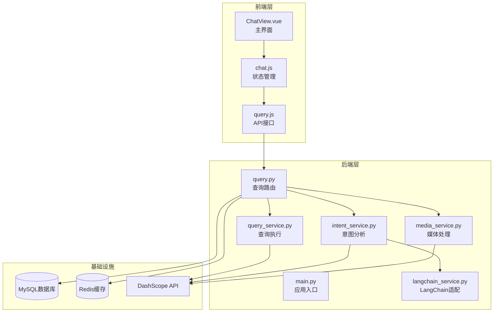

**图表来源**
- [main.py:52-86](file://service/ai_assistant/app/main.py#L52-L86)
- [query.py:198-212](file://service/ai_assistant/app/routers/query.py#L198-L212)

**章节来源**
- [main.py:1-86](file://service/ai_assistant/app/main.py#L1-L86)
- [requirements.txt:1-22](file://service/ai_assistant/requirements.txt#L1-L22)

## 核心组件

### 前端组件

前端采用Vue 3 + Vite构建，主要组件包括：

- **ChatView.vue**：主聊天界面，负责用户交互和显示
- **chat.js**：Pinia状态管理，处理会话和消息状态
- **query.js**：API接口封装，支持SSE流式传输

### 后端组件

后端采用FastAPI框架，核心服务包括：

- **媒体服务**：处理图片OCR和语音转文字
- **意图服务**：分析查询意图并生成回答
- **查询服务**：执行结构化查询和向量检索
- **LangChain服务**：提供LangChain集成适配

**章节来源**
- [ChatView.vue:1-535](file://frontend/ai_assistant/src/views/ChatView.vue#L1-L535)
- [chat.js:1-278](file://frontend/ai_assistant/src/stores/chat.js#L1-L278)
- [query.js:1-141](file://frontend/ai_assistant/src/api/query.js#L1-L141)

## 架构概览

系统采用统一的查询接口 `/api/v1/query` 处理所有多模态输入：

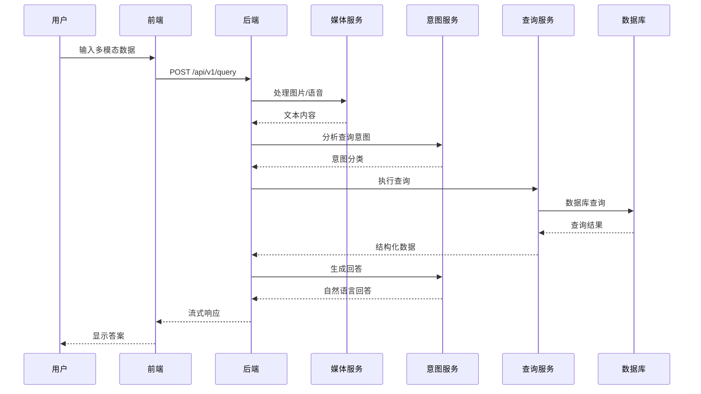

**图表来源**
- [query.py:207-745](file://service/ai_assistant/app/routers/query.py#L207-L745)
- [media_service.py:115-246](file://service/ai_assistant/app/services/media_service.py#L115-L246)

## 详细组件分析

### 文本输入处理

#### 前端实现

文本输入是最基础的交互方式，前端通过Textarea组件实现：

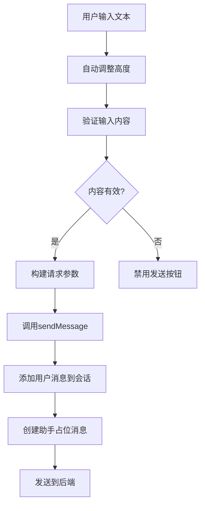

**图表来源**
- [ChatView.vue:288-333](file://frontend/ai_assistant/src/views/ChatView.vue#L288-L333)
- [chat.js:133-230](file://frontend/ai_assistant/src/stores/chat.js#L133-L230)

#### 后端处理

后端接收文本请求并进行统一处理：

**章节来源**
- [ChatView.vue:189-207](file://frontend/ai_assistant/src/views/ChatView.vue#L189-L207)
- [chat.js:184-218](file://frontend/ai_assistant/src/stores/chat.js#L184-L218)

### 图片上传处理

#### 前端图片处理流程

前端实现了完整的图片上传和预处理功能：

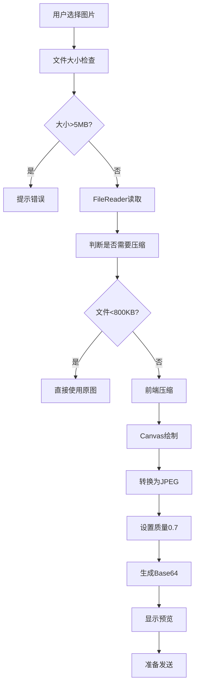

**图表来源**
- [ChatView.vue:336-390](file://frontend/ai_assistant/src/views/ChatView.vue#L336-L390)

#### 后端图片处理流程

后端使用DashScope的Qwen-VL模型进行OCR识别：

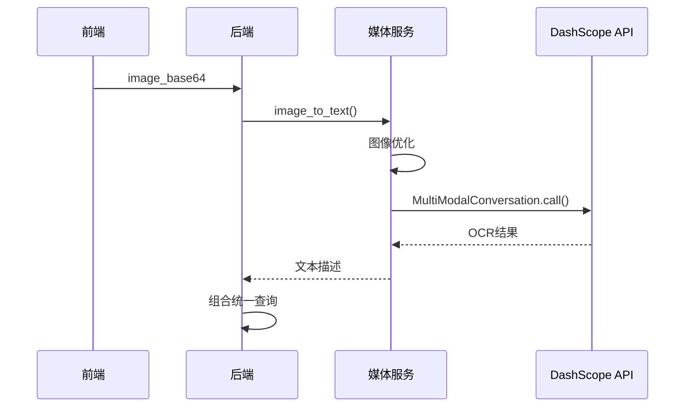

**图表来源**
- [media_service.py:115-157](file://service/ai_assistant/app/services/media_service.py#L115-L157)
- [query.py:232-242](file://service/ai_assistant/app/routers/query.py#L232-L242)

**章节来源**
- [ChatView.vue:336-390](file://frontend/ai_assistant/src/views/ChatView.vue#L336-L390)
- [media_service.py:23-64](file://service/ai_assistant/app/services/media_service.py#L23-L64)

### 语音录制处理

#### 前端语音处理

前端实现了完整的语音录制和处理功能：

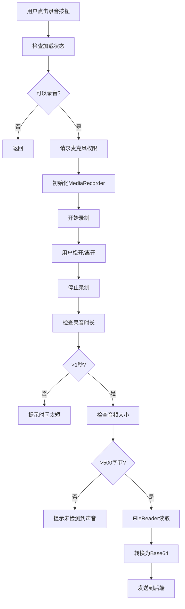

**图表来源**
- [ChatView.vue:400-481](file://frontend/ai_assistant/src/views/ChatView.vue#L400-L481)

#### 后端语音处理

后端使用DashScope的ASR模型进行语音转文字：

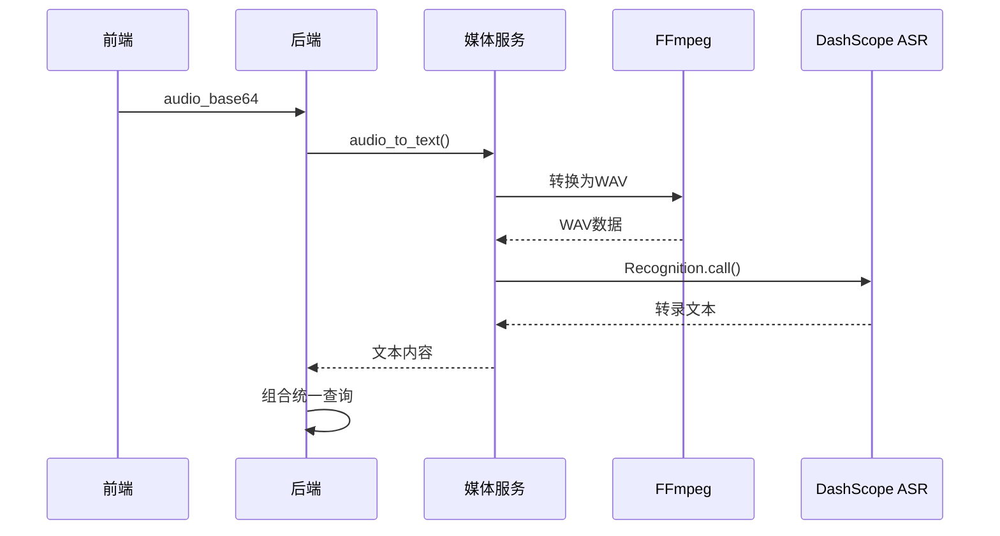

**图表来源**
- [media_service.py:159-246](file://service/ai_assistant/app/services/media_service.py#L159-L246)
- [query.py:244-260](file://service/ai_assistant/app/routers/query.py#L244-L260)

**章节来源**
- [ChatView.vue:397-525](file://frontend/ai_assistant/src/views/ChatView.vue#L397-L525)
- [media_service.py:66-113](file://service/ai_assistant/app/services/media_service.py#L66-L113)

### 多模态数据融合算法

系统采用统一的查询构建策略：

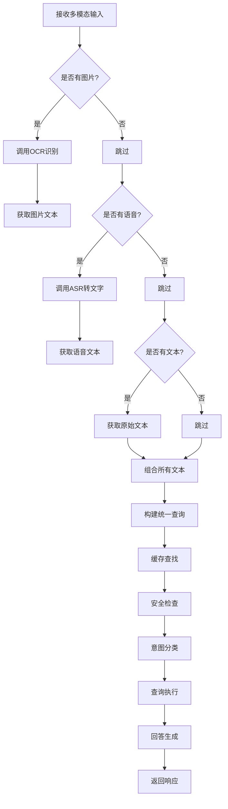

**图表来源**
- [query.py:228-273](file://service/ai_assistant/app/routers/query.py#L228-L273)
- [query.py:288-312](file://service/ai_assistant/app/routers/query.py#L288-L312)

**章节来源**
- [query.py:49-113](file://service/ai_assistant/app/routers/query.py#L49-L113)
- [query.py:505-525](file://service/ai_assistant/app/routers/query.py#L505-L525)

### 意图分类与回答生成

系统采用三层架构的意图分类：

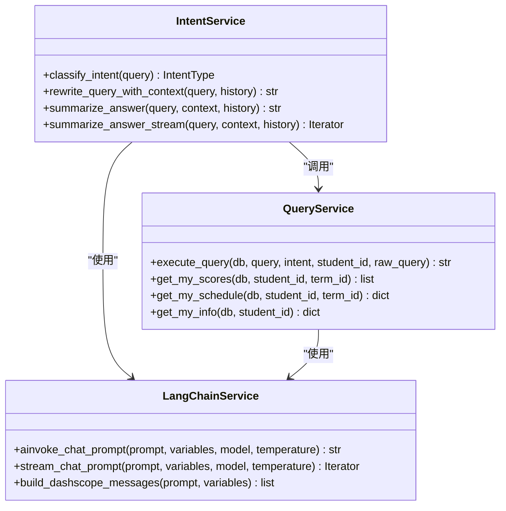

**图表来源**
- [intent_service.py:218-346](file://service/ai_assistant/app/services/intent_service.py#L218-L346)
- [query_service.py:1-800](file://service/ai_assistant/app/services/query_service.py#L1-L800)

**章节来源**
- [intent_service.py:218-346](file://service/ai_assistant/app/services/intent_service.py#L218-L346)
- [query_service.py:574-706](file://service/ai_assistant/app/services/query_service.py#L574-L706)

## 依赖关系分析

### 技术栈依赖

系统采用现代化的技术栈，各组件之间的依赖关系如下：

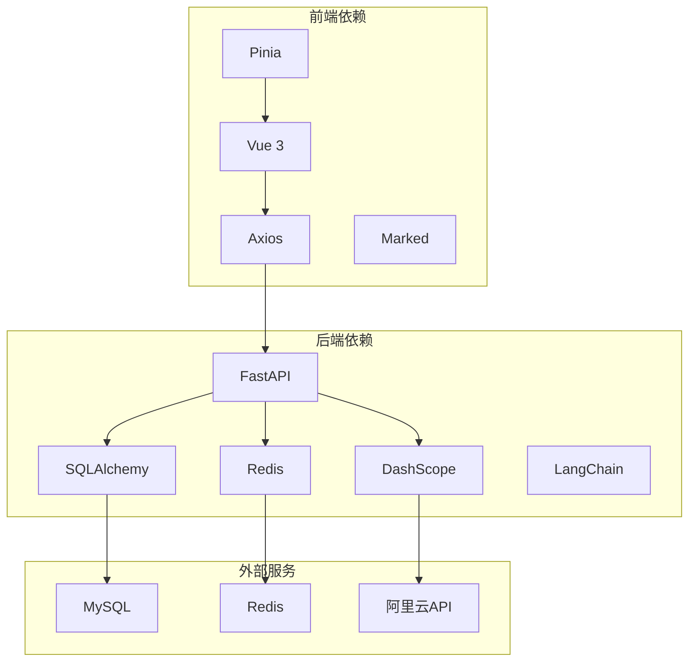

**图表来源**
- [requirements.txt:1-22](file://service/ai_assistant/requirements.txt#L1-L22)
- [config.py:48-80](file://service/ai_assistant/app/config.py#L48-L80)

### 模块间通信

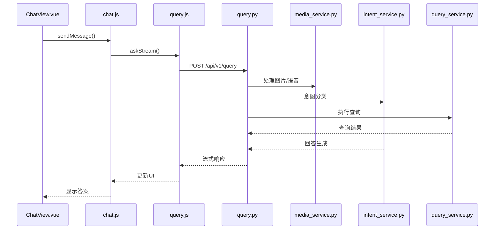

**图表来源**
- [chat.js:189-218](file://frontend/ai_assistant/src/stores/chat.js#L189-L218)
- [query.py:207-745](file://service/ai_assistant/app/routers/query.py#L207-L745)

**章节来源**
- [requirements.txt:1-22](file://service/ai_assistant/requirements.txt#L1-L22)
- [config.py:1-113](file://service/ai_assistant/app/config.py#L1-L113)

## 性能考虑

### 缓存策略

系统实现了多层次的缓存机制：

1. **Redis缓存**：存储查询结果和会话历史
2. **本地缓存**：前端状态管理
3. **数据库缓存**：查询结果的持久化

### 并发处理

系统采用异步处理模式：

- **异步API调用**：使用async/await处理
- **并发任务**：安全检查、隐私检查、意图重写并行执行
- **流式响应**：支持SSE流式传输

### 性能优化

- **图像压缩**：前端和后端双重压缩
- **音频转换**：使用FFmpeg进行高效转换
- **输入截断**：防止超长输入影响性能

## 故障排除指南

### 常见问题及解决方案

#### 图片处理问题

**问题**：图片处理失败
**原因**：图片格式不支持或文件过大
**解决**：
- 确认图片格式为PNG/JPEG/GIF/WebP
- 检查图片大小是否超过5MB限制
- 确认网络连接正常

#### 语音处理问题

**问题**：语音识别失败
**原因**：麦克风权限未授权或静音
**解决**：
- 检查浏览器麦克风权限设置
- 确保录音环境安静
- 重新尝试录音

#### 网络连接问题

**问题**：请求超时或连接失败
**解决**：
- 检查网络连接状态
- 确认后端服务正常运行
- 查看防火墙设置

**章节来源**
- [chat.js:235-257](file://frontend/ai_assistant/src/stores/chat.js#L235-L257)
- [query.py:238-260](file://service/ai_assistant/app/routers/query.py#L238-L260)

## 结论

AI校园助手的多模态输入处理系统通过精心设计的架构和完善的实现，为用户提供了自然、便捷的校园信息服务体验。系统的主要优势包括：

1. **多模态支持**：同时支持文本、图片、语音三种输入方式
2. **智能处理**：通过OCR和ASR技术实现智能化内容提取
3. **高效架构**：采用前后端分离和异步处理模式
4. **安全保障**：完善的隐私保护和安全检查机制
5. **性能优化**：多层次缓存和并发处理机制

该系统为开发者提供了清晰的扩展指导，可以轻松添加新的输入类型或改进现有功能。通过合理的架构设计和实现细节，系统能够稳定可靠地为用户提供高质量的校园信息服务。