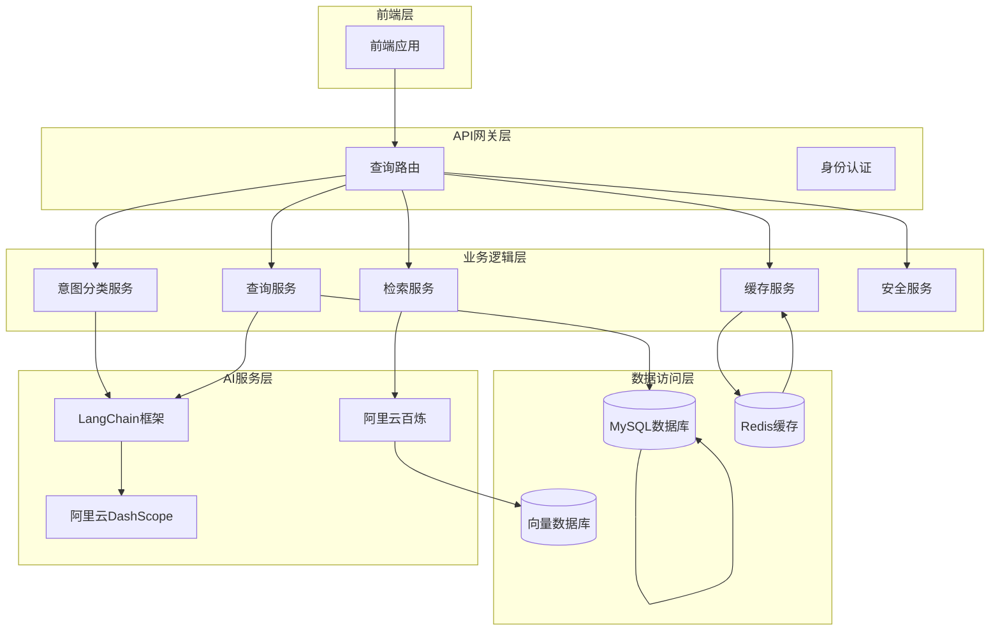
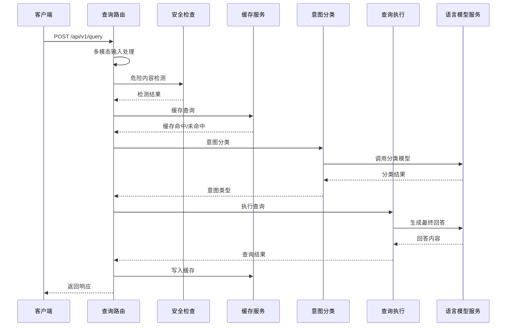
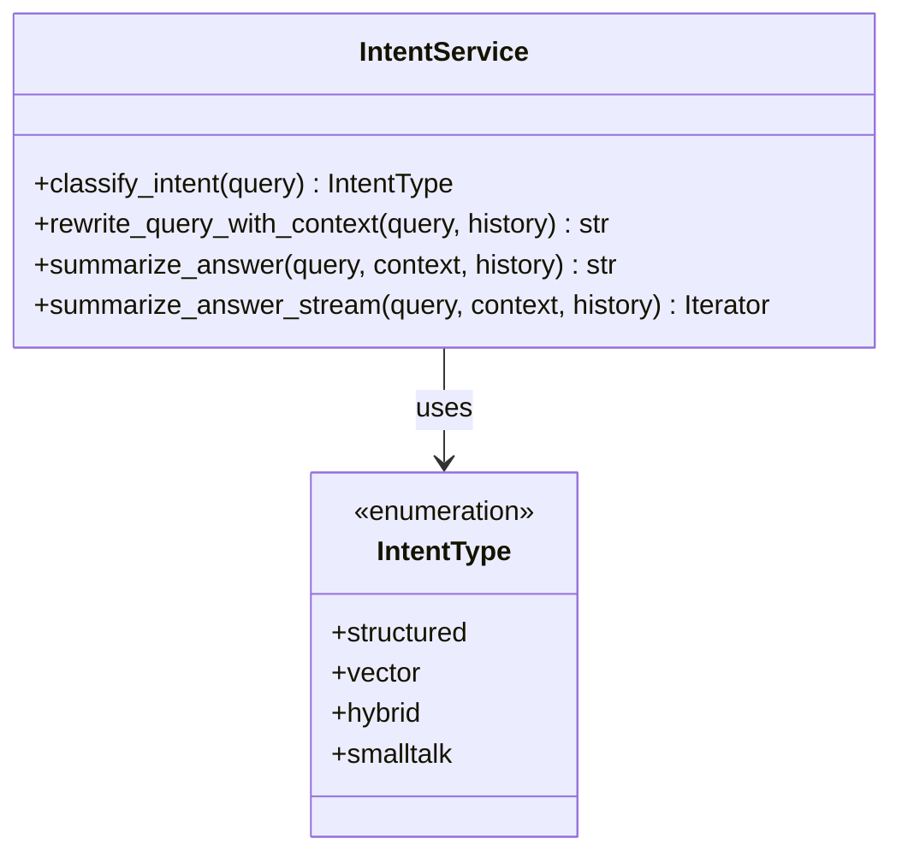
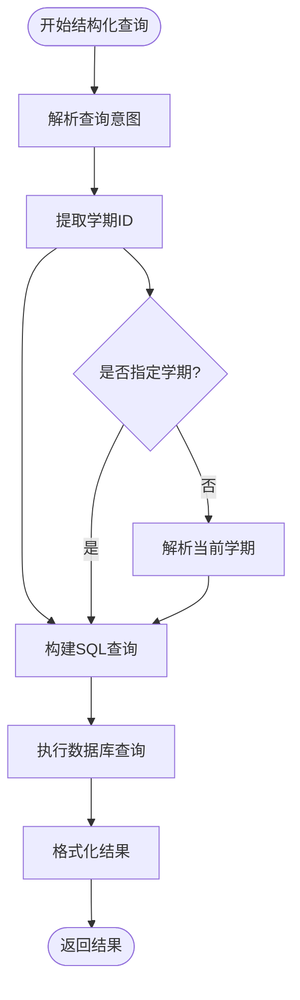
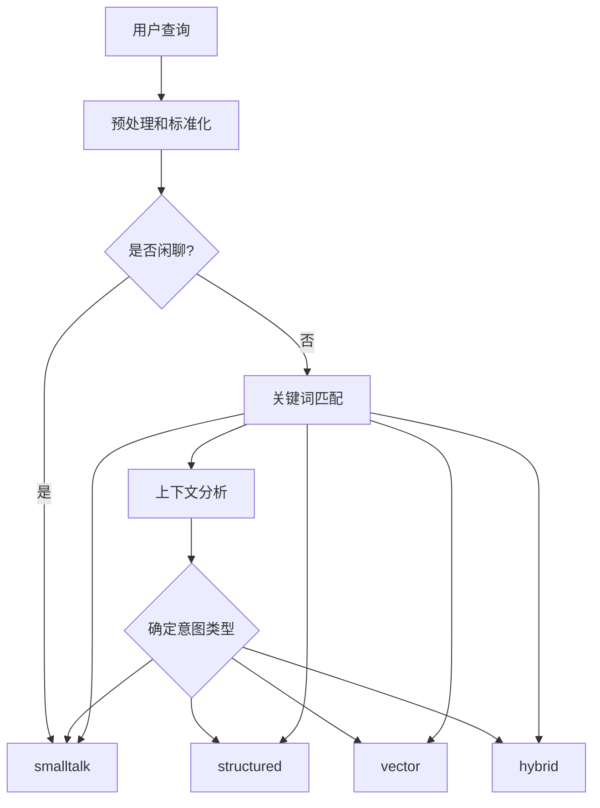
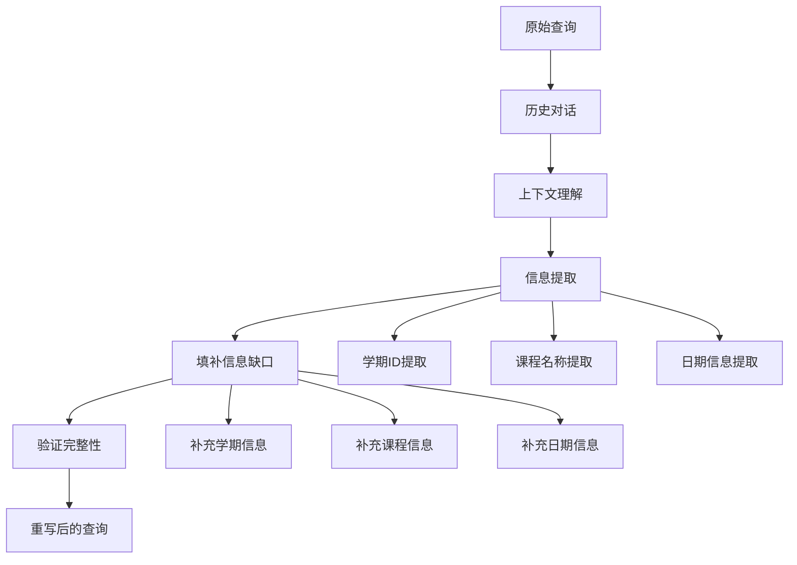
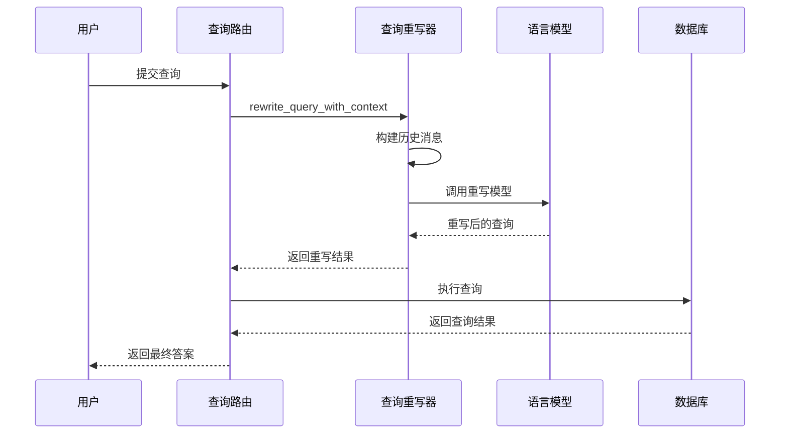
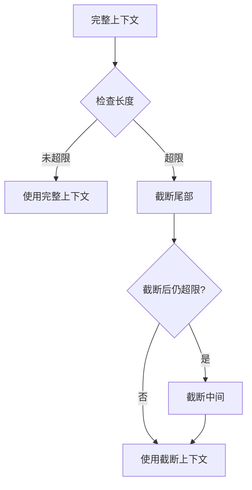
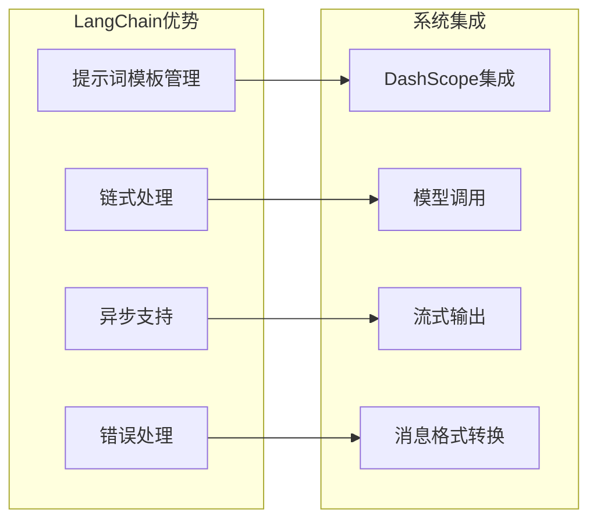
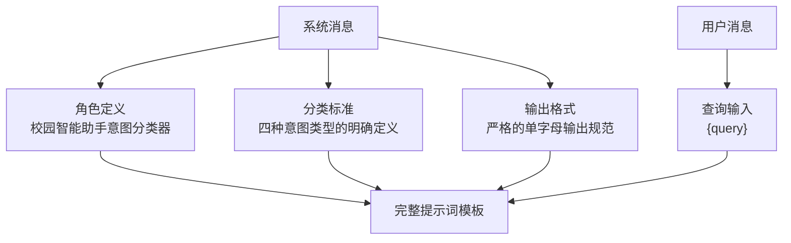

# 智能意图分类与查询重写

<cite>
**本文档引用的文件**
- [intent_service.py](file://service/ai_assistant/app/services/intent_service.py)
- [query_service.py](file://service/ai_assistant/app/services/query_service.py)
- [langchain_service.py](file://service/ai_assistant/app/services/langchain_service.py)
- [query.py](file://service/ai_assistant/app/routers/query.py)
- [query.py](file://service/ai_assistant/app/schemas/query.py)
- [config.py](file://service/ai_assistant/app/config.py)
- [models.py](file://service/ai_assistant/app/models/models.py)
- [retriever_service.py](file://service/ai_assistant/app/services/retriever_service.py)
- [cache_service.py](file://service/ai_assistant/app/services/cache_service.py)
- [safety_service.py](file://service/ai_assistant/app/services/safety_service.py)
- [chat_log_service.py](file://service/ai_assistant/app/services/chat_log_service.py)
- [logger.py](file://service/ai_assistant/app/utils/logger.py)
</cite>

## 目录
1. [简介](#简介)
2. [项目结构](#项目结构)
3. [核心组件](#核心组件)
4. [架构概览](#架构概览)
5. [详细组件分析](#详细组件分析)
6. [意图分类算法详解](#意图分类算法详解)
7. [查询重写机制](#查询重写机制)
8. [上下文理解能力](#上下文理解能力)
9. [LangChain框架使用](#langchain框架使用)
10. [提示词工程](#提示词工程)
11. [模型调优策略](#模型调优策略)
12. [分类示例与重写规则](#分类示例与重写规则)
13. [开发者指南](#开发者指南)
14. [性能考虑](#性能考虑)
15. [故障排除指南](#故障排除指南)
16. [结论](#结论)

## 简介

AI校园助手是一个基于LangChain框架构建的智能问答系统，专门服务于高校环境。该系统的核心功能包括智能意图分类与查询重写，能够准确识别用户查询的四种意图类型：structured（结构化数据查询）、vector（向量检索）、hybrid（混合查询）和smalltalk（闲聊）。

系统采用多模态输入处理（文本、图像、音频），通过先进的自然语言处理技术和机器学习模型，为用户提供准确、及时、个性化的校园信息服务。无论是查询课表、成绩、教师联系方式，还是获取校园规章制度、办事流程等信息，系统都能提供智能化的解决方案。

## 项目结构

AI校园助手采用分层架构设计，主要分为以下几个层次：



**图表来源**
- [query.py:198-745](file://service/ai_assistant/app/routers/query.py#L198-L745)
- [intent_service.py:1-346](file://service/ai_assistant/app/services/intent_service.py#L1-L346)
- [query_service.py:1-800](file://service/ai_assistant/app/services/query_service.py#L1-L800)

**章节来源**
- [query.py:1-788](file://service/ai_assistant/app/routers/query.py#L1-L788)
- [config.py:1-113](file://service/ai_assistant/app/config.py#L1-L113)

## 核心组件

系统的核心组件包括：

### 1. 意图分类服务
负责将用户查询分类为四种意图类型，使用LangChain框架和阿里云DashScope模型进行智能判断。

### 2. 查询服务
执行具体的查询操作，包括结构化SQL查询、向量检索和混合查询。

### 3. 检索服务
基于阿里云百炼知识库API进行向量检索和文档相似度匹配。

### 4. 缓存服务
提供Redis缓存支持，包含敏感信息保护和时间敏感查询处理。

### 5. 安全服务
检测潜在的危险内容，包括自杀、自残和暴力倾向。

### 6. 语言模型服务
封装LangChain与DashScope的集成，提供统一的提示词模板和流式输出支持。

**章节来源**
- [intent_service.py:1-346](file://service/ai_assistant/app/services/intent_service.py#L1-L346)
- [query_service.py:1-800](file://service/ai_assistant/app/services/query_service.py#L1-L800)
- [retriever_service.py:1-168](file://service/ai_assistant/app/services/retriever_service.py#L1-L168)

## 架构概览

系统采用微服务架构，通过RESTful API提供服务。整体处理流程如下：



**图表来源**
- [query.py:207-745](file://service/ai_assistant/app/routers/query.py#L207-L745)
- [intent_service.py:218-248](file://service/ai_assistant/app/services/intent_service.py#L218-L248)

## 详细组件分析

### 意图分类服务

意图分类服务是系统的核心组件，负责将用户查询准确分类到四种意图类型中。

#### 类型定义

系统定义了四种意图类型：



**图表来源**
- [query.py:8-12](file://service/ai_assistant/app/schemas/query.py#L8-L12)
- [intent_service.py:218-346](file://service/ai_assistant/app/services/intent_service.py#L218-L346)

#### 分类算法实现

意图分类算法基于LangChain框架和阿里云DashScope模型，使用精心设计的提示词模板：

**分类提示词模板**：
- 系统角色：校园智能助手的意图分类器
- 分类标准：明确四种意图类型的定义和边界
- 输出格式：严格的单字母输出规范

**分类流程**：
1. 构建分类提示词模板
2. 调用LangChain链式处理
3. 解析模型输出
4. 验证和回退机制

**章节来源**
- [intent_service.py:23-48](file://service/ai_assistant/app/services/intent_service.py#L23-L48)
- [intent_service.py:218-248](file://service/ai_assistant/app/services/intent_service.py#L218-L248)

### 查询服务

查询服务负责执行具体的查询操作，支持三种查询模式：

#### 结构化查询（Structured）

处理明确的结构化数据查询，如成绩、课表、个人信息等：



**图表来源**
- [query_service.py:575-706](file://service/ai_assistant/app/services/query_service.py#L575-L706)

#### 向量检索（Vector）

基于阿里云百炼知识库API进行语义搜索：

**检索流程**：
1. 知识库查询
2. 结果重排
3. 上下文构建
4. 结果格式化

#### 混合查询（Hybrid）

结合结构化查询和向量检索的优势：

**混合处理流程**：
1. 同时执行结构化查询和向量检索
2. 结果去重和重排
3. 上下文融合
4. 统一回答生成

**章节来源**
- [query_service.py:1-800](file://service/ai_assistant/app/services/query_service.py#L1-L800)
- [retriever_service.py:1-168](file://service/ai_assistant/app/services/retriever_service.py#L1-L168)

### LangChain服务

LangChain服务封装了与DashScope的集成，提供了统一的提示词模板处理和流式输出支持。

#### 提示词模板管理

系统维护了多个专用的提示词模板：

| 模板类型 | 描述 | 使用场景 |
|---------|------|----------|
| 分类提示词 | 意图分类 | structured/vector/hybrid/smalltalk分类 |
| 重写提示词 | 查询重写 | 上下文理解与信息补全 |
| 总结提示词 | 答案生成 | 结构化数据和向量检索结果整合 |
| 工具规划提示词 | 结构化查询规划 | SQL查询工具选择和参数生成 |

#### 流式输出支持

LangChain服务提供了完整的流式输出支持，包括：

- **非流式调用**：`ainvoke_chat_prompt`
- **流式调用**：`stream_chat_prompt`
- **消息裁剪**：自动处理输入长度限制
- **错误处理**：统一的异常处理和回退机制

**章节来源**
- [langchain_service.py:1-278](file://service/ai_assistant/app/services/langchain_service.py#L1-L278)

## 意图分类算法详解

### 分类标准定义

系统为每种意图类型定义了明确的边界和特征：

#### Structured（结构化数据查询）
- **特征**：明确的结构化数据需求
- **典型查询**：成绩查询、课表查询、个人信息查询
- **数据来源**：MySQL数据库
- **输出格式**：结构化数据表格

#### Vector（向量检索）
- **特征**：知识库语义搜索需求
- **典型查询**：规章制度、办事流程、校园指南
- **数据来源**：阿里云百炼知识库
- **输出格式**：文档片段和摘要

#### Hybrid（混合查询）
- **特征**：同时需要个人信息和知识库信息
- **典型查询**：个人课表与课程要求对比
- **数据来源**：数据库 + 知识库
- **输出格式**：综合信息整合

#### Smalltalk（闲聊）
- **特征**：无需查询的数据或知识
- **典型查询**：问候、感谢、闲聊
- **数据来源**：无需外部数据源
- **输出格式**：自然语言对话

### 分类算法实现



**图表来源**
- [intent_service.py:218-248](file://service/ai_assistant/app/services/intent_service.py#L218-L248)

### 分类准确性保障

系统采用了多重保障机制确保分类准确性：

1. **模型回退机制**：LangChain调用失败时自动回退到vector
2. **输出验证**：严格验证模型输出格式
3. **模糊匹配**：对不确定分类进行模糊匹配
4. **错误日志**：详细记录分类过程和错误信息

**章节来源**
- [intent_service.py:233-248](file://service/ai_assistant/app/services/intent_service.py#L233-L248)

## 查询重写机制

查询重写机制是系统上下文理解能力的核心，通过结合历史对话和当前查询，生成更完整、更准确的查询语句。

### 重写算法设计



**图表来源**
- [intent_service.py:251-295](file://service/ai_assistant/app/services/intent_service.py#L251-L295)

### 重写规则

系统制定了详细的重写规则：

#### 1. 信息补全规则
- **学期信息**：当历史对话提到具体学期而新查询缺失时，自动补充
- **课程信息**：当查询涉及特定课程时，确保课程名称完整
- **日期信息**：当查询涉及特定日期时，确保日期格式正确

#### 2. 上下文保持规则
- **历史消息截断**：限制历史消息长度，避免过长上下文影响模型性能
- **关键信息保留**：在截断时优先保留关键信息
- **消息角色转换**：将历史消息转换为LangChain兼容格式

#### 3. 输出质量控制
- **长度限制**：重写查询长度限制在1200字符以内
- **格式规范**：确保输出为独立、完整的查询句
- **无解释输出**：直接输出结果，不包含任何解释说明

### 重写流程实现



**图表来源**
- [intent_service.py:251-295](file://service/ai_assistant/app/services/intent_service.py#L251-L295)

**章节来源**
- [intent_service.py:50-62](file://service/ai_assistant/app/services/intent_service.py#L50-L62)
- [intent_service.py:163-210](file://service/ai_assistant/app/services/intent_service.py#L163-L210)

## 上下文理解能力

系统通过多种机制实现强大的上下文理解能力：

### 1. 会话历史管理

系统实现了完整的会话历史管理机制：

- **Redis会话存储**：使用Redis存储会话历史，支持跨请求的上下文保持
- **DID隔离**：通过去标识化ID（DID）隔离不同用户的会话
- **历史长度控制**：限制最大历史长度，避免内存溢出
- **自动过期**：设置7天过期时间，释放存储空间

### 2. 上下文截断策略

为了适应模型输入长度限制，系统实现了智能的上下文截断策略：



**图表来源**
- [intent_service.py:116-161](file://service/ai_assistant/app/services/intent_service.py#L116-L161)

### 3. 关键信息保留

在上下文截断过程中，系统优先保留关键信息：

- **历史消息项长度限制**：每条历史消息最多1200字符
- **查询长度限制**：用户查询最多1200字符
- **上下文长度限制**：相关数据最多18000字符
- **头尾保留策略**：结构化上下文优先保留开头和结尾的关键信息

### 4. 会话隔离机制

系统实现了严格的会话隔离机制：

- **DID生成**：基于学号生成去标识化ID
- **会话键管理**：使用`chat:session_history:{did}:{session_id}`格式
- **并发安全**：避免不同会话之间的数据串扰
- **权限控制**：确保用户只能访问自己的会话历史

**章节来源**
- [query.py:153-196](file://service/ai_assistant/app/routers/query.py#L153-L196)
- [intent_service.py:116-210](file://service/ai_assistant/app/services/intent_service.py#L116-L210)

## LangChain框架使用

系统深度集成了LangChain框架，充分利用其强大的链式处理能力和提示词模板管理功能。

### LangChain核心组件

#### 1. 提示词模板（ChatPromptTemplate）

系统使用ChatPromptTemplate管理各种提示词：

- **系统消息**：定义AI助手的角色和行为规范
- **用户消息**：包含具体的查询内容
- **占位符**：支持动态变量注入
- **消息占位符**：支持历史消息列表

#### 2. 链式处理（Runnable）

系统使用Runnable接口实现链式处理：

- **RunnableLambda**：包装异步函数调用
- **StrOutputParser**：解析字符串输出
- **链式组合**：将多个处理步骤组合成流水线

#### 3. 异步支持

系统全面支持异步处理：

- **异步调用**：`ainvoke_chat_prompt`支持异步调用
- **异步流式**：`stream_chat_prompt`支持流式输出
- **并发处理**：多个异步任务可以并行执行

### LangChain集成优势



**图表来源**
- [langchain_service.py:139-278](file://service/ai_assistant/app/services/langchain_service.py#L139-L278)

**章节来源**
- [langchain_service.py:1-278](file://service/ai_assistant/app/services/langchain_service.py#L1-L278)

## 提示词工程

提示词工程是系统智能性的关键，通过精心设计的提示词模板实现高质量的AI交互。

### 提示词设计原则

#### 1. 明确性原则
提示词必须清晰明确，避免歧义：

- **角色定义**：明确AI助手的身份和职责
- **任务描述**：清楚说明需要完成的任务
- **输出格式**：严格规定输出格式和约束

#### 2. 一致性原则
提示词在整个系统中保持一致性：

- **术语统一**：使用统一的专业术语
- **格式规范**：遵循相同的格式规范
- **逻辑连贯**：确保逻辑推理的连贯性

#### 3. 可扩展性原则
提示词设计要考虑未来的扩展需求：

- **模块化设计**：提示词可以独立修改和更新
- **参数化支持**：支持动态参数注入
- **版本管理**：支持提示词版本控制

### 主要提示词模板

#### 1. 意图分类提示词



**图表来源**
- [intent_service.py:23-48](file://service/ai_assistant/app/services/intent_service.py#L23-L48)

#### 2. 查询重写提示词

查询重写提示词强调上下文理解和信息补全：

- **上下文理解**：结合最近3轮历史对话
- **信息补全**：自动补充缺失的关键信息
- **独立查询**：生成独立、完整的查询句

#### 3. 答案生成提示词

答案生成提示词确保回答的质量和准确性：

- **数据准确性**：严格基于查询到的数据回答
- **语言风格**：自然亲切的校园助手风格
- **格式规范**：严格的回答格式和内容规范

### 提示词优化策略

#### 1. 渐进式复杂度
从简单到复杂的渐进式设计：

- **基础规则**：简单的规则和约束
- **高级规则**：复杂的逻辑推理
- **特殊情况**：边缘情况的处理

#### 2. 错误恢复机制
设计错误恢复和回退机制：

- **格式验证**：验证模型输出格式
- **内容检查**：检查输出内容的合理性
- **自动修正**：自动修正常见的错误

#### 3. 性能优化
优化提示词以提高处理效率：

- **长度控制**：控制提示词长度
- **重复消除**：避免重复的信息
- **上下文压缩**：压缩上下文信息

**章节来源**
- [intent_service.py:23-101](file://service/ai_assistant/app/services/intent_service.py#L23-L101)

## 模型调优策略

系统采用了多层次的模型调优策略，确保在不同场景下的最佳性能表现。

### 模型选择策略

系统为不同的任务选择了最适合的模型：

| 任务类型 | 模型名称 | 参数配置 | 使用场景 |
|---------|----------|----------|----------|
| 意图分类 | qwen-turbo | temperature=0.0, max_tokens=10 | 快速、准确的意图分类 |
| 查询重写 | qwen-turbo | temperature=0.0 | 精确的查询重写 |
| 答案生成 | qwen-plus | temperature=0.2, max_tokens=4096 | 丰富的回答生成 |
| 工具规划 | qwen-plus | temperature=0.2 | 复杂的工具调用规划 |
| 向量分解 | qwen-turbo | temperature=0.0 | 关键词提取和分解 |
| 混合重排 | qwen-turbo | temperature=0.0 | 多源结果重排 |
| 安全检测 | qwen-turbo | temperature=0.0 | 危险内容检测 |
| 图像理解 | qwen-vl-plus | 专用视觉模型 | 多模态图像理解 |
| 语音识别 | paraformer-realtime-v1 | 专用语音模型 | 实时语音转文字 |

### 调优参数配置

#### 1. 温度参数（Temperature）
- **意图分类**：0.0（确定性输出）
- **查询重写**：0.0（确定性输出）
- **答案生成**：0.2（适度创造性）
- **工具规划**：0.2（适度创造性）

#### 2. 最大令牌数（Max Tokens）
- **意图分类**：10（最小输出）
- **查询重写**：无限制（灵活长度）
- **答案生成**：4096（丰富内容）
- **工具规划**：无限制（复杂逻辑）

#### 3. 上下文长度控制
- **输入字符限制**：28000字符
- **历史消息限制**：6条
- **单条消息限制**：1200字符
- **上下文数据限制**：18000字符

### 性能监控与优化

#### 1. 性能指标监控
系统监控关键性能指标：

- **响应时间**：查询到回答的总时间
- **模型调用次数**：各模型的调用频率
- **错误率**：模型调用失败的比例
- **缓存命中率**：缓存的有效利用

#### 2. 动态调整机制
根据监控数据动态调整：

- **负载均衡**：根据实时负载调整模型分配
- **参数自适应**：根据任务复杂度调整参数
- **缓存策略**：根据使用模式优化缓存

#### 3. 错误处理与回退
建立完善的错误处理机制：

- **模型失败回退**：LangChain调用失败时回退到vector
- **超时处理**：模型响应超时时的处理策略
- **资源限制**：内存和CPU使用的限制

**章节来源**
- [config.py:54-72](file://service/ai_assistant/app/config.py#L54-L72)
- [langchain_service.py:139-203](file://service/ai_assistant/app/services/langchain_service.py#L139-L203)

## 分类示例与重写规则

### 意图分类示例

#### Structured（结构化数据查询）示例

**典型查询**：
- "我的202509学期成绩"
- "我本学期的课表"
- "张三的联系方式"
- "计算机专业的课程安排"

**特征识别**：
- 明确的个人信息查询
- 结构化数据的直接需求
- 可以通过SQL查询满足

#### Vector（向量检索）示例

**典型查询**：
- "校园卡丢失怎么办"
- "选课流程是什么"
- "奖学金申请条件"
- "图书馆开放时间"

**特征识别**：
- 通用知识查询
- 需要语义理解
- 可以通过知识库检索

#### Hybrid（混合查询）示例

**典型查询**：
- "我的必修课有哪些学分要求"
- "我本学期成绩是否符合奖学金条件"
- "这周的课表和课程要求对比"

**特征识别**：
- 同时需要个人信息和知识库信息
- 需要综合分析
- 复杂的推理过程

#### Smalltalk（闲聊）示例

**典型查询**：
- "你好"
- "谢谢"
- "你真棒"
- "今天天气不错"

**特征识别**：
- 无需查询数据
- 社交礼仪性质
- 简单的问候交流

### 查询重写规则

#### 1. 学期信息补全

**场景**：历史对话提到具体学期，新查询缺失学期信息

**示例**：
- 历史： "上学期我的课表很好看"
- 新查询： "导出"
- 重写： "导出上学期的课表"

**规则**：
- 自动识别历史中的学期信息
- 补充到当前查询中
- 保持查询的完整性

#### 2. 课程信息提取

**场景**：查询涉及特定课程，需要完整课程信息

**示例**：
- 历史： "我这学期选了数据结构课"
- 新查询： "这门课的作业"
- 重写： "数据结构课的作业"

**规则**：
- 从历史对话中提取课程名称
- 确保课程信息的完整性
- 避免歧义和不明确

#### 3. 日期信息处理

**场景**：查询涉及特定日期或时间段

**示例**：
- 历史： "上周的考试成绩"
- 新查询： "导出"
- 重写： "导出上周的考试成绩"

**规则**：
- 识别周、月、年的相对时间
- 转换为绝对日期格式
- 确保时间范围的准确性

### 重写质量评估

#### 1. 完整性评估
- **信息完整性**：是否包含所有必要信息
- **上下文完整性**：是否正确理解历史背景
- **查询完整性**：是否形成独立完整的查询

#### 2. 准确性评估
- **语义准确性**：重写后的查询是否准确反映原意
- **语法正确性**：查询语句是否语法正确
- **逻辑一致性**：查询逻辑是否合理

#### 3. 效率评估
- **长度控制**：重写查询是否在长度限制内
- **处理速度**：重写过程是否高效
- **资源消耗**：重写过程的资源消耗

**章节来源**
- [intent_service.py:251-295](file://service/ai_assistant/app/services/intent_service.py#L251-L295)

## 开发者指南

### 自定义分类规则

开发者可以通过以下方式自定义分类规则：

#### 1. 修改意图定义

在`IntentType`枚举中添加新的意图类型：

```python
class IntentType(str, Enum):
    structured = "structured"
    vector = "vector"
    hybrid = "hybrid"
    smalltalk = "smalltalk"
    # 添加新的意图类型
    custom = "custom"
```

#### 2. 更新分类提示词

修改`_CLASSIFY_PROMPT`中的分类标准：

```python
_CLASSIFY_PROMPT = ChatPromptTemplate.from_messages([
    ("system", """
    你是一个校园智能助手的意图分类器。
    根据学生的问题，判断最合适的查询方式，只需回答下列五者之一：
    - structured：结构化数据查询
    - vector：知识库向量检索
    - hybrid：混合查询
    - smalltalk：闲聊
    - custom：自定义查询类型
    """),
    ("user", "{query}"),
])
```

#### 3. 实现自定义分类逻辑

在`classify_intent`函数中添加自定义分类逻辑：

```python
async def classify_intent(query: str) -> IntentType:
    # 现有的分类逻辑...
    
    # 自定义分类逻辑
    if custom_condition(query):
        return IntentType.custom
    
    return IntentType.vector
```

### 模型参数调优

#### 1. 温度参数调整

根据任务特点调整温度参数：

```python
# 确定性任务
async def classify_intent(query: str) -> IntentType:
    return await ainvoke_chat_prompt(
        _CLASSIFY_PROMPT,
        {"query": text},
        model=settings.LLM_MODEL_INTENT_CLASSIFY,
        temperature=0.0,  # 确定性输出
        max_tokens=10,
    )

# 创造性任务
async def generate_answer(query: str, context: str) -> str:
    return await ainvoke_chat_prompt(
        _SUMMARIZE_PROMPT,
        {"query": query, "context": context},
        model=settings.LLM_MODEL_FINAL_ANSWER,
        temperature=0.7,  # 增加创造性
        max_tokens=4096,
    )
```

#### 2. 上下文长度优化

根据模型能力调整上下文长度：

```python
# 调整消息截断策略
def _trim_messages_for_dashscope(
    messages: list[dict[str, str]],
    *,
    max_total_chars: int,
) -> tuple[list[dict[str, str]], dict[str, int]]:
    # 根据模型能力调整截断策略
    if model_name == "qwen-turbo":
        max_total_chars = 16000  # 较短的上下文
    elif model_name == "qwen-plus":
        max_total_chars = 28000  # 较长的上下文
    # ... 其他模型的配置
```

### 提示词模板定制

#### 1. 创建自定义提示词模板

```python
_CUSTOM_PROMPT = ChatPromptTemplate.from_messages([
    ("system", """
    你是一个专业的{specialty}助手。
    你的职责是{responsibility}。
    请严格按照以下格式回答：
    - {format_requirement}
    """),
    ("user", "{query}"),
])
```

#### 2. 动态参数注入

```python
def create_custom_prompt(specialty: str, responsibility: str) -> ChatPromptTemplate:
    return ChatPromptTemplate.from_messages([
        ("system", f"""
        你是一个专业的{specialty}助手。
        你的职责是{responsibility}。
        """),
        ("user", "{query}"),
    ])
```

### 错误处理与监控

#### 1. 自定义错误处理

```python
async def safe_invoke(prompt: ChatPromptTemplate, variables: dict[str, Any], model: str) -> str:
    try:
        return await ainvoke_chat_prompt(prompt, variables, model=model)
    except Exception as exc:
        logger.error(f"Model call failed: {exc}")
        # 自定义回退逻辑
        return fallback_response()
```

#### 2. 性能监控

```python
def log_performance_metrics(operation: str, duration: float, **kwargs):
    logger.info(f"Performance: operation={operation}, duration={duration:.2f}s, {kwargs}")
```

### 部署配置

#### 1. 环境变量配置

```python
# .env文件配置示例
ALI_API_KEY=your_api_key
BAILIAN_APP_ID=your_app_id
BAILIAN_WORKSPACE_ID=your_workspace_id
BAILIAN_INDEX_ID=your_index_id
```

#### 2. 模型配置

```python
# config.py中的模型配置
class Settings(BaseSettings):
    # ... 其他配置
    
    # 模型配置
    LLM_MODEL_INTENT_CLASSIFY: str = "qwen-turbo"
    LLM_MODEL_QUERY_REWRITE: str = "qwen-turbo"
    LLM_MODEL_FINAL_ANSWER: str = "qwen-plus"
    LLM_MODEL_TOOL_PLANNER: str = "qwen-plus"
```

**章节来源**
- [config.py:54-72](file://service/ai_assistant/app/config.py#L54-L72)
- [intent_service.py:218-248](file://service/ai_assistant/app/services/intent_service.py#L218-L248)

## 性能考虑

### 1. 模型调用优化

系统采用了多种优化策略来提高模型调用效率：

#### 并发处理
- **并行任务**：安全检查和查询重写并行执行
- **异步调用**：所有模型调用都是异步的
- **资源池**：使用线程池处理阻塞操作

#### 缓存策略
- **Redis缓存**：热点查询结果缓存
- **敏感信息保护**：隐私查询使用短TTL
- **版本控制**：缓存版本管理防止脏数据

#### 输入优化
- **消息截断**：自动截断过长的历史消息
- **字符限制**：严格控制输入长度
- **格式优化**：优化消息格式减少开销

### 2. 内存管理

系统实现了高效的内存管理策略：

#### 对象池
- **数据库连接池**：复用数据库连接
- **Redis连接池**：复用Redis连接
- **模型实例池**：复用模型实例

#### 垃圾回收
- **及时释放**：及时释放不再使用的对象
- **循环引用**：避免循环引用导致的内存泄漏
- **监控告警**：监控内存使用情况

### 3. 网络优化

#### 连接管理
- **长连接**：使用长连接减少握手开销
- **连接池**：数据库和Redis连接池
- **超时控制**：合理的超时设置

#### 数据传输
- **压缩传输**：启用HTTP压缩
- **批量处理**：批量处理减少网络往返
- **增量更新**：支持增量数据传输

### 4. 性能监控

系统建立了完善的性能监控体系：

#### 关键指标
- **响应时间**：端到端响应时间
- **吞吐量**：每秒处理的请求数
- **错误率**：请求失败比例
- **资源使用**：CPU、内存、磁盘使用率

#### 监控工具
- **日志分析**：结构化日志分析
- **APM工具**：应用性能监控
- **告警系统**：异常情况告警

**章节来源**
- [query.py:347-352](file://service/ai_assistant/app/routers/query.py#L347-L352)
- [cache_service.py:85-90](file://service/ai_assistant/app/services/cache_service.py#L85-L90)

## 故障排除指南

### 常见问题诊断

#### 1. 模型调用失败

**症状**：`Generation API error`或`InvalidParameter`错误

**诊断步骤**：
1. 检查API密钥配置
2. 验证模型名称正确性
3. 检查输入格式和长度
4. 查看网络连接状态

**解决方法**：
```python
# 错误处理示例
try:
    response = await ainvoke_chat_prompt(prompt, variables, model=model)
except Exception as e:
    logger.error(f"Model call failed: {e}")
    # 回退到备用模型
    if model == settings.LLM_MODEL_INTENT_CLASSIFY:
        response = await fallback_classification(query)
```

#### 2. 缓存访问失败

**症状**：Redis连接超时或认证失败

**诊断步骤**：
1. 检查Redis服务器状态
2. 验证连接参数配置
3. 检查网络连通性
4. 查看Redis日志

**解决方法**：
```python
# 缓存降级处理
async def get_cached_response_fallback(redis, did, query_text):
    try:
        return await get_cached_response(redis, did, query_text)
    except Exception:
        logger.warning("Redis cache unavailable, using fallback")
        return None  # 直接跳过缓存
```

#### 3. 数据库连接问题

**症状**：SQLAlchemy连接池耗尽

**诊断步骤**：
1. 检查数据库连接数
2. 查看连接池配置
3. 监控慢查询
4. 检查数据库状态

**解决方法**：
```python
# 连接池管理
async def get_db_session():
    async with AsyncSessionLocal() as session:
        try:
            yield session
        except Exception as e:
            await session.rollback()
            raise e
```

### 日志分析

#### 1. 关键日志字段

系统记录了详细的日志信息：

| 日志级别 | 关键字段 | 用途 |
|---------|----------|------|
| INFO | student_id, session_id | 用户身份识别 |
| INFO | query_len, context_len | 查询长度监控 |
| WARNING | original_chars, final_chars | 输入截断警告 |
| ERROR | status_code, message | API调用错误 |
| DEBUG | model, temperature | 模型调用详情 |

#### 2. 日志分析工具

```python
# 日志聚合示例
def analyze_performance_logs():
    # 分析响应时间分布
    # 统计错误率趋势
    # 监控资源使用峰值
    pass
```

### 性能调优

#### 1. 模型参数调优

根据实际使用情况调整模型参数：

```python
# 动态参数调整
def adjust_model_parameters(task_type: str, performance_metrics: dict):
    if performance_metrics['error_rate'] > 0.1:
        # 增加温度参数
        return {'temperature': 0.3}
    elif performance_metrics['latency'] > 2.0:
        # 减少最大令牌数
        return {'max_tokens': 2048}
    return {}
```

#### 2. 缓存策略优化

根据使用模式优化缓存策略：

```python
# 缓存命中率监控
def monitor_cache_efficiency():
    cache_hit_rate = get_cache_hit_rate()
    if cache_hit_rate < 0.3:
        # 增加缓存容量
        increase_cache_size()
    elif cache_hit_rate > 0.8:
        # 优化缓存淘汰策略
        optimize_cache_eviction()
```

**章节来源**
- [query.py:142-151](file://service/ai_assistant/app/routers/query.py#L142-L151)
- [langchain_service.py:189-203](file://service/ai_assistant/app/services/langchain_service.py#L189-L203)

## 结论

AI校园助手的智能意图分类与查询重写系统通过精心设计的架构和先进的技术手段，为高校环境提供了智能化的问答服务。系统的主要特点包括：

### 技术优势

1. **精确的意图分类**：通过多层验证和回退机制，确保分类准确性
2. **强大的上下文理解**：完整的会话历史管理和智能信息补全
3. **高效的多模态处理**：支持文本、图像、音频的统一处理
4. **可靠的性能保障**：完善的缓存策略和性能监控机制

### 应用价值

1. **提升用户体验**：准确理解用户需求，提供个性化服务
2. **降低人工成本**：自动化处理大量重复性查询
3. **增强安全性**：内置安全检测和隐私保护机制
4. **支持扩展发展**：模块化设计便于功能扩展和定制

### 发展前景

随着人工智能技术的不断发展，系统将继续优化和完善：

1. **模型持续改进**：通过更多的训练数据提升分类准确性
2. **功能不断扩展**：支持更多类型的查询和应用场景
3. **性能持续优化**：通过技术创新提升系统性能
4. **用户体验提升**：通过界面优化和交互改进提升满意度

该系统为现代高校的数字化转型提供了强有力的技术支撑，将成为智慧校园建设的重要组成部分。