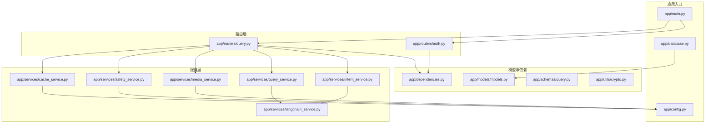
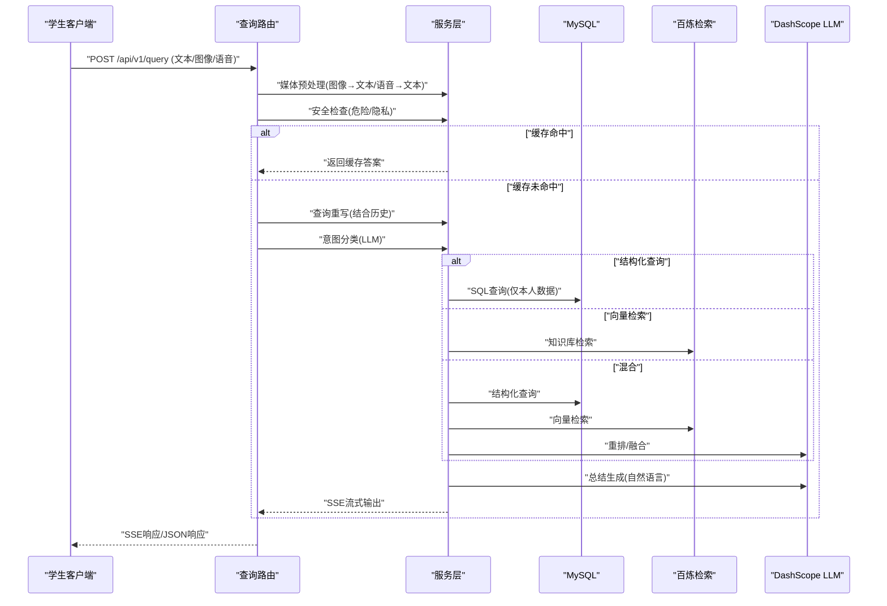
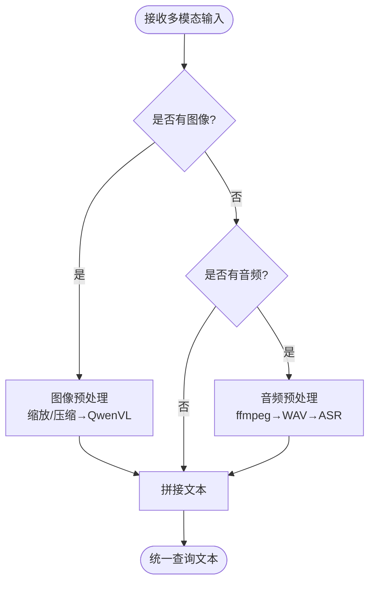
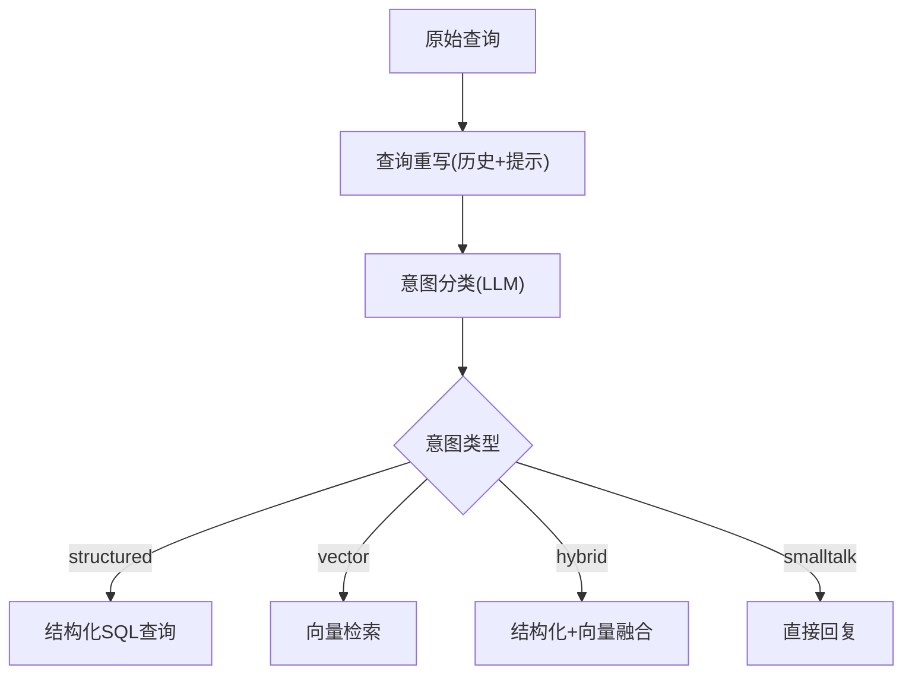
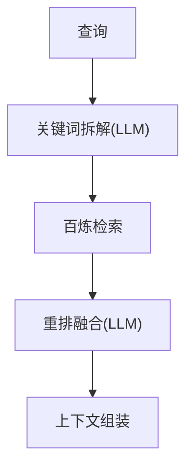
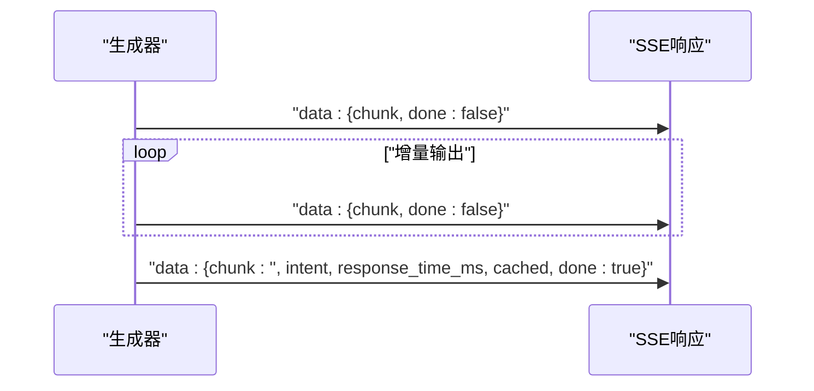
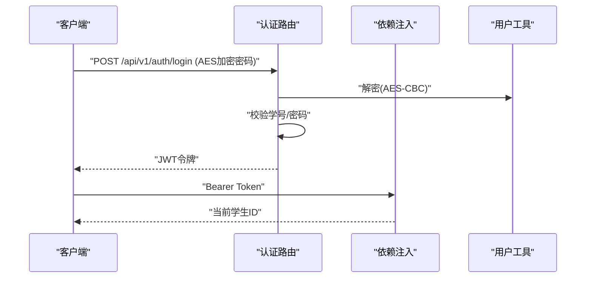
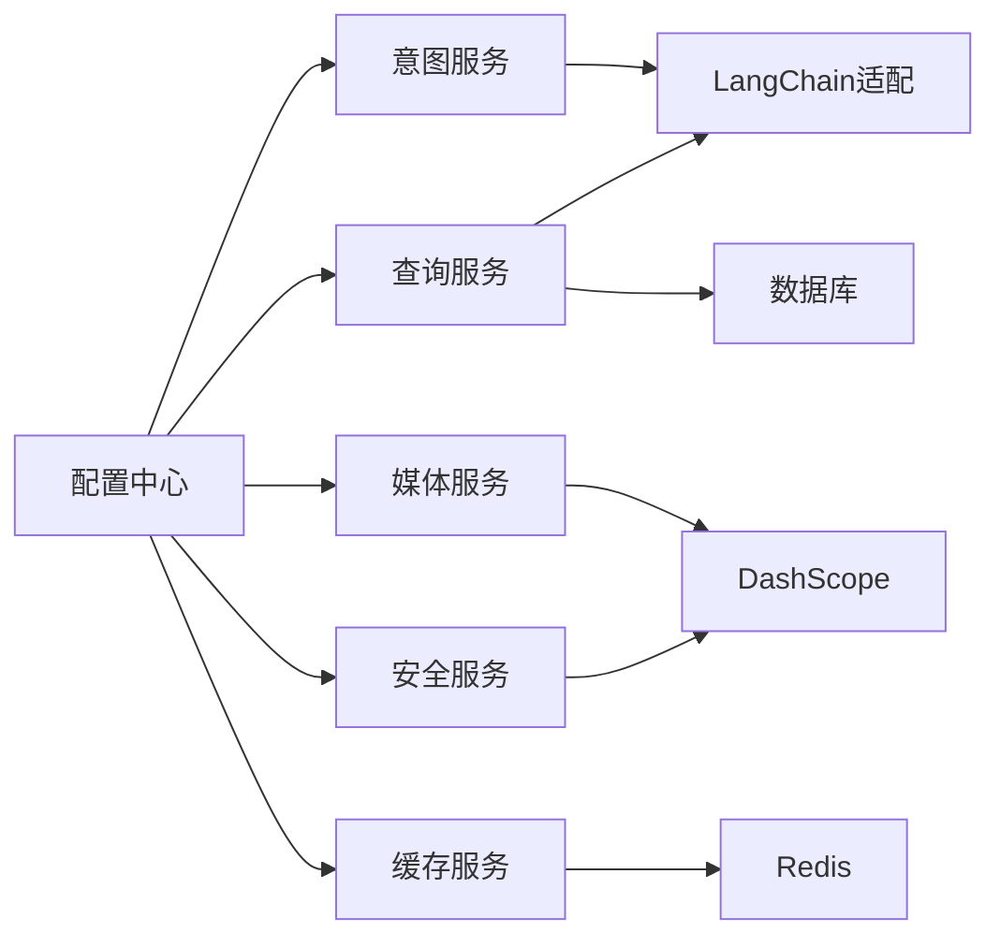

# 核心功能特性

<cite>
**本文档引用的文件**
- [main.py](file://service/ai_assistant/app/main.py)
- [config.py](file://service/ai_assistant/app/config.py)
- [database.py](file://service/ai_assistant/app/database.py)
- [models.py](file://service/ai_assistant/app/models/models.py)
- [query.py](file://service/ai_assistant/app/routers/query.py)
- [auth.py](file://service/ai_assistant/app/routers/auth.py)
- [intent_service.py](file://service/ai_assistant/app/services/intent_service.py)
- [query_service.py](file://service/ai_assistant/app/services/query_service.py)
- [media_service.py](file://service/ai_assistant/app/services/media_service.py)
- [safety_service.py](file://service/ai_assistant/app/services/safety_service.py)
- [cache_service.py](file://service/ai_assistant/app/services/cache_service.py)
- [langchain_service.py](file://service/ai_assistant/app/services/langchain_service.py)
- [dependencies.py](file://service/ai_assistant/app/dependencies.py)
- [crypto.py](file://service/ai_assistant/app/utils/crypto.py)
- [query.py](file://service/ai_assistant/app/schemas/query.py)
</cite>

## 目录
1. [简介](#简介)
2. [项目结构](#项目结构)
3. [核心组件](#核心组件)
4. [架构总览](#架构总览)
5. [详细组件分析](#详细组件分析)
6. [依赖分析](#依赖分析)
7. [性能考虑](#性能考虑)
8. [故障排查指南](#故障排查指南)
9. [结论](#结论)
10. [附录](#附录)

## 简介
本项目为“AI校园助手”，面向高校学生提供统一的多模态校园问答服务。系统支持文本、图像、语音三种输入方式，通过智能意图分类与查询重写、结构化数据查询、向量检索与RAG、混合查询执行、SSE流式响应以及JWT认证与安全防护，形成完整闭环。本文档聚焦核心功能特性，解释工作原理、技术实现与用户体验优势，并提供使用场景与扩展建议。

## 项目结构
后端采用FastAPI + SQLAlchemy + Redis + DashScope（阿里平寻）构建，遵循分层架构：
- 应用入口与生命周期管理
- 配置中心与数据库连接
- 路由层（认证、查询、系统）
- 服务层（意图、查询、媒体、安全、缓存、LangChain适配）
- 模型层（校园业务实体）
- 依赖注入与认证
- 工具与加密



**图表来源**
- [main.py:52-86](file://service/ai_assistant/app/main.py#L52-L86)
- [config.py:6-113](file://service/ai_assistant/app/config.py#L6-L113)
- [database.py:1-35](file://service/ai_assistant/app/database.py#L1-L35)
- [auth.py:1-102](file://service/ai_assistant/app/routers/auth.py#L1-L102)
- [query.py:1-788](file://service/ai_assistant/app/routers/query.py#L1-L788)
- [intent_service.py:1-346](file://service/ai_assistant/app/services/intent_service.py#L1-L346)
- [query_service.py:1-800](file://service/ai_assistant/app/services/query_service.py#L1-L800)
- [media_service.py:1-246](file://service/ai_assistant/app/services/media_service.py#L1-L246)
- [safety_service.py:1-163](file://service/ai_assistant/app/services/safety_service.py#L1-L163)
- [cache_service.py:1-177](file://service/ai_assistant/app/services/cache_service.py#L1-L177)
- [langchain_service.py:1-278](file://service/ai_assistant/app/services/langchain_service.py#L1-L278)
- [dependencies.py:1-109](file://service/ai_assistant/app/dependencies.py#L1-L109)
- [crypto.py:1-73](file://service/ai_assistant/app/utils/crypto.py#L1-L73)
- [models.py:1-660](file://service/ai_assistant/app/models/models.py#L1-L660)
- [query.py:1-33](file://service/ai_assistant/app/schemas/query.py#L1-L33)

**章节来源**
- [main.py:1-86](file://service/ai_assistant/app/main.py#L1-L86)
- [config.py:1-113](file://service/ai_assistant/app/config.py#L1-L113)
- [database.py:1-35](file://service/ai_assistant/app/database.py#L1-L35)

## 核心组件
- 多模态输入处理：图像理解（QwenVL）、语音识别（Paraformer实时）与文本融合
- 智能意图分类与查询重写：LangChain + DashScope，结合历史上下文
- 结构化数据查询：SQL直连，严格隐私约束（仅本人数据）
- 向量检索与RAG：百炼知识检索 + LLM总结
- 混合查询执行：结构化 + 向量融合，动态意图修正
- SSE流式响应：低延迟、可中断的增量输出
- JWT认证与安全：密码AES-CBC解密、JWT签发、安全检测与隐私保护
- 缓存策略：按敏感度与时间维度的Redis缓存

**章节来源**
- [query.py:1-788](file://service/ai_assistant/app/routers/query.py#L1-L788)
- [intent_service.py:1-346](file://service/ai_assistant/app/services/intent_service.py#L1-L346)
- [query_service.py:1-800](file://service/ai_assistant/app/services/query_service.py#L1-L800)
- [media_service.py:1-246](file://service/ai_assistant/app/services/media_service.py#L1-L246)
- [safety_service.py:1-163](file://service/ai_assistant/app/services/safety_service.py#L1-L163)
- [cache_service.py:1-177](file://service/ai_assistant/app/services/cache_service.py#L1-L177)
- [auth.py:1-102](file://service/ai_assistant/app/routers/auth.py#L1-L102)
- [dependencies.py:1-109](file://service/ai_assistant/app/dependencies.py#L1-L109)
- [crypto.py:1-73](file://service/ai_assistant/app/utils/crypto.py#L1-L73)

## 架构总览
系统采用“路由-服务-模型-外部服务”的分层设计，核心流程如下：
- 认证：登录使用AES解密 + JWT签发
- 输入：多模态预处理（图像/语音→文本）+ 文本拼接
- 安全：危险内容检测 + 隐私检查（禁止查询他人学号）
- 缓存：Redis命中优先，敏感/时间敏感/课表敏感策略
- 意图：LLM分类（structured/vector/hybrid/smalltalk）
- 执行：结构化SQL + 向量检索 + 混合重排
- 总结：LLM生成自然语言回答
- 流式：SSE增量输出，结束包携带元数据
- 日志：对话日志持久化与会话历史



**图表来源**
- [query.py:198-745](file://service/ai_assistant/app/routers/query.py#L198-L745)
- [intent_service.py:218-346](file://service/ai_assistant/app/services/intent_service.py#L218-L346)
- [query_service.py:1-800](file://service/ai_assistant/app/services/query_service.py#L1-L800)
- [media_service.py:115-246](file://service/ai_assistant/app/services/media_service.py#L115-L246)
- [safety_service.py:84-163](file://service/ai_assistant/app/services/safety_service.py#L84-L163)
- [cache_service.py:92-177](file://service/ai_assistant/app/services/cache_service.py#L92-L177)
- [langchain_service.py:139-278](file://service/ai_assistant/app/services/langchain_service.py#L139-L278)

## 详细组件分析

### 多模态输入处理（文本/图像/语音）
- 图像理解：使用配置化模型将Base64图像转为自然语言描述，自动缩放与压缩，避免输入过大
- 语音识别：将Base64音频解码并通过ffmpeg转为16kHz单声道WAV，调用实时ASR模型
- 文本拼接：将图像/语音转文本与原始文本合并，形成统一查询



**图表来源**
- [media_service.py:23-156](file://service/ai_assistant/app/services/media_service.py#L23-L156)
- [media_service.py:159-246](file://service/ai_assistant/app/services/media_service.py#L159-L246)
- [query.py:228-273](file://service/ai_assistant/app/routers/query.py#L228-L273)

**章节来源**
- [media_service.py:1-246](file://service/ai_assistant/app/services/media_service.py#L1-L246)
- [query.py:228-273](file://service/ai_assistant/app/routers/query.py#L228-L273)

### 智能意图分类与查询重写
- 意图分类：将查询归类为structured/vector/hybrid/smalltalk，使用LLM与提示词模板
- 查询重写：结合最近N轮历史，补齐缺失信息（如学期、课程、日期），控制长度
- 上下文截断：针对LLM输入长度限制进行消息裁剪与截断



**图表来源**
- [intent_service.py:218-248](file://service/ai_assistant/app/services/intent_service.py#L218-L248)
- [intent_service.py:251-295](file://service/ai_assistant/app/services/intent_service.py#L251-L295)
- [intent_service.py:163-210](file://service/ai_assistant/app/services/intent_service.py#L163-L210)

**章节来源**
- [intent_service.py:1-346](file://service/ai_assistant/app/services/intent_service.py#L1-L346)

### 结构化数据查询（SQL）
- 隐私约束：所有查询仅限当前学生本人数据，防止越权
- 工具规划：根据意图与关键词选择合适工具（成绩、课表、选课、个人信息、通讯录、目录）
- 自动学期解析：根据日期推断当前/上/下学期，或手动指定
- 结果美化：字段名翻译、学期ID格式化、布尔值人性化

```mermaid
classDiagram
class QueryService {
+get_my_scores()
+get_my_schedule()
+get_my_enrollment()
+get_my_info()
+get_my_academic_overview()
+list_departments_and_majors()
+search_teachers()
+resolve_term_id()
}
class Models {
<<entities>>
"Student/Score/Schedule/Course/Teacher/Classroom/Term..."
}
QueryService --> Models : "SQL查询"
```

**图表来源**
- [query_service.py:575-800](file://service/ai_assistant/app/services/query_service.py#L575-L800)
- [models.py:304-480](file://service/ai_assistant/app/models/models.py#L304-L480)

**章节来源**
- [query_service.py:1-800](file://service/ai_assistant/app/services/query_service.py#L1-L800)
- [models.py:1-660](file://service/ai_assistant/app/models/models.py#L1-L660)

### 向量检索与RAG
- 百炼检索：封装为LangChain检索器，支持异步检索
- 查询拆解：将复杂问题拆分为关键词短语，提升召回
- 重排融合：将检索结果与结构化结果去重、筛选、重排
- 上下文截断：对大体量上下文进行头尾截断，保留关键信息



**图表来源**
- [query_service.py:150-176](file://service/ai_assistant/app/services/query_service.py#L150-L176)
- [query_service.py:212-237](file://service/ai_assistant/app/services/query_service.py#L212-L237)
- [langchain_service.py:206-278](file://service/ai_assistant/app/services/langchain_service.py#L206-L278)

**章节来源**
- [query_service.py:1-800](file://service/ai_assistant/app/services/query_service.py#L1-L800)
- [langchain_service.py:1-278](file://service/ai_assistant/app/services/langchain_service.py#L1-L278)

### 混合查询执行与意图修正
- 执行阶段：根据意图类型分别调用结构化查询或向量检索，或两者融合
- 动态修正：根据实际返回上下文（是否包含结构化/向量标识）修正意图
- 场景示例：从“查询我的课表”到“查询某周课表”，自动切换至结构化或混合

**章节来源**
- [query.py:529-573](file://service/ai_assistant/app/routers/query.py#L529-L573)

### SSE流式响应
- 低延迟：在数据库连接释放后，使用独立会话持久化最终回答
- 增量输出：逐块返回token，支持中断与恢复
- 结束包：包含意图、耗时、缓存标记等元数据
- 兼容性：设置必要的HTTP头避免反向代理缓冲



**图表来源**
- [query.py:659-745](file://service/ai_assistant/app/routers/query.py#L659-L745)

**章节来源**
- [query.py:115-125](file://service/ai_assistant/app/routers/query.py#L115-L125)
- [query.py:659-745](file://service/ai_assistant/app/routers/query.py#L659-L745)

### JWT认证与安全保护
- 登录流程：前端使用CryptoJS AES-CBC加密密码，后端解密后验证，签发JWT
- 依赖注入：HTTP Bearer校验，获取当前学生ID
- 危险内容检测：LLM判断自杀/自残/暴力倾向，必要时触发干预
- 隐私保护：禁止查询他人学号，违者拦截并提示



**图表来源**
- [auth.py:24-52](file://service/ai_assistant/app/routers/auth.py#L24-L52)
- [dependencies.py:56-72](file://service/ai_assistant/app/dependencies.py#L56-L72)
- [crypto.py:39-73](file://service/ai_assistant/app/utils/crypto.py#L39-L73)

**章节来源**
- [auth.py:1-102](file://service/ai_assistant/app/routers/auth.py#L1-L102)
- [dependencies.py:1-109](file://service/ai_assistant/app/dependencies.py#L1-L109)
- [crypto.py:1-73](file://service/ai_assistant/app/utils/crypto.py#L1-L73)
- [safety_service.py:84-163](file://service/ai_assistant/app/services/safety_service.py#L84-L163)

### 缓存策略与会话历史
- 缓存键：基于DID与查询哈希，版本化隔离
- 敏感度：按关键词判断，敏感查询短TTL，普通查询长TTL
- 时间敏感：相对日期/周/学期查询按当日桶失效
- 课表敏感：管理员改课后递增版本号，强制失效
- 会话历史：Redis按会话隔离存储，避免并发串话

**章节来源**
- [cache_service.py:1-177](file://service/ai_assistant/app/services/cache_service.py#L1-L177)
- [query.py:153-196](file://service/ai_assistant/app/routers/query.py#L153-L196)

## 依赖分析
- 外部依赖：DashScope（多模态/ASR/生成）、百炼检索、Redis、MySQL
- 内部耦合：路由依赖服务层；服务层依赖配置、LangChain适配器与模型
- 安全边界：认证与授权在依赖注入层完成，服务层严格遵守隐私约束



**图表来源**
- [config.py:48-113](file://service/ai_assistant/app/config.py#L48-L113)
- [intent_service.py:17-21](file://service/ai_assistant/app/services/intent_service.py#L17-L21)
- [query_service.py:29-47](file://service/ai_assistant/app/services/query_service.py#L29-L47)
- [media_service.py:17-21](file://service/ai_assistant/app/services/media_service.py#L17-L21)
- [safety_service.py:9-12](file://service/ai_assistant/app/services/safety_service.py#L9-L12)
- [cache_service.py:18-19](file://service/ai_assistant/app/services/cache_service.py#L18-L19)

**章节来源**
- [config.py:1-113](file://service/ai_assistant/app/config.py#L1-L113)
- [dependencies.py:1-109](file://service/ai_assistant/app/dependencies.py#L1-L109)

## 性能考虑
- 异步与并发：媒体处理、安全检查、意图重写并行执行，缩短端到端延迟
- 连接池：数据库与Redis连接池复用，避免频繁创建销毁
- 缓存命中：热点查询快速返回，减轻后端压力
- 流式输出：边生成边返回，降低首字节延迟
- 输入裁剪：对LLM输入进行消息裁剪与截断，避免超限

[本节为通用指导，无需特定文件引用]

## 故障排查指南
- 媒体处理失败：检查图像/音频Base64格式、ffmpeg可用性与DashScope API状态
- 安全拦截：若被判定危险或隐私违规，查看对应检测逻辑与提示
- 缓存异常：Redis不可用时自动降级，检查键空间与TTL策略
- LLM调用失败：检查模型配置、API Key与网络代理设置
- 认证失败：确认JWT签名、过期时间与AES密钥一致性

**章节来源**
- [media_service.py:115-156](file://service/ai_assistant/app/services/media_service.py#L115-L156)
- [media_service.py:159-246](file://service/ai_assistant/app/services/media_service.py#L159-L246)
- [safety_service.py:84-163](file://service/ai_assistant/app/services/safety_service.py#L84-L163)
- [cache_service.py:92-177](file://service/ai_assistant/app/services/cache_service.py#L92-L177)
- [langchain_service.py:139-204](file://service/ai_assistant/app/services/langchain_service.py#L139-L204)
- [dependencies.py:56-72](file://service/ai_assistant/app/dependencies.py#L56-L72)

## 结论
本系统通过多模态输入、智能意图与查询重写、结构化与向量融合、SSE流式响应与JWT安全体系，实现了高效、安全、可扩展的校园问答能力。其模块化设计便于演进与维护，适合在高校场景中持续迭代与推广。

[本节为总结，无需特定文件引用]

## 附录
- 使用场景示例
  - 图片问答：上传课堂笔记/公式截图，系统直接基于图片内容回答
  - 语音查询：语音播报课表/成绩，系统转写后回答
  - 混合查询：结合本人课表与校历，回答“本周有几节”“下周课程”
  - 安全干预：检测到情绪危机时，引导至心理援助渠道
- 开发扩展建议
  - 引入更丰富的检索器与重排策略
  - 增加对话摘要与记忆增强
  - 支持更多媒体格式与多轮上下文压缩
  - 完善监控与可观测性指标

[本节为概念性内容，无需特定文件引用]