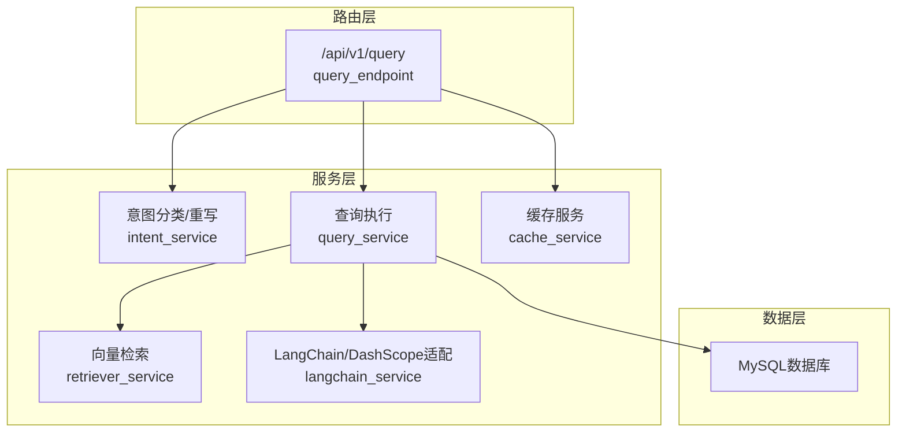
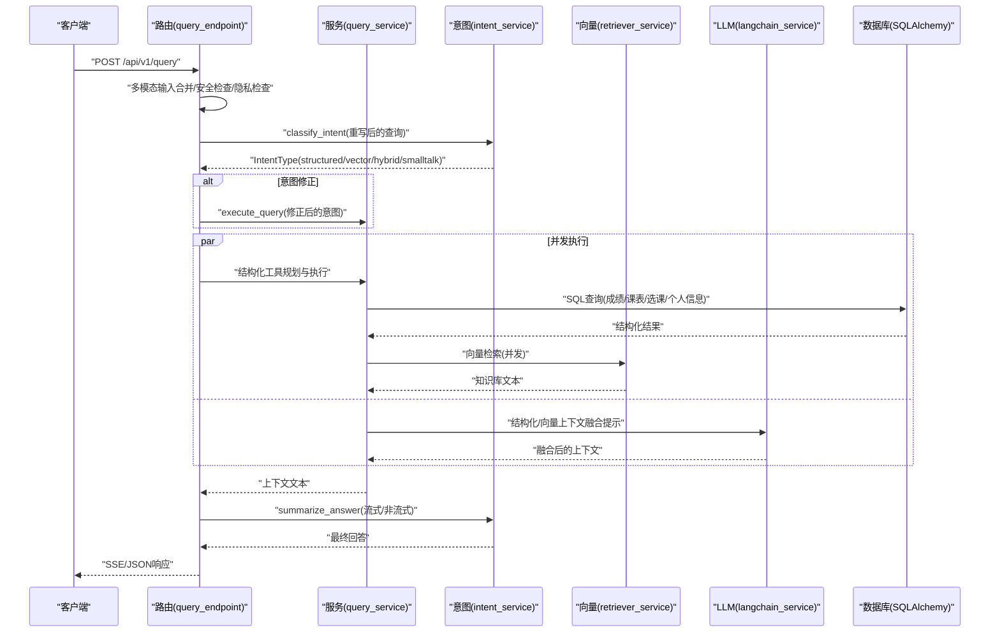
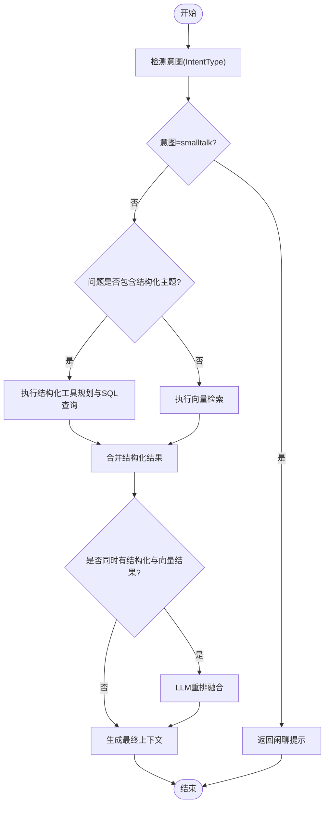
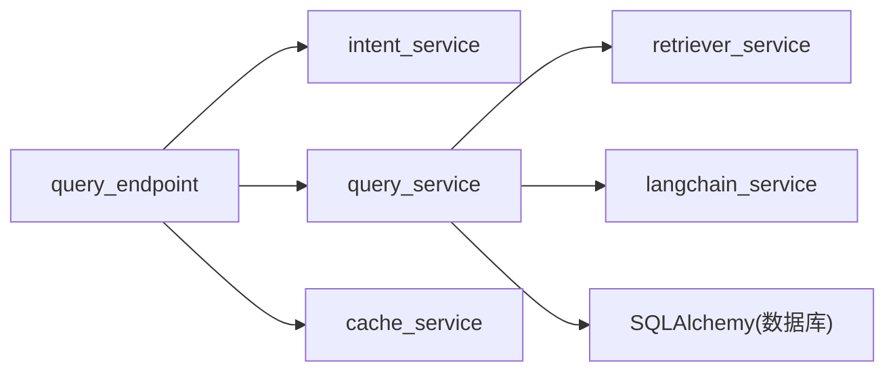

# 混合查询执行

<cite>
**本文档引用的文件**
- [query_service.py](file://service/ai_assistant/app/services/query_service.py)
- [query.py](file://service/ai_assistant/app/routers/query.py)
- [intent_service.py](file://service/ai_assistant/app/services/intent_service.py)
- [retriever_service.py](file://service/ai_assistant/app/services/retriever_service.py)
- [langchain_service.py](file://service/ai_assistant/app/services/langchain_service.py)
- [query.py](file://service/ai_assistant/app/schemas/query.py)
- [cache_service.py](file://service/ai_assistant/app/services/cache_service.py)
- [config.py](file://service/ai_assistant/app/config.py)
</cite>

## 目录
1. [简介](#简介)
2. [项目结构](#项目结构)
3. [核心组件](#核心组件)
4. [架构总览](#架构总览)
5. [详细组件分析](#详细组件分析)
6. [依赖关系分析](#依赖关系分析)
7. [性能考量](#性能考量)
8. [故障排查指南](#故障排查指南)
9. [结论](#结论)
10. [附录](#附录)

## 简介
本文件面向AI校园助手的“混合查询执行”能力，系统性阐述如何在同一请求中同时处理结构化数据查询（如个人课表、成绩、选课）与向量检索（知识库规则、政策、流程等），并融合两类结果生成最终回答。文档覆盖：
- 混合查询的触发条件与意图修正
- 查询策略选择（结构化/向量/混合）与执行路径
- 结果融合算法与最终答案生成机制
- 不同类型混合查询的处理流程与优化策略
- 错误恢复与稳定性保障
- 开发者优化技巧与系统集成要点

## 项目结构
后端采用FastAPI + SQLAlchemy + LangChain + DashScope的组合，查询链路位于服务层与路由层之间，形成“意图分类 → 查询执行 → 结果融合 → 总结输出”的闭环。

图表来源
- [query.py:198-746](file://service/ai_assistant/app/routers/query.py#L198-L746)
- [intent_service.py:218-346](file://service/ai_assistant/app/services/intent_service.py#L218-L346)
- [query_service.py:1807-1913](file://service/ai_assistant/app/services/query_service.py#L1807-L1913)
- [retriever_service.py:23-168](file://service/ai_assistant/app/services/retriever_service.py#L23-L168)
- [langchain_service.py:139-278](file://service/ai_assistant/app/services/langchain_service.py#L139-L278)
- [cache_service.py:92-177](file://service/ai_assistant/app/services/cache_service.py#L92-L177)

章节来源
- [query.py:1-788](file://service/ai_assistant/app/routers/query.py#L1-L788)
- [query_service.py:1-1913](file://service/ai_assistant/app/services/query_service.py#L1-L1913)

## 核心组件
- 路由与入口：统一的查询端点负责多模态输入预处理、缓存命中、意图分类、并发执行、流式输出与缓存写入。
- 意图分类与重写：基于LLM对用户问题进行意图分类（structured/vector/hybrid/smalltalk），并结合历史上下文重写查询，提升后续执行的准确性。
- 查询执行器：根据意图与问题主题，选择结构化工具规划与执行、向量检索或混合执行，并产出统一的上下文文本。
- 向量检索器：封装阿里云百炼检索API，支持查询分解、并发检索、重排与指标上报。
- LangChain适配：统一消息格式、输入裁剪、流式与非流式调用DashScope。
- 缓存服务：基于Redis的键空间隔离、敏感度与时间维度的TTL控制，支持课表版本失效。

章节来源
- [query.py:198-746](file://service/ai_assistant/app/routers/query.py#L198-L746)
- [intent_service.py:218-346](file://service/ai_assistant/app/services/intent_service.py#L218-L346)
- [query_service.py:882-1913](file://service/ai_assistant/app/services/query_service.py#L882-L1913)
- [retriever_service.py:23-168](file://service/ai_assistant/app/services/retriever_service.py#L23-L168)
- [langchain_service.py:139-278](file://service/ai_assistant/app/services/langchain_service.py#L139-L278)
- [cache_service.py:92-177](file://service/ai_assistant/app/services/cache_service.py#L92-L177)

## 架构总览
混合查询执行的整体流程如下：

图表来源
- [query.py:207-746](file://service/ai_assistant/app/routers/query.py#L207-L746)
- [intent_service.py:218-346](file://service/ai_assistant/app/services/intent_service.py#L218-L346)
- [query_service.py:1807-1913](file://service/ai_assistant/app/services/query_service.py#L1807-L1913)
- [retriever_service.py:46-135](file://service/ai_assistant/app/services/retriever_service.py#L46-L135)
- [langchain_service.py:139-278](file://service/ai_assistant/app/services/langchain_service.py#L139-L278)

## 详细组件分析

### 组件A：混合查询触发与意图修正
- 触发条件
  - 当原始意图分类为vector，但在执行后发现同时存在结构化数据与向量检索结果时，意图会被修正为hybrid。
  - 当原始意图分类为structured，但实际执行中仅触发向量检索，意图会被修正为vector。
  - 当问题包含“我的”或结构化主题关键词（如课表、成绩、选课、教师、联系方式等），且原始意图为smalltalk时，会被强制修正为structured。
- 意图修正逻辑
  - 在执行完成后，根据上下文是否包含“结构化判定”“结构化数据结果”“知识库内容”等标识，动态调整意图类型，确保最终回答与实际执行一致。

章节来源
- [query.py:551-573](file://service/ai_assistant/app/routers/query.py#L551-L573)

### 组件B：查询策略选择与执行
- 策略选择
  - structured：仅执行结构化工具规划与SQL查询。
  - vector：仅执行向量检索。
  - hybrid：并发执行结构化与向量检索，再由LLM进行重排融合。
  - smalltalk：直接返回闲聊提示，不执行结构化或向量检索。
- 执行路径
  - 结构化工具规划：基于LLM生成工具调用计划（tool_calls），解析JSON，补充缺失参数（如学期ID），执行工具并格式化结果。
  - 向量检索：查询分解（多片段）、并发检索、去重合并、指标上报。
  - 混合融合：当两侧均有结果时，使用专门提示模板进行重排，优先保留与问题最相关的片段。

图表来源
- [query_service.py:1807-1913](file://service/ai_assistant/app/services/query_service.py#L1807-L1913)
- [query_service.py:882-1067](file://service/ai_assistant/app/services/query_service.py#L882-L1067)

章节来源
- [query_service.py:1807-1913](file://service/ai_assistant/app/services/query_service.py#L1807-L1913)

### 组件C：结构化工具规划与执行
- 工具集
  - get_my_scores、get_my_schedule、get_my_enrollment、get_my_info、get_my_academic_overview、list_departments_and_majors、search_teachers。
- 规划与纠偏
  - LLM生成tool_calls，解析失败时回退到规则检测（按关键词识别所需工具）。
  - 对联系人查询进行强制纠偏，确保优先执行search_teachers。
  - 自动补充学期参数（term_id），并校验学期有效性。
- 结果融合
  - 将结构化结果翻译为中文可读格式，生成“结构化判定”摘要（如周次、停课、目标周无课日等），便于后续LLM总结。

章节来源
- [query_service.py:1510-1744](file://service/ai_assistant/app/services/query_service.py#L1510-L1744)

### 组件D：向量检索与重排
- 查询分解
  - 将用户问题拆分为1-3个核心关键词，分别检索，再合并去重。
- 并发检索
  - retriever与app双通道并发，分别返回文本块，避免单点瓶颈。
- 重排融合
  - 当两侧均非“未命中”时，使用LLM对两侧候选进行去重、筛选与重排，输出更相关、更有信息量的融合文本。
- 指标上报
  - 记录路由类型、片段数量与耗时，便于性能调优。

章节来源
- [query_service.py:894-1067](file://service/ai_assistant/app/services/query_service.py#L894-L1067)
- [retriever_service.py:46-135](file://service/ai_assistant/app/services/retriever_service.py#L46-L135)

### 组件E：最终答案生成与流式输出
- 非流式JSON输出：在请求会话释放数据库连接后，调用LLM进行总结，写入缓存并持久化聊天日志。
- 流式SSE输出：在流式阶段尽量避免持有数据库连接，使用独立会话写入最终日志，保证稳定性。
- 输出规范：严格遵循回答规范，避免暴露内部字段名、term_id等技术细节，统一使用中文可读格式。

章节来源
- [query.py:582-746](file://service/ai_assistant/app/routers/query.py#L582-L746)
- [intent_service.py:71-346](file://service/ai_assistant/app/services/intent_service.py#L71-L346)

## 依赖关系分析
- 组件耦合
  - 路由层依赖意图分类、查询执行、缓存与媒体服务；查询执行器依赖数据库、向量检索与LLM适配；意图分类依赖LLM适配。
- 外部依赖
  - 阿里云百炼检索API、DashScope LLM、Redis、MySQL。
- 循环依赖
  - 未发现循环依赖，模块职责清晰。

图表来源
- [query.py:198-746](file://service/ai_assistant/app/routers/query.py#L198-L746)
- [query_service.py:1807-1913](file://service/ai_assistant/app/services/query_service.py#L1807-L1913)
- [retriever_service.py:23-168](file://service/ai_assistant/app/services/retriever_service.py#L23-L168)
- [langchain_service.py:139-278](file://service/ai_assistant/app/services/langchain_service.py#L139-L278)
- [cache_service.py:92-177](file://service/ai_assistant/app/services/cache_service.py#L92-L177)

章节来源
- [query.py:198-746](file://service/ai_assistant/app/routers/query.py#L198-L746)
- [query_service.py:1807-1913](file://service/ai_assistant/app/services/query_service.py#L1807-L1913)

## 性能考量
- 并发执行
  - 结构化与向量检索并行，显著降低端到端延迟。
  - 向量检索采用查询分解与并发，提高召回质量与吞吐。
- 输入裁剪
  - LangChain适配层对消息与上下文进行裁剪，避免超出模型输入上限。
- 缓存策略
  - 基于DID与查询哈希的键空间隔离，敏感查询与普通查询采用不同TTL；课表相关查询支持版本失效，避免管理员改课后命中旧缓存。
- 指标监控
  - 向量检索路由与片段数量、耗时指标上报，便于定位性能瓶颈。

章节来源
- [query.py:347-500](file://service/ai_assistant/app/routers/query.py#L347-L500)
- [query_service.py:934-1067](file://service/ai_assistant/app/services/query_service.py#L934-L1067)
- [langchain_service.py:20-96](file://service/ai_assistant/app/services/langchain_service.py#L20-L96)
- [cache_service.py:85-177](file://service/ai_assistant/app/services/cache_service.py#L85-L177)

## 故障排查指南
- 意图分类失败
  - 现象：分类异常或返回vector。
  - 处理：查看日志中的分类失败回退，确认提示词与模型配置。
- 结构化工具规划失败
  - 现象：JSON解析失败或tool_calls为空。
  - 处理：启用规则回退（按关键词识别工具），检查工具参数（如term_id）。
- 向量检索失败
  - 现象：返回“未在知识库中找到相关信息”或API错误。
  - 处理：检查百炼检索配置、索引ID与工作区ID；必要时降级为app模式或仅执行结构化查询。
- 流式输出异常
  - 现象：SSE中途报错或空回答。
  - 处理：查看公共错误映射，确认模型调用状态码与消息；确保最终日志写入使用独立会话。
- 缓存命中异常
  - 现象：敏感查询或课表查询命中过期语义。
  - 处理：检查敏感关键词匹配与日期/课表版本失效逻辑。

章节来源
- [query.py:142-151](file://service/ai_assistant/app/routers/query.py#L142-L151)
- [query_service.py:1665-1682](file://service/ai_assistant/app/services/query_service.py#L1665-L1682)
- [retriever_service.py:132-135](file://service/ai_assistant/app/services/retriever_service.py#L132-L135)
- [cache_service.py:114-143](file://service/ai_assistant/app/services/cache_service.py#L114-L143)

## 结论
混合查询执行通过“意图分类 + 结构化工具规划 + 向量检索 + LLM融合”的流水线，实现了对复杂校园问题的综合解答。系统在并发、缓存、输入裁剪与指标监控方面具备完善的性能与稳定性保障，能够灵活应对不同类型的混合查询场景。

## 附录

### 混合查询示例
- 示例1：结合个人成绩与校园规定的综合咨询
  - 问题：我上学期的必修课学分是否满足奖学金申请条件？需要参考哪些政策？
  - 执行：结构化查询获取上学期成绩与学分；向量检索获取奖学金政策；LLM融合生成最终回答。
- 示例2：结合课表与教师联系方式的综合咨询
  - 问题：下周三下午的课程教室在哪里？任课老师联系方式是什么？
  - 执行：结构化查询获取下周三课表；向量检索获取教师通讯录；LLM融合生成最终回答。

### 开发者优化技巧
- 调整意图分类与重写提示词，提升结构化主题识别准确率。
- 优化查询分解策略，增加领域关键词权重，提高向量召回质量。
- 在混合重排中引入更细粒度的相似度阈值与去重策略，减少冗余。
- 对热点查询开启并发缓存，缩短冷启动时间。
- 关注模型输入裁剪参数，避免历史消息过长导致截断。

### 系统集成方法
- 配置百炼检索与DashScope API密钥，确保检索与LLM调用可用。
- 设置Redis与MySQL连接参数，保证缓存与数据库稳定。
- 在路由层启用SSE流式输出，提升用户体验；在非流式场景下注意数据库连接释放与独立会话写日志。
- 通过环境变量与配置类集中管理模型与外部服务参数，便于部署与切换。

章节来源
- [config.py:6-113](file://service/ai_assistant/app/config.py#L6-L113)
- [query.py:198-746](file://service/ai_assistant/app/routers/query.py#L198-L746)
- [query_service.py:1807-1913](file://service/ai_assistant/app/services/query_service.py#L1807-L1913)