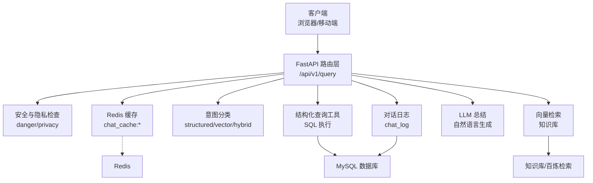
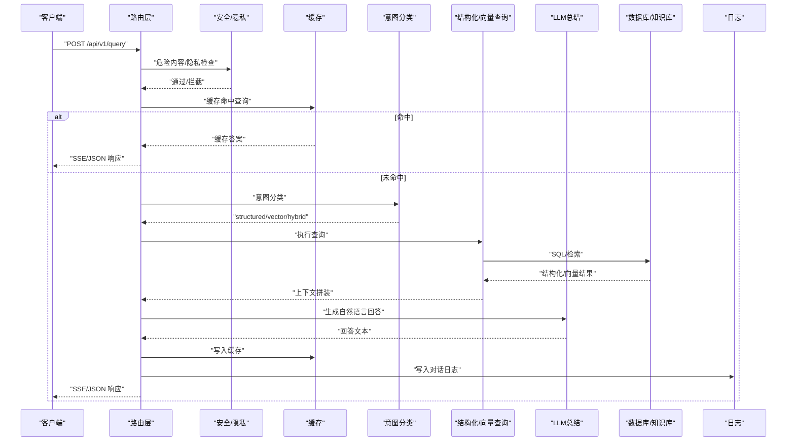
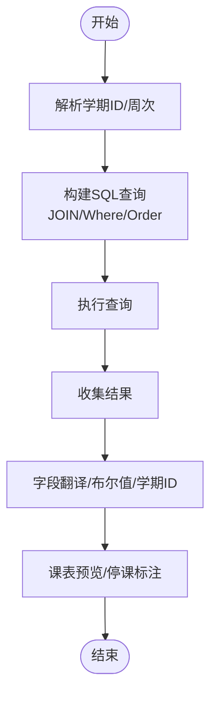
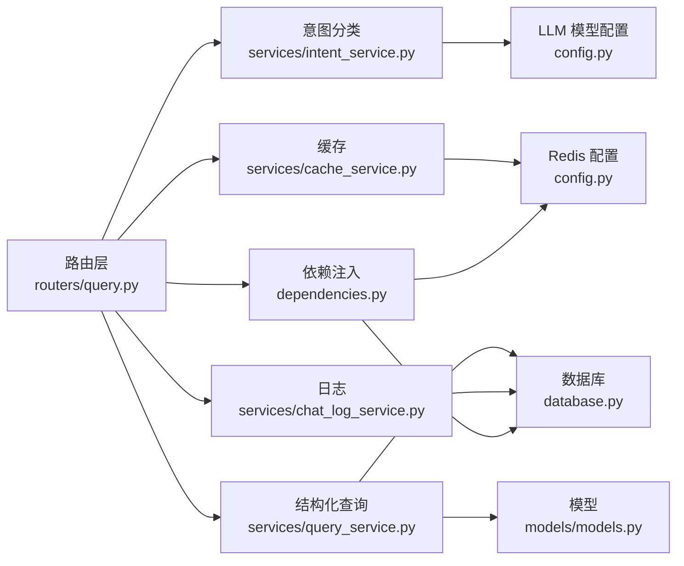

# 结构化数据查询

<cite>
**本文档引用的文件**
- [query.py](file://service/ai_assistant/app/routers/query.py)
- [query_service.py](file://service/ai_assistant/app/services/query_service.py)
- [models.py](file://service/ai_assistant/app/models/models.py)
- [database.py](file://service/ai_assistant/app/database.py)
- [dependencies.py](file://service/ai_assistant/app/dependencies.py)
- [config.py](file://service/ai_assistant/app/config.py)
- [privacy.py](file://service/ai_assistant/app/utils/privacy.py)
- [cache_service.py](file://service/ai_assistant/app/services/cache_service.py)
- [intent_service.py](file://service/ai_assistant/app/services/intent_service.py)
- [chat_log_service.py](file://service/ai_assistant/app/services/chat_log_service.py)
- [main.py](file://service/ai_assistant/app/main.py)
- [query.py](file://service/ai_assistant/app/schemas/query.py)
</cite>

## 目录
1. [简介](#简介)
2. [项目结构](#项目结构)
3. [核心组件](#核心组件)
4. [架构总览](#架构总览)
5. [详细组件分析](#详细组件分析)
6. [依赖关系分析](#依赖关系分析)
7. [性能考量](#性能考量)
8. [故障排查指南](#故障排查指南)
9. [结论](#结论)
10. [附录](#附录)

## 简介
本文件面向AI校园助手的“结构化数据查询”能力，系统性阐述如何基于数据库执行结构化查询（如成绩、课表、个人信息、选课、教师通讯录等），并覆盖SQL查询生成、数据库连接管理、数据安全过滤、结果格式化、权限控制与数据脱敏策略。文档同时提供查询示例与参数说明，帮助用户了解可用的数据查询范围；并为开发者提供查询优化技巧、数据库设计原则与扩展新查询类型的方法。

## 项目结构
后端采用FastAPI + SQLAlchemy异步ORM + Redis缓存的分层架构：
- 路由层：统一入口接收多模态输入，完成安全检查、缓存查找、意图分类、查询执行、LLM总结、缓存与日志落盘。
- 服务层：结构化查询工具（SQL）、向量检索（知识库）、意图分类与回答生成、缓存与会话历史管理。
- 模型层：基于SQLAlchemy ORM的实体模型，涵盖学生、课程、成绩、课表、教师、教室、学期等。
- 基础设施：数据库连接池、Redis连接池、JWT鉴权、日志与配置。

图表来源
- [query.py:198-745](file://service/ai_assistant/app/routers/query.py#L198-L745)
- [query_service.py:1510-1599](file://service/ai_assistant/app/services/query_service.py#L1510-L1599)
- [cache_service.py:92-176](file://service/ai_assistant/app/services/cache_service.py#L92-L176)
- [intent_service.py:218-346](file://service/ai_assistant/app/services/intent_service.py#L218-L346)
- [database.py:7-20](file://service/ai_assistant/app/database.py#L7-L20)
- [main.py:52-86](file://service/ai_assistant/app/main.py#L52-L86)

章节来源
- [main.py:1-86](file://service/ai_assistant/app/main.py#L1-L86)
- [config.py:1-113](file://service/ai_assistant/app/config.py#L1-L113)

## 核心组件
- 路由器：统一的查询入口，负责多模态输入解码、缓存命中、安全与隐私检查、意图分类、查询执行、LLM总结、缓存与日志落盘。
- 结构化查询服务：封装SQL查询工具（成绩、课表、个人信息、选课、教师通讯录、学院专业目录等），提供学期ID解析与校验、周次与目标周解析、结果字段翻译与美化。
- 向量检索服务：基于百炼检索与百炼应用模式的并发检索与重排融合。
- 意图分类与回答生成：将用户问题分类为structured/vector/hybrid/smalltalk，并生成自然语言回答。
- 缓存服务：基于Redis的键空间隔离、TTL策略、日期敏感与课表版本失效控制。
- 数据库与依赖注入：异步引擎与会话池、Redis连接池、JWT鉴权与当前用户解析。
- 日志与隐私：对话日志脱敏存储、DID生成与会话历史隔离。

章节来源
- [query.py:1-788](file://service/ai_assistant/app/routers/query.py#L1-L788)
- [query_service.py:1-1913](file://service/ai_assistant/app/services/query_service.py#L1-L1913)
- [intent_service.py:1-346](file://service/ai_assistant/app/services/intent_service.py#L1-L346)
- [cache_service.py:1-177](file://service/ai_assistant/app/services/cache_service.py#L1-L177)
- [database.py:1-35](file://service/ai_assistant/app/database.py#L1-L35)
- [dependencies.py:1-109](file://service/ai_assistant/app/dependencies.py#L1-L109)
- [privacy.py:1-23](file://service/ai_assistant/app/utils/privacy.py#L1-L23)
- [chat_log_service.py:1-76](file://service/ai_assistant/app/services/chat_log_service.py#L1-L76)

## 架构总览
整体流程分为“多模态输入 → 缓存 → 安全与隐私 → 意图分类 → 查询执行 → LLM总结 → 缓存与日志”的闭环。

图表来源
- [query.py:207-745](file://service/ai_assistant/app/routers/query.py#L207-L745)
- [intent_service.py:218-346](file://service/ai_assistant/app/services/intent_service.py#L218-L346)
- [query_service.py:1034-1067](file://service/ai_assistant/app/services/query_service.py#L1034-L1067)
- [cache_service.py:92-176](file://service/ai_assistant/app/services/cache_service.py#L92-L176)
- [chat_log_service.py:14-55](file://service/ai_assistant/app/services/chat_log_service.py#L14-L55)

## 详细组件分析

### 路由层：统一查询入口
- 多模态输入：支持文本、Base64图像、Base64音频，图像与音频通过媒体服务转文本后合并为统一查询文本。
- 缓存：按DID与查询文本哈希进行缓存键生成，命中即直接返回。
- 安全与隐私：并发执行危险内容检测与隐私违规检测（禁止查询他人学号），拦截后直接返回提示。
- 会话历史：优先从Redis加载最近N轮历史，异常时回退至数据库。
- 意图分类：基于重写后的查询进行分类，支持smalltalk直连回答与图片纯问答直连。
- 查询执行：根据意图调用结构化查询或向量检索，必要时混合重排。
- LLM总结：在JSON模式下提前回滚数据库会话，避免长时间占用连接；流式模式在生成器结束后再落盘日志。
- 缓存与日志：根据敏感度设置TTL，记录会话历史，写入对话日志。

章节来源
- [query.py:198-745](file://service/ai_assistant/app/routers/query.py#L198-L745)

### 结构化查询服务：SQL生成与结果格式化
- 工具集：提供学生成绩、课表、个人信息、选课记录、学术概览、教师通讯录、学院专业目录等工具。
- 学期解析：根据参考日期解析当前/即将到来/之前的学期，或按默认规则猜测学期ID。
- 周次解析：支持“本周/下周/上周/第N周”等自然语言，计算目标周与日分布。
- 字段翻译：将英文字段名翻译为中文可读名称，布尔值转“是/否”，学期ID转中文格式。
- 结果美化：课表预览格式化，停课状态标注，联系方式与办公地点展示。
- 安全约束：所有查询均以当前登录学生ID为隐私边界，禁止跨用户访问。

图表来源
- [query_service.py:575-706](file://service/ai_assistant/app/services/query_service.py#L575-L706)
- [query_service.py:1510-1599](file://service/ai_assistant/app/services/query_service.py#L1510-L1599)
- [query_service.py:840-874](file://service/ai_assistant/app/services/query_service.py#L840-L874)

章节来源
- [query_service.py:575-706](file://service/ai_assistant/app/services/query_service.py#L575-L706)
- [query_service.py:840-874](file://service/ai_assistant/app/services/query_service.py#L840-L874)
- [query_service.py:1510-1599](file://service/ai_assistant/app/services/query_service.py#L1510-L1599)

### 向量检索服务：并发检索与重排
- 路由选择：根据配置决定使用百炼检索、百炼应用或混合重排。
- 查询分解：将用户问题分解为1-3个关键词片段，提高召回。
- 并发检索：对每个片段并发检索，去重合并。
- 重排融合：当两侧均有结果时，使用LLM对检索结果进行去重与重排。

章节来源
- [query_service.py:1034-1067](file://service/ai_assistant/app/services/query_service.py#L1034-L1067)
- [query_service.py:894-1031](file://service/ai_assistant/app/services/query_service.py#L894-L1031)

### 意图分类与回答生成
- 意图分类：将问题归类为structured/vector/hybrid/smalltalk，支持向量化与混合路径。
- 查询重写：结合最近N轮历史，补全缺失的学期、课程、日期等上下文信息。
- 回答生成：严格遵循规范，避免泄露字段名、term_id等技术信息，使用中文可读格式输出。

章节来源
- [intent_service.py:218-346](file://service/ai_assistant/app/services/intent_service.py#L218-L346)

### 缓存与会话历史
- 键空间：chat_cache:{version}:{did}:{query_md5}，版本号用于升级隔离。
- TTL策略：敏感查询30分钟，普通查询1天；日期敏感查询按“当日桶”失效，课表相关查询按版本号失效。
- 会话历史：按DID+会话ID隔离，避免并发会话串话；异常时回退至数据库历史。

章节来源
- [cache_service.py:49-176](file://service/ai_assistant/app/services/cache_service.py#L49-L176)
- [query.py:153-196](file://service/ai_assistant/app/routers/query.py#L153-L196)

### 数据库与依赖注入
- 异步引擎：基于SQLAlchemy异步引擎，启用pre_ping与回收策略。
- 会话池：异步会话工厂，expire_on_commit=false以提升性能。
- Redis连接池：全局单例，按配置URL连接。
- JWT鉴权：Bearer Token解析当前学生ID，作为后续隐私与权限控制依据。

章节来源
- [database.py:7-20](file://service/ai_assistant/app/database.py#L7-L20)
- [dependencies.py:27-50](file://service/ai_assistant/app/dependencies.py#L27-L50)
- [dependencies.py:56-72](file://service/ai_assistant/app/dependencies.py#L56-L72)

### 日志与隐私
- 对话日志：普通消息仅存储DID，危险消息存储原始student_id以便干预。
- DID生成：基于student_id与盐值生成稳定的哈希，用于日志关联与会话隔离。
- 会话历史：按DID+会话ID写入Redis列表，限制长度并设置过期。

章节来源
- [chat_log_service.py:14-55](file://service/ai_assistant/app/services/chat_log_service.py#L14-L55)
- [privacy.py:9-22](file://service/ai_assistant/app/utils/privacy.py#L9-L22)
- [query.py:153-196](file://service/ai_assistant/app/routers/query.py#L153-L196)

## 依赖关系分析

图表来源
- [query.py:34-42](file://service/ai_assistant/app/routers/query.py#L34-L42)
- [query_service.py:29-47](file://service/ai_assistant/app/services/query_service.py#L29-L47)
- [intent_service.py:17-21](file://service/ai_assistant/app/services/intent_service.py#L17-L21)
- [cache_service.py:18-19](file://service/ai_assistant/app/services/cache_service.py#L18-L19)
- [database.py:1-35](file://service/ai_assistant/app/database.py#L1-L35)
- [dependencies.py:1-109](file://service/ai_assistant/app/dependencies.py#L1-L109)
- [config.py:85-112](file://service/ai_assistant/app/config.py#L85-L112)

章节来源
- [query.py:34-42](file://service/ai_assistant/app/routers/query.py#L34-L42)
- [query_service.py:29-47](file://service/ai_assistant/app/services/query_service.py#L29-L47)
- [intent_service.py:17-21](file://service/ai_assistant/app/services/intent_service.py#L17-L21)
- [cache_service.py:18-19](file://service/ai_assistant/app/services/cache_service.py#L18-L19)
- [database.py:1-35](file://service/ai_assistant/app/database.py#L1-L35)
- [dependencies.py:1-109](file://service/ai_assistant/app/dependencies.py#L1-L109)
- [config.py:85-112](file://service/ai_assistant/app/config.py#L85-L112)

## 性能考量
- 连接池与回收：数据库与Redis均启用连接池与回收策略，避免连接泄漏。
- 并发优化：安全检查、隐私检查与意图重写并行执行，缩短首字节延迟。
- 流式输出：流式模式下尽早回滚数据库会话，避免长时间占用连接。
- 缓存策略：敏感/普通/日期敏感/课表相关差异化TTL，降低无效命中成本。
- 向量检索：查询片段并发检索与去重，减少重复IO。
- 字段翻译与格式化：在内存中进行，避免额外网络往返。

[本节为通用指导，无需特定文件引用]

## 故障排查指南
- 缓存异常：Redis不可用时自动降级，检查Redis连接配置与网络。
- 危险内容拦截：若返回干预提示，确认安全模型配置与输入内容。
- 隐私违规：禁止查询他人学号，若命中将直接返回提示。
- 意图分类失败：回退为向量检索，检查LLM模型配置与提示词。
- 查询超时：检查数据库慢查询、索引缺失与连接池饱和。
- 会话历史异常：Redis写入失败时回退至数据库，检查历史数量限制与TTL。

章节来源
- [query.py:349-470](file://service/ai_assistant/app/routers/query.py#L349-L470)
- [cache_service.py:92-146](file://service/ai_assistant/app/services/cache_service.py#L92-L146)
- [intent_service.py:218-248](file://service/ai_assistant/app/services/intent_service.py#L218-L248)

## 结论
本系统通过“路由层 + 服务层 + 模型层 + 基础设施”的清晰分层，实现了多模态输入到结构化数据查询的完整链路。结构化查询以SQL为核心，辅以向量检索与混合重排，结合严格的隐私与安全策略、会话历史隔离与缓存治理，既保障了用户体验，又满足了校园数据安全与合规要求。开发者可在此基础上扩展新的查询工具与意图类型，持续优化性能与准确性。

[本节为总结性内容，无需特定文件引用]

## 附录

### 支持的结构化查询类型与参数
- 查询学生成绩
  - 工具：get_my_scores
  - 参数：term_id（可选，6位数字，如202509）
  - 输出：课程名称、学期、成绩、学分、是否获得学分
- 查询学生课表
  - 工具：get_my_schedule
  - 参数：term_id（可选，6位数字）
  - 输出：课程名称、周次、星期、节次、教室、教师、学期信息、周次统计
- 查询学生选课记录
  - 工具：get_my_enrollment
  - 参数：term_id（可选，6位数字）
  - 输出：课程名称、学期、学分、课程类型
- 查询学生个人信息
  - 工具：get_my_info
  - 输出：姓名、性别、入学年份、班级ID、联系方式、状态
- 查询学术概览
  - 工具：get_my_academic_overview
  - 输出：班级、专业、学院、年级
- 教师通讯录
  - 工具：search_teachers
  - 参数：keyword（可选，按姓名/学院/电话/邮箱模糊匹配）
  - 输出：教师姓名、职称、学院、联系方式、办公信息
- 学院与专业目录
  - 工具：list_departments_and_majors
  - 输出：学院与下属专业列表

章节来源
- [query_service.py:575-706](file://service/ai_assistant/app/services/query_service.py#L575-L706)
- [query_service.py:729-750](file://service/ai_assistant/app/services/query_service.py#L729-L750)
- [query_service.py:709-726](file://service/ai_assistant/app/services/query_service.py#L709-L726)
- [query_service.py:752-776](file://service/ai_assistant/app/services/query_service.py#L752-L776)
- [query_service.py:805-837](file://service/ai_assistant/app/services/query_service.py#L805-L837)
- [query_service.py:779-802](file://service/ai_assistant/app/services/query_service.py#L779-L802)

### 查询示例与参数说明
- “我上学期的成绩”
  - 自动解析“上学期”为term_id，调用get_my_scores
- “本周课表”
  - 解析“本周”为目标周，调用get_my_schedule并裁剪为目标周
- “张三的电话”
  - 提取联系人“张三”，调用search_teachers并按姓名匹配
- “我的专业和班级”
  - 调用get_my_academic_overview
- “计算机学院有哪些专业”
  - 调用list_departments_and_majors

章节来源
- [query_service.py:1075-1158](file://service/ai_assistant/app/services/query_service.py#L1075-L1158)
- [query_service.py:343-373](file://service/ai_assistant/app/services/query_service.py#L343-L373)

### 开发者扩展指南
- 新增结构化查询工具
  - 在服务层新增异步函数，使用@tool装饰器注册为工具
  - 在提示词模板中声明工具签名与用途
  - 在工具调用对齐逻辑中补充优先级与参数校验
- 新增意图类型
  - 在枚举中添加新意图，更新分类提示词与重写逻辑
- 数据库设计原则
  - 为高频查询字段建立索引，避免SELECT *
  - 使用JOIN替代N+1查询，必要时使用批量查询
  - 对日期/周次/学期等字段建立范围约束与校验
- 查询优化技巧
  - 使用LIMIT与分页，避免一次性返回大量数据
  - 合理使用EXPLAIN分析慢查询
  - 对热点数据使用缓存，注意失效策略
  - 对多意图查询，先执行代价低的工具，再执行代价高的工具

章节来源
- [query_service.py:1510-1599](file://service/ai_assistant/app/services/query_service.py#L1510-L1599)
- [models.py:407-465](file://service/ai_assistant/app/models/models.py#L407-L465)
- [intent_service.py:23-48](file://service/ai_assistant/app/services/intent_service.py#L23-L48)