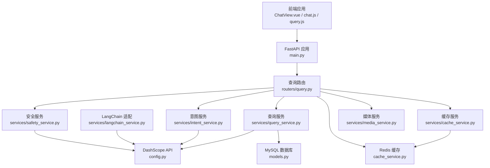
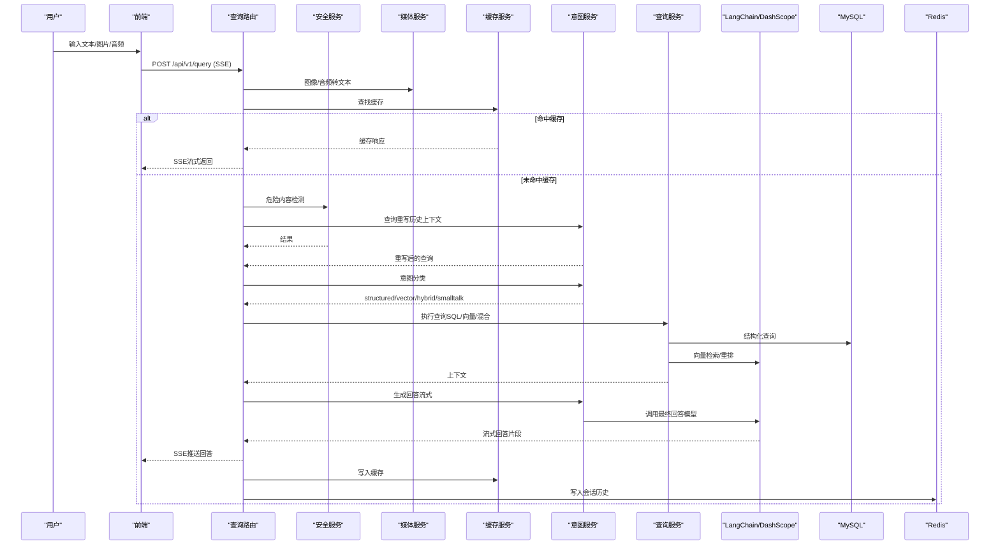
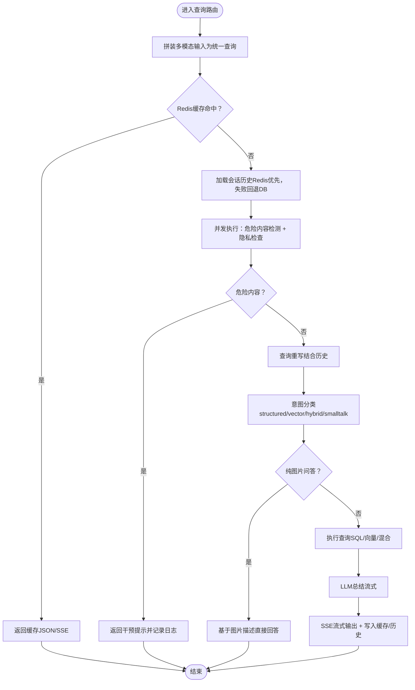
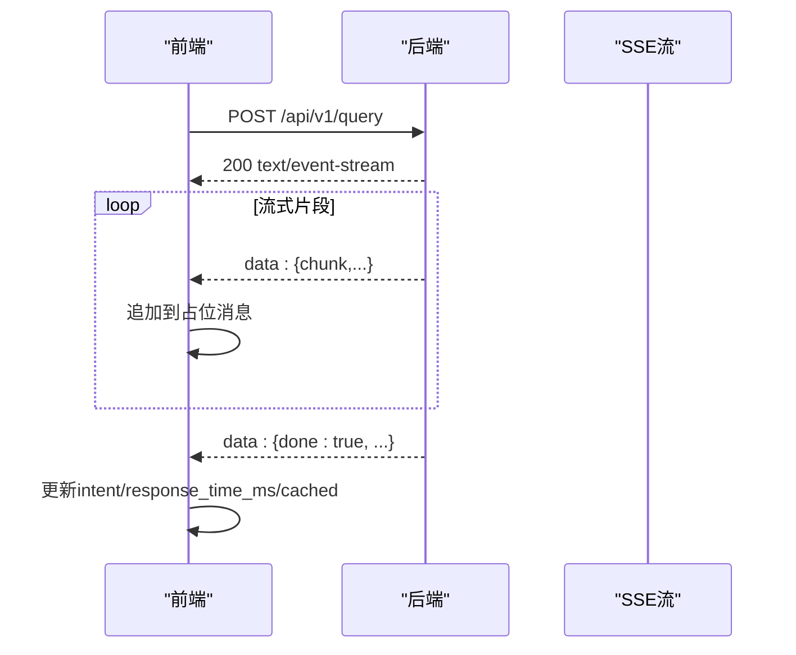
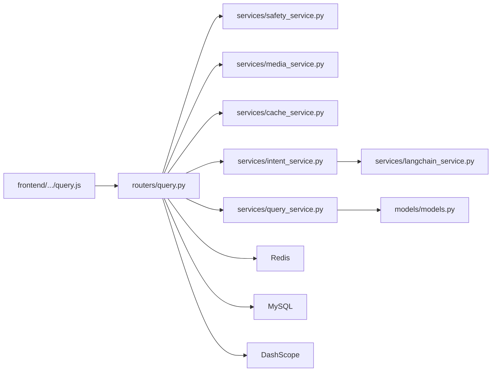

# 系统工作流程

<cite>
**本文档引用的文件**
- [main.py](file://service/ai_assistant/app/main.py)
- [query.py](file://service/ai_assistant/app/routers/query.py)
- [query_service.py](file://service/ai_assistant/app/services/query_service.py)
- [intent_service.py](file://service/ai_assistant/app/services/intent_service.py)
- [langchain_service.py](file://service/ai_assistant/app/services/langchain_service.py)
- [safety_service.py](file://service/ai_assistant/app/services/safety_service.py)
- [cache_service.py](file://service/ai_assistant/app/services/cache_service.py)
- [media_service.py](file://service/ai_assistant/app/services/media_service.py)
- [models.py](file://service/ai_assistant/app/models/models.py)
- [query.py](file://service/ai_assistant/app/schemas/query.py)
- [config.py](file://service/ai_assistant/app/config.py)
- [ChatView.vue](file://frontend/ai_assistant/src/views/ChatView.vue)
- [chat.js](file://frontend/ai_assistant/src/stores/chat.js)
- [query.js](file://frontend/ai_assistant/src/api/query.js)
</cite>

## 目录
1. [简介](#简介)
2. [项目结构](#项目结构)
3. [核心组件](#核心组件)
4. [架构总览](#架构总览)
5. [详细组件分析](#详细组件分析)
6. [依赖关系分析](#依赖关系分析)
7. [性能考量](#性能考量)
8. [故障排查指南](#故障排查指南)
9. [结论](#结论)
10. [附录](#附录)

## 简介
本文件面向AI校园助手项目的系统工作流程，围绕“从用户输入到AI响应”的完整链路进行深入说明。系统支持多模态输入（文本、图像、音频），内置安全检查、意图分类、查询重写、结构化查询执行、向量检索、混合查询处理、LLM总结生成、缓存存储、SSE流式输出等环节。文档提供流程图、时序图、数据流图与异常处理策略，帮助开发者与用户理解系统运行机制与优化方向。

## 项目结构
后端采用FastAPI + SQLAlchemy + Redis + DashScope（阿里云百炼）实现，前端使用Vue 3 + Pinia + SSE。整体分为三层：
- 前端层：负责多模态输入、SSE流式渲染与会话管理
- 后端层：路由与业务编排、服务层（安全、意图、媒体、缓存、查询、LLM）、数据模型与数据库
- 基础设施：MySQL（结构化数据）、Redis（缓存与会话历史）、DashScope（多模态与大模型）

图表来源
- [main.py:52-86](file://service/ai_assistant/app/main.py#L52-L86)
- [query.py:198-745](file://service/ai_assistant/app/routers/query.py#L198-L745)
- [query_service.py:1-200](file://service/ai_assistant/app/services/query_service.py#L1-L200)
- [intent_service.py:218-346](file://service/ai_assistant/app/services/intent_service.py#L218-L346)
- [langchain_service.py:139-278](file://service/ai_assistant/app/services/langchain_service.py#L139-L278)
- [safety_service.py:84-163](file://service/ai_assistant/app/services/safety_service.py#L84-L163)
- [cache_service.py:92-177](file://service/ai_assistant/app/services/cache_service.py#L92-L177)
- [media_service.py:115-246](file://service/ai_assistant/app/services/media_service.py#L115-L246)
- [models.py:628-660](file://service/ai_assistant/app/models/models.py#L628-L660)
- [config.py:6-113](file://service/ai_assistant/app/config.py#L6-L113)

章节来源
- [main.py:1-86](file://service/ai_assistant/app/main.py#L1-L86)
- [config.py:6-113](file://service/ai_assistant/app/config.py#L6-L113)

## 核心组件
- 查询路由：统一入口，负责多模态输入拼装、缓存查找、并发安全检查与隐私检查、意图分类、查询执行、LLM总结、缓存写入、SSE流式输出与会话历史管理
- 安全服务：危险内容检测与隐私违规拦截
- 媒体服务：图像理解（Qwen-VL）与语音识别（ASR）
- 意图服务：意图分类、查询重写、回答生成（LangChain + DashScope）
- 查询服务：结构化SQL查询、向量检索、混合查询与上下文构建
- 缓存服务：基于Redis的查询缓存与版本控制
- LangChain适配：消息裁剪、LLM调用与流式输出
- 数据模型：校园相关实体（学生、课程、成绩、课表、教师、教室等）

章节来源
- [query.py:198-745](file://service/ai_assistant/app/routers/query.py#L198-L745)
- [safety_service.py:84-163](file://service/ai_assistant/app/services/safety_service.py#L84-L163)
- [media_service.py:115-246](file://service/ai_assistant/app/services/media_service.py#L115-L246)
- [intent_service.py:218-346](file://service/ai_assistant/app/services/intent_service.py#L218-L346)
- [query_service.py:1-200](file://service/ai_assistant/app/services/query_service.py#L1-L200)
- [cache_service.py:92-177](file://service/ai_assistant/app/services/cache_service.py#L92-L177)
- [langchain_service.py:139-278](file://service/ai_assistant/app/services/langchain_service.py#L139-L278)
- [models.py:628-660](file://service/ai_assistant/app/models/models.py#L628-L660)

## 架构总览
系统采用“路由编排 + 服务层解耦”的设计，前端通过SSE接收流式回答，后端通过并发任务与异步I/O提升吞吐。关键特性：
- 多模态输入：图像/音频转文本后与文本合并，形成统一查询
- 缓存优先：Redis命中即快速返回，降低延迟
- 并发执行：安全检查、隐私检查与查询重写并行
- 意图驱动：基于LLM的意图分类决定查询路径（结构化/向量/混合/闲聊）
- 流式输出：SSE逐步推送回答片段，结束包携带元数据
- 会话隔离：基于DID与session_id的Redis历史与缓存隔离

图表来源
- [query.py:207-745](file://service/ai_assistant/app/routers/query.py#L207-L745)
- [media_service.py:115-246](file://service/ai_assistant/app/services/media_service.py#L115-L246)
- [cache_service.py:92-177](file://service/ai_assistant/app/services/cache_service.py#L92-L177)
- [intent_service.py:218-346](file://service/ai_assistant/app/services/intent_service.py#L218-L346)
- [query_service.py:1-200](file://service/ai_assistant/app/services/query_service.py#L1-L200)
- [langchain_service.py:139-278](file://service/ai_assistant/app/services/langchain_service.py#L139-L278)

## 详细组件分析

### 查询路由（POST /api/v1/query）
职责与流程要点：
- 多模态输入拼装：图像→文本、音频→文本、文本直接拼接，形成统一查询
- 缓存优先：命中则直接返回JSON或SSE
- 并发安全与隐私：危险内容检测与隐私违规拦截
- 历史加载：优先Redis，失败回退DB
- 意图分类与查询执行：根据意图执行结构化/向量/混合查询
- 图片纯问答：针对“图片解释/分析/解读”等场景，直接基于图片描述回答
- LLM总结：流式生成最终回答
- 缓存写入与会话历史：写入Redis缓存与会话历史
- SSE响应：统一头部避免反向代理缓冲/改写

图表来源
- [query.py:207-745](file://service/ai_assistant/app/routers/query.py#L207-L745)

章节来源
- [query.py:198-745](file://service/ai_assistant/app/routers/query.py#L198-L745)

### 安全服务（危险内容与隐私检查）
- 危险内容检测：使用LLM判断“自杀/自残/暴力”倾向，正则作为降级与兜底
- 公共服务联系方式查询放行：避免将“校医院/心理中心”等查询误判为危险
- 隐私检查：拦截查询他人学号的行为，返回隐私提示并记录

章节来源
- [safety_service.py:84-163](file://service/ai_assistant/app/services/safety_service.py#L84-L163)

### 媒体服务（图像/音频转文本）
- 图像理解：Qwen-VL，支持JPEG/PNG，自动缩放与压缩，避免过大负载
- 语音识别：ASR，支持WAV/MP3，转为16kHz单声道WAV后识别
- 错误处理：FFmpeg转换失败、识别无内容等异常均抛出可读错误

章节来源
- [media_service.py:115-246](file://service/ai_assistant/app/services/media_service.py#L115-L246)

### 意图服务（分类、重写、总结）
- 意图分类：structured/vector/hybrid/smalltalk，基于LLM与规则
- 查询重写：结合历史上下文，补齐缺失信息，限制长度
- 总结生成：构建系统提示与上下文，裁剪消息长度，避免越界
- 流式输出：LangChain + DashScope增量输出，前端SSE渲染

章节来源
- [intent_service.py:218-346](file://service/ai_assistant/app/services/intent_service.py#L218-L346)
- [langchain_service.py:139-278](file://service/ai_assistant/app/services/langchain_service.py#L139-L278)

### 查询服务（结构化/向量/混合）
- 结构化查询：基于SQL的学生成绩、课表、选课、个人信息、教师通讯录等
- 向量检索：基于百炼检索API，支持检索校园知识库
- 混合查询：融合结构化数据与向量检索结果，去重与重排
- 上下文美化：字段名翻译、学期ID格式化、布尔值人性化

章节来源
- [query_service.py:1-200](file://service/ai_assistant/app/services/query_service.py#L1-L200)

### 缓存服务（Redis）
- 键命名：chat_cache:{version}:{did}:{query_md5}
- TTL策略：敏感/普通查询不同TTL
- 日期敏感与课表版本：跨天失效与管理员改课后失效
- 版本控制：通过版本号隔离升级后的缓存

章节来源
- [cache_service.py:92-177](file://service/ai_assistant/app/services/cache_service.py#L92-L177)

### LangChain适配（DashScope）
- 消息裁剪：按总字符数优先丢弃旧历史，再裁剪最后一条
- LLM调用：非流式与流式两种模式，增量输出
- 错误处理：状态码异常统一转换为运行时错误

章节来源
- [langchain_service.py:139-278](file://service/ai_assistant/app/services/langchain_service.py#L139-L278)

### 数据模型（校园实体）
- 学生、课程、成绩、课表、教师、教室、院系、专业、班级等
- 关系与索引：支撑结构化查询与性能优化

章节来源
- [models.py:628-660](file://service/ai_assistant/app/models/models.py#L628-L660)

### 前端工作流（SSE流式渲染）
- 会话管理：Pinia Store维护会话与消息列表
- 发送消息：自动附加session_id，创建占位消息
- SSE解析：逐行解析data: JSON，支持容错与兜底
- 错误解析：根据后端状态码与错误信息友好提示

图表来源
- [chat.js:133-230](file://frontend/ai_assistant/src/stores/chat.js#L133-L230)
- [query.js:28-141](file://frontend/ai_assistant/src/api/query.js#L28-L141)

章节来源
- [ChatView.vue:312-333](file://frontend/ai_assistant/src/views/ChatView.vue#L312-L333)
- [chat.js:133-230](file://frontend/ai_assistant/src/stores/chat.js#L133-L230)
- [query.js:28-141](file://frontend/ai_assistant/src/api/query.js#L28-L141)

## 依赖关系分析
- 路由依赖：查询路由依赖安全、媒体、缓存、意图、查询服务
- 服务依赖：查询服务依赖数据库与DashScope；意图服务依赖LangChain与DashScope；缓存服务依赖Redis
- 前后端依赖：前端通过HTTP/SSE与后端交互，依赖JWT令牌

图表来源
- [query.py:35-42](file://service/ai_assistant/app/routers/query.py#L35-L42)
- [intent_service.py:17-21](file://service/ai_assistant/app/services/intent_service.py#L17-L21)
- [query_service.py:29-47](file://service/ai_assistant/app/services/query_service.py#L29-L47)
- [cache_service.py:16-19](file://service/ai_assistant/app/services/cache_service.py#L16-L19)
- [models.py:22-47](file://service/ai_assistant/app/models/models.py#L22-L47)
- [config.py:48-83](file://service/ai_assistant/app/config.py#L48-L83)
- [query.js:28-141](file://frontend/ai_assistant/src/api/query.js#L28-L141)

章节来源
- [query.py:35-42](file://service/ai_assistant/app/routers/query.py#L35-L42)
- [intent_service.py:17-21](file://service/ai_assistant/app/services/intent_service.py#L17-L21)
- [query_service.py:29-47](file://service/ai_assistant/app/services/query_service.py#L29-L47)
- [cache_service.py:16-19](file://service/ai_assistant/app/services/cache_service.py#L16-L19)
- [models.py:22-47](file://service/ai_assistant/app/models/models.py#L22-L47)
- [config.py:48-83](file://service/ai_assistant/app/config.py#L48-L83)
- [query.js:28-141](file://frontend/ai_assistant/src/api/query.js#L28-L141)

## 性能考量
- 并发与异步：路由中对安全检查与查询重写使用并发任务，缩短端到端延迟
- 缓存命中：Redis缓存显著降低重复查询成本，敏感/普通查询采用不同TTL
- 消息裁剪：LangChain适配对消息进行裁剪，避免LLM输入超限
- 连接池与事务：StreamingResponse生命周期结束后尽快释放数据库连接
- 前端流式渲染：SSE增量推送，避免一次性渲染大文本

章节来源
- [query.py:347-352](file://service/ai_assistant/app/routers/query.py#L347-L352)
- [cache_service.py:85-89](file://service/ai_assistant/app/services/cache_service.py#L85-L89)
- [langchain_service.py:46-96](file://service/ai_assistant/app/services/langchain_service.py#L46-L96)
- [query.py:654-657](file://service/ai_assistant/app/routers/query.py#L654-L657)

## 故障排查指南
常见问题与定位思路：
- 图像/音频处理失败：检查DashScope API Key与模型配置，查看媒体服务异常日志
- 危险内容检测误判：调整LLM提示或放宽正则阈值，注意公共服务联系方式查询放行
- 缓存未命中/过期：确认Redis连通性与TTL策略，敏感查询跨天失效属预期
- LLM调用失败：检查DashScope状态码与错误信息，LangChain适配会统一转换为运行时错误
- SSE流中断：检查反向代理是否修改/缓冲SSE，路由已设置避免缓冲的响应头
- 隐私违规拦截：确认查询中是否包含他人学号，系统会拒绝并记录

章节来源
- [media_service.py:115-246](file://service/ai_assistant/app/services/media_service.py#L115-L246)
- [safety_service.py:84-163](file://service/ai_assistant/app/services/safety_service.py#L84-L163)
- [cache_service.py:92-177](file://service/ai_assistant/app/services/cache_service.py#L92-L177)
- [langchain_service.py:139-278](file://service/ai_assistant/app/services/langchain_service.py#L139-L278)
- [query.py:115-125](file://service/ai_assistant/app/routers/query.py#L115-L125)

## 结论
本系统通过“路由编排 + 服务层解耦 + 多模态 + 缓存 + 流式输出”的设计，实现了从用户输入到AI响应的高效闭环。在保障安全与隐私的前提下，利用LLM与结构化数据的协同，满足校园场景的多样化需求。建议持续优化缓存策略、消息裁剪与并发任务调度，以进一步提升用户体验与系统稳定性。

## 附录
- 典型场景示例
  - 图片纯问答：用户上传一张课程表截图，系统识别图片内容后直接回答“这周/下周课程”，不触发结构化查询
  - 结构化查询：用户问“我的成绩”，系统仅查询本人数据并格式化输出
  - 混合查询：用户问“我的必修课学分要求是否满足”，系统结合结构化数据与知识库检索给出结论
  - 闲聊：用户问“你好”，系统识别为smalltalk，返回友好回复
- 前端交互要点
  - 支持文本、图片、语音多模态输入
  - SSE流式渲染，支持占位消息与错误提示
  - 会话持久化与清理

章节来源
- [query.py:50-88](file://service/ai_assistant/app/routers/query.py#L50-L88)
- [query.py:529-543](file://service/ai_assistant/app/routers/query.py#L529-L543)
- [ChatView.vue:312-333](file://frontend/ai_assistant/src/views/ChatView.vue#L312-L333)
- [chat.js:133-230](file://frontend/ai_assistant/src/stores/chat.js#L133-L230)
- [query.js:28-141](file://frontend/ai_assistant/src/api/query.js#L28-L141)