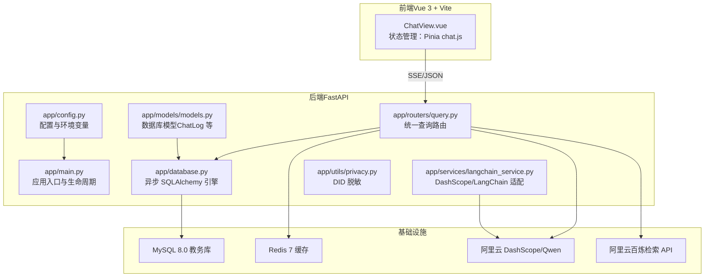
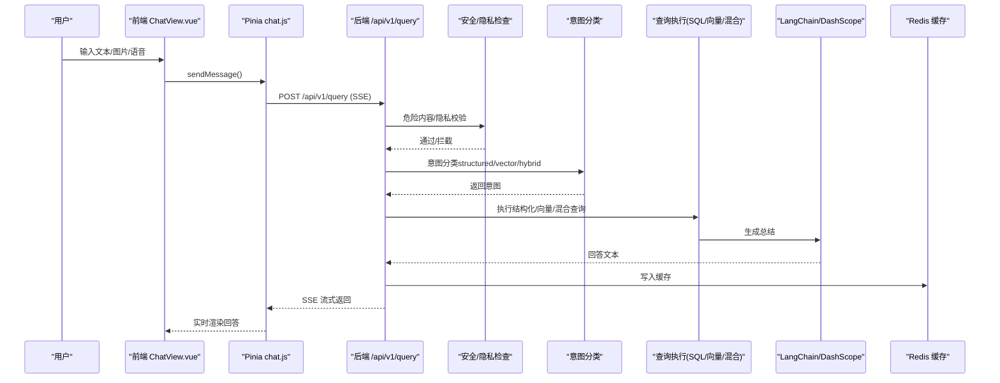
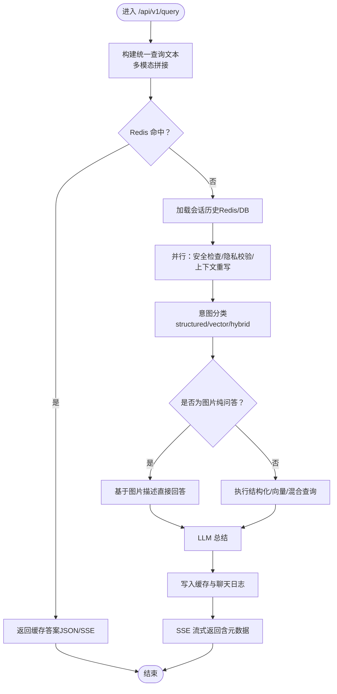
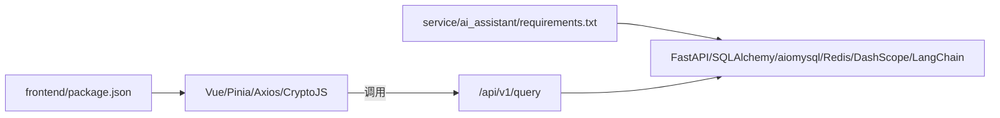

# 项目介绍

<cite>
**本文引用的文件**
- [README.md](file://README.md)
- [service/ai_assistant/README.md](file://service/ai_assistant/README.md)
- [frontend/ai_assistant/README.md](file://frontend/ai_assistant/README.md)
- [service/ai_assistant/app/main.py](file://service/ai_assistant/app/main.py)
- [service/ai_assistant/app/config.py](file://service/ai_assistant/app/config.py)
- [service/ai_assistant/app/routers/query.py](file://service/ai_assistant/app/routers/query.py)
- [service/ai_assistant/app/schemas/query.py](file://service/ai_assistant/app/schemas/query.py)
- [service/ai_assistant/app/utils/privacy.py](file://service/ai_assistant/app/utils/privacy.py)
- [service/ai_assistant/app/services/langchain_service.py](file://service/ai_assistant/app/services/langchain_service.py)
- [frontend/ai_assistant/src/views/ChatView.vue](file://frontend/ai_assistant/src/views/ChatView.vue)
- [frontend/ai_assistant/src/stores/chat.js](file://frontend/ai_assistant/src/stores/chat.js)
- [service/ai_assistant/requirements.txt](file://service/ai_assistant/requirements.txt)
- [frontend/ai_assistant/package.json](file://frontend/ai_assistant/package.json)
- [service/ai_assistant/app/database.py](file://service/ai_assistant/app/database.py)
- [service/ai_assistant/app/models/models.py](file://service/ai_assistant/app/models/models.py)
</cite>

## 目录
1. [引言](#引言)
2. [项目结构](#项目结构)
3. [核心组件](#核心组件)
4. [架构总览](#架构总览)
5. [详细组件分析](#详细组件分析)
6. [依赖关系分析](#依赖关系分析)
7. [性能考量](#性能考量)
8. [故障排查指南](#故障排查指南)
9. [结论](#结论)
10. [附录](#附录)

## 引言
本项目旨在打造一个“懂变通、强隐私、高安全”的校园贴心助手，通过大语言模型（LLM）提供智能化、强逻辑与严格保障隐私的问答服务。项目面向高校学生与教师，解决传统校园信息系统缺乏智能化问答能力、学生查询效率低、隐私保护不足等痛点，提供多模态输入（文本、图片、语音）、隐私脱敏、SSE流式响应等关键技术特性，还原类似 ChatGPT 的打字机体验，同时确保数据安全与合规。

## 项目结构
项目采用前后端分离架构，前端基于 Vue 3 + Vite，后端基于 FastAPI（Python），通过 LangChain 与阿里云 DashScope/Qwen 系列大模型对接，结合 Redis 缓存与 MySQL 教务库，实现结构化查询与向量检索（RAG）的混合执行链路。

图表来源
- [service/ai_assistant/app/main.py:1-86](file://service/ai_assistant/app/main.py#L1-L86)
- [service/ai_assistant/app/config.py:1-113](file://service/ai_assistant/app/config.py#L1-L113)
- [service/ai_assistant/app/routers/query.py:1-788](file://service/ai_assistant/app/routers/query.py#L1-L788)
- [service/ai_assistant/app/database.py:1-35](file://service/ai_assistant/app/database.py#L1-L35)
- [service/ai_assistant/app/models/models.py:625-660](file://service/ai_assistant/app/models/models.py#L625-L660)
- [service/ai_assistant/app/services/langchain_service.py:1-278](file://service/ai_assistant/app/services/langchain_service.py#L1-L278)
- [service/ai_assistant/app/utils/privacy.py:1-23](file://service/ai_assistant/app/utils/privacy.py#L1-L23)

章节来源
- [README.md:5-14](file://README.md#L5-L14)
- [service/ai_assistant/README.md:5-14](file://service/ai_assistant/README.md#L5-L14)
- [frontend/ai_assistant/README.md:1-35](file://frontend/ai_assistant/README.md#L1-L35)

## 核心组件
- 前端聊天界面与状态管理：提供多模态输入（文本、图片、语音）、SSE 流式渲染、会话持久化与错误提示。
- 后端统一查询路由：接收多模态输入，进行安全检查、隐私校验、意图分类、结构化/向量/混合查询执行、LLM 总结与缓存。
- 大模型与检索链路：LangChain 适配 DashScope/Qwen，结合百炼检索 API 实现 RAG。
- 数据与隐私：异步 ORM 访问 MySQL，DID 脱敏存储，会话历史隔离，缓存 TTL 策略。
- 基础设施：Redis 缓存、CORS、HTTPS 反向代理（Nginx/Caddy）。

章节来源
- [frontend/ai_assistant/src/views/ChatView.vue:1-800](file://frontend/ai_assistant/src/views/ChatView.vue#L1-L800)
- [frontend/ai_assistant/src/stores/chat.js:1-278](file://frontend/ai_assistant/src/stores/chat.js#L1-L278)
- [service/ai_assistant/app/routers/query.py:1-788](file://service/ai_assistant/app/routers/query.py#L1-L788)
- [service/ai_assistant/app/services/langchain_service.py:1-278](file://service/ai_assistant/app/services/langchain_service.py#L1-L278)
- [service/ai_assistant/app/utils/privacy.py:1-23](file://service/ai_assistant/app/utils/privacy.py#L1-L23)

## 架构总览
系统通过统一的查询接口处理多模态输入，结合安全与隐私策略，动态路由到结构化 SQL 查询或向量检索（RAG），最终由 LLM 生成自然语言回答，并通过 SSE 实时流式返回给前端。

图表来源
- [service/ai_assistant/app/routers/query.py:198-745](file://service/ai_assistant/app/routers/query.py#L198-L745)
- [service/ai_assistant/app/services/langchain_service.py:139-278](file://service/ai_assistant/app/services/langchain_service.py#L139-L278)
- [frontend/ai_assistant/src/stores/chat.js:133-230](file://frontend/ai_assistant/src/stores/chat.js#L133-L230)

## 详细组件分析

### 统一查询路由（POST /api/v1/query）
- 多模态输入处理：图片转文本、语音转文本，统一构建查询文本。
- 缓存优先：基于 DID + 查询哈希命中缓存则直接返回，支持 JSON 与 SSE 两种输出。
- 并发优化：安全检查、隐私校验、上下文重写并行执行。
- 意图路由：基于 LLM 对重写后的查询进行意图分类，动态选择结构化/向量/混合执行路径。
- 图片纯问答：对“解释/分析/解读”等场景直接基于图片描述回答，避免检索。
- 总结与缓存：LLM 生成最终回答，写入 Redis 缓存与聊天日志，SSE 流式返回。

图表来源
- [service/ai_assistant/app/routers/query.py:207-745](file://service/ai_assistant/app/routers/query.py#L207-L745)

章节来源
- [service/ai_assistant/app/routers/query.py:1-788](file://service/ai_assistant/app/routers/query.py#L1-L788)

### LangChain 与 DashScope 适配
- 提示模板渲染与消息格式转换，按最大输入字符限制裁剪历史，避免超限。
- 非流式与流式调用统一封装，支持增量输出与进度日志。
- 会话级 HTTP 会话配置，避免代理干扰。

章节来源
- [service/ai_assistant/app/services/langchain_service.py:1-278](file://service/ai_assistant/app/services/langchain_service.py#L1-L278)

### 隐私与脱敏（DID）
- 从真实 student_id 生成稳定、单向的 DID，用于聊天日志与会话历史关联，避免泄露真实身份。
- 配合盐值（salt）与环境密钥，确保不同环境下的唯一性与安全性。

章节来源
- [service/ai_assistant/app/utils/privacy.py:1-23](file://service/ai_assistant/app/utils/privacy.py#L1-L23)
- [service/ai_assistant/app/config.py:42-44](file://service/ai_assistant/app/config.py#L42-L44)

### 前端聊天界面与状态管理
- 多模态输入：文本、图片（压缩上传）、语音（录音与播放）。
- SSE 流式渲染：逐字打印，显示意图、缓存状态、响应耗时等元信息。
- 会话管理：本地持久化、会话切换、清空与删除。

章节来源
- [frontend/ai_assistant/src/views/ChatView.vue:1-800](file://frontend/ai_assistant/src/views/ChatView.vue#L1-L800)
- [frontend/ai_assistant/src/stores/chat.js:1-278](file://frontend/ai_assistant/src/stores/chat.js#L1-L278)

### 数据模型与数据库
- 聊天日志模型（ChatLog）：包含 did、sender、message_content、system_action、response_time_ms 等字段，支持按 did 与时间索引查询。
- 异步 SQLAlchemy 引擎与会话管理，支持连接池与回滚策略，保障长耗时流式输出期间的连接释放。

章节来源
- [service/ai_assistant/app/models/models.py:625-660](file://service/ai_assistant/app/models/models.py#L625-L660)
- [service/ai_assistant/app/database.py:1-35](file://service/ai_assistant/app/database.py#L1-L35)

## 依赖关系分析
- 后端依赖：FastAPI、SQLAlchemy AsyncIO、aiomysql、Redis、DashScope、LangChain Core、日志与配置工具。
- 前端依赖：Vue 3、Vue Router、Pinia、Axios、CryptoJS、UUID、Marked。

图表来源
- [frontend/ai_assistant/package.json:1-24](file://frontend/ai_assistant/package.json#L1-L24)
- [service/ai_assistant/requirements.txt:1-22](file://service/ai_assistant/requirements.txt#L1-L22)

章节来源
- [frontend/ai_assistant/package.json:1-24](file://frontend/ai_assistant/package.json#L1-L24)
- [service/ai_assistant/requirements.txt:1-22](file://service/ai_assistant/requirements.txt#L1-L22)

## 性能考量
- 并发与异步：后端使用异步 ORM 与并发任务，减少阻塞；SSE 流式输出避免长连接占用数据库连接。
- 缓存策略：按敏感度区分 TTL，热点查询命中缓存显著降低延迟与成本。
- 输入裁剪：LangChain 适配器按最大字符限制裁剪历史，避免超限导致的失败与重试。
- 前端优化：图片压缩、语音阈值判断、滚动与渲染节流，提升交互流畅度。

## 故障排查指南
- SSE 未流式：确认反向代理（Nginx/Caddy）禁用缓冲与缓存，开启 chunked transfer。
- 400 参数错误：确保至少提供文本、图片或语音其一。
- 401 未授权：检查 JWT 令牌有效期与刷新。
- 502 AI 服务异常：检查 DashScope API Key、网络连通性与模型限额。
- 隐私拦截：若涉及查询他人学号，系统将拒绝并提示仅能访问本人数据。
- 缓存异常：Redis 不可用时会降级到数据库历史与回退策略，不影响主流程。

章节来源
- [README.md:67-104](file://README.md#L67-L104)
- [service/ai_assistant/README.md:67-104](file://service/ai_assistant/README.md#L67-L104)
- [service/ai_assistant/app/routers/query.py:265-270](file://service/ai_assistant/app/routers/query.py#L265-L270)
- [service/ai_assistant/app/routers/query.py:354-413](file://service/ai_assistant/app/routers/query.py#L354-L413)

## 结论
本项目通过“LLM + RAG + 多模态 + 隐私脱敏 + SSE 流式”的组合，有效解决了传统校园信息系统在智能化与用户体验方面的短板。其模块化设计与严格的隐私保护策略，使其具备良好的可扩展性与生产落地价值。对于初学者而言，该项目提供了从前后端到大模型与数据库的完整实践范式，便于快速理解并开展二次开发。

## 附录
- 快速开始（后端）：创建虚拟环境、安装依赖、配置 .env、启动 uvicorn。
- 快速开始（前端）：安装依赖、复制 .env.example、启动 dev 服务器。
- 生产部署：Docker Compose 启动 Redis（可选），Nginx/Caddy 反向代理与 HTTPS，SSE 关键参数禁用缓冲。

章节来源
- [service/ai_assistant/README.md:106-204](file://service/ai_assistant/README.md#L106-L204)
- [frontend/ai_assistant/README.md:1-35](file://frontend/ai_assistant/README.md#L1-L35)