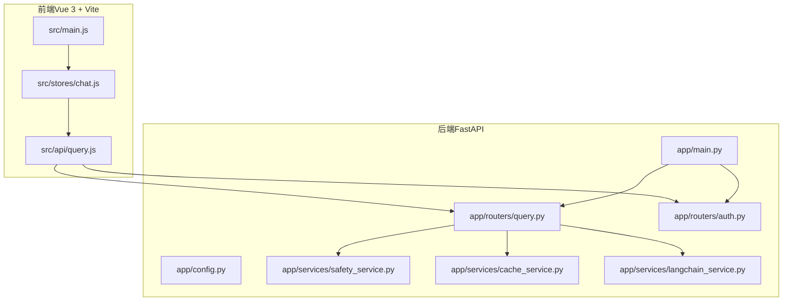
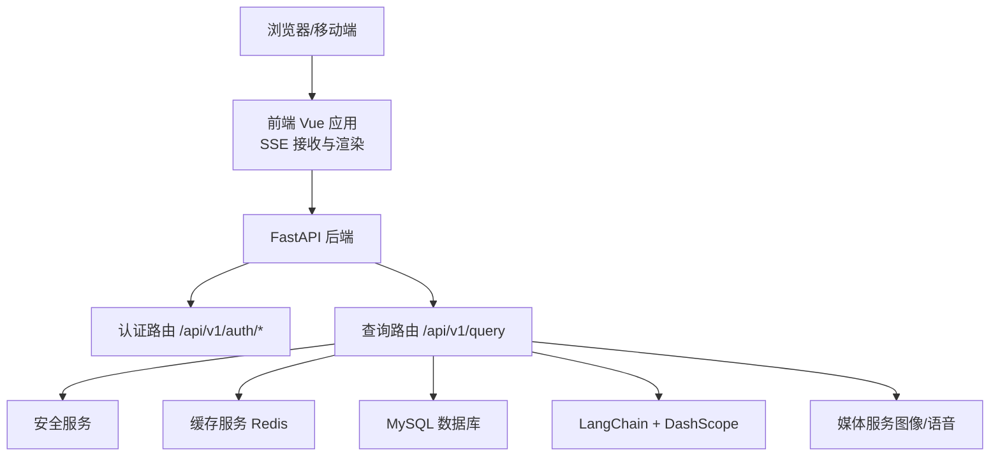
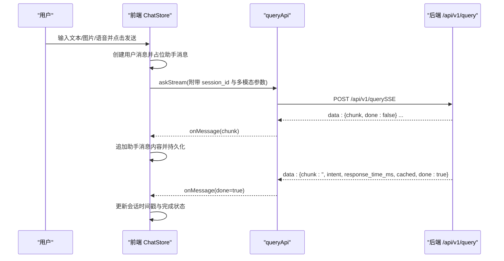
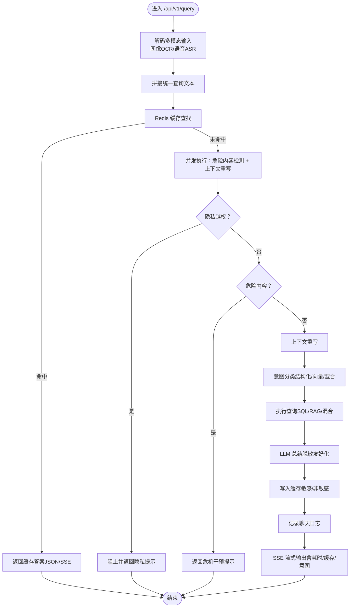
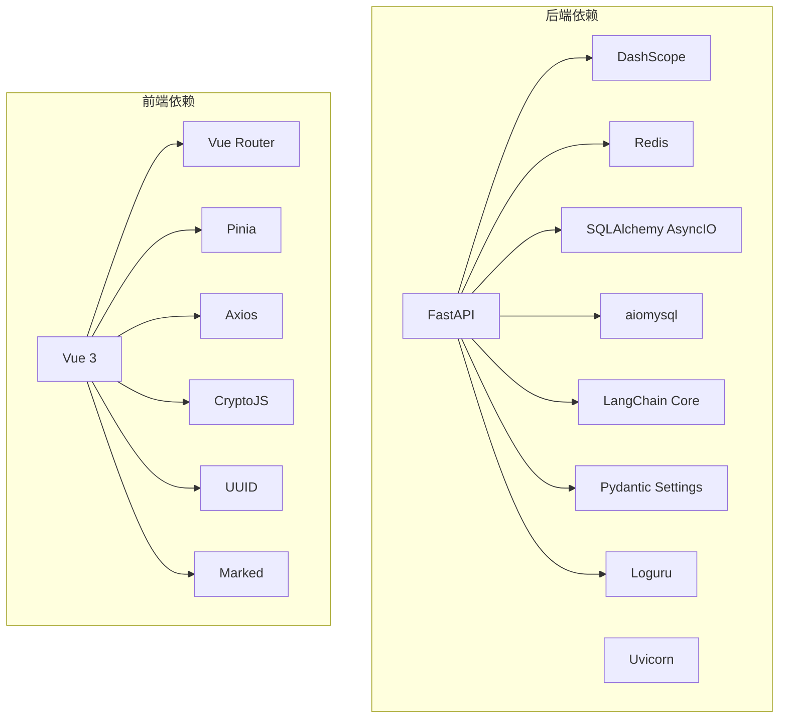

# 项目概述

<cite>
**本文引用的文件**   
- [README.md](file://README.md)
- [service/ai_assistant/README.md](file://service/ai_assistant/README.md)
- [frontend/ai_assistant/README.md](file://frontend/ai_assistant/README.md)
- [service/ai_assistant/app/main.py](file://service/ai_assistant/app/main.py)
- [service/ai_assistant/app/config.py](file://service/ai_assistant/app/config.py)
- [service/ai_assistant/requirements.txt](file://service/ai_assistant/requirements.txt)
- [service/ai_assistant/app/routers/query.py](file://service/ai_assistant/app/routers/query.py)
- [service/ai_assistant/app/routers/auth.py](file://service/ai_assistant/app/routers/auth.py)
- [service/ai_assistant/app/services/safety_service.py](file://service/ai_assistant/app/services/safety_service.py)
- [service/ai_assistant/app/services/cache_service.py](file://service/ai_assistant/app/services/cache_service.py)
- [service/ai_assistant/app/services/langchain_service.py](file://service/ai_assistant/app/services/langchain_service.py)
- [frontend/ai_assistant/src/main.js](file://frontend/ai_assistant/src/main.js)
- [frontend/ai_assistant/src/stores/chat.js](file://frontend/ai_assistant/src/stores/chat.js)
- [frontend/ai_assistant/src/api/query.js](file://frontend/ai_assistant/src/api/query.js)
</cite>

## 目录
1. [引言](#引言)
2. [项目结构](#项目结构)
3. [核心组件](#核心组件)
4. [架构总览](#架构总览)
5. [详细组件分析](#详细组件分析)
6. [依赖分析](#依赖分析)
7. [性能考量](#性能考量)
8. [故障排查指南](#故障排查指南)
9. [结论](#结论)
10. [附录](#附录)

## 引言
本项目旨在为高校学生提供一个智能化、隐私安全、可扩展的校园问答助手。系统通过大语言模型（LLM）与检索增强生成（RAG）相结合的方式，支持文本、图片、语音等多模态输入，提供近实时的流式回答体验。后端采用前后端分离架构，前端基于 Vue 3 + Vite，后端基于 FastAPI，配合 Redis 缓存、JWT 认证、安全检查与隐私保护机制，形成一套稳定高效的生产级解决方案。

## 项目结构
项目分为三个主要部分：
- 前端：Vue 3 + Vite + Pinia + 路由，负责用户界面与交互、SSE 流式接收、会话与消息状态管理。
- 后端：FastAPI 应用，提供认证、查询、系统信息等接口，集成数据库、缓存、安全与大模型服务。
- 文档与部署：包含整体架构说明、Prompt 设计、部署步骤与反向代理配置要点。

**图表来源**
- [service/ai_assistant/app/main.py:52-86](file://service/ai_assistant/app/main.py#L52-L86)
- [frontend/ai_assistant/src/main.js:1-10](file://frontend/ai_assistant/src/main.js#L1-L10)

**章节来源**
- [README.md:1-104](file://README.md#L1-L104)
- [service/ai_assistant/README.md:1-230](file://service/ai_assistant/README.md#L1-L230)
- [frontend/ai_assistant/README.md:1-35](file://frontend/ai_assistant/README.md#L1-L35)

## 核心组件
- 前端组件
  - 应用入口与状态管理：应用初始化、Pinia 注册、路由挂载。
  - 聊天状态管理：会话创建/切换/删除/清空、消息发送、搜索过滤、本地持久化。
  - 查询 API：封装 POST /api/v1/query 的请求，支持 JSON 与 SSE 两种输出模式，流式解析与错误处理。
- 后端组件
  - 应用入口：FastAPI 初始化、CORS 配置、路由注册、生命周期钩子。
  - 配置中心：数据库、Redis、JWT、AES、阿里云 API、模型与缓存 TTL 等集中配置。
  - 认证路由：登录、修改密码，返回 JWT。
  - 查询路由：多模态输入解码、安全检查、意图分类、查询执行、流式总结、缓存与日志。
  - 服务层：安全检查、缓存、LangChain/DashScope 适配、媒体处理、日志与隐私工具。

**章节来源**
- [frontend/ai_assistant/src/main.js:1-10](file://frontend/ai_assistant/src/main.js#L1-L10)
- [frontend/ai_assistant/src/stores/chat.js:1-278](file://frontend/ai_assistant/src/stores/chat.js#L1-L278)
- [frontend/ai_assistant/src/api/query.js:1-141](file://frontend/ai_assistant/src/api/query.js#L1-L141)
- [service/ai_assistant/app/main.py:1-86](file://service/ai_assistant/app/main.py#L1-L86)
- [service/ai_assistant/app/config.py:1-113](file://service/ai_assistant/app/config.py#L1-L113)
- [service/ai_assistant/app/routers/auth.py:1-102](file://service/ai_assistant/app/routers/auth.py#L1-L102)
- [service/ai_assistant/app/routers/query.py:1-788](file://service/ai_assistant/app/routers/query.py#L1-L788)
- [service/ai_assistant/app/services/safety_service.py:1-163](file://service/ai_assistant/app/services/safety_service.py#L1-L163)
- [service/ai_assistant/app/services/cache_service.py:1-177](file://service/ai_assistant/app/services/cache_service.py#L1-L177)
- [service/ai_assistant/app/services/langchain_service.py:1-278](file://service/ai_assistant/app/services/langchain_service.py#L1-L278)

## 架构总览
系统采用前后端分离架构，核心特性包括：
- 多模态输入：文本、图片（OCR）、语音（ASR）统一转为文本后合并为统一查询。
- 安全与隐私：双重安全检查（危险内容与隐私越权）、脱敏与友好化提示、DID 隔离与会话历史。
- 智能路由：意图分类（结构化/向量/混合），结合 RAG 与 SQL 执行，最终由 LLM 总结。
- 流式输出：SSE 实时推送 Token/Chunk，前端逐字渲染，最后附带耗时、缓存状态与意图来源。
- 缓存与限流：Redis 缓存按敏感度分级 TTL，时间敏感与课表敏感缓存版本控制。
- 认证与授权：JWT 令牌，AES 加密密码传输，行级数据隔离。

**图表来源**
- [service/ai_assistant/app/routers/auth.py:1-102](file://service/ai_assistant/app/routers/auth.py#L1-L102)
- [service/ai_assistant/app/routers/query.py:1-788](file://service/ai_assistant/app/routers/query.py#L1-L788)
- [service/ai_assistant/app/services/safety_service.py:1-163](file://service/ai_assistant/app/services/safety_service.py#L1-L163)
- [service/ai_assistant/app/services/cache_service.py:1-177](file://service/ai_assistant/app/services/cache_service.py#L1-L177)
- [service/ai_assistant/app/services/langchain_service.py:1-278](file://service/ai_assistant/app/services/langchain_service.py#L1-L278)

## 详细组件分析

### 前端组件分析
- 应用入口与状态管理
  - 初始化 Vue 应用、注册 Pinia 与路由，挂载根组件。
- 聊天状态管理（Pinia）
  - 会话 CRUD、消息发送、搜索过滤、localStorage 持久化。
  - 发送消息时自动附加 session_id，并在流式过程中逐步追加内容。
- 查询 API（SSE）
  - 支持 JSON 与 SSE 两种输出；SSE 解析 data: {...} 行，兼容网关改写；最后一条数据携带 intent、耗时、缓存标记与 done 标志。

**图表来源**
- [frontend/ai_assistant/src/stores/chat.js:133-230](file://frontend/ai_assistant/src/stores/chat.js#L133-L230)
- [frontend/ai_assistant/src/api/query.js:28-141](file://frontend/ai_assistant/src/api/query.js#L28-L141)
- [service/ai_assistant/app/routers/query.py:198-745](file://service/ai_assistant/app/routers/query.py#L198-L745)

**章节来源**
- [frontend/ai_assistant/src/main.js:1-10](file://frontend/ai_assistant/src/main.js#L1-L10)
- [frontend/ai_assistant/src/stores/chat.js:1-278](file://frontend/ai_assistant/src/stores/chat.js#L1-L278)
- [frontend/ai_assistant/src/api/query.js:1-141](file://frontend/ai_assistant/src/api/query.js#L1-L141)

### 后端组件分析
- 应用入口与生命周期
  - FastAPI 初始化、CORS 配置、路由注册、启动时检查不安全默认值、关闭时关闭 Redis 连接池。
- 配置中心
  - 集中管理数据库、Redis、JWT、AES、阿里云 API、模型选择与缓存 TTL。
- 认证路由
  - 登录：使用 AES 加密密码与学生 ID 认证，签发 JWT。
  - 修改密码：校验旧密码后更新新密码，禁止越权修改。
- 查询路由（核心）
  - 多模态输入解码（图像 OCR、语音 ASR）→ 统一文本 → 安全检查（危险内容与隐私越权）→ 缓存查找 → 意图分类（结构化/向量/混合）→ 查询执行（SQL/RAG/混合）→ 总结（LLM）→ 缓存与日志 → SSE 流式输出。
- 服务层
  - 安全服务：危险内容检测（LLM + 正则回退）、隐私越权检测。
  - 缓存服务：MD5 键、敏感度分级 TTL、日期敏感与课表版本控制。
  - LangChain 适配：DashScope 调用、消息裁剪、流式输出。

**图表来源**
- [service/ai_assistant/app/routers/query.py:198-745](file://service/ai_assistant/app/routers/query.py#L198-L745)
- [service/ai_assistant/app/services/safety_service.py:84-144](file://service/ai_assistant/app/services/safety_service.py#L84-L144)
- [service/ai_assistant/app/services/cache_service.py:92-177](file://service/ai_assistant/app/services/cache_service.py#L92-L177)

**章节来源**
- [service/ai_assistant/app/main.py:1-86](file://service/ai_assistant/app/main.py#L1-L86)
- [service/ai_assistant/app/config.py:1-113](file://service/ai_assistant/app/config.py#L1-L113)
- [service/ai_assistant/app/routers/auth.py:1-102](file://service/ai_assistant/app/routers/auth.py#L1-L102)
- [service/ai_assistant/app/routers/query.py:1-788](file://service/ai_assistant/app/routers/query.py#L1-L788)
- [service/ai_assistant/app/services/safety_service.py:1-163](file://service/ai_assistant/app/services/safety_service.py#L1-L163)
- [service/ai_assistant/app/services/cache_service.py:1-177](file://service/ai_assistant/app/services/cache_service.py#L1-L177)
- [service/ai_assistant/app/services/langchain_service.py:1-278](file://service/ai_assistant/app/services/langchain_service.py#L1-L278)

## 依赖分析
- 技术栈与版本
  - 后端：FastAPI、Uvicorn、SQLAlchemy AsyncIO、aiomysql、Redis、DashScope、LangChain Core、Pydantic Settings、Loguru 等。
  - 前端：Vue 3、Vue Router、Pinia、Axios、CryptoJS、UUID、Marked。
- 外部服务
  - 阿里云 DashScope（Qwen 系列）、阿里云百炼检索 API（RAG）。
  - MySQL 8.0、Redis 7、Docker Compose（部署）。

**图表来源**
- [service/ai_assistant/requirements.txt:1-22](file://service/ai_assistant/requirements.txt#L1-L22)
- [frontend/ai_assistant/package.json:1-24](file://frontend/ai_assistant/package.json#L1-L24)

**章节来源**
- [service/ai_assistant/README.md:106-205](file://service/ai_assistant/README.md#L106-L205)
- [frontend/ai_assistant/README.md:1-35](file://frontend/ai_assistant/README.md#L1-L35)

## 性能考量
- 流式响应与 SSE
  - 后端使用 StreamingResponse 逐块推送 Token/Chunk，前端逐字渲染，显著改善用户体验。
- 缓存策略
  - 按敏感度分级 TTL，时间敏感与课表敏感缓存版本控制，避免陈旧结果。
- 并发优化
  - 安全检查与上下文重写并发执行，缩短端到端延迟。
- 数据库连接管理
  - 流式阶段提前回滚请求会话，释放连接，避免长时间占用。
- 反向代理
  - Nginx/Caddy 需禁用缓冲与缓存，开启 chunked transfer，确保 SSE 不被阻塞。

**章节来源**
- [service/ai_assistant/app/routers/query.py:347-352](file://service/ai_assistant/app/routers/query.py#L347-L352)
- [service/ai_assistant/app/routers/query.py:654-657](file://service/ai_assistant/app/routers/query.py#L654-L657)
- [service/ai_assistant/app/services/cache_service.py:85-90](file://service/ai_assistant/app/services/cache_service.py#L85-L90)
- [README.md:76-98](file://README.md#L76-L98)

## 故障排查指南
- 常见错误与定位
  - 400 参数错误：至少提供文本/图片/语音其一。
  - 401 未授权：JWT 过期或无效，需重新登录。
  - 502 服务异常：AI 服务不可用或语音识别失败。
  - 前端流式解析：若网关改写流格式，前端具备容错解析。
- 安全与隐私
  - 危险内容检测失败时回退到正则；隐私越权查询会被拦截并提示。
- 缓存问题
  - 缓存键包含 DID 与查询哈希，敏感/非敏感区分 TTL；时间敏感与课表缓存版本变化会自动失效。
- 日志与可观测性
  - 后端使用 loguru 记录关键路径与异常；前端在错误回调中统一提示。

**章节来源**
- [frontend/ai_assistant/src/api/query.js:136-140](file://frontend/ai_assistant/src/api/query.js#L136-L140)
- [frontend/ai_assistant/src/stores/chat.js:235-257](file://frontend/ai_assistant/src/stores/chat.js#L235-L257)
- [service/ai_assistant/app/services/safety_service.py:134-144](file://service/ai_assistant/app/services/safety_service.py#L134-L144)
- [service/ai_assistant/app/services/cache_service.py:114-142](file://service/ai_assistant/app/services/cache_service.py#L114-L142)

## 结论
本项目通过前后端分离与现代化技术栈，构建了一个可扩展、安全、高性能的校园智能问答平台。其核心优势在于：
- 多模态输入与统一查询处理；
- 完整的安全与隐私保护链路；
- 基于意图路由与 RAG 的智能执行；
- SSE 流式响应与 Redis 缓存；
- JWT 认证与行级数据隔离。

这些特性共同确保了系统在教学与科研场景下的稳定性与易用性，适合进一步拓展到更多高校与组织。

## 附录
- 快速开始
  - 前端：安装依赖、复制并配置 .env、启动开发服务器。
  - 后端：创建并激活虚拟环境、安装依赖、复制并配置 .env、启动 Uvicorn。
- 部署与 HTTPS
  - 生产环境建议使用 Docker 管理中间件，Nginx/Caddy 配置禁用缓冲与缓存，支持 SSE。
- API 参考
  - 认证：POST /api/v1/auth/login、POST /api/v1/auth/change-password
  - 查询：POST /api/v1/query（支持 JSON 与 SSE）
  - 系统：GET /api/v1/health、GET /api/v1/version

**章节来源**
- [frontend/ai_assistant/README.md:7-35](file://frontend/ai_assistant/README.md#L7-L35)
- [service/ai_assistant/README.md:106-205](file://service/ai_assistant/README.md#L106-L205)
- [README.md:47-104](file://README.md#L47-L104)